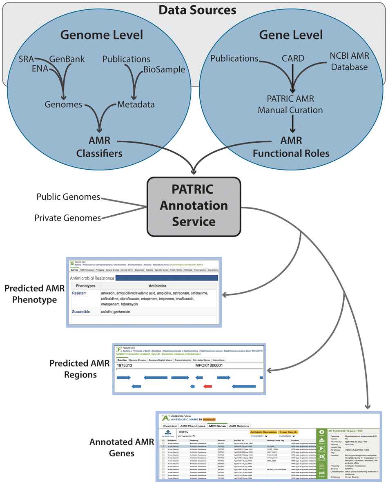

# Antimicrobial Resistance (AMR)

Antimicrobial Resistance (AMR) refers to the ability of bacteria to resist the effects of antibiotic drugs that are commonly used to treat them. Resistance arises through one of three ways: natural resistance in certain types of bacteria, genetic mutation, or by one species acquiring resistance from another. BV-BRC provides a variety of data and analysis tools to help researchers study AMR and its genetic determinants. This includes AMR phenotype data for the bacterial genomes as well as genes and intergenic regions associated with AMR. 

## Antibiotics

Antibiotics are a type of antimicrobial drug used in the treatment and prevention of bacterial infections. BV-BRC provides basic information about commonly used antibiotics, inlcuding their chemical and physical properties, pharmacology, and mechanism of action. In addition, each antibiotic is linked to other relevant data available in BV-BRC, such as AMR phenotypes for genomes, AMR genes, and AMR regions. Below are some examples: 

* [Amikacin](https://bv-brc.org/view/Antibiotic/?eq(antibiotic_name,amikacin))
* [Ethambutol](https://bv-brc.org/view/Antibiotic/?eq(antibiotic_name,ethambutol))
* [Isoniazid](https://bv-brc.org/view/Antibiotic/?eq(antibiotic_name,isoniazid))
* [Rifampin](https://bv-brc.org/view/Antibiotic/?eq(antibiotic_name,rifampin))
* [Streptomycin](https://bv-brc.org/view/Antibiotic/?eq(antibiotic_name,streptomycin))
* [View all antibiotics](https://bv-brc.org/view/AntibioticList/?keyword(*))

## AMR Phenotypes

AMR phenotypes refer to the resistance or susceptibility of a given organism to one or more antibiotics. BV-BRC collects AMR phenotype data generated using antimicrobial susceptibility testing methods (AST) from published studies and collaborators. In addition, BV-BRC also provideS predicted AMR phenotypes using machine learning classifiers. Example AMR phenotype data for select genera:

* [Mycobacterium](https://bv-brc.org/view/Taxonomy/1763#view_tab=amr)
* [Staphylococcus](https://bv-brc.org/view/Taxonomy/1279#view_tab=amr)
* [Streptococcus](https://bv-brc.org/view/Taxonomy/1301#view_tab=amr)
* [Acinetobacter](https://bv-brc.org/view/Taxonomy/469#view_tab=amr)
* [Pseudomonas](https://bv-brc.org/view/Taxonomy/286#view_tab=amr)
* [View all AMR phenotype data](https://bv-brc.org/view/Taxonomy/2#view_tab=amr)

## AMR Genes

AMR genes refer to the genes implicated in or associated with the resistance to one or more antibiotics. The resistance may result from the presence or absence of a gene or specific mutions acquired spontaniously or through evolution over time. BV-BRC integrates and maps known antibiotic resistance genes from the following sources:

* [CARD](https://bv-brc.org/view/Taxonomy/2#view_tab=specialtyGenes&filter=and(eq(property,%22Antibiotic%20Resistance%22),eq(source,%22CARD%22)))
* [NDARO](https://bv-brc.org/view/Taxonomy/2#view_tab=specialtyGenes&filter=and(eq(property,%22Antibiotic%20Resistance%22),eq(source,%22NDARO%22)))
* [BV-BRC AMR predictions](https://bv-brc.org/view/Taxonomy/2#view_tab=specialtyGenes&filter=and(eq(property,%22Antibiotic%20Resistance%22),eq(source,%22PATRIC%22)))
* [View all AMR genes](https://bv-brc.org/view/Taxonomy/2#view_tab=specialtyGenes&filter=eq(property,%22Antibiotic%20Resistance%22))

## AMR Regions

AMR regions refer to the small genomic regions implicated in or associated with the resistance to one or more antibiotics. The AMR regions are computationally predicted using machine learning classifiers used to predict AMR phenotypes. They may map to existing genes or intergenic regions and may help identify new AMR genes or increase understanding of AMR mechanisms.

* [View all AMR regions](https://bv-brc.org/view/FeatureList/?eq(feature_type,classifier_predicted_region)#view_tab=features&filter=or(eq(annotation,%22PATRIC%22)))

BV-BRC Process for Curation, Integration, and Mapping of Antibiotic Resistance Data
-----------------------------------------------------------------------------------

