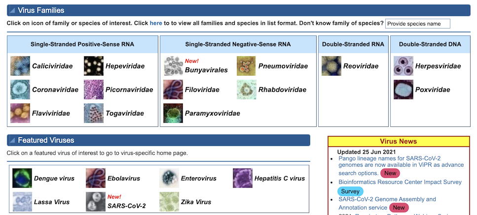
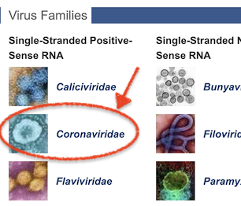
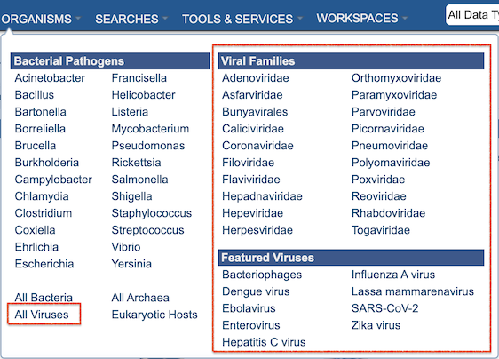
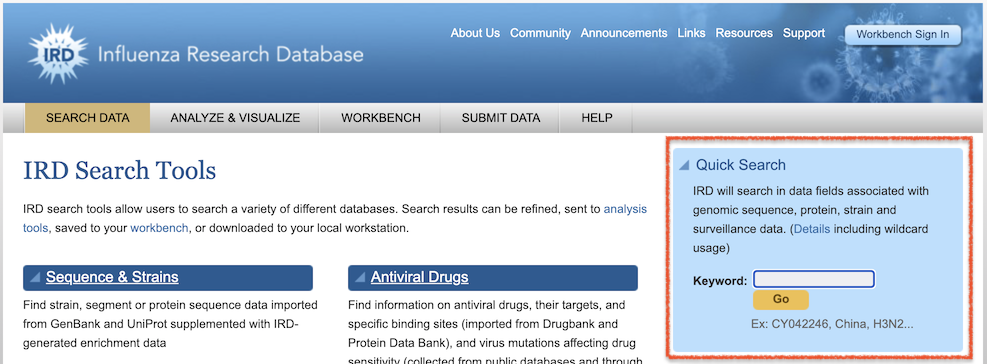
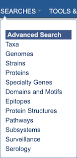
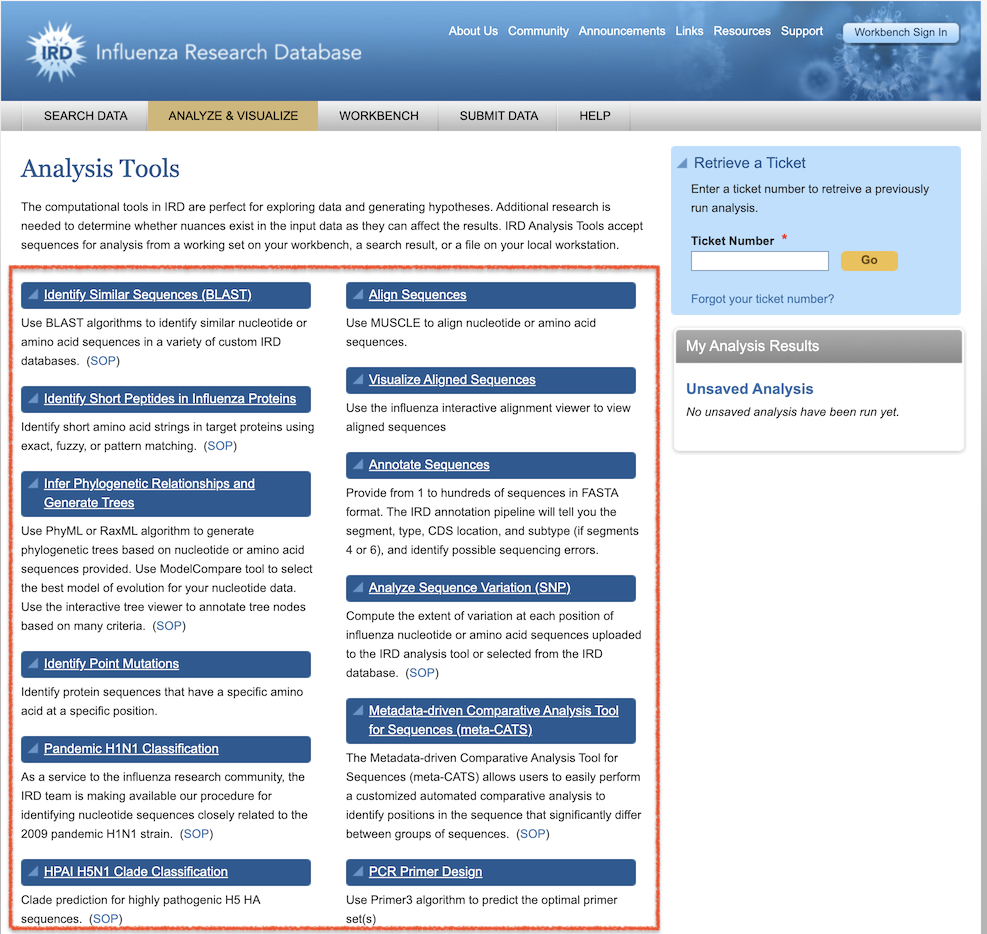
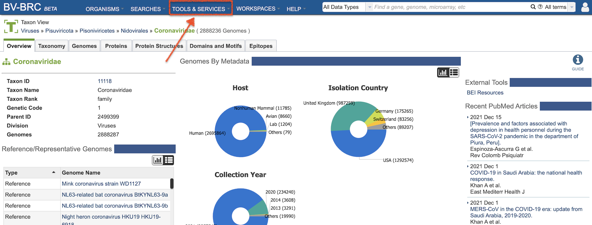

# Mapping of IRD/ViPR Features and Terminology to BV-BRC
## A Guide for IRD/ViPR Users

BV-BRC integrates key IRD and ViPR viral data and tools with bacterial data and tools from PATRIC. The BV-BRC system is built on the PATRIC system infrastructure (database, services, and website). As a result, the interfaces for accessing and using data and tools differ substantially from IRD and ViPR. To aid researchers in making this transition, the table below provides a mapping of IRD and ViPR features to the corresponding BV-BRC features. Links to relevant BV-BRC help documentation are provided as well.

* [Viral Genomes and Other Data](#data)
* [Searches](#searches)
* [Viral Analysis Tools](#tools)
* [Workbench](#workbench)

Additional details are presented below. 

## Viral Data

As in ViPR, viral data in BV-BRC are organized by families, with additional links to subsets of featured viruses including Influenza A (focus of IRD), Dengue, Ebolavirus, Enterovirus, Hepatitis C, Lassa mammarenavirus, SARS-CoV-2, Zika, and bacteriophages.

In *ViPR*, users can directly access viral data by family by clicking the appropriate link in the middle of the [ViPR Homepage](https://www.viprbrc.org/brc/home.spg?decorator=vipr) homepage, as shown below. (The [IRD homepage](https://www.fludb.org/brc/home.spg?decorator=influenza) is already scoped to Influenza.) 

***ViPR* Homepage:**

Similarly, *BV-BRC* provides a landing page with access to viral data at the same levels. It can be reached by clicking the VIRUSES button on the [BV-BRC homepage](https://bv-brc.org/), as shown below: 

***BV-BRC* Homepage:**

This will display the [BV-BRC Viruses landing page](https://beta.bv-brc.org/view/Virus/10239) (below):

***BV-BRC* Viruses Landing Page:**

Clicking on one of these links (e.g., "Coronaviridae" in the figure below) will display the corresponding viral data in BV-BRC, scoped to that viral family or subset, shown in the second figure below.

*Alternatively*, the same set of viral families and featured viral groups can be accessed directly from the ORGANISMS top menu (below).

***BV-BRC* Organisms Menu**

The ORGANISMS menu provides links to viral families and featured viruses, as well as bacteria genera, archaea, and eukaryotic hosts.  

Once the desired virus family or subset is selected, the corresponding **Taxon landing page** will be displayed. The **Data Tabs** (Overview, Taxonomy, Genomes, Proteins, Protein Structures, Domains and Motifs, Epitopes, etc.) on this page will be similarly scoped to the selected Taxon as well. 

Clicking on the Data Tabs (e.g., "Genomes") will display a list of all of the data and associated metadata of that type in BV-BRC for the selected Taxon. Keyword Search, Advanced Search, and Filter tools are available to refine the list. Also, the metadata columns can be resized, rearranged, added, removed, and sorted. 

Detailed instructions for using the Taxon-level data pages is available from the [BV-BRC Organisms Quick Reference Guide](../quick_references/organisms_menu.html).

## Searches

Similar to IRD and ViPR, BV-BRC provides searches to facilitate rapide direct access to viral data of interest. Two types of searches are provided: **Global Search** and **Advanced Searches**.

### Global Search
The *BV-BRC* **Global Search** provides keyword search capability similar to the *IRD/ViPR* **Quick Search** (available from the [IRD/ViPR Search Tools page](https://www.fludb.org/brc/search_landing.spg?decorator=influenza), below), but with advanced controls for selecting data type and other search conditions.  

***IRD/ViPR* Quick Search**

The *BV-BRC* **Global Search** is available at the top right of all BV-BRC pages, except for the home page, where it is in the upper center of the page, as shown below.

***BV-BRC* Global Search**

The Global Search provides optional filters for data types and search term options (All, Any, Exact).  

Detailed instructions for using the Global Search are available from the [BV-BRC Global Search Quick Reference Guide](../quick_references/global_search.html).

### Advanced Searches
The *BV-BRC* **Advanced Searches** provide fine-grained searches based on data type and metadata values, similar to the *IRD/ViPR* **Search Tools** (available from the [IRD/ViPR Search Tools page](https://www.fludb.org/brc/search_landing.spg?decorator=influenza), below). Some searches have been deprecated based on limited usage and available data.

***IRD/ViPR* Search Tools**

The *BV-BRC* **Advanced Searches** are available from the SEARCHES top menu, as shown below. 

***BV-BRC* Advanced Searches**

Advanced Searches are available for each of the major data types in BV-BRC.  

Clicking on one of the Advanced Searches (e.g., "Strains") opens a search form with drop down box options for primary metadata values and other special criteria.  

Detailed instructions for using the Advanced Searches are available from the [BV-BRC Advanced Searches Quick Reference Guide](../quick_references/advanced_searches.html).

The table below provides a mapping of the IRD/ViPR Search Tools to corresponding BV-BRC Advanced Searches. 

**Mapping of IRD/ViPR Search Tools to BV-BRC Advanced Searches**
<table style="width:100%">
  <tr>
    <th style="width:40%">IRD/ViPR</th>
    <th style="width:40%">BV-BRC</th>
    <th style="width:20%">Documentation</th>
  </tr>
 <tr>
    <td>
      <a href="https://www.fludb.org/brc/search_landing.spg?decorator=influenza">Quick Search</a> (upper right)
    </td>
    <td><a href="https://beta.bv-brc.org/view/Taxonomy/10239">Global Search</a> (top right)</td>
    <td><a href="../quick_references/global_search.html">Quick Reference</a></td>
  </tr>
  <tr>
    <td>
      <a href="https://www.fludb.org/brc/influenza_sequence_search_segment_display.spg?method=ShowCleanSearch&decorator=influenza">Nucleotide Search (IRD)</a> 
      <a href="https://www.fludb.org/brc/influenza_sequence_search_segment_display.spg?method=ShowCleanSearch&decorator=influenza">Genome Search (ViPR)</a>
    </td>
    <td><a href="https://beta.bv-brc.org/searches/GenomeSearch">Genome Search</a></td>
    <td></td>
  </tr>
  <tr>
    <td>
      <a href="https://www.fludb.org/brc/influenza_surveillanceRecord_search.spg?method=ShowCleanSearch&decorator=influenza">Animal Surveillance Search (IRD)</a> 
      <a href="https://www.fludb.org/brc/influenza_humanSurveillanceData_search.spg?method=ShowCleanSearch&decorator=influenza">Human Surveillance Records (IRD)</a>
    </td>
    <td><a href="https://beta.bv-brc.org/searches/SurveillanceSearch">Surveillance Search</a></td>
    <td></td>
  </tr>
  <tr>
    <td><a href="https://www.fludb.org/brc/influenza_surveillanceRecord_search.spg?method=ShowCleanSearch&decorator=influenza">3-D Protein Structure Search</a></td>
    <td><a href="https://beta.bv-brc.org/searches/ProteinStructureSearch">Protein Structure Search</a></td>
    <td></td>
  </tr>
  <! --- Insert Anti-Viral Drugs Search when available --->
  <tr>
    <td><a href="https://www.fludb.org/brc/serology_experiment_search.spg?method=ShowCleanSearch&decorator=influenza">Serology Experiment Search (IRD)</a></td>
    <td><a href="https://beta.bv-brc.org/searches/SerologySearch">Serology Search</a></td>
    <td></td>
  </tr>
  <tr>
    <td><a href="https://www.fludb.org/brc/hostFactorExperiments.spg?method=SubmitForm&decorator=influenza&navRoot=true">Host Factor Experiments</a></td>
    <td></td>
    <td></td>
  </tr>
  <tr>
    <td><a href="https://www.fludb.org/brc/influenza_epitope_search.spg?method=ShowCleanSearch&decorator=influenza">Immune Epitope Search</a></td>
    <td><a href="https://beta.bv-brc.org/searches/EpitopeSearch">Epitope Search</a></td>
    <td></td>
  </tr>
  <! --- Insert Phenotypes Search if/when available --->
  <! --- Insert PCR Primer Probe Search if/when available --->
  <! --- Insert Sequence Feature Variant Type Search if/when available --->
  <! --- Insert Human Clinical Studies Search if/when available --->
  <! --- Insert ORFeome Plasmid Data Search if/when available --->
  <tr>
    <td><a href="https://www.viprbrc.org/brc/vipr_virusDomain_search.spg?method=ShowCleanSearch&decorator=corona">Protein Domains Search</a></td>
    <td><a href="https://beta.bv-brc.org/searches/ProteinFeatureSearch">Domain and Motif Search</a></td>
    <td></td>
  </tr>
</table>

## Analysis Tools

Similar to IRD and ViPR, BV-BRC provides tools and visualizations to enable  researchers to perform in-depth analyses and exploration of their own data and in combination with BV-BRC data. BV-BRC integrates the most used analysis tools In *IRD/ViPR* (available from the [IRD/ViPR Analysis Tools page](https://www.fludb.org/brc/analysis_landing.spg?decorator=influenza), below).

***IRD/ViPR* Analysis Tools**

In *BV-BRC*, analysis tools are available from the TOOLS & SERVICES top menu, as shown below. A list of all tools with descriptions is available from the [BV-BRC Tools & Services page](https://bv-brc.org/tools)

***BV-BRC* Tools & Services**

In the BV-BRC TOOLS & SERVICES menu, viral analysis tools are shown alongside bacterial analysis tools. Where practical, the two have been merged into one tool, with appropriate settings and logic to perform the correct type of computation based on the the organism type (e.g., Genome Annotation). The figure below highlights tools that have been added or updated to support viral data. 

Clicking on one of the tools (e.g., "Annotation") opens an input form that allows users to upload their own data, set parameters, and specify a location in the Workspace to save the results.   

Most analysis tools in BV-BRC are implemented as computational "services" that use high-performance computing (HPC) resources to perform the analysis on the backend. When an analysis tool is started, it creates a "job" that runs on the HPC resources. The job processing status (Queued, Running, Complete, Failed) and results are listed on the user's Job Status page, which is displayed by clicking the small Jobs status monitor on the bottom right of each page. 

Detailed instructions for using the Advanced Searches are available from the [BV-BRC Advanced Searches Quick Reference Guide](../quick_references/advanced_searches.html).

The table below provides a mapping of the IRD/ViPR Search Tools to corresponding BV-BRC Advanced Searches. 

<table style="width:100%">
  <tr>
    <th style="width:40%">IRD/ViPR</th>
    <th style="width:40%">BV-BRC</th>
    <th style="width:20%">Documentation</th>
  </tr>
  <tr>
    <td>
      <a href="https://www.fludb.org/brc/blast.spg?method=ShowCleanInputPage&decorator=influenza">Identify Similar Sequences (BLAST)</a> 
      <a href="https://www.fludb.org/brc/sssearch.spg?method=ShowCleanInputPage&decorator=influenza&preSelectDB=true">Identify Short Peptides in Proteins</a>
    </td>
    <td><a href="https://beta.bv-brc.org/app/Homology">BLAST (Homology)</a></td>
    <td>
      <a href="../quick_references/services/blast.html">Quick Reference</a> 
      <a href="../tutorial/blast/blast.html">Tutorial</a>
    </td>  
  </tr>
  <tr>
    <td><a href="https://www.fludb.org/brc/tree.spg?method=ShowCleanInputPage&decorator=influenza">Generate Phylogenetic Tree</a></td>
    <td><a href="">Phylogenetic Tree (Gene Tree)</a></td>
    <td>
      <a href="../quick_references/services/genetree.html">Quick Reference</a> 
      <a href="../tutorial/genetree/genetree.html">Tutorial</a>
    </td>  
  </tr>
  <tr>
    <td>
      <a href="https://www.fludb.org/brc/msa.spg?method=ShowCleanInputPage&decorator=influenza">Align Sequences (MSA)</a> 
      <a href="https://www.fludb.org/brc/snpAnalysis.spg?method=ShowCleanInputPage&decorator=influenza">Analyze Sequence Variation</a> 
      <a href="https://www.fludb.org/brc/jalviewUsingFasta.spg?method=ShowCleanInputPage&decorator=influenza">Visualize Aligned Sequences</a>
    </td>
    <td><a href="https://beta.bv-brc.org/app/MSA">MSA and SNP Analysis</a></td>
    <td>
      <a href="../quick_references/services/msa_snp_variation_service.html">Quick Reference</a> 
      <a href="../tutorial/msa_snp_variation/msa_snp_variation.html">Tutorial</a>
    </td>  
  </tr>
  <tr>
    <td><a href="https://www.viprbrc.org/brc/vigorAnnotator.spg?method=ShowCleanInputPage&decorator=corona">Genome Annotation (VIGOR4)</a></td>
    <td><a href="https://beta.bv-brc.org/app/Annotation">Genome Annotation</a></td>
    <td>
      <a href="../quick_references/services/genome_annotation_service.html">Quick Reference</a> 
      <a href="../tutorial/genome_annotation/genome_annotation.html">Tutorial</a>
    </td>  
  </tr>
  <tr>
    <td><a href="https://www.fludb.org/brc/mgc.spg?method=ShowCleanInputPage&selectionContext={selectionContext}&decorator=influenza">Metadata-driven Comparative Analysis Tool (Meta-CATS)</a></td>
    <td><a href="https://beta.bv-brc.org/app/MetaCATS">Metadata-driven Comparative Analysis Tool (Meta-CATS)</a></td>
    <td>
      <a href="../quick_references/services/metacats.html">Quick Reference</a> 
      <a href="../tutorial/metacats/metacats.html">Tutorial</a>
    </td>  
  </tr>
  <tr>
    <td><a href="https://www.fludb.org/brc/primer3.spg?method=ShowCleanInputPage&decorator=influenza">Polymerase Chain Reaction (PCR) Primer Design</a></td>
    <td><a href="https://beta.bv-brc.org/app/PrimerDesign">Primer Design</a></td>
    <td>
      <a href="../quick_references/services/primer_design_service.html">Quick Reference</a> 
      <a href="../tutorial/primer_design/primer_design.html">Tutorial</a>
    </td>  
  </tr>
</table>  

## Workbench

<table style="width:100%">
  <tr>
    <th style="width:40%">IRD/ViPR</th>
    <th style="width:40%">BV-BRC</th>
    <th style="width:20%">Documentation</th>
  </tr>  
  <tr>
    <td></td>
    <td></td>
    <td></td>
  </tr>
  <tr>
    <td></td>
    <td></td>
    <td></td>
  </tr>
  <tr>
    <td></td>
    <td></td>
    <td></td>
  </tr>
  <tr>
    <td></td>
    <td></td>
    <td></td>
  </tr>
  <tr>
    <td></td>
    <td></td>
    <td></td>
  </tr>
</table>