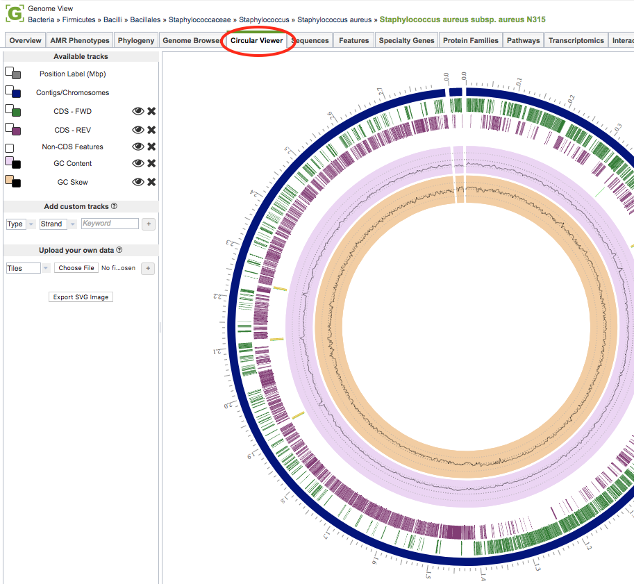
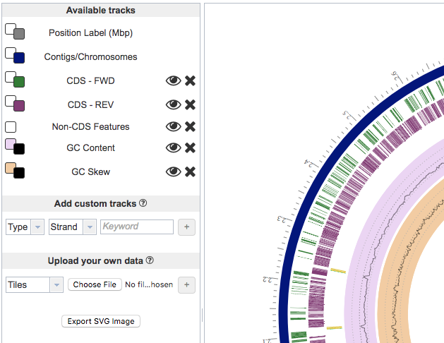

# Circular Genome Viewer

## Overview
The Circular Genome Viewer provides a circular interactive graphical representation of the
alignment of genes and other genomic data.

## See also
  * [Genome Annotations](/quick_references/organisms_taxon/genome_annotations)
  * [Exploring a (private) genome Tutorial](/tutorial/private_genome/private_genome)

## Accessing the Circular Genome Viewer
Clicking the Circular Viewer tab in a Genome View displays the interactive Circular Genome Viewer, shown below. 

The Circular Genome Viewer provides a circular interactive graphical representation of the alignment of genes and other genomic data. The tracks on the viewer are displayed as concentric rings, from outermost to innermost: Position, Contigs/Chromosomes, CDS-forward, CDS-reverse, Non-CDS Features, GC Content, and GC Skew. Features and functionality of the viewer are described in detail below.

## Circular Genome Viewer Features and Functionality

### Circular Genome Viewer Main Window:

The main window on the right side shows the circular view, which has interactive features triggered by mouseovers and mouse-clicks. 

* **View the Genome information** by mousing over or clicking on a contig

* **View the Feature information** by mousing over or clicking on a feature

### Tracks Panel:

The Available Tracks Panel on left lists all available tracks in the Circular Viewer.

* **Show/hide tracks** by clicking on the eye icon to the right of the track name.

* **Remove tracks** by clicking the "X" to the right of the track name.

* **Change the color of the track** or background by clicking on the small squares to the left of the track name.

* **Add a custom track* by selecting feature type, strand and keywords to show genes of interest.

* **Add a custom track of your own data** by choosing the display option (Tile, Line, Histogram, or Heatmap) and choosing a file containing **annotations** or **gene lists** as GFF3 files; or **RNA-Seq**, **ChIP-Seq**, or **SNP data** as BigWig or BAM files.

* **Export an SVG image** by clicking the Export SVG Image button.
