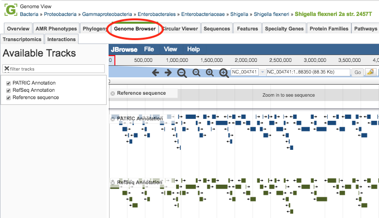
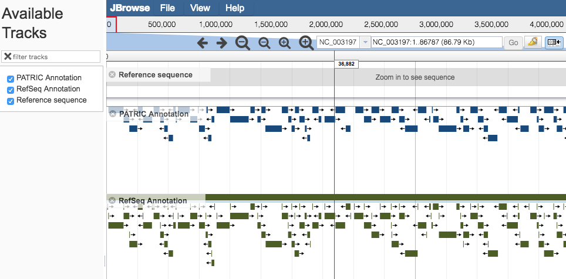

# Genome Browser

## Overview
The Genome Browser provides an interactive graphical representation of the alignment of genes and other genomic features depicted along a horizontal axis of genome coordinates.

## See also
  * [Genome Annotations](/quick_references/organisms_taxon/genome_annotations)
  * Exploring a (private) genome tutorial

## Accessing the Genome Browser
Clicking the Genome Browser Tab in a Genome View displays the interactive Genome Browser, shown below. You may also access the Genome Browser from BV-BRC tables that contain genomes by selecting the genome row and clicking the Genome Browser button in the vertical green Action Bar on the right side of the table.

The Genome Browser provides an interactive graphical representation of the alignment of genes and other genomic features depicted along a horizontal axis of genome coordinates. The Ajax-based genome browser was implemented using JBrowse
([Skinner et al, 2009](http://www.ncbi.nlm.nih.gov/pubmed/19570905)). Features and functionality are described in detail below.

## Genome Browser Features and Functionality

### Genome Browser Main Window

* **Pan** to a region of interest in the genome by
  * Using the forward and backward arrow buttons at the top of the Browser.
  * Clicking and dragging the red slide box bar located within the genome coordinate axis.
  * Entering desired start and/or end coordinates in the coordinate field and clicking on the “Go” button.

* **Zoom** in/out to regions of interest by using the + and – buttons along the top of the Browser. The larger buttons will zoom further in/out with one click than the smaller buttons. Zooming to approximately 650 base pairs or less reveals a color-coded (a = green, t = red , c = blue , g = yellow) DNA sequence track for the Reference Sequence. Zooming in to 150 base pairs or less labels the nucleic acids (NA) and associated 6-frame translated amino acids (AA) with their corresponding letters.

* **Share** the current display (location, zoom) by clicking the Share Button at the top upper right corner. Copy this url and share it or save it and visit the same area at another time.

* **Highlight** a region of the browser using the Highlight Button in the Zoom Bar next to the sequence range near the top of the browser. Clear highlighted sections via the View menu. Note: A highlighted notation will remain when using the Share Button.

## Browser Tracks and Downloading
By default, the Genome Browser initially displays BV-BRC and RefSeq (if available)  annotated data tracks. If available, additional tracks from other annotation sources are located in the Available Tracks column, along the left side of the Genome Browser.

* **Add or remove tracks** by either selecting or unselecting the track name in the Available Tracks box on the left side, or alternately, either clicking the "x" beside the track name or clicking and dragging the track between the Available Tracks box and the browser window.

* **Perform other actions tracks** by hovering the mouse cursor over the track label in the browser and selecting from the drop-down menu. The actions include displaying information about the track, pinning the track to the top row in the browser, editing the tracks configuration, removing the track to the Available Tracks box, saving track data, changing the display mode, and showing/hiding feature labels.
  * When saving track data, you may chose to view or download either the “visible region” or the “whole reference genome” in one of the three following formats: GFF3, BED, or Sequin Table.

* **Upload your own tracks and add custom tracks** by selecting “Open” from the File menu in the top left corner of the browser and selecting **annotations** or **gene lists** as GFF3 files; **RNA-Seq**, **ChIP-Seq**, or **SNP data** as BigWig or BAM files; or by providing URLs that point to these files.

* **Create tracks showing specific regions of the Reference Sequence** (or it’s translations) by entering the NA or AA sequence via the “Add sequence search track” option in the File menu.

* **Access information about an individual feature** by hovering over the feature with the mouse cursor to display information such as Locus Tag, Location, Strand, Type, Gene Symbol, and Product. Click on the feature to open a pop-up box with feature details such as links to NCBI for the RefSeq Locus Tag, Protein ID, and Gene ID; links to the Genome ID and Genome Name; and displays of the NA and AA sequences.
