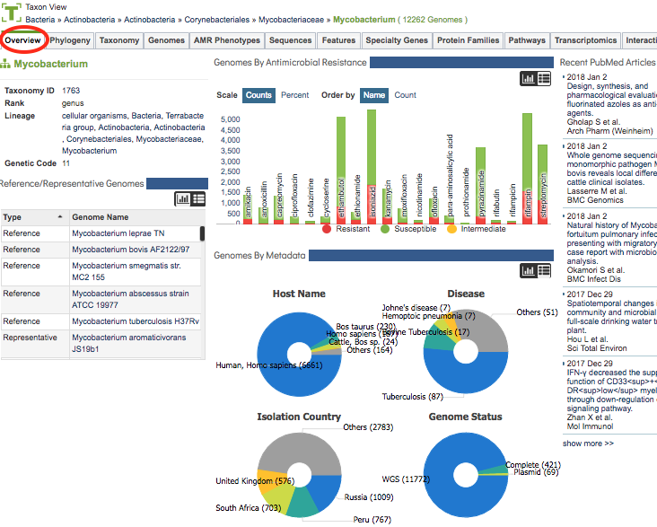

# Taxonomic Overview

## Overview
For the chosen taxon level, the Taxon Overview Tab provides summary information for corresponding data in BV-BRC, including Taxon Info, Reference/Representative Genomes, Genomes by Antimicrobial Resistance, Genomes by Metada, and relevant Recent PubMed Articles.  

## See also
  * [Taxonomy](../organisms_taxon/taxonomy.html)
  * [Antimicrobial Resistance Phenotypes](../organisms_taxon/amr_phenotypes.html)
  * [Genome Metadata](../organisms_taxon/genome_metadata.html) 

## Accessing the Taxon Overview
Clicking the Overview Tab in a Taxon View displays the Taxon Overview Page, shown below. 

The Taxon Overview Page summarizes information regarding the taxonomy, genomes, reference/representative genomes, antimicrobial resistance, metadata, and relevant literature associated with the chosen taxon level. Each section of the page is described in more detail below.

## Taxon Info
The top level of the displayed taxonomic structure is displayed directly under the Overview Tab, in large green text.  Below this is additional taxonomic information, defined by the [NCBI Taxonomy](https://www.ncbi.nlm.nih.gov/taxonomy):

* **Taxonomy ID:** The taxonomy ID for the selected taxon level.

* **Rank:** The relative level in biological classification for the selected taxon, e.g., kingdom, phylum, class, order, family, genus, species.

* **Lineage:** Provides links to the higher taxonomic levels of which the currently displayed taxon is a descendent.

* **Genetic Code:** The code used for translation of coding sequence (CDS), typically 11, defined in [The Bacterial, Archaeal, and Plant Plastid Code](https://www.ncbi.nlm.nih.gov/Taxonomy/Utils/wprintgc.cgi#SG11).

## Reference/Representative Genomes
This section provides direct links to genomes/strains within the selected taxon level that have been flagged as Reference or Representative.  These are derived from the NCBI Reference and Representative lists, UniProt Reference genomes, and manual curation. The data can be portrayed in either histogram or list view by clicking the Chart or List buttons at the top right of the section.

## Genomes by Antimicrobial Resistance
This section provides a summary of antibiogram (AMR panel) data across antibiotics for genomes in the selected taxon level. The AMR phenotypes are classified as Resistant, Susceptible, or Intermediate. See [Antimicrobial Resistance Phenotypes](../organisms_taxon/amr_phenotypes.html) for more information.

The data can be portrayed in either histogram or list view by clicking the Chart or List buttons at the top right of the section. In the histogram view, the scale can be shown as either genome counts or percentage in each antibiotic and resistance phenotype category. Also, the histogram can be ordered alphabetically by antibiotic name or numerically by counts of AMR phenotypes. 

## Genomes by Metadata
This section provide summaries of genomes by key metadata fields including Host Name, Disease, Isolation Country, and Genome Status.  The data can be portrayed in either pie chart or list view by clicking the Chart or List buttons at the top right of the section.

## Recent PubMed Articles
Displays recent articles from PubMed directly in real time query (via PubMed API) for literature related to the taxonomic level shown at the top of the page. The title links directly to the article on PubMed.
