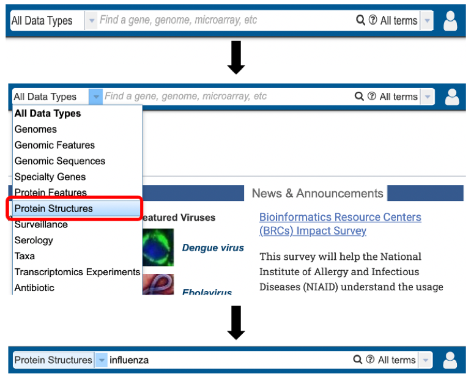
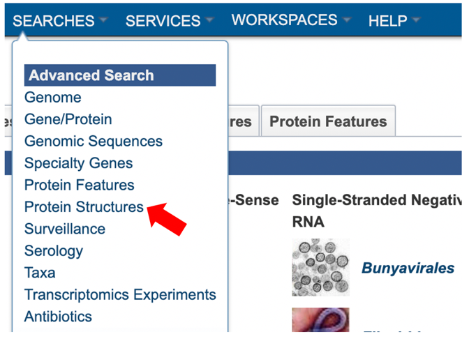
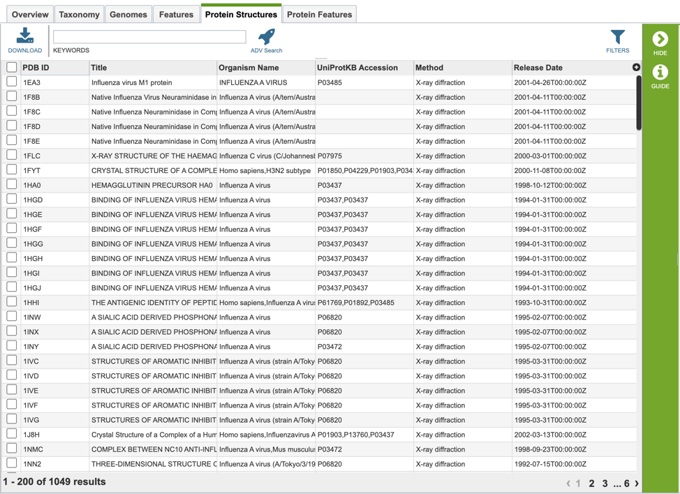
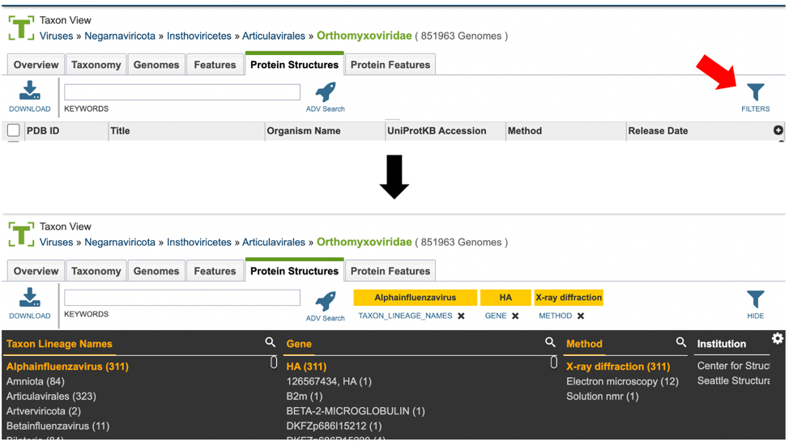
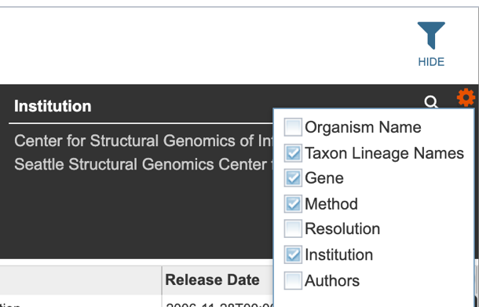
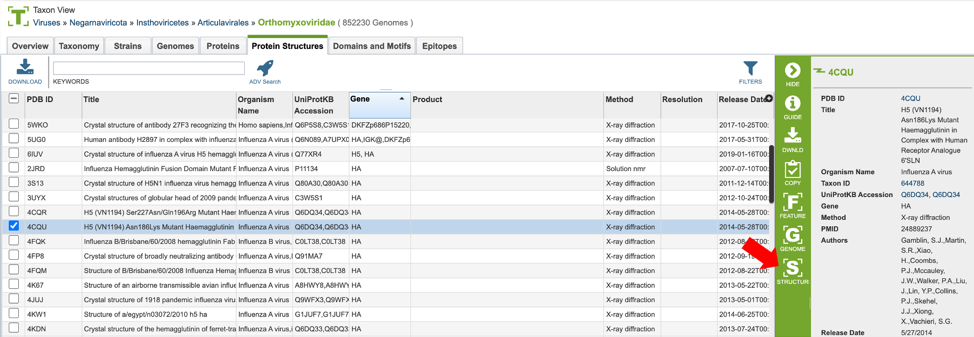

# Protein Structure Data

## Overview
Protein structure data allows users to search for 3D protein structure files obtained from the [Protein Data Bank (PDB)](https://www.rcsb.org/). Protein(s) are associated with each PDB file UniProt database. One protein structure can be assigned to multiple GenBank protein records.

### See also
* Protein Structure Tutorial

## Accessing Protein Structure data

Protein structure data can be accessed through multiple routes in the BV-BRC: 

1\. Specifically searching for protein structure data by selecting "Protein Structures" as the Data Type from the Global Search bar.

2\. Selecting “Protein Structures” data type from the search results (red arrow) after performing search using a relevant keyword in the Global Search bar. 

3\. Selecting "Protein Structures" from the Advanced Search under the “SEARCHES” menu. 

4\. Selecting the “Protein Structures” tab when browsing data for a specific organism.  

## Protein Structure List View and Metadata Definitions

Protein structure results are presented in tabular format in BV-BRC as shown below. 

Several metadata fields are associated with protein structure records. Visible metadata columns can be customized by clicking on the “+” sign at the top right corner of the table, as shown below.  

Below is a list of available metadata fields (columns) and their definitions. 

* **PDB ID:** The protein data bank identification number for the structure. 
* **Title:** The descriptive name of the protein structure. 
* **Organism Name:** The scientific name of the organism. 
* **Taxon ID:** The NCBI Taxonomy ID number of the organism.
* **Taxon Lineage IDs:** The taxonomic hierarchical classification lineage of the source organism; numerical ID. 
* **Taxon Lineage Names:** The taxonomic hierarchical classification lineage of the source organism; descriptive name. 
* **Genome ID:** The internal BV-BRC identification given to the sequence. 
* **UniProtKB Accession:** The identifier for the UniProtKB entries.
* **Gene:** The gene name. 
* **Product:** The gene’s protein product name. 
* **Sequence MD5:** The protein MD5 checksum. 
* **Sequence:** The amino acid sequence of the relevant protein structure. 
* **Alignments:** The coordinates (start and end positions) of the alignment of the PDB sequence with the corresponding UniProt sequence.
* **Method:** The experimental method used to determine the protein structure. 
* **Resolution:** The measure of the quality of the data that has been collected on the structure.
* **PMID:** The NCBI’s PubMed ID associated with the publication describing the structure (if applicable). 
* **Institution:** The institute associated with the protein structure record submission. 
* **Authors:** The authors associated with the protein structure record submission.
* **Release Date:** The publication date of the protein structure record. 

Users who wish to further filter results can do so by clicking the “FILTERS” icon (red arrow) and selecting the desired criteria as shown below.   

Users may also customize the filters bar by clicking on the gear icon at the top right corner of the page. 

## Action buttons

After selecting one of the output files by clicking it, a set of options becomes available in the vertical green “Action Bar” on the right side of the table, as shown below. These include:

Options include:

* **Hide/Show:** Toggles (hides) the right-hand side Details Pane.
* **Guide:** Links to the corresponding Quick Reference guide.
* **Download:** Downloads the selected item.
* **Copy:** Copies the selected items to the clipboard.
* **Feature:** Displays the Feature Page for the selected feature. Available only if a single feature is selected.
* **Genome:** Displays the Genome View Overview page corresponding to the selected genome/feature. Available only if a single feature is selected.
* **Structure:** Displays the Protein Structure View Overview page corresponding to the selected genome/feature. Available only if a single feature is selected.  

More details are available in the [Selection Action Bar](../action_bar.html) Quick Reference.

## Using the Structure Viewer

Protein structures can be viewed on BV-BRC by clicking on the “Structure” action button described above, as shown below. 

This will open a new window, allowing the user to view and interact with the protein structure using Mol* (/’molstar/), a web-based open-source toolkit for visualisation and analysis of large-scale molecular data [1].

## Additional Resources

1. [Mol* website](https://molstar.org)
2. [Mol* viewer documentation](https://molstar.org/viewer-docs/)
