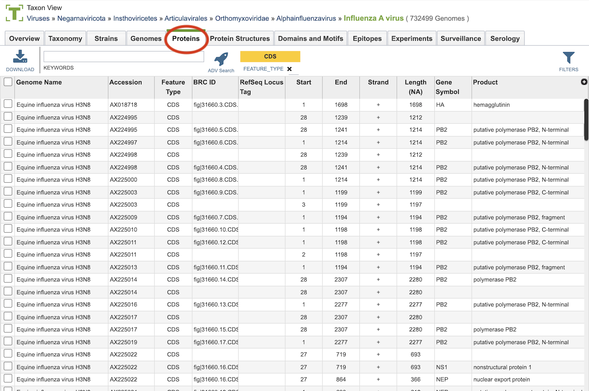
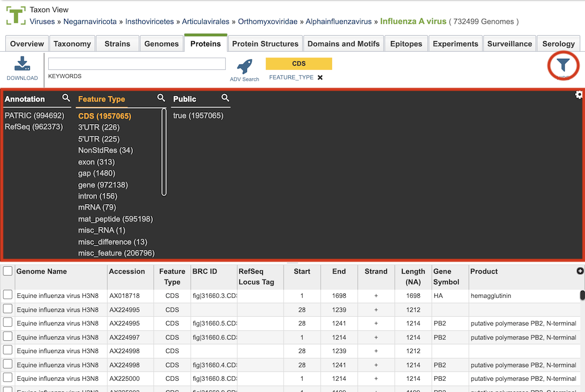

# Proteins Tab

## Overview
The Proteins Tab provides a table of all the annotated genomic features (gene, CDS, mRNA, proteins, etc.) corresponding to the set of genomes in the selected Taxon View level or in the user-defined Genome Group.  From this page, proteins can be sorted, filtered, collected into groups, and downloaded. 

### See also
  * [Genome Annotations](../organisms_taxon/genome_annotations.html)
  * [Genome Page Overview](../organisms_genome/overview.html)
  * [Multiple Sequence Alignment Viewer](../other/msa_viewer.html)

## Accessing the Proteins Table
Clicking the Proteins Tab in a Taxon View displays the Proteins Table (shown below), listing all the annotated proteins and other genomic features corresponding to the set of genomes in the selected taxon level.

The list in the Proteins table includes annotations created by the BV-BRC annotation service, which includes protein-coding genes and other genomic features, as well as the original annotations (typically from RefSeq), if availalble. 

### Proteins Table Tools
Within this table you may do the following:

* **Download** the entire contents of the table in text, CSV, or Excel format by clicking the Download button above the table on the left side.

* **Rearrange and narrow** the list of sequences in the table via sorting (using column headers), keywords (using the Keyword box), and filtering (using the Filters tool).

### Filter Tool

As with all tables, the Filters tool is available to narrow the display of the items in the table, show below:
  

Clicking on the Filters button at the top right of the table opens the Filter Panel above the table, displaying column names from the table and values for those columns with counts of occurence.  Clicking on the filter values narrows the list displayed in the table to those matching the chosen filter values.  Clicking the Hide button closes the Filter Panel. More details are available in the [Filter Tool](../other/filter_tool.html) Quick Reference Guide.

### Action buttons

After selecting one or more of the proteins by clicking the checkbox beside the Genome Name in the table, a set of options becomes available in the vertical green Action Bar on the right side of the table.  These include

* **Hide/Show:** Toggles (hides) the right-hand side Details Pane.
* **Download:**  Downloads the selected items (rows).
* **Copy:** Copies the selected items to the clipboard.
* **Feature:** Loads the Feature Page for the selected feature. *Available only if a single feature is selected.*
* **Features:** Loads the Proteins Table for the selected proteins/features. *Available only if multiple proteins are selected.*
* **Genome:** Loads the Genome View Overview page corresponding to the selected feature.  *Available only if a single feature is selected.*
* **Genomes:** Loads the Genomes Table, listing the genomes that correspond to the selected proteins. *Available only if multiple proteins are selected.*
* **FASTA:** Provides the FASTA DNA or protein sequence for the selected feature(s).
* **ID Map:** Provides the option to map the selected feature(s) to multiple other idenfiers, such as RefSeq and UniProt.
* **MSA:** Launches the Multiple Sequence Alignment (MSA) tool and aligns the selected proteins/features by DNA or protein sequence in an interactive viewer.
* **Pathway:** Loads the Pathway Summary Table containing a list of all the pathways in which the selected proteins/features are found.
* **Group:** Opens a pop-up window to enable adding the selected sequences to an existing or new group in the private workspace.

More details are available in the [Action Buttons](../action_buttons.html) Quick Reference Guide.
