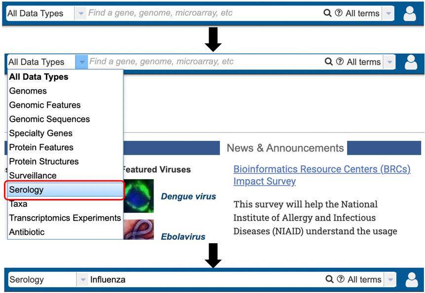
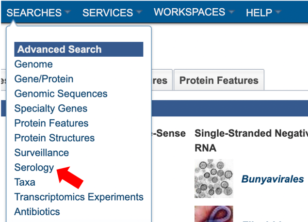
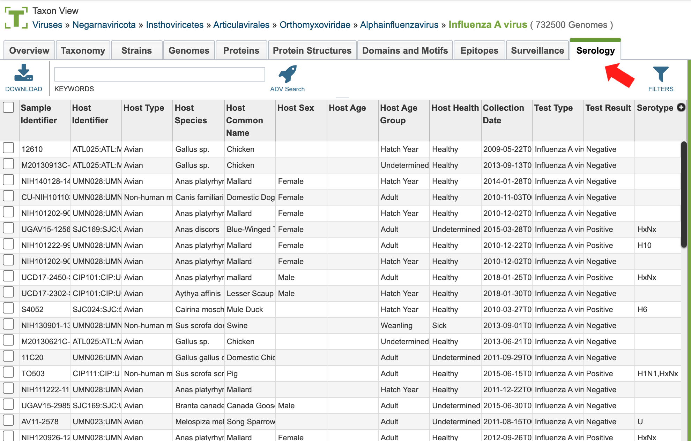
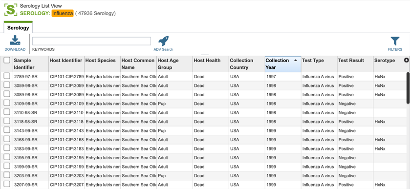

# Serology Data

## Overview
Serum samples were collected from avian, non-human mammalian, and human subjects and tested for the presence of antibodies to specific influenza serotypes. The serotypes detected in the serum are identified in the search result. 

## Accessing Serology data

Serology data can be accessed through multiple routes in the BV-BRC: 

1\. Specifically searching for serology data using the search bar.

2\. Using the advanced search for Serology (red arrow) under the “SEARCHES” menu. 

3\. Selecting “Serology” as the data type (red arrow) after performing a quick search for all data types using a relevant keyword. 

4\. Selecting the “Serology” tab when browsing data for a specific virus.  

## Serology List View and Column Definitions

Serology data is listed in tabular format in the BV-BRC as shown below. 

Visible column names are customizable and can include: 

* **Project Identifier:** the identification assigned to the project contributing serology information. 
Contributing Institution:** the institution where the serology test took place. 
* **Sample Identifier:** the identification number assigned to the serology sample. 
* **Host Identifier:** the identification number assigned to the host the sample was taken from. 
* **Host Type:** Can include avian, human or non-human mammalian. 
* **Host Species:** the scientific name for the host the sample was taken from. 
Host Common Name:** the common name for the host the sample was taken from.
* **Host Sex:** the sex of the host: male, female.
* **Host Age:** the age of the host at the time the sample was taken. 
* **Host Age Group:** the general age group of the host; eg: adult or juvenile. 
* **Host Health:** the disease status of the host at the time the sample was taken.
* **Collection Country, State, or City:** the geographic information associated with the serology sample. 
* **Collection Date:** the complete collection date (day, month, year) for the serology sample
* **Collection Year:** the year the serology sample was collected. 
* **Test Type:** the type of test used to ascertain the virus type. 
* **Test Result:** the results of the serology test. 
* **Test Interpretation:** the serology test interpretation results. 
* **Serotype:** the virus serotype ascertained. 
* **Comments:** Any additional comments provided by the submitters.

Users who wish to further filter data can do so by clicking the “filters” icon (red arrow) and selecting the desired criteria as shown below. 

Users may also customize the filters bar by clicking on the gear icon at the top right corner of the page. 

## Action buttons

After selecting one of the output files by clicking it, a set of options becomes available in the vertical green “Action Bar” on the right side of the table. These include:

* **Hide/Show:** Toggles (hides) the right-hand side Details Pane.
* **Guide:** Link to the corresponding User Guide
* **Download:** Downloads the selected item.
* **Copy:** Copies the selected items to the clipboard.
* **Serology:** Opens a new window and displays the selected serology record.

More details are available in the [Selection Action Bar](../action_bar.html) Quick Reference Guide. 
