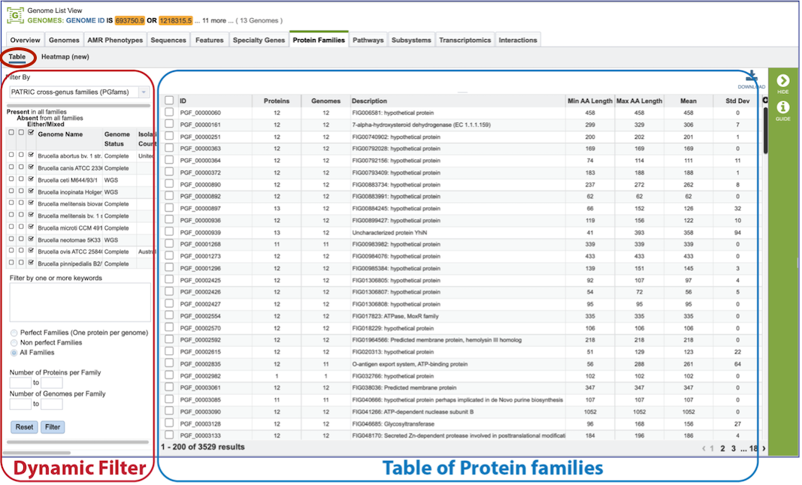
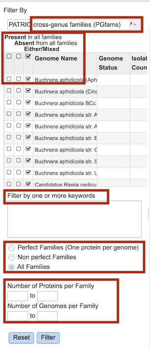

# Protein Family Sorter

## Overview
The Protein Family Sorter (PFS) allows users to select a set of genomes of interest and examine distribution of the superset of protein families across the genomes, commonly referred to as the “pan genome." The PFS provides various filtering options to quickly locate protein families that are conserved across all the genomes (“core genome”), conserved only in asubset of the selected genomes (“accessory genome”) or that match a specified function. A tabular view shows protein families matching filtering criteria and an interactive heatmap viewer provides a bird’s-eye (“pan genome”) view of the distribution of the protein families across multiple genomes, with clustering andanchoring functions to show relative conservation of synteny and identify areas of possible horizontal transfer. 

### See also
  * [Comparative Systems Service](https://www.bv-brc.org/app/ComparativeSystems)
  * [Comparative Systems Service Tutorial](../../tutorial/comparative_systems/comparative_systems.html)
  * [Protein Families]

## Accessing the Protein Family Sorter
The PFS can be accessed by clickging the **Families** icon at the top right of the results page from a [Comparative Systems Service](https://www.bv-brc.org/app/ComparativeSystems) analysis job.

Results are presented in tabular and heatmap views, as described below.

### Tabular View

**Dynamic Filter Panel**

The dynamic filter on the left side panel allows inclusion or exclusion of genomes based on their presence or absence in the pan genome protein families. 

The first option selects between **genus-specific families (PLFams)** and **cross-genus families (PGFams)**.

Next, options are provided for limiting families to those with the following critieria:

* *Present* in all families
* *Absent* in all families
* *Either/mixed*

All of the options result in immediate updates the table of Protein Families in the right-hand panel.

Filter options are also provided for filtering by keyword, Protein Family membership (*Perfect*, *Non-perfect*, *All*) and specification of a numeric range of *Proteins per Family* and *Genomes per Family*.

For these options, clicking the **Filter** button applies these filter options to the table of protein families in the right-hand panel. The **Reset** button clears all of the keyword, Family Membership, and numeric range filters.  

**Protein Family Table**

In the Tabular View, the right panel displays a list of the protein families based on the criteria specified in the left-hand filter panel. Fields (columns) in the table include the following:

* **ID**: BV-BRC identifier for the protein family
* **Proteins**: Number of proteins in the protein family   
* **Genomes**: Number of genomes containing proteins in the protein family  
* **Description**: Functional description of the proteins in the family  
* **Min AA Length**: Length (number of amino acids) of shortest protein in the family  
* **Max AA Length**: Length (number of amino acids) of longest protein in the family
* **Mean**: Average length of proteins in the family
* **Std Dev**: Standard deviation of lengths of proteins in the family. 

### Action buttons

After selecting one or more of the protein families by clicking the checkbox beside the ID column in the table, a set of options becomes available in the vertical green Action Bar on the right side of the table.  These include

* **Hide:** Toggles (hides) the right-hand side Details Pane.
* **Guide:** Opens the Quick Reference Guide for the page.
* **Services:** Provides links to tools and services in BV-BRC that can accept the selected items as input.
* **ID Map:** Provides the option to map the selected feature(s) to multiple other idenfiers, such as RefSeq and UniProt.
* **Pathway:** Displays the Pathway Summary Table containing a list of all the pathways in which the selected features are found.
* **Download:**  Downloads the selected items (rows).
* **FASTA:** Provides the FASTA DNA or protein sequence for the selected item(s).
* **MSA:** Launches the Multiple Sequence Alignment (MSA) tool and aligns the selected features by DNA or protein sequence in an interactive viewer.
* **Members:** Displays a list of all of the features in the selected protein family within the current genome or taxonomic level.
* **Group:** Opens a pop-up window to enable adding the selected genomes or features to an existing or new group in the private workspace.

More details are available in the [Action Buttons](../other/action_buttons.html) Quick Reference Guide.

### Heatmap View

## Features and Functionality

The visualization has 3 main components:
  1. 
  2. 
  3. 