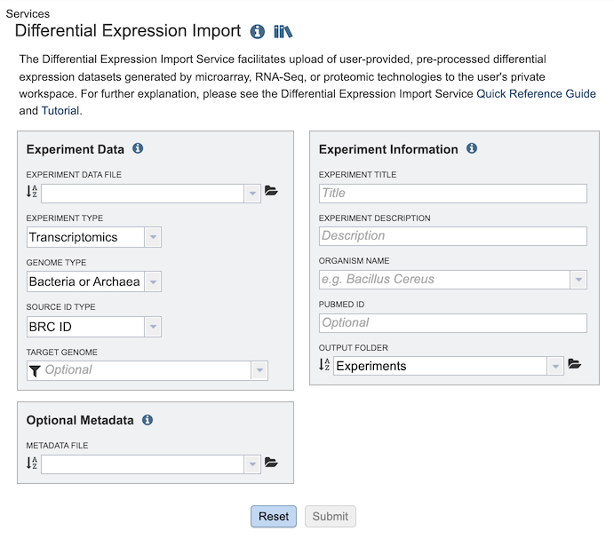
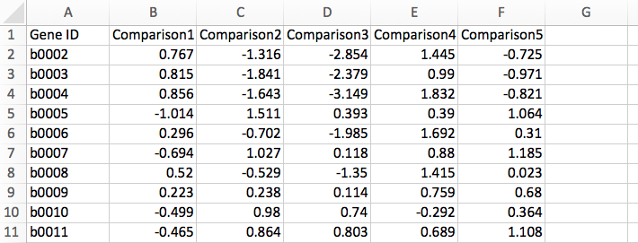
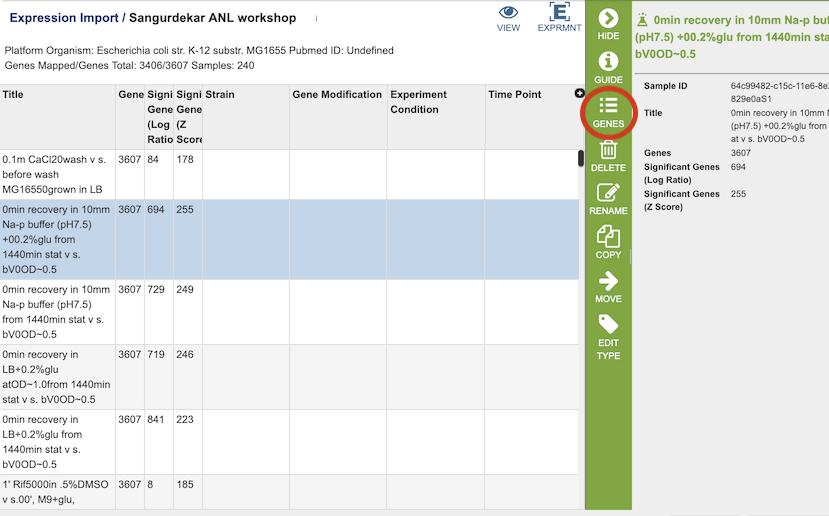
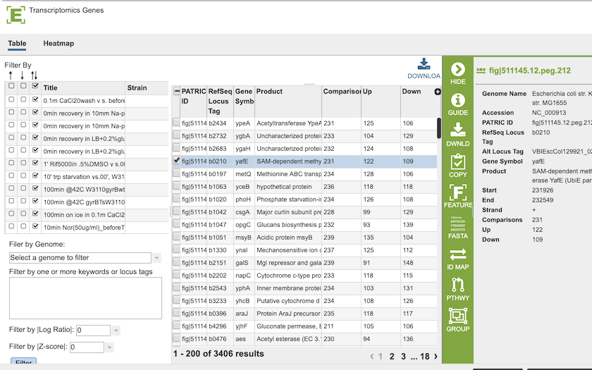

# Expression Data Import Service

## Overview
The Differential Expression Import Service facilitates upload of user-provided, pre-processed differential expression datasets generated by microarray, RNA-Seq, or proteomic technologies to the user's private workspace. From there the data sets can be analyzed using annotations and analysis tools for comparison with other expression data sets in BV-BRC. Currently, BV-BRC only supports differential gene expression data in the form of log ratios, generated by comparing samples/conditions/time points.

### See also
  * [Expression Import Service](https://bv-brc.org/app/Expression)
  * [Expression Import Service Tutorial](../../tutorial/expression_import/expression_import.html)

## Using the Expression Import Service
The **Expression Import** submenu option under the **Services** main menu (Transcriptomics category) opens the Expression Import input form (*shown below*). *Note: You must be logged into BV-BRC to use this service.* The Expression Data Import Service can also be accessed via the Command Line Interface (CLI).

## Options
 

## Data information

### Experiment Data File
Allows upload a data file containing differential gene expression values in the form of log ratios. The file should be in one of the supported formats described below. Optionally, you may also upload metadata related to sample comparisons in the prescribed format to provide additional context for data analysis. See Optional Metadata.

**File Format:**  Currently, BV-BRC allows you to upload your transcriptomics datasets in
the form of differential gene expression measured as log ratios. Data can be uploaded in multiple file formats: comma separated values (.csv), tab delimited values (.txt), or Excel (.xls or .xlsx). Click to download the [Sample Data template](https://docs.alpha.bv-brc.org/_static/Sample-Genes.xlsx) in Gene Matrix Format.
Files should contain data in one of the following formats:

*Gene Matrix:* Gene IDs are represented in the first column with extra columns for each of the comparisons in the form of log ratio, i.e., log2(test/control). Below is an example of transcriptomics data in Gene Matrix format:

*Gene List:* Data are represented in three columns: Gene ID, Comparison ID, and Log Ratio of expression value, i.e., log2(test/control). Below is an example of transcriptomics data in Gene List format:

### Experiment Type
Dropdown list specifying the the experiment type, either Transcriptomics, Proteomics, or Phenomics.

### Genome Type
Option for specifying if the data set is for bacteria/archea, or alternatively, eukaryotic host. 

### Source ID Type
Dropdown list for specifying the source ID type, e.g., ID, NCBI Gene ID, RefSeq Locus Tag. Used to map genes to genes in BV-BRC, allowing integration of other data in BV-BR into the analysis. Due to differences in annotation that may exist, some genes may go unmapped. Unmapped genes will be excluded from subsequent analysis.

**Supported IDs:**
1. RefSeq Locus Tag
2. Feature ID
3. NCBI GI Number
4. NCBI Protein ID
5. SEED ID
6. PATRIC Legacy ID

### Target Genome
Option for mapping the expression data to a particular genome in BV-BRC.  This will facilitate inclusion of other expression data in BV-BRC for that genome in subsequent analysis.

## Experiment Information
Metadata to specify the experiment title, description, organism, and Pubmed ID (optional) for providing contextual information for the uploaded data. 

### Experiment Title
Title for the experiment (required).

### Experiment Description
Description of the experiment (required).

### Organism Name
Taxonomic name of the organism associated with the uploaded data.

### Pubmed ID
Pubmed ID associated with the uploaded data, if available (optional).

### Output Folder
Folder in the Workspace where the uploaded data file will be located.  The default is /home/Experiments.

## Optional Metadata
Allows upload of an additional file containing key metadata attributes about the comparisons. This will enhance your analysis when using the heatmap and clustering tools. The metadata table can be uploaded as a tab/comma-delimited or Excel file. *Note: The column names should be the same as in the example template. Also, comparison IDs in
the metadata file should match those in the data file.* Click to download the [Metadata Template](../_static/Sample-Metadata.xlsx).

## Buttons
**Reset:** Resets the input form to default values.

**Submit:** Starts the upload.

## Output Results
 

The Expression Import Service generates several files that are deposited in the Private Workspace in the designated Output Folder. These include

* **experiment.json** - JavaScript Object Notation (JSON) format file containing experiment metadata.
* **expression.json** - JSON format file containing log-ratio expression values by feature.
* **mapping.json** - JSON format file containing details of the mapping of genes/proteins in the uploaded file to Feature IDs.
* **sample.json** - JSON format file containing the experiment conditions.

### View Experiment Conditions
 

Clicking on the View icon at the top right of the page will display a page with each of the conditions that are part of the experiment. 

Selecting one of the Conditions and clicking the Genes icon in the vertical green Action Bar on the right side of the table will display a table of the genes and how they are regulated for that condition. See [Transcriptomics Tab](../organisms_taxon/transcriptomics.html) for more information on how to use this table and the associated heatmap.

### View Experiment Results Across All Conditions
 

Clicking on the Experiment icon at the top right of the page will display a page with all of the results for all of the conditions. 

See [Transcriptomics Tab](../organisms_taxon/transcriptomics.html) for more information on how to use this table and the associated heatmap.

### Action buttons
After selecting one of the output files by clicking it, a set of options becomes available in the vertical green Action Bar on the right side of the table.  These include

* **Hide/Show:** Toggles (hides) the right-hand side Details Pane.
* **Guide** Link to the corresponding Quick Reference Guide.
* **Download:**  Downloads the selected item.
* **View** Displays the content of the file, typically as plain text or rendered html, depending on filetype.
* **Copy:** Copies the selected items to the clipboard.

More details are available in the [Action Bar](../action_bar.html) Quick Reference Guide.
