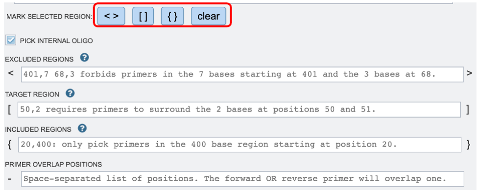

# Primer Design Service

## Overview
The Primer Design Service utilizes Primer3[1-5] to design primers from a given input sequence under a variety of temperature, size, and concentration constraints. Primer3 can be used to design primers for several uses including, PCR (Polymerase Chain Reaction) primers, hybridization probes, and sequencing primers. The service accepts a nucleotide sequence (pasted in, or select a FASTA formatted file from the workspace) and allows users to specify design. After specifying an appropriate output folder and clicking “submit”, the primer design is queued as a “job” to process in the Jobs information box on the bottom right of the page. Once the job has successfully completed, the output file will appear in the workspace, allowing the user to choose from a list of appropriate primers. 

### See also
* [Primer Design Service](https://beta.bv-brc.org/app/PrimerDesign)
* [Primer Design Service Tutorial](../tutorial/primer_design.html)

## Using the Primer Design Service

The **Primer Design** submenu option under the **"SERVICES"** main menu (Viral Services category) opens the MSA and SNP/Variation Service input form. *Note: You must be logged into BV-BRC to use this service.*

 

### Parameters

Once the primer design service has been selected, users will be directed to the Primer Design landing page as shown below. 

 

Users may select one of three input options. 
1. *Pasting in a relevant sequence:* 

   * **Sequence Identifier:** The user-provided name to identify the input sequence. If using a FASTA formatted file, this field will automatically be populated with the sequence name. 

   * **Paste Sequence:** Choosing this option allows users to paste in an input sequence. 

2. *Choosing a workspace sequence:*

   * **Workspace FASTA:** Choosing this option allows users to specify the FASTA file from their workspace. 

3. *Choosing a BV-BRC record:* 

   * **BV-BRC ID:** Choosing this option allows users to specify the BV-BRC identifier for an input sequence. 
  

*Users will also need to select appropriate target, inclusion and exclusion positions using options shown below.* 

   * **Excluded Regions:** Values should be one or a space-separated list of start, length pairs. Primers will not overlap these regions. These values will be denoted with “< >” symbols.

   * **Targets:** Values should be one or a space-separated list of start, length pairs. Primers will flank one or more regions. These values will be denoted with “[ ]” symbols.

   * **Included Regions:** Values should be a single start, length pair. Primers will be picked within this range. These values will be denoted with “{ }” symbols.

   * **Primer Overlap Positions:** Values should be space separated list of positions, The forward OR reverse primer will overlap one of these positions. These values will be denoted with “-” symbol. 

   * **Output Folder:** The workspace folder where results will be placed.

   * **Output Name:** The name users specify for the completed job. 

  *Users may also choose to specify one or more “Advanced Options” as shown below.*

