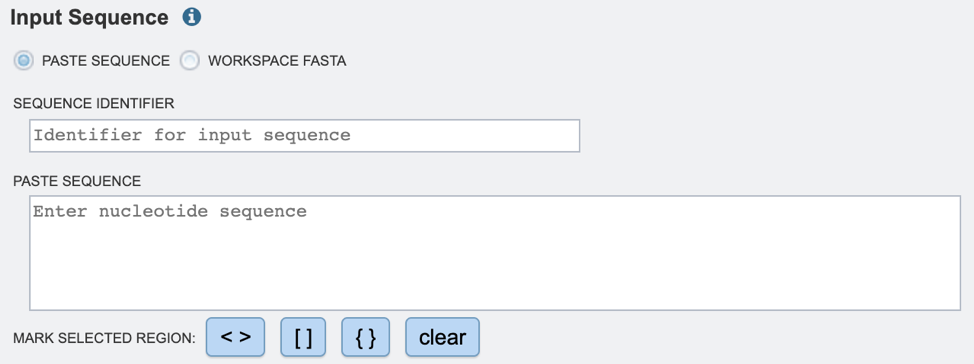
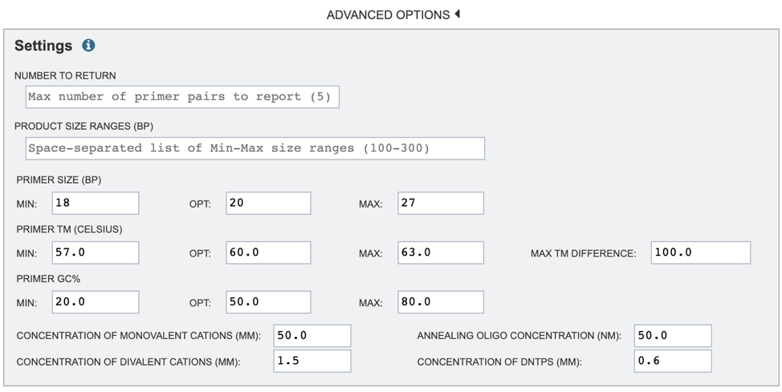

# Primer Design Service

## Overview
The Primer Design Service utilizes Primer3[1-5] to design primers from a given input sequence under a variety of temperature, size, and concentration constraints. Primer3 can be used to design primers for several uses including, PCR (Polymerase Chain Reaction) primers, hybridization probes, and sequencing primers. The service accepts a nucleotide sequence (pasted in, or select a FASTA formatted file from the workspace) and allows users to specify design. After specifying an appropriate output folder and clicking “submit”, the primer design is queued as a “job” to process in the Jobs information box on the bottom right of the page. Once the job has successfully completed, the output file will appear in the workspace, allowing the user to choose from a list of appropriate primers. 

## See also
* [Primer Design Service](https://bv-brc.org/app/PrimerDesign)
* [Primer Design Service Tutorial](../../tutorial/primer_design/primer_design.html)

## Using the Primer Design Service

The **Primer Design** submenu option under the **"SERVICES"** main menu (Viral Services category) opens the MSA and SNP/Variation Service input form. *Note: You must be logged into BV-BRC to use this service.*

 

### Parameters

Once the primer design service has been selected, users will be directed to the Primer Design landing page as shown below. 

 

Users may select one of two input options. 

*1\) Pasting in a relevant sequence:* 

**Sequence Identifier:** The user-provided name to identify the input sequence. If using a FASTA formatted file, this field will automatically be populated with the sequence name. 

**Paste Sequence:** Choosing this option allows users to paste in an input sequence. 

*2\) Choosing a workspace sequence:*

**Workspace FASTA:** Choosing this option allows users to specify the FASTA file from their workspace. 

*Users will also need to select appropriate target, inclusion and exclusion positions using options shown below. Selections can either be denoted by highlighting the desired regions and clicking the appropriate buttons (red box), or by manually typing in a list of coordinates in the appropriate boxes below.* 

If you would like to design a hybridization probe to detect the PCR product after amplification (real-time PCR applications) you may select the “PICK INTERNAL OLIGO” option as shown above. 

**Excluded Regions:** Values should be one or a space-separated list of start, length pairs. Primers will not overlap these regions. These values will be denoted with “< >” symbols.

**Targets:** Values should be one or a space-separated list of start, length pairs. Primers will flank one or more regions. These values will be denoted with “[ ]” symbols.

**Included Regions:** Values should be a single start, length pair. Primers will be picked within this range. These values will be denoted with “{ }” symbols.

**Primer Overlap Positions:** Values should be space separated list of positions, The forward OR reverse primer will overlap one of these positions. These values will be denoted with “-” symbol. 

*Output options can be specified using the parameters shown below:*  

**Output Folder:** The workspace folder where results will be placed.

**Output Name:** The name users specify for the completed job. 

  *Users may also choose to specify one or more primer properties by selecting “Advanced Options,” as shown below.*

**Number to Return:** number of primers/primer pairs to return.

**Product Size Ranges:** desired product size range.

**Primer Size:** desired primer length. 

**Primer TM:** melting temperature (Celsius) for a primer oligo.  

**Primer GC%:** percentage of Gs (guanines) and Cs (cytosine) desired in primers.

**Concentration of Monovalent Cations:** The millimolar (mM) concentration of monovalent salt cations (usually KCl) in the PCR. Primer3 uses this argument to calculate oligo and primer melting temperatures.

**Concentration of Divalent Cations:** The millimolar concentration of divalent salt cations (usually MgCl^(2+)) in the PCR.

**Annealing Oligo Concentration:** A value to use as nanomolar (nM) concentration of each annealing oligo over the course the PCR.

**Concentration of DNTPs:** The millimolar concentration of the sum of all deoxyribonucleotide triphosphates.

*More details on primer3 settings can be found on the [primer3 manual page [5]](https://primer3.org/manual.html#PRIMER_DNA_CONC).* 

### Buttons

**Reset:** Resets the input form to default values

**Submit:** Launches the primer design job. A message will appear below the box to indicate that the job is now in the queue. 

## Output Results

Clicking on the Jobs indicator at the bottom of the BV-BRC page open the Jobs Status page that displays all current and previous service jobs and their status. 

Once the job has completed, selecting the job by clicking on it and clicking the “View” button on the green vertical Action Bar on the right-hand side of the page displays the results files. 

The results page will consist of a header describing the job and a list of output files, as shown below. 

The Primer Design Service generates several files that are deposited in the Private Workspace in the designated Output Folder. These include

* **Primer3_input.txt** – a text file specifying the input sequences and the parameters used to specify the primer properties. If none are specified, default parameters will be used/listed. 
* **Primer3_output.txt** – a text file containing a list of primers and probe (if selected) candidates designed, as well as their corresponding properties. 
* **primers.fasta file** – a file containing a list of candidate primers and probes designed. Can be opened as a text or fasta file. 
* **table.html** – a HyperText Markup Language (Web-formatted) file displaying a table of output primer pairs and probes, as well as their properties, statistics, and location in the input sequence (see below). 
 

### Action buttons

After selecting one of the output files by clicking it, a set of options becomes available in the vertical green Action Bar on the right side of the table. These include

* **Hide/Show:** Toggles (hides) the right-hand side Details Pane.

* **Guide:** Links to the corresponding Quick Reference

* **Download:** Downloads the selected item.

* **View:** Displays the content of the file, typically as plain text or rendered html, depending on filetype.

* **Delete:** Deletes the file.

* **Rename:** Allows renaming of the file.

* **Copy:** Copies the selected items to the clipboard.

* **Move:** Allows moving of the file to another folder.

More details are available in the [Selection Action Bar](../action_bar.html) Quick Reference Guide.

## References

1.	Rozen S, Skaletsky H (2000) Primer3 on the WWW for general users and for biologist programmers. Methods Mol Biol 132(3):365–386
2.	Untergasser A, Nijveen H, Rao X, Bisseling T, Geurts R, Leunissen JA (2007) Primer3Plus, an enhanced web interface to Primer3. Nucleic Acids Res 35(Web Server issue):71–74
3.	You FM, Huo N, Gu YQ, Luo MC, Ma Y, Hane D, Lazo GR, Dvorak J, Anderson OD (2008) BatchPrimer3: a high throughput web application for PCR and sequencing primer design. BMC Bioinformatics 9:253
4.	https://github.com/primer3-org
5.	https://primer3.org/manual.html#PRIMER_DNA_CONC
