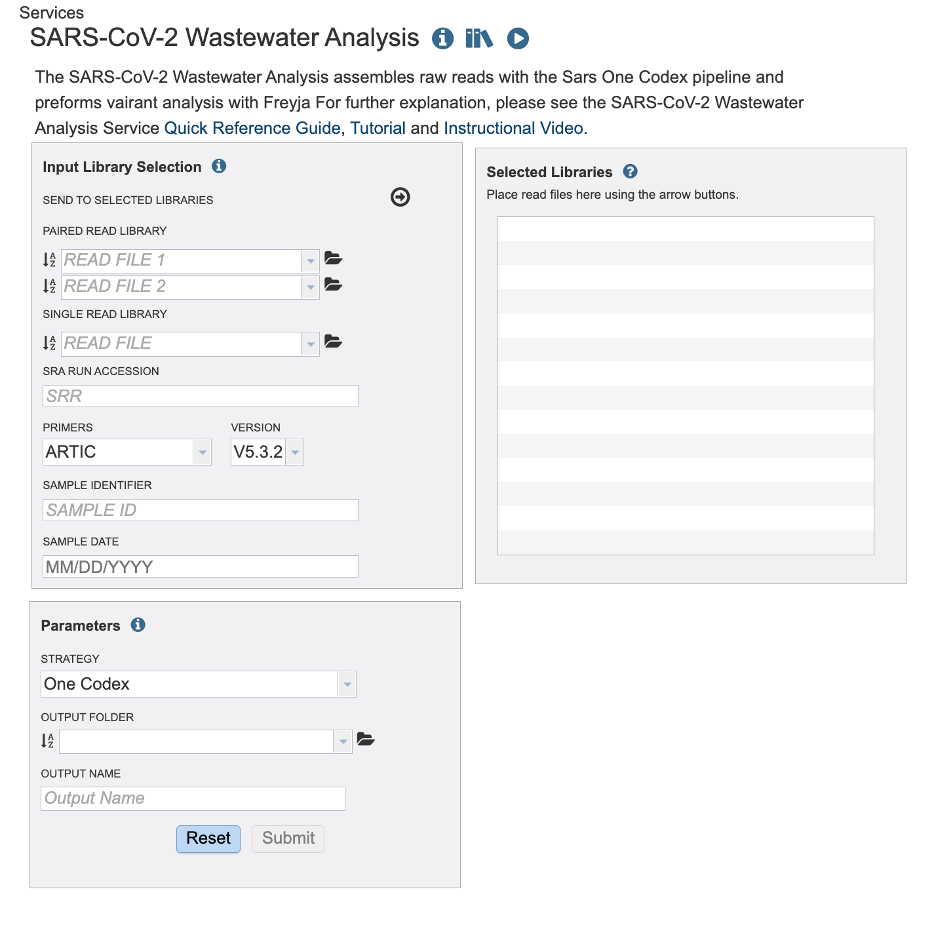
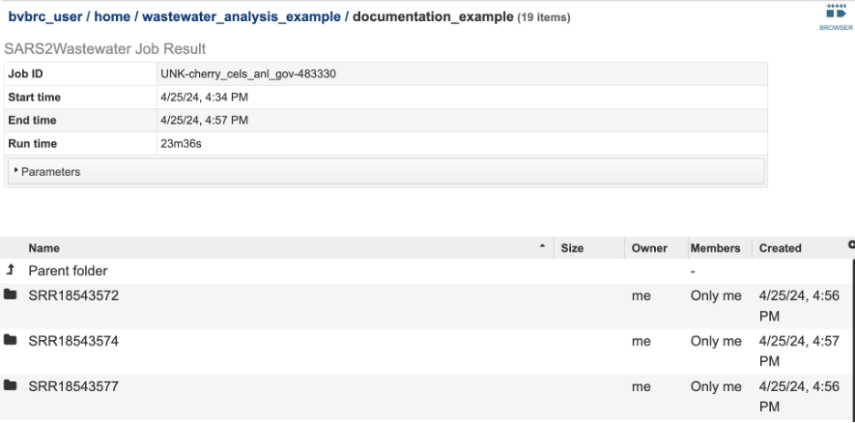

# SARS-Cov-2 Wastewater Analysis Service

##Overview
The SARS-CoV-2 Wastewater Analysis service is a comprehensive analysis of wastewater aimed at detecting and quantifying lineages and variants of concern (VOC) of the SARS-CoV-2 virus. 

The service accepts raw short amplicon reads from wastewater samples. The service analyzes reads by aligning them to the reference genome (Wuhan-Hu-1) and then analyzes the variants in the sample using [Freyja](https://andersen-lab.com/secrets/code/). Below is an overview of the service.

## See also
  * [SARSWastewater Service](https://bv-brc.org/app/SARSWastewater)
  * [SARSWastewater Service Tutorial](../../tutorial/sarswastewater/sarswastewater.html)

##Read Input File
This Service accepts read files uploaded to the workspace and SRA run accession values. This service is designed for short amplicon sequenced wastewater samples.

##Paired Read File
Read File 1 & 2: Many paired read libraries are given as file pairs, with each file containing half of each read pair. Paired read files are expected to be sorted such that each read in a pair occurs in the same Nth position as its mate in their respective files. These files are specified as READ FILE 1 and READ FILE 2. For a given file pair, the selection of which file is READ 1 and which is READ 2 does not matter.

##Single Read file 
Read File: The FASTQ file containing the reads.

##SRA Run Accession 
Allows direct upload of read files from the NCBI Sequence Read Archive to the Assembly Service. Entering the SRR accession number and clicking the arrow will add the file to the selected libraries box for use in the assembly.

##Primers / Version
Primer sequences play a crucial role in amplicon-based sequencing, a method used to analyze a specific region of DNA or RNA. These short, synthetic sequences of nucleotides are designed to bind (or anneal) to specific target sequences in the DNA that flank the region of interest. Once bound, primers initiate DNA amplification. The primers are specific to the target sequence. It is important to select the correct primer type and version so that the synthetic sequences can be removed from your sample.

##Sample Identifier 
The sample identifier Field will auto populate with the file name. Edit the field by clicking into the text box. The text entered to this the sample identifier fields will be used throughout the output files for the service. This documentation refers to this field as a sample id.

##Sample Date
Type the corresponding sample date if it is available to you. Take caution to format your date as Month, Day, Year, MM/DD/YYYY. You must type the “/” between Month and Day / Day and Year. For SRA samples the date may be available in the BioSample data.

##Selected Libraries
Reads placed here will be  submitted for analysis. You can review the metadata (sample id, primer information and date I given, by hovering over the ‘I’ icon. Notice the Sample ID and Date fields clear once samples are submitted to the selected libraries. The primer field remains the same. Take caution you are uploading reads with different primer sequences.

##Parameters

###Strategy
Currently there is only one strategy for this service.  The raw reads are aligned to the reference genome (Wuhan-Hu-1, NC_045512) with Minimap2 with MiniMap2  2]. Then SAMtools [3] converts the aligned FASTQs into BAM files. SAMtools [3] also sorts the aligned BAM files by the leftmost coordinates. Then the primers and low-quality sequences are trimmed by iVAR [4].  FastQC [5] offers a range of quality assessments for the raw FASTQ files, as well as the aligned and sorted BAM files.  

###Output Folder
User-selected workspace folder where results will be placed.

###Output Name 
Auto-generated name for the results (Taxonomy Name + My Label)

/Users/nbowers/Documents/bv-brc_git_repos/BV-BRC-Docs/docroot/quick_references/images/
