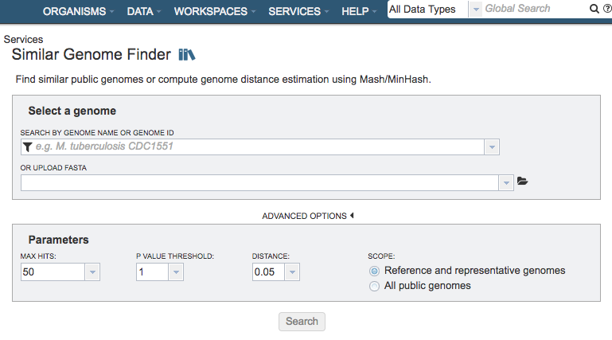

# Similar Genome Finder Service

## Overview
The bacterial Similar Genome Finder Service will find similar public genomes in BV-BRC or compute genome distance estimation using [Mash/MinHash](https://www.ncbi.nlm.nih.gov/pmc/articles/PMC4915045/). It returns a set of genomes matching the specified similarity criteria. 

## See also
* [Similar Genome Finder Service](https://bv-brc.org/app/GenomeDistance)
* [Similar Genome Finder Service Tutorial](/tutorial/similar_genome_finder/similar_genome_finder)

## Using the Similar Genome Finder Service
The **Similar Genome Finder** submenu option under the **Services** main menu (Genomics category) opens the Similar Genome Finder input form (*shown below*).

## Select a Genome
Specifies the genome to use as the basis for finding other similar genomes

### Search by Genome Name or Genome ID
Selection box for specifying genome in BV-BRC to use as the basis of comparison

### Or Upload FASTA
Alternate option for uploading a FASTA file to use as the basis of comparison. *Note: You must be logged into BV-BRC to use this option.* 

## Advanced Options

### Parameters

**Max Hits:** The maximum number of matching genomes to return. 

**P-Value Threshold:** Sets the maximum allowable p-value associated with the [Mash](https://www.ncbi.nlm.nih.gov/pmc/articles/PMC4915045/) Jaccard estimate used in calculating the distance.

**Distance:**  Mash distance, which estimates the rate of sequence mutation under as simple evolutionary model using k-mers. The Distance parameter sets the maximum Mash distance to include in the Similar Genome Finder Service results. Mash distances are probabilistic estimates associated with p-values. 

**Scope:** Option for limiting the search to only Reference and Representative genomes, or all genomes in BV-BRC.

## Buttons

**Search:** Launches the similar genome finder job.

## Output Results
 

The Similar Genome Finder Service generates a table of matching genomes based on the options chosen.  

### Action buttons
After selecting one of the output files by clicking it, a set of options becomes available in the vertical green Action Bar on the right side of the table.  These include

* **Hide/Show:** Toggles (hides) the right-hand side Details Pane.
* **Download:**  Downloads the selected items (rows).
* **Copy:** Copies the selected items to the clipboard.
* **Group:** Opens a pop-up window to enable adding the selected sequences to an existing or new group in the private workspace.
* **Genome:** Loads the Genome View Overview page corresponding to the selected feature.  *Available only if a single feature is selected.*
* **Genomes:** Loads the Genomes Table, listing the genomes that correspond to the selected features. *Available only if multiple features are selected.*

More details are available in the [Action Bar](/quick_references/action_bar) Quick Reference Guide.

## References
1.	Ondov BD, Treangen TJ, Melsted P et al. Mash: fast genome and metagenome distance estimation using MinHash, Genome biology 2016;17:132.
