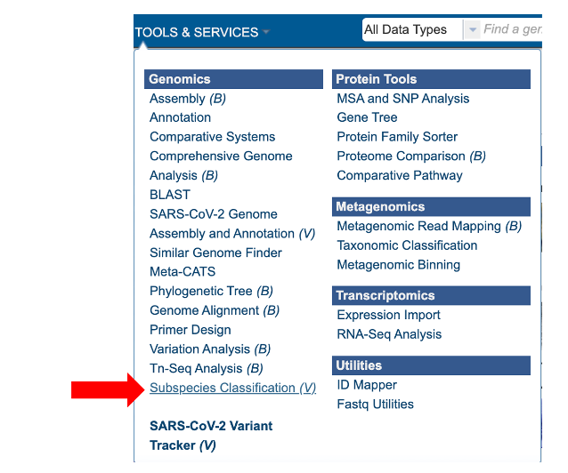
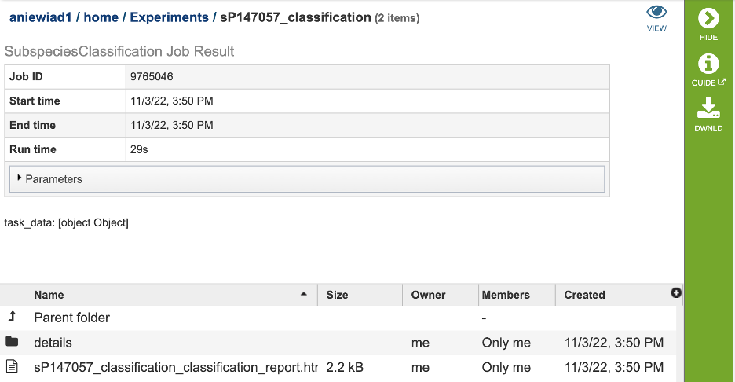

# Subspecies Classification Service

## Overview

The subspecies classification tool assigns the genotype/subtype of a virus, based on the genotype/subtype assignments maintained by the International Committee on Taxonomy of Viruses (ICTV). This tool infers the genotype/subtype for a query sequence from its position within a reference tree (using the [pplacer](https://matsen.fhcrc.org/pplacer) tool with a reference tree and reference alignment, including the query sequence as input, interpretation of the [pplacer](https://matsen.fhcrc.org/pplacer) result is handled by [Cladinator](https://github.com/cmzmasek/forester/blob/master/forester/java/src/org/forester/application/cladinator.java)).

## See Also
  * [Subspecies Classification Service](https://www.bv-brc.org/app/SubspeciesClassification)
  * [Subspecies Classification Tutorial](../../tutorial/subspecies_classification/subspecies_classification.html)

  ## Using the Subspecies Classification Service
  The **“Subspecies classification”** submenu (red arrow) under the **“SERVICES”** main menu (Viral Services category) opens the input form.

  * *Note: You must be logged into BV-BRC to use this service.*

## Parameters

**Query source:** Users may enter their input sequence in this box, either by  directly pasting in a nucleotide sequence, or by selecting a FASTA file from the BV-BRC or uploading it to the site.

**Enter Sequence:** Users may enter custom sequences here by pasting in FASTA formatted sequences.

**Select FASTA file:** Choose FASTA file that has been uploaded to the Workspace.

**Species:** Select the viral species desired for classification. Current species available for subspecies classification include: Hepatitis C Virus (HCV), Dengue Virus, Saint Louis Encephalitis Virus, West Nile Virus, Japanese Encephalitis Virus, tickborne Encephalitis Virus, Yellow Fever virus, Bovine diarrheal virus 1, Murray Valley Encephalitis virus, and Zika virus.

**Output Folder:** The workspace folder where results will be placed.

**Output Name:** A user-specified label. This name will appear in the workspace when the annotation job is complete.

**Reset:** Resets the input form to default values

**Submit:** Launches the classification job. A message will appear below the box to indicate that the job is now in the queue. 

## Output Results
Clicking on the Jobs indicator at the bottom of the BV-BRC page open the Jobs Status page that displays all current and previous service jobs and their status.

Once the job has completed, select the job by double-clicking on it, or clicking the “View” button on the green vertical Action Bar on the right-hand side of the page (red box). This displays the results files.

The results page will consist of a header describing the job and a list of output files, as shown below.

The Classification Service generates several files that are deposited in the Private Workspace in the previously designated Output Folder. These include:

  * **.tre** – the alignment file in fasta format.
  * input.fasta
  * out.json
  * out.sing.tre
  * ref_MSA_with_query_seqs.fasta
  * **result.tsv** – A tab separated value file allowing users a tabular view of all nucleotide or amino acid variations found within their MSA.
  * **_classification**.txt:

  ## Action Buttons
  After selecting one of the output files by clicking it, a set of options becomes available in the vertical green Action Bar on the right side of the table. These include:

* **Hide/Show:** Toggles (hides) the right-hand side Details Pane.
* **Guide** Link to the corresponding User Guide
* **Download:** Downloads the selected item.
* **View** Displays the content of the file, typically as plain text or rendered html, depending on filetype.
* **Delete** Deletes the file.
* **Rename** Allows renaming of the file.
* **Copy:** Copies the selected items to the clipboard.
* **Move** Allows moving of the file to another folder.
* **Edit Type** Allows changing of the type of the file in terms of how BV-BRC interprets the content and uses it in other services or parts of the website. Allowable types include unspecified, contigs, nwk, reads, differential expression input data, and differential expression input metadata.

More details are available in the [Action Buttons](https://bv-brc.org/docs/user_guides/action_buttons.html) user guide.

## References
1.  Pplacer
    [https://matsen.fhcrc.org/pplacer/](https://matsen.fhcrc.org/pplacer/)

2.  Cladinator
    [https://github.com/cmzmasek/forester/blob/master/forester/java/src/org/forester/application/cladinator.java](https://github.com/cmzmasek/forester/blob/master/forester/java/src/org/forester/application/cladinator.java)
