# Taxonomic Classification Service

## Overview
The Taxonomic Classification Service accepts reads or SRR values from sequencing of a metagenomic sample and uses [Kraken 2](http://genomebiology.com/2014/15/3/R46) to assign the reads to taxonomic bins, providing an initial profile of the possible constituent organisms present in the sample. We support taxonomic classification for whole genome sequencing data (WGS) and for 16s rRNA sequencing. It is important that you select the sequence type. Then the analysis options and database options will change support your sequence type.

## See also
  * [Taxonomic Classification Service](https://bv-brc.org/app/TaxonomicClassification)
  * [Taxonomic Classification Service Tutorial](../../tutorial/taxonomic_classification/taxonomic_classification.html)

## Using the Taxonomic Classification Service
The **Taxonomic Classification** submenu option under the **Services** main menu (Metagenomics category) opens the Taxonomic Classification input form (shown below). *Note: You must be logged into BV-BRC to use this service.*

## Options
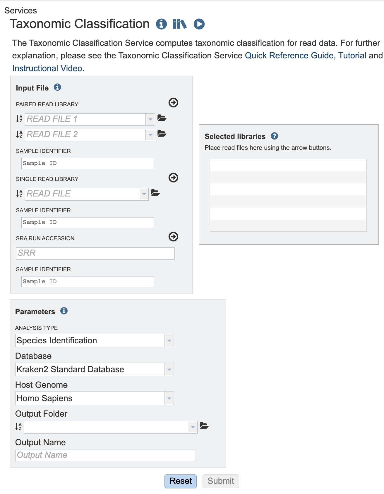

## Input File
This service is designed to process short reads. This can be via single read files, paired read files or the SRA run accession. 

## Sample Identifiers
The SAMPLE IDENTIFIER Field will auto populate with the file name. Edit the field by clicking into the text box. The text entered to this the SAMPLE IDENTIFER fields will be used throughout the output files for the service. This documentation refers to this field as a sample id.
### Paired read library
**Read File 1 & 2:** Many paired read libraries are given as FASTQ file pairs, with each file containing half of each read pair. Paired read files are expected to be sorted such that each read in a pair occurs in the same Nth position as its mate in their respective files. These files are specified as READ FILE 1 and READ FILE 2. For a given file pair, the selection of which file is READ 1 and which is READ 2 does not matter.

### Single read library
**Read File:** The FASTQ file containing the reads.

### SRA run accession
Allows direct upload of read files from the [NCBI Sequence Read Archive](https://www.ncbi.nlm.nih.gov/sra) to the service. Entering the SRR accession number and clicking the arrow will add the file to the selected libraries box for use in the assembly.

## Selected libraries
Read files placed here will be submitted to the service.

## Parameters

### Sequencing Type
We now support 16S and Whole Genome Sequencing (WGS). The Analysis type and database options will change according to which sequencing type is chosen.  16S sequencing is less read-intensive as it consumes fewer sequencing resources and allows you to run more samples per sequencing run. Although it allows for less multiplexing of samples due to a higher read budget, WGS provides more valuable metagenomic data from your samples.

### Analysis Type 
#### Whole Genome Sequencing (WGS) Analysis Types
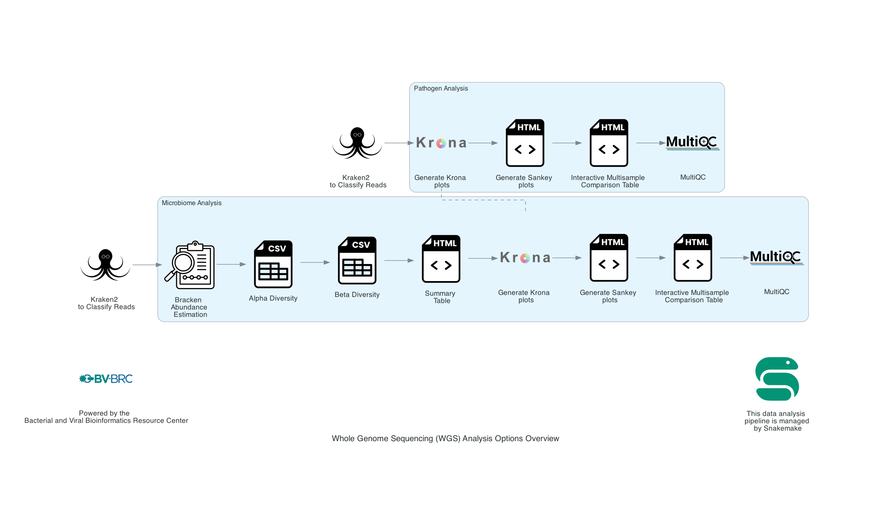

The WGS pipelines are described in [Lu et al., 2022](https://doi.org/10.1038/s41596-022-00738-y). 

#### WGS FASTQ Processing
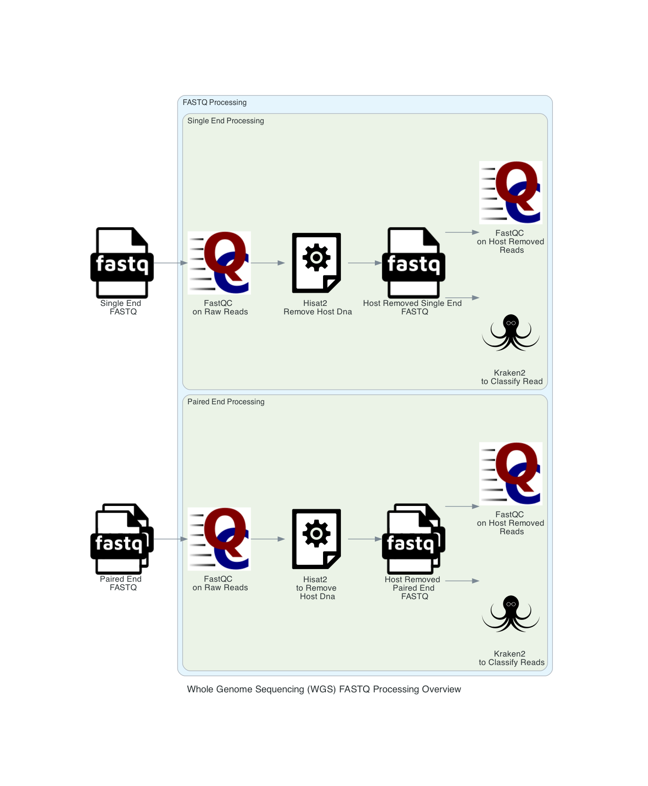
The FASTQ processing is the same for both the Species Identification and Microbiome Pipeline. FastQC is performed on the raw FASTQ files. 

If a host is chosen in the Filter Host Reads dropdown, [Hisat2](http://daehwankimlab.github.io/hisat2/) will align the reads to the host genome then remove any aligned reads that aligned to the host genome from the sample.  FastQC will run on the host removed reads.  Then the host removed reads are used in thee Kraken2 command.

[Hisat2](http://daehwankimlab.github.io/hisat2/) is a fast and sensitive alignment program for mapping next-generation sequencing reads. The FastQC results are available under the sample directory in the FastQC_results directory. The results are also compiled into a MultiQC report. If the default parameter, 'None' is selected, this step is not run, and the raw reads are used in the Kraken2 command. 

#### Species Identification

The Species identification is an end-to-end pipeline that runs Kraken2Uniq to identify taxa at the species level.  The Kraken results are used in the analysis results. This analysis outputs Krona and Sankey plots. A MultiQC report will generate with the FastQC results and kraken results. If multiple samples are submitted, an interactive multisample comparison table is generated from the Kraken results.

#### Microbiome Analysis
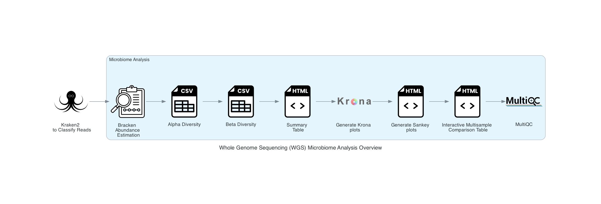

The Microbiome analysis is an end-to-end pipeline that is similar to the Species Identification Pipeline.  This pipeline uses Kraken2 to identify taxa the species level. However, this pipeline uses a companion program to Kraken2 and the other tools in the Kraken suite, [Bracken](https://github.com/jenniferlu717/Bracken).  Bracken is run at the species level with the flag '-S'.  Bracken recreates the report file using the values from the Bracken recalculation. This is available in the user input sample id subdirectory under bracken_output. Any levels whose reads were below the threshold of 10 are not included. Percentages will be re-calculated for the remaining levels. Unclassified reads are not included in the report.  The Bracken results are used the Krona and Sankey plots. Bracken functions calculate alpha and beta diversity. The statistics displayed with plotly in .HTML files as well as .CSV for downstream analysis.  A MultiQC report will generate with the FastQC results and kraken results. If multiple samples are submitted, an interactive multisample comparison table is generated from the Bracken results.

#### 16S rRNA Analysis
16S rRNA Analysis with Kraken2 is described in [Lu et al., 2020]( https://doi.org/10.1186/s40168-020-00900-2). Currently, we offer one analysis type for 16S that is very similar to the WGS microbiome analysis with a few differences. The most important differences are the database options.

#### 16S rRNA FASTQ Processing
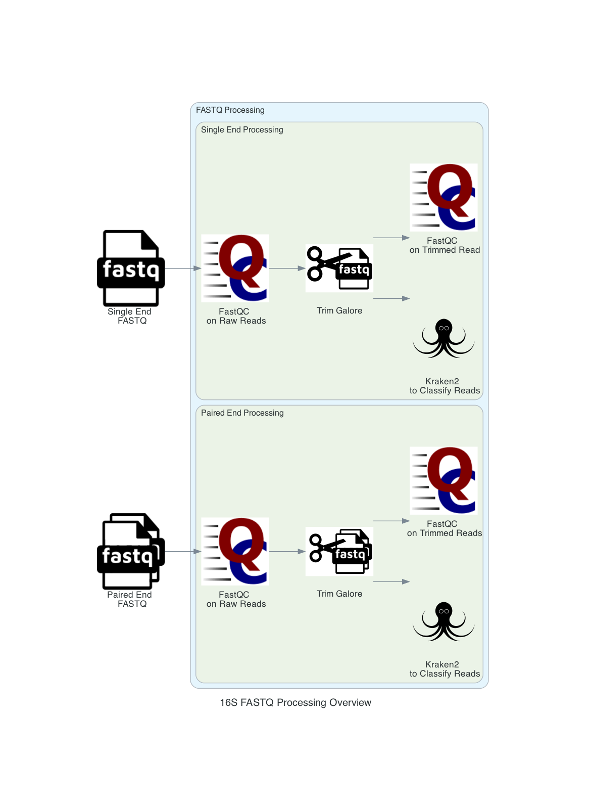
The FASTQ processing begins with FastQC on the raw FASTQ files. Then the reads are trimmed with [Trim Galore](https://www.bioinformatics.babraham.ac.uk/projects/trim_galore/).  Trim Galore is a wrapper around the tool [Cutadapt]( https://cutadapt.readthedocs.io/en/stable/) and FastQC to apply quality and adapter trimming of FASTQ files. FastQC results will be available for the trimmed reads. The FastQC results are available under the sample directory in the FastQC_results directory. The results are also compiled into a MultiQC report. The trimmed reads are used in the Kraken2 command.

#### 16S rRNA Default Analysis
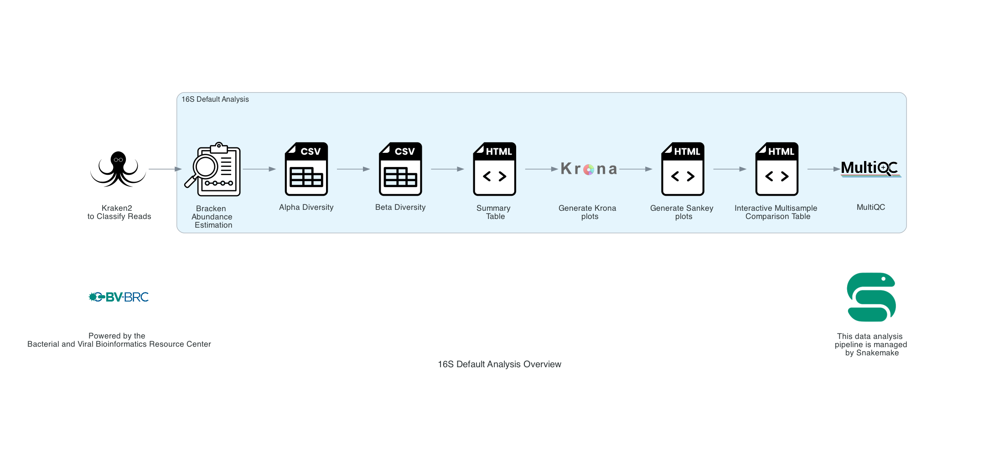

This pipeline uses a companion program to Kraken2 and the other tools in the Kraken suite, [Bracken](https://github.com/jenniferlu717/Bracken).  Bracken is run at the genus level with the flag '-G'. The SILVA and Greengenes database offer reliable results to the genus level. The databases offer some taxa at lower taxonomy levels. But too few to reliably generate the Bracken report. Bracken recreates the report file using the values from the Bracken recalculation. This is available in the user input sample id subdirectory under bracken_output. Any levels whose reads were below the threshold of 10 are not included. Percentages will be re-calculated for the remaining levels. Unclassified reads are not included in the report.  The Bracken results are used the Krona and Sankey plots. Bracken functions calculate alpha and beta diversity. The statistics displayed with plotly in .HTML files as well as .CSV for downstream analysis.  A MultiQC report will generate with the FastQC results and kraken results. If multiple samples are submitted, an interactive multisample comparison table is generated from the Bracken results.

 * All analysis types use [Kraken 2](http://genomebiology.com/2014/15/3/R46) - Assigns taxonomic labels to metagenomic DNA sequences using exact alignment of k-mers. [Kraken 2 source code](https://ccb.jhu.edu/software/kraken2/)

### Database
Reference taxonomic database used by the algorithm.

__Whole genome sequencing databases (WGS)__
* [Kraken2 Standard Database](https://ccb.jhu.edu/software/kraken2/index.shtml?t=manual#standard-kraken-2-database) - Standard Kraken 2 database containing distinct 31-mers, based on completed microbial genomes from NCBI.
* [BV-BRC Database]( https://github.com/DerrickWood/kraken2/wiki/Manual#custom-databases) - The default Kraken 2 database at BV-BRC includes the following:

  * Archaea: RefSeq complete archaeal genomes/proteins

  * Bacteria: RefSeq complete bacterial genomes/proteins

  * Plasmid: RefSeq plasmid nucleotide/protein sequences

  * Viral: RefSeq complete viral genomes/proteins

  * Human: GRCh38 human genome/proteins

  * Fungi: RefSeq complete fungal genomes/proteins

  * Plant: RefSeq complete plant genomes/proteins

  * Protozoa: RefSeq complete protozoan genomes/proteins

  * UniVec: NCBI-supplied database of vector, adapter, linker, and primer sequences that may be contaminating sequencing projects and/or assemblies

 __16s Analysis databases__
* [SILVA](https://www.arb-silva.de/) - The SILVA Database, short for "SILVA rRNA database project," is a widely recognized and meticulously curated resource for ribosomal RNA (rRNA) gene sequences. It covers rRNA genes from bacteria, archaea, and eukaryotes, offering high-quality data with taxonomic classifications. SILVA is an essential tool for researchers in molecular biology and microbiology, aiding in phylogenetic analysis, taxonomic identification, and the study of microbial communities in diverse environments. With its constant updates and comprehensive coverage, SILVA plays a crucial role in advancing our understanding of microbial diversity and evolution.

* [Greengenes](https://greengenes.lbl.gov/Download/) - Greengenes is a prominent 16S rRNA gene sequence database designed for microbiologists and microbial ecologists. This database contains curated and annotated 16S rRNA gene sequences primarily from bacteria and archaea. Greengenes is a valuable resource for researchers studying microbial communities in various environments. It enables taxonomic classification, comparative analyses, and metagenomic studies by providing a standardized and well-maintained collection of sequences. Whether you're investigating the human microbiome or exploring microbial diversity in natural ecosystems, Greengenes is a go-to resource for characterizing and understanding microorganisms and their roles in different ecosystems. Greengenes includes species level annotations.

### Output Folder
The workspace folder where results will be placed.

### Output Name
Name used to uniquely identify results.

## Output Results

The Taxonomic Classification Service generates several files that are deposited in the Private Workspace in the designated Output Folder.

### All Jobs Will Output
* **multiqc_report.html** - An interactive output report from [MultiQC]( https://multiqc.info/)
* **sample_key.csv** - An Excel compatible file displaying the user input SAMPLE IDENTIFIER used in the output files and the user input fille name.
* **SAMPLE IDENTIFIER_sankey.html** - A Sankey diagram for each sample named with sample identifier displays an overview of taxa at each domain level.

### Jobs With Multiple Samples Will Output
* **multi_sample_table** - An Excel compatible file of the data displayed in multisample_comparison.html
* **multisample_comparison.html** - An interactive chart displaying z-scores across multiple samples with heatmap style coloring.
* **multisample_krona.html** - Link to [Krona](https://www.ncbi.nlm.nih.gov/pmc/articles/PMC3190407/)-based interactive chart showing the taxonomic classification distribution for every sample in the analysis.
* **summary_table.csv** An Excel compatible file with the Kraken2 summary statistics for each sample.

### Microbiome Analysis Jobs Will Output
* **alpha_diversity.csv** - An Excel compatible file of the data displayed in alpha_diversity.html
* **alpha_diversity.html** - A data table with the alpha diversity (Berger-parker, Shannon, Fisher's index, Simpson, statistics Simpson's Reciprocal Index) for each sample.
* **beta_diversity.csv** - An Excel compatible file of the data displayed in beta_stats_heatmap.html
* **beta_stats_heatmap.html** - A heatmap with diversity statistics between each sample

### Krona Chart and Multiple Sample Krona

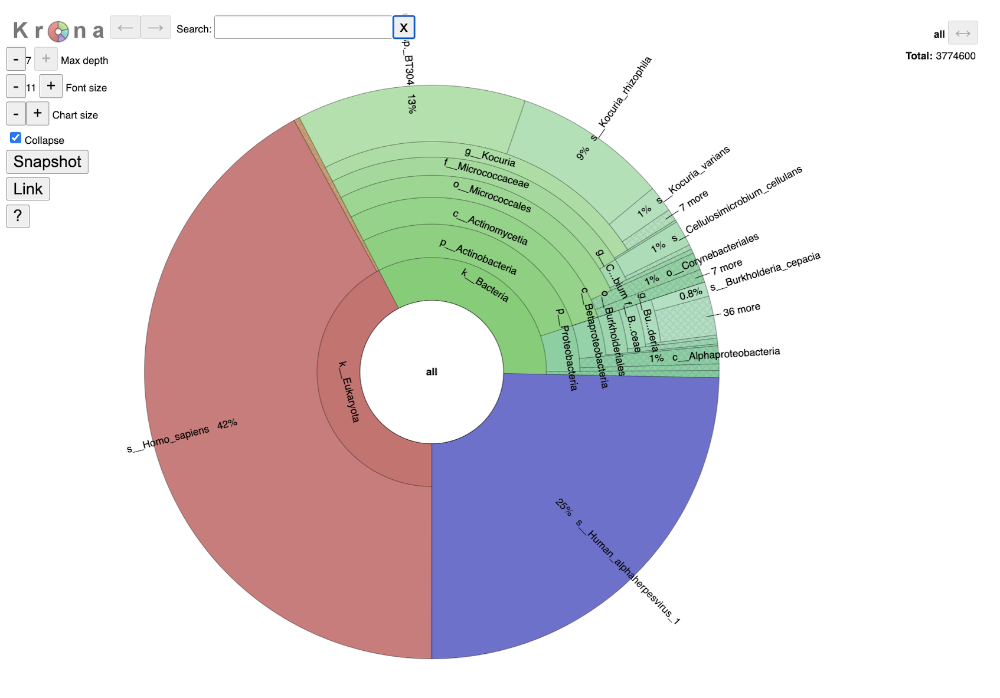

This interactive chart provides a visual representation of the reads mapping to each taxon. Clicking on a taxon within the pie chart will provide a summary of the reads mapping to that specific selection on the upper right corner. Double clicking with a section will open that specific section to view. It is possible to change the maximum depth, font size and chart size by clicking the plus and minus buttons. Clicking the collapse check box will determine if you show every taxa level that is currently selected. The snapshot button will capture an image of the krona plot at the current.

Single sample Krona plots are available in the sample level directories. Multisample Krona plots are available in the landing page for the job. Navigating the multisample Krona plot is the same as navigating an individual Krona plot. To toggle between samples, select the “SAMPLE ID.b.krona” in the box below the Krona logo. This is the name of the file used to create the plot. The start of the file name will be the user entered SAMPLE ID. Or use the arrow buttons on the right-hand side. 

### MultiQC Report

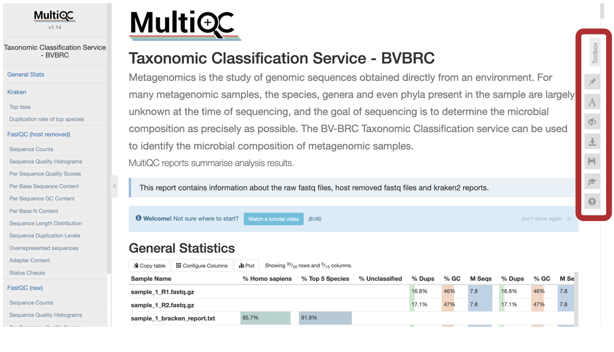

The MultiQC Report will display a compilation of sample results from FastQC and Kraken2 into one place. If you are new to MultiQC, an introductory video walkthrough is available above General Statistics. Use the toolbox to interact with the contents of the report. There are multiple ways to interact with this report. Subsection most plots by clicking to highlight a portion of the plot or clicking and dragging a subsection of the plot.  

To export an individual plot (before or after manipulations) use the "Export Plot" button in the upper right-hand corner of the individual plot.

The MultiQC Toolbox is a very powerful aspect of the report. To interact with the MultiQC report Toolbox, click the icons along the right-hand side.  
 * The "Pin" icon called "highlight" allows you to highlight specific text in the report. 
 * The "A" icon called "rename" allows you to rename samples in the report. You could also paste the columns of a tab-delaminated table here (for example, the sample_key.CSV from the job output)
 * The "Eye" with a strike through called "hide" allows you to show or hide specific samples.
 * The "Download" icon called "export" in the Images tab, allows you manipulate the plots within the report and export selected plots. Plots can be manipulated in the following ways: 
   * Size changes the number of pixels.
   * Use the dropdown to select  .PNG, .JPEG, .SGV for the output image of the plot.
   * Plot scaling allows you to change the scale of your plot.
Click in the check box to select the images for output. Then, at the bottom of this list, select "Download Plot Image" to save these images.

Under the Data tab you can download the exact raw data used to create the plots. Click in the check box to select which plot(s) to download the data from. Then, at the bottom of the list, select "Download Plot Data"

### Sample Key

 

### Sankey Diagram

This is another interactive view of the taxa across every domain level at the same time. The key to reading and interpreting Sankey Diagrams is remembering that the width is proportional to the quantity represented. If features are overlapping, click and drag bars up and down. Specifically, the archaea feature may populate over the sample name. Simply click and drag down to view. 

### Multiple Sample Comparison

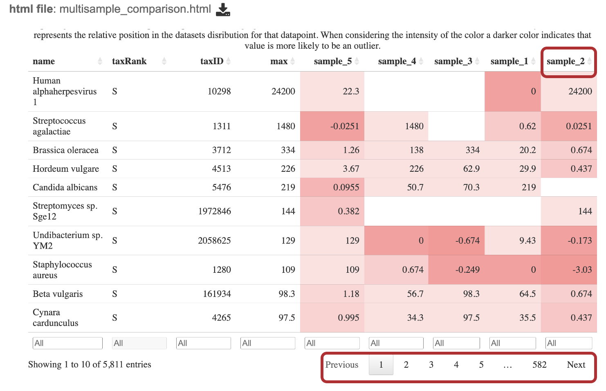
The goal of this table is to identify which microbes are unique within each sample and which are common among all samples. When interesting this table, it is important to consider the if a value is positive or negative, the magnitude of the value and the color of the value calculated from the Kraken2 report. Note, this table shows the taxa at the species level for WGS results and at the genus level for 16S rRNA results.

Interact with the table by clicking the up and down arrows next to the sample ID. This will sort the results for the taxa with the highest z-score at the. top of the table. Set a range for the values in  a column in the "All" text box. Click the "Prev", "Next", and page numbers to sort through pages of the table.

Search for a specific taxa by typing in box that says "All" in the "name" column.

The robust z-score is the median absolute deviation. This method is chosen to reduce impact from outliers in the data, providing a more reliable measure of relative position within the data distribution. 

If the positive robust z-score indicates that t the number of fragments assigned to that taxon was above the median or central tendency of the data. 

Conversely, a negative robust z-score indicates that the number of fragments assigned to that taxon was below the median or central tendency of the data. 

The magnitude (represented as the value of the z-score) indicates the distance of the data point from the central tendency in terms of the robust measure of dispersion. 

The intensity of the red for each cell is calculated by putting the read scores into quantiles probabilities ranging from 0.05 to 0.95 with an increment of 0.05. This means that the intensity of the color represents the relative position in the dataset’s distribution for that datapoint. A darker color indicates that value is more likely to be an outlier.

### Alpha Diversity

Alpha-diversity is measured as the observed richness (number of taxa) or evenness (the relative abundances of those taxa) of an average sample within one sample. (Anderson et al., 2006) These are calculated with the [KrakenTools](https://ccb.jhu.edu/software/krakentools/) alpha_diversity.py script. Each column of the table displays one sample at each alpha diversity level. Alpha results are available for individual samples at the sample level directory. The data displayed in the .HTML file is also available as .CSV

 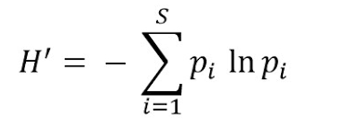 
 
Shannon's diversity index quantifies the uncertainty in predicting the species identity of an individual that is taken at random from the dataset. ACE Index. (Shannon, 1948)

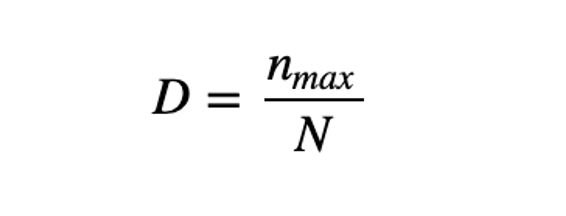 

Berger-Parker’s The Berger-Parker index (Berger and Parker 1970) expresses the proportional importance of the most abundant type. This metric is highly biased by sample size and richness, moreover it does not make use of all the information available from sample. (Berger & Parker, 1970)

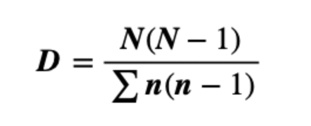 

Simpson’s index is a measure of diversity which considers the number of species present, as well as the relative abundance of each species. As species richness and evenness increase, so diversity increases. (Simpson, 1949). The Simpson-based metrics are that they do not tend to be as affected by sampling effort as the Shannon’s index. 

 

Inverse Simpson’s: Simpson’s reciprocal index quantifies biodiversity by considering the richness and evenness. The greater the biodiversity in an area, the higher the value of D. The lowest possible defined value of D is 1and would occur if the
community contained only one species. The maximum value would occur if there
was perfect evenness and would be equal to the number of species.
(Simpson, 1949)

 

Fisher’s represented the first attempt to describe mathematically the relationship between the number of species and the number of individuals in those species. This index is most applicable when a sample has a small number of abundant species and the large proportion of 'rare' species (the class containing one individual is always the largest) predicted by the log series model. (Fisher et al., 1943)

### Beta Diversity Heatmap

Beta-diversity is quantified as the variability in community composition (the identity of taxa observed) between samples within a group of samples (Anderson et al., 2006). The data displayed in the .HTML file is also available as .CSV

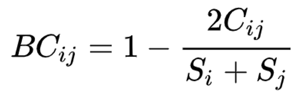

Beta diversity is calculated with the [KrakenTools](https://ccb.jhu.edu/software/krakentools/) beta_diversity.py script to compute the Bray-Curtis dissimilarity matrix for pairwise dissimilarities among three microbiome samples. In this matrix, a 0 means the two samples were _exactly_ the same and a 1 means they are maximally divergent. (Bray & Curtis, 1957).

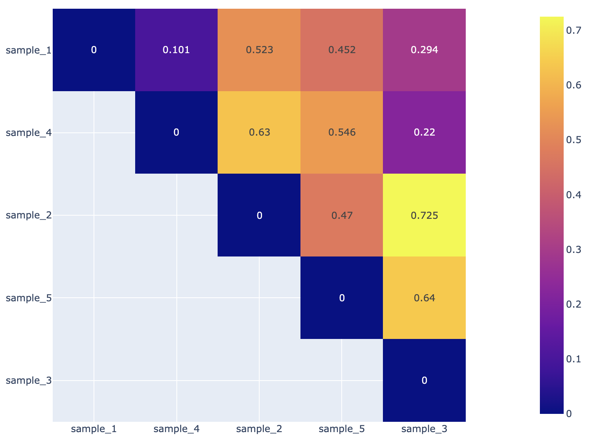 

### Action buttons

After selecting one of the output files by clicking it, a set of options becomes available in the vertical green Action Bar on the right side of the table. These include

* **Hide/Show:** Toggles (hides) the right-hand side Details Pane.
* **Guide** Link to the corresponding Quick Reference Guide.
* **Download:** Downloads the selected item.
* **View** Displays the content of the file, typically as plain text or rendered html, depending on filetype.
* **Delete** Deletes the file.
* **Rename** Allows renaming of the file.
* **Copy:** Copies the selected items to the clipboard.
* **Move** Allows moving of the file to another folder.

More details are available in the [Action Bar](../action_bar.html) Quick Reference Guide.

## References
 * Anderson MJ, Ellingsen KE, McArdle BH. Multivariate dispersion as a measure of beta diversity. Ecol Lett. 2006. June;9(6):683–93. 10.1111/j.1461-0248.2006.00926.
 * Andrews, S. (2010). FastQC:  A Quality Control Tool for High Throughput Sequence Data [Online]. Available online at: http://www.bioinformatics.babraham.ac.uk/projects/fastqc/
 * Breitwieser FP, Salzberg SL. Pavian: interactive analysis of metagenomics data for microbiome studies and pathogen identification. Bioinformatics. 2020 Feb 15;36(4):1303-1304. DOI: 10.1093/bioinformatics/btz715. PMID: 31553437; PMCID: PMC8215911.
 * Ewels, P., Magnusson, M., Lundin, S., &amp; Käller, M. (2016). MultiQC: Summarize analysis results for multiple tools and samples in a single report. Bioinformatics, 32(19), 3047–3048. https://doi.org/10.1093/bioinformatics/btw354 
 * Fisher, R. A., Corbet, A. S. & Williams, C. B. The relation between the number of species and the number of individuals in a random sample of an animal population. J. Anim. Ecol. 12, 42–58 (1943)
 * Kim, D., Langmead, B., & Salzberg, S.L. (2015). HISAT: A fastq spliced aligner with low memory requirements. Nature Methods, 12(4), 357-360. https://doi.org/10.1038/nmeth.3317
 * Lu, J. & Salzberg, S. L. Ultrafast and accurate 16S rRNA microbial community analysis using Kraken 2. Microbiome 8, 1-11 (2020).
 * Lu, J., Rincon, N., Wood, D. E., Breitwieser, F. P., Pockrandt, C., Langmead, B., Salzberg, S. L., &amp; Steinegger, M. (2022). Metagenome analysis using the Kraken Software Suite. Nature Protocols, 17(12), 2815–2839. https://doi.org/10.1038/s41596-022-00738-y 
 * Maidak, Bonnie L., et al. "The RDP (ribosomal database project)." Nucleic acids research 25.1 (1997): 109-110.
 * Ondov BD, Bergman NH, and Phillippy AM. Interactive metagenomic visualization in a Web browser. BMC Bioinformatics. 2011 Sep 30; 12(1):385.
 * Wood DE, Salzberg SL: Kraken: ultrafast metagenomic sequence classification using exact alignments. Genome Biology 2014, 15:R46.
 * Shannon, C. E. A mathematical theory of communication. Bell Syst. Tech. J. 27, 379–423 (1948).
 * Simpson, E. H. Measurement of diversity. Nature 163, 688–688 (1949)
 * Yilmaz P, Parfrey LW, Yarza P, Gerken J, Pruesse E, Quast C, Schweer T, Peplies J, Ludwig W, Glöckner FO. The SILVA and “All-species Living Tree Project (LTP)” taxonomic frameworks. Nucleic Acids Res. 2014; 42(Database issue):643–8.

