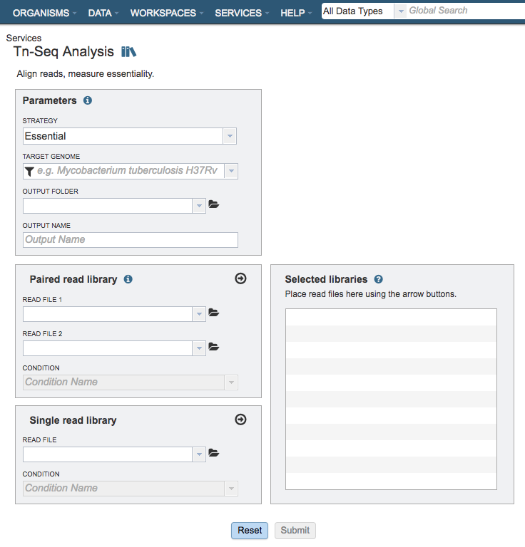
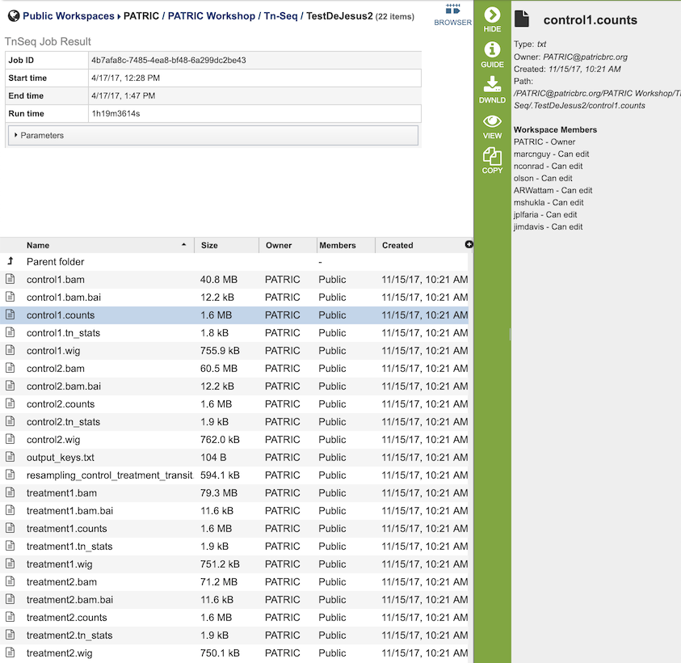
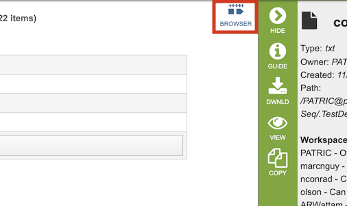
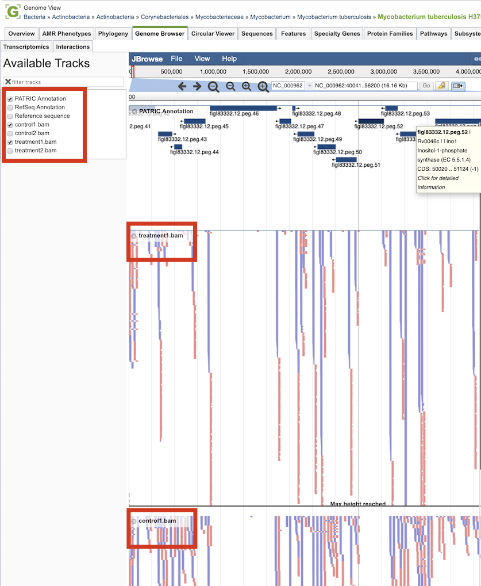

# Tn-Seq Analysis Service

## Overview
The Tn-Seq Analysis Service facilitates determination of essential and conditionally essential regions in bacterial genomes from data generated from transposon insertion sequencing (Tn-Seq) experiments. Tn-Seq (in the broad sense used here) refers to a family of related methods that use deep sequencing to survey a transposon insertion library and quantify the abundance of insertions at different sites in the genome.

*Note: The BV-BRC Tn-Seq Analysis Service wraps the [TRANSIT](http://journals.plos.org/ploscompbiol/article?id=10.1371/journal.pcbi.1004401) software.  Please cite this reference when publishing results from this service:*

* DeJesus, M. A., Ambadipudi, C., Baker, R., Sassetti, C., & Ioerger, T. R. (2015). TRANSIT-a software tool for Himar1 TnSeq analysis. *PLoS computational biology*, *11*(10), e1004401.

## See also
* [Tn-Seq Analysis Service](https://bv-brc.org/app/Tnseq)
* [Tn-Seq Analysis Service Tutorial](/tutorial/tn-seq/tn-seq)

## Using the Tn-Seq Service
The **Tn-Seq Analysis** submenu option under the **Services** main menu (Genomics category) opens the Tn-Seq Analysis input form (*shown below*). *Note: You must be logged into BV-BRC to use this service.*

## Options
 

## Parameters

### Strategy
This parameter determines whether the genes are determined to be essential in a single condition or by comparison to a control.

**Essential:** Runs the
[TRANSIT](http://journals.plos.org/ploscompbiol/article?id=10.1371/journal.pcbi.1004401)
software. With this strategy selected TRANSIT will calculate the probability of being essential using the Gumbel or Extreme Value distribution.

**Conditionally Essential:** Runs the
[TRANSIT](http://journals.plos.org/ploscompbiol/article?id=10.1371/journal.pcbi.1004401)
software. With this strategy selected TRANSIT will operate in "resampling" mode and use the difference between the sum of read-counts in each condition to calculate the probability of being essential.

### Target Genome
A target genome to align the reads against. If this genome is a private genome, the search can be narrowed by clicking on the filter icon under the words Target Genome.

### Output Folder
The workspace folder where results will be placed.

### Output Name
Name used to uniquely identify results.

## Primer Sequence 
This must be a DNA string. It is used for trimming reads.

## Paired read library

### Read File 1 & 2
Many paired read libraries are given as file pairs, with each file containing half of each read pair. Paired read files are expected to be sorted such that each read in a pair occurs in the same Nth position as its mate in their respective files. These files are
specified as READ FILE 1 and READ FILE 2. For a given file pair, the selection of which file is READ 1 and which is READ 2 does not matter.

### Condition
The group/condition specified will be used to determine contrasts in the conditionally essential mode. Reads assigned to the same group will be used as replicates. Choose whether the sample is a treatment or control.

## Selected Libraries
Read files placed here will contribute to a single Tn-Seq analysis. Read files placed into this table under the same condition will be considered replicates.

## Output Results
 

The Tn-Seq Analysis Service generates several files that are deposited in the Private Workspace in the designated Output Folder. These include

* **.bam** - A binary version of a SAM file that describes the alignment and alignment quality of each read in a sample file.
* **.bai** - A binary index alignment file gives the byte range offset of particular sequence regions in the BAM file. This can be used to selectively load information for a particular region out of a BAM file.
* **.counts** - The counts associated with each of the read files.
* **.tn_stats** - The statistics associated with each of the read files.
* **.wig** - wiggle file that defines the feature/data track.
* **output_keys.txt** - A summary of the reads and the metadata assigned to them.
* **resampling_control_treatment_transit.txt** - A summary of the statistical data produced by the TRANSIT software.

Clicking the Browser icon at the top left displays the Genome Browser with the reference genome loaded.  

Tn-seq analysis result tracks are available to add to the browser by clicking the associated track options in the upper left corner, displaying individual reads with the colors indicative of the orientation of the reads (blue is forward, red is reverse). 

## References
* Adey A, Morrison HG, Asan, Xun X, Kitzman JO, Turner EH, Stackhouse B, MacKenzie AP, Caruccio NC, Zhang X, et al. 2010. Rapid, low-input, low-bias construction of shotgun fragment libraries by high-density in vitro transposition. Genome Biol 11: R119.
* DeJesus MA, Ambadipudi C, Baker R, Sassetti C, Ioerger TR. TRANSIT - a software tool for Himar1 Tnseq analysis. PLoS Comput Biol. 2015;11: 1004401.
* Lampe DJ, Churchill ME, Robertson HM. A purified mariner transposase is sufficient to mediate transposition in vitro. The European Molecular Biology Organization Journal. 1996;15(19):5470–5479.
