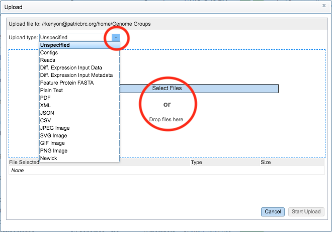
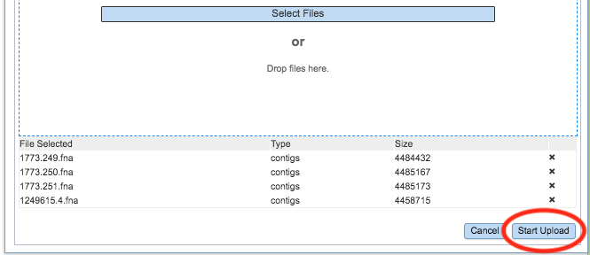

# Uploading Data

## Overview
In order to use your own private data with the BV-BRC analysis services and tools requires uploading the data into the Workspace. Each analysisservice that accepts external data (e.g., Assembly, Annotation, RNA-Seq, etc.) provides a means for uploading the required data files for that service. However, sometimes it is desirable to upload files into the Workspace independent of a particular service or in bulk.  The Workspace Upload functionality provides this capability. *

### See also:
  * [Workspace](../workspaces/workspace.html)
  * [Registration](../registration.html)
  * [Services and Tools](../services_tab.html)

## Accessing the Upload function in the Workspace

*Note: Registration is required to use the private Workspace.* Once logged in, clicking the Upload button on the right side above the table in the workspace will display the Upload dialog box: 

When uploading files, it is important to select the appropriate file type so that the Workspace and services will interpret the file correctly. During the upload process, the service provides some file type verification to help avoid mis-typing of files. Files can be chosen by clicking the Select Files button or by "dragging and dropping" from your local computer to the indicated area in the dialog box. 

Once the files are selected, clicking the Start Upload button will upload the files into the current folder in the Workspace.

Once the files have finished uploading, they will appear in the Workspace in the designated folder and can be used with the analysis services. Files can also be managed (moved, deleted, renamed, re-typed, etc.) using the workspace tools.  See [Workspace](../workspaces/workspace.html) for more information. 
