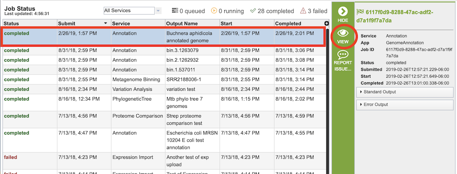
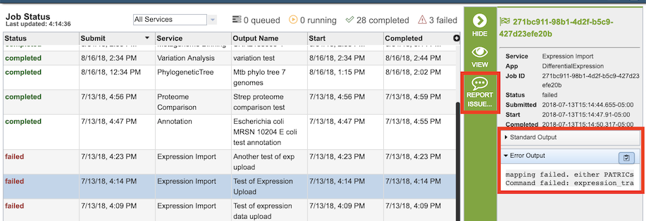

# Analysis Service Jobs

## Overview
For most BV-BRC analysis services, when the service starts, it creates a computational "job" that runs on back-end high-performance computing (HPC) systems which perform the analysis and return the results back to the user via the website or command line interface. The reason for this is that many services, such as Genome Annotation and Genome Assembly, require a significant amount of computational power and time to complete. The job display provides information on the status of the computation: queued, running, completed, or failed. 

## See also:
  * [Services and Tools](../services/services_tab.html.html)
  * [Private Workspace](../workspaces/workspace.html)

## Accessing Job Status Information and Results
If a user is logged in, a small Jobs Indicator box is always displayed at the bottom right of the website.  

The Jobs Indicator box provides a compact view of the status of current and prior jobs.

Clicking the Jobs Indicator box displays the Job Status page.  

This page provides a list of all submitted jobs and additional information, including

* **Status** - the current status of the job; either queued, running, completed, or failed.
* **Submit** - the date and time the job was submitted
* **Service** - the name of the analysis that started the job (e.g., Assembly, Annotation)
* **Output Name** - The name provided by the user to identify the result, displayed in the workspace when the job has completed.
* **Start** - the date and time the job started running.  This will likely be different than the submit time due to queues in the HPC systems that run the analysis.
* **Completed** - the date and time the job completed, or failed.

Double-clicking a job name or selecting it and clicking the **View** button in the vertical green Action Bar on the right hand side will display the job results.  

The nature of the results of the job depends on the type of analysis service that initiated the job.  For descriptions of the various services and their results, see [Services and Tools](../services/services_tab.html.html).  

If a job seems to be running unusually long, or if it is known that something was wrong with the input, the job can be stopped using the **Kill Job** button in the Action Bar.  Note that this option is only available while the job is still running.

If a job fails, it usually means that either something was wrong with the input files or there was a problem with the back-end systems that run the jobs.  In this instance, selecting failed job and clicking the Standard Output and Error Output drop-down boxes in the far right panel may give some useful information as to why the job failed.  If not, clicking the **Report Issue** button in the vertial green Action Bar will automatically generate a ticket to the BV-BRC help desk.  Providing additional information in the ticket will help the BV-BRC team diagnose and resolve the problem.

