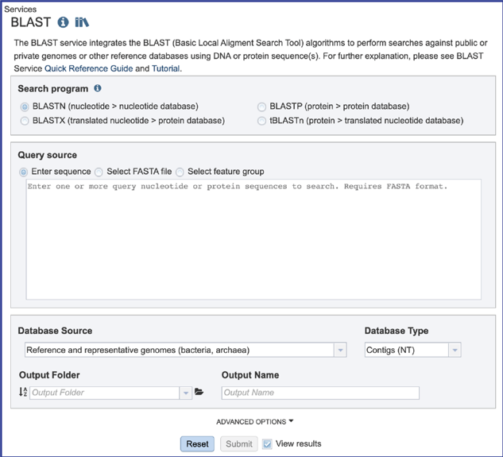
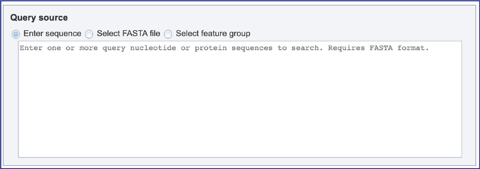
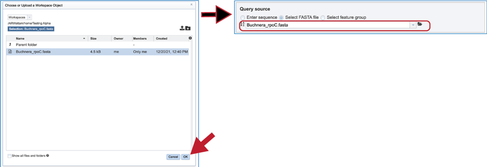
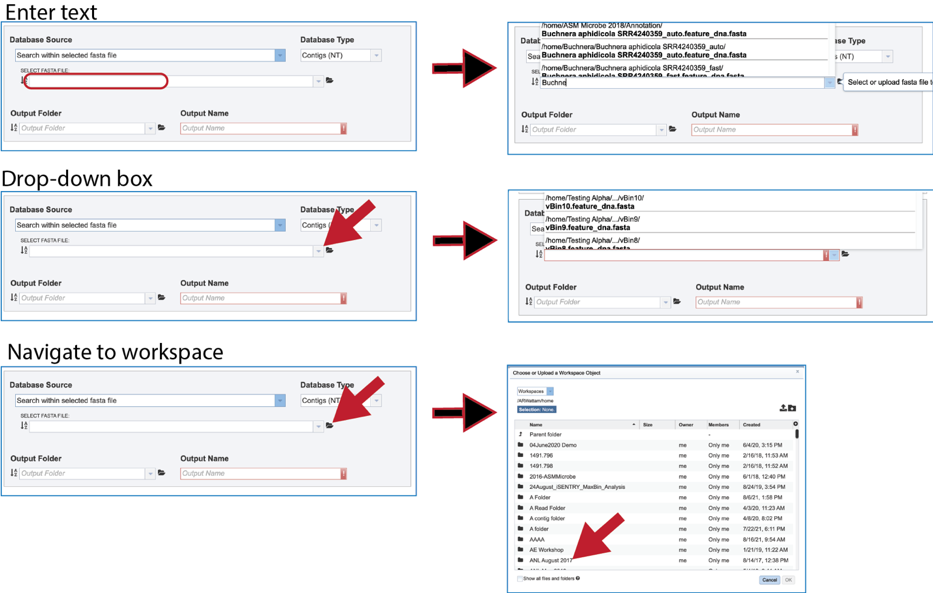
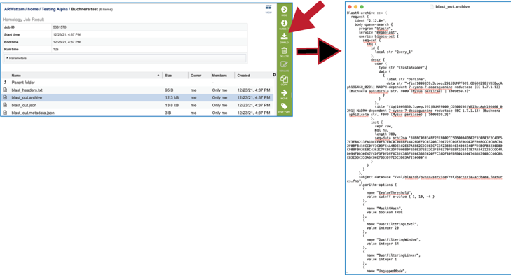

# BLAST Service

The **B**asic **L**ocal **A**lignment **S**earch **T**ool (BLAST)[1] is an algorithm and program for comparing primary biological sequence information, such as the amino-acid sequences of proteins or the nucleotides of DNA and/or RNA sequences. A BLAST search allows a researcher to compare a subject protein or nucleotide sequence (called a **query**) with a library or database of sequences, and identify database sequences that resemble the query sequence above a certain threshold.  An excellent resource on BLAST is provided by Madden[2].

## Creating a folder to hold the BLAST job and related data
Please refer to the Assembly service tutorial for instructions on creating a folder in the BV-BRC (./genome_assembly/assembly.html).

## Locating the BLAST Service App

1\. Click on the Services tab at the top of the page, and then click on BLAST. 

2\.	This will open the BLAST landing page where researchers can choose a specific program, insert of upload a specific fasta sequence, and select parameters to the service. 

## Selecting the Search Program

There are four BLAST programs provided by BV-BRC, and each has a specific query sequence and database. Clicking on the radial button in front of the program name will select it and will also select the appropriate databases.
* BLASTN – The query sequence is DNA (nucleotide), and when enabled the program will search against DNA databases of contig or gene sequences.
* BLASTX – The query sequence is DNA (nucleotide), and when enabled the program will search against the protein sequence database.
* BLASTP – The query sequence is protein (amino acid), and when enabled the program will search against the protein sequence database.
* tBLASTn – The query sequence is protein (amino acid), and when enabled the program will search against DNA databases of contig or gene sequences. 

## Selecting the Query Source
1\.	There are three types of Query sources that are provided by BV-BRC.  Clicking on the radial button in front of the query type will select it and will also reformat the page to support that selection.  

2\.	**Enter sequence.** When “Enter sequence” is selected a query sequence must be pasted into the text box. 

3\.	**Select FASTA file.**  When “Select FASTA file” is selected, a query sequence can be located in several ways.  Files that were recently uploaded can be seen and selected by clicking on the drop-down arrow that follows the text box.  Clicking on the correct sequence will fill the text box with that name.

4\.	Another way to select a fasta file is to navigate to one that is in the workspace.  To do this, click on the folder icon at the end of the text box.  This will open a pop-up window that shows the workspace.  Scroll down to find the correct folder and then click on it. 

5\.	The pop-up window will then show the contents of that folder.  Click on the row that has the file of interest and then on the OK button at the lower right of the window.  The pop-up window will close, and the name of the selected file will appear in the Query source text box.  

6\.	Fasta files can also be uploaded to the workspace.  From the pop-up window, clicking on the icon will open a window that starts the process for selecting a file from the computer.  Note that the window has the type of the file needed for the service pre-selected and when the computer interface opens, it will highlight files that meet the fasta requirement.  Moreover, those files that are uploaded will be tagged as DNA or Protein FASTA, depending upon the service that was originally selected the search program. Click on the Select File button in the middle of the page. 
 

7\.	This will open an interface with the computer.  Navigate to the file of interest and click on the Open button.  The name will then appear below File Selected on the pop-up window.  Then click on the Start Upload button at the lower right of the window. 

8\.	The pop-up window will close, and the name of the file will appear in the Query source text box. 

9\.	**Select Feature group.**  When “Select Feature group” is selected, a query sequence can be located in several ways as described above for Fasta files.  Text can be entered in the text box or located by clicking on the arrow at the end of box.  Clicking on the folder icon at the end of the text box will open a pop-up window with access to the workspace, where the group of interest can be located and selected. 

## Selecting the Database

1\.	BR-BRC has different databases to choose from.  To see the available choices, click on the down arrow at the end of the text box underneath Database Source.  There are six different choices to search within, each of which can be selected by clicking on the row that contains them: 
* Reference and representative genomes (bacteria, archaea)
* Reference and representative genomes (virus)
* Selected genome list
* Selected genome group
* Selected feature group
* Taxon
* Selected fasta file

**Reference and representative genomes.**  The reference and representative genomes, which are the default, are those designated by the National Center (https://www.ncbi.nlm.nih.gov/refseq/about/prokaryotes/). 

2\.	**Genome List.** Clicking on “Search within genome list” in the drop-down box will open a new source box where desired genomes can be added and searched against.   

3\.	The name or ID of the desired genome is entered into the text box.  The name of the matching genome, which will occur below the text box, is clicked on, and then the name will appear in the text box.  To move it into the box for the selected genomes, click on the arrow at the end of the text box.  The name will move into the text box at the right.  Additional genomes can be added in this manner. 

4\.	**Genome Group.**  Previously created groups of genomes can also be searched.  There are several ways to navigate to the group.  Clicking on the drop-down box will show genome groups, with the most recently created groups shown first. Clicking on the desired group will fill the box with that name. 

5\.	The text box can also be used by entering part of a name.  the drop-down box below will show all the genome groups that match that text.  Clicking on the desired group will fill the box with that name. 

6\.	Another way to find a genome group of interest is to navigate to it in the workspace.  Clicking on the file icon to the immediate right of the text box will open a pop-up window that shows the workspace.  Navigate to the desired folder, click on the row that contains the desired group, and then click on the OK button at the lower right of that window.  The name of the selected group will appear in the text box. 

7\.	**Feature group.** Previously created groups of features (genes or proteins) can also be searched, with the methods like those described for genome groups above. 

8\.	**Taxon.** A broader search across a taxon is also provided.  Entering the name of the taxon will open a drop-down box that shows the taxa that have similar text.  Clicking on the row that has the correct name will select the database, which will appear in the text box. 

