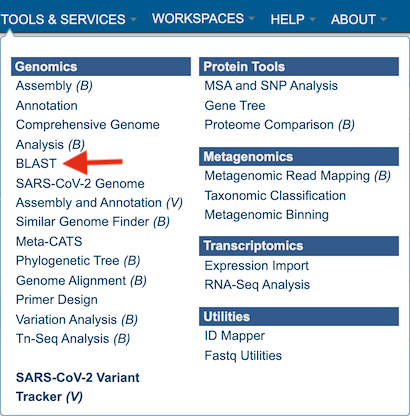
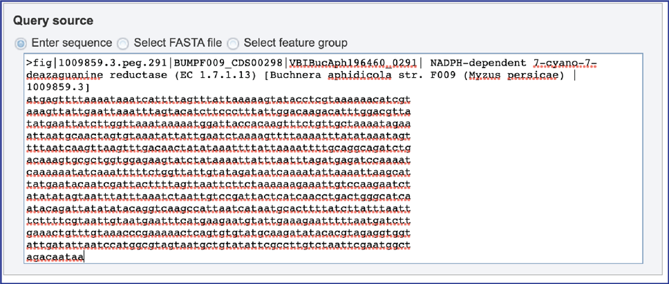
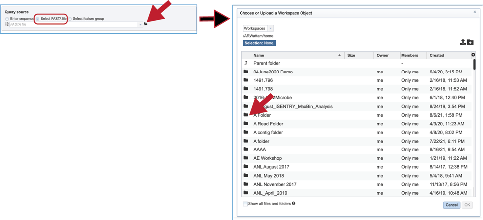
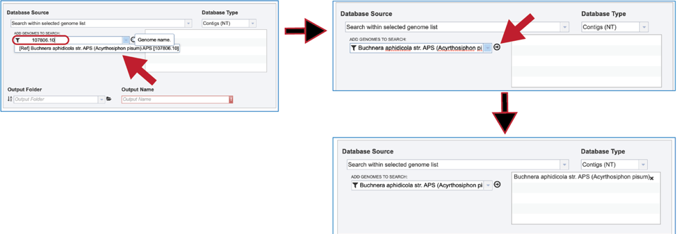
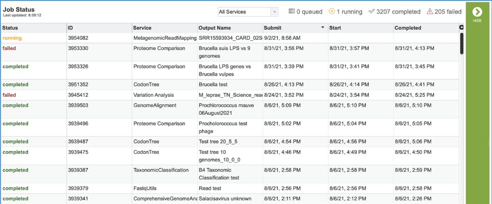
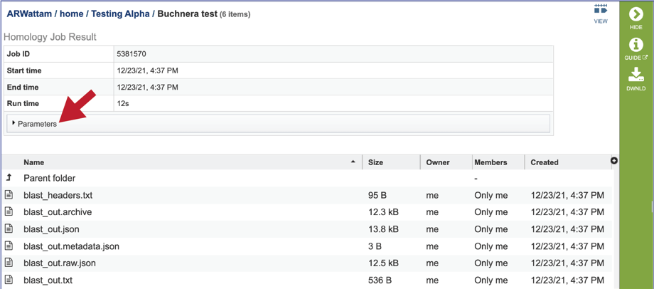

# BLAST Service

The **B**asic **L**ocal **A**lignment **S**earch **T**ool (BLAST)[1] is an algorithm and program for comparing primary biological sequence information, such as the amino-acid sequences of proteins or the nucleotides of DNA and/or RNA sequences. A BLAST search allows a researcher to compare a subject protein or nucleotide sequence (called a **query**) with a library or database of sequences, and identify database sequences that resemble the query sequence above a certain threshold.  An excellent resource on BLAST is provided by Madden[2].

## Creating a folder to hold the BLAST job and related data
Please refer to the Assembly service tutorial for instructions on creating a folder in the BV-BRC (./genome_assembly/assembly.html).

## Locating the BLAST Service App

1\. Click on the Services tab at the top of the page, and then click on BLAST. 

2\.	This will open the BLAST landing page where researchers can choose a specific program, insert of upload a specific fasta sequence, and select parameters to the service. 

## Selecting the Search Program

There are four BLAST programs provided by BV-BRC, and each has a specific query sequence and database. Clicking on the radial button in front of the program name will select it and will also select the appropriate databases.
* BLASTN – The query sequence is DNA (nucleotide), and when enabled the program will search against DNA databases of contig or gene sequences.
* BLASTX – The query sequence is DNA (nucleotide), and when enabled the program will search against the protein sequence database.
* BLASTP – The query sequence is protein (amino acid), and when enabled the program will search against the protein sequence database.
* tBLASTn – The query sequence is protein (amino acid), and when enabled the program will search against DNA databases of contig or gene sequences. 

## Selecting the Query Source
1\.	There are three types of Query sources that are provided by BV-BRC.  Clicking on the radial button in front of the query type will select it and will also reformat the page to support that selection.  

2\.	**Enter sequence.** When “Enter sequence” is selected a query sequence must be pasted into the text box. 

3\.	**Select FASTA file.**  When “Select FASTA file” is selected, a query sequence can be located in several ways.  Files that were recently uploaded can be seen and selected by clicking on the drop-down arrow that follows the text box.  Clicking on the correct sequence will fill the text box with that name.

4\.	Another way to select a fasta file is to navigate to one that is in the workspace.  To do this, click on the folder icon at the end of the text box.  This will open a pop-up window that shows the workspace.  Scroll down to find the correct folder and then click on it. 

5\.	The pop-up window will then show the contents of that folder.  Click on the row that has the file of interest and then on the OK button at the lower right of the window.  The pop-up window will close, and the name of the selected file will appear in the Query source text box.  

