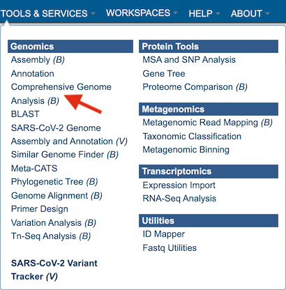
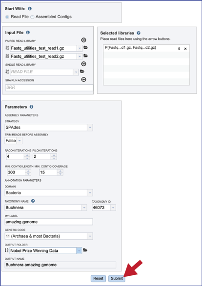
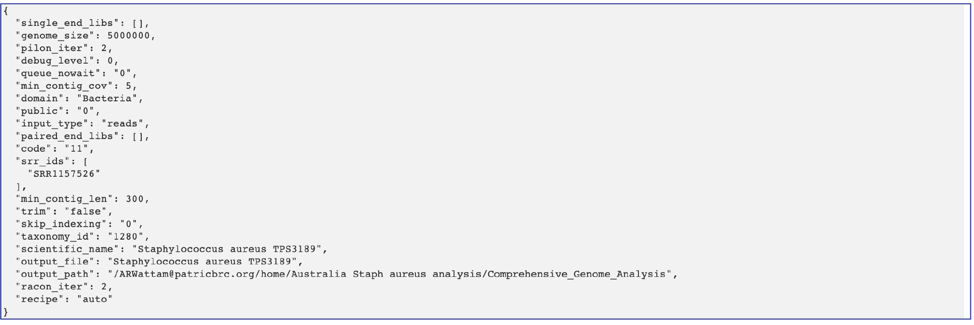
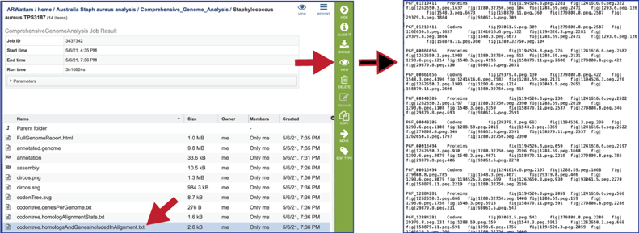
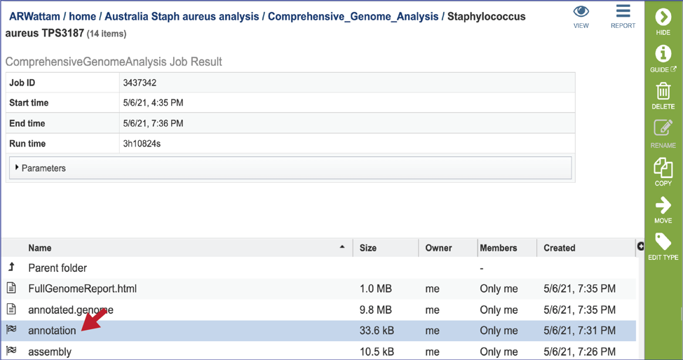

# Comprehensive Genome Analysis (CGA): Annotation and/or Assembly of a Genome

One of the most common use cases for analysis of private genomes at BV-BRC or PATRIC is for researchers to assemble and then annotate their genome sequences using two separate services. In the Spring of 2018, we launched a streamlined Comprehensive Genome Analysis ‘meta-service’ that accepts sequencing reads, computes the assembly and annotation, and provides a user-friendly description of the genome. The output includes a genome quality assessment, AMR genes and phenotype predictions, specialty genes, subsystem overview, identification of the closest genome sequences, a phylogenetic tree and a list of features that distinguish the genome from its nearest neighbors. The Comprehensive Genome Analysis Service has quickly risen to be one of the most popular services[1].

Creating a folder to hold the assembly job and related data
Please refer to the Assembly service tutorial for instructions on creating a folder in the BV-BRC or PATRIC (https://alpha.bv-brc.org/docs/tutorial/genome_assembly/assembly.html).

## Locating the Comprehensive Genome Analysis App

1.	Click on the Services tab at the top of the page, and then click on Comprehensive Genome Analysis (CGA).

2.	This will open the landing page for the service. 

### Uploading paired end reads

Please refer to the Assembly service tutorial for instructions on uploading paired-end reads in the BV-BRC or PATRIC (https://alpha.bv-brc.org/docs/tutorial/genome_assembly/assembly.html).

### Uploading single reads

Please refer to the Assembly service tutorial for instructions on uploading single-end reads in the BV-BRC or PATRIC (https://alpha.bv-brc.org/docs/tutorial/genome_assembly/assembly.html).

### Submitting reads that are present at the Sequence Read Archive (SRA)

Please refer to the Assembly service tutorial for instructions on submitting reads from the SRA  (https://alpha.bv-brc.org/docs/tutorial/genome_assembly/assembly.html).

## Selecting a contig file interface for CGA

1.	To submit contigs for an annotation job, click on the check box in front of Assembled Contigs at the top of the service. 

2.	This will rewrite the page to select contigs instead of read files. 

## Selecting a contig file interface for CGA

Please refer to the Annotation service tutorial for instructions on selecting contigs for annotation (https://alpha.bv-brc.org/docs/tutorial/genome_annotation/genome_annotation.html).

## Setting Parameters for the Annotation part of the CGA

Please refer to the Annotation service tutorial for instructions on selecting annotation parameters (https://alpha.bv-brc.org/docs/tutorial/genome_annotation/genome_annotation.html).

## Submitting the CGA job

1.	Once the input data and the parameters have been selected, the Submit button at the bottom of the page will turn blue.  The annotation job will be submitted once this button is clicked. Once submitted, the job will enter the queue.  You can check the status of your job by clicking on the Jobs monitor at the lower right. 

## Finding the CGA job

Please refer to the Annotation service tutorial for instructions on finding completed jobs (https://alpha.bv-brc.org/docs/tutorial/genome_annotation/genome_annotation.html).

## CGA job results-Full Genome Report

1.	BV-BRC and PATRIC now provide a genome announcement style document for any genome annotated using the Comprehensive Genome Analysis service.  To see this document, select the row that contains the FullGenomeReport.html and click on the view or download icon in the vertical green bar.

