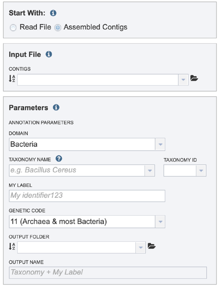
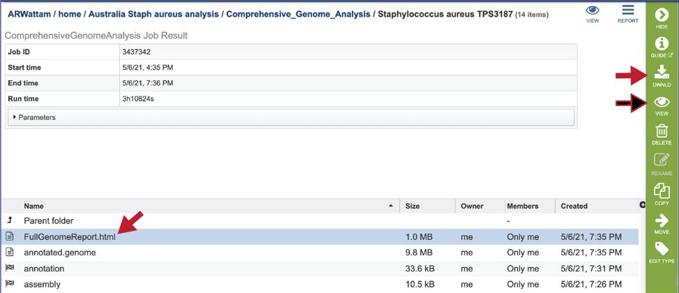
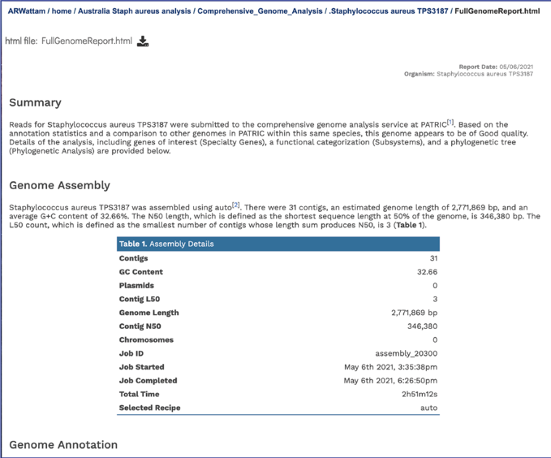
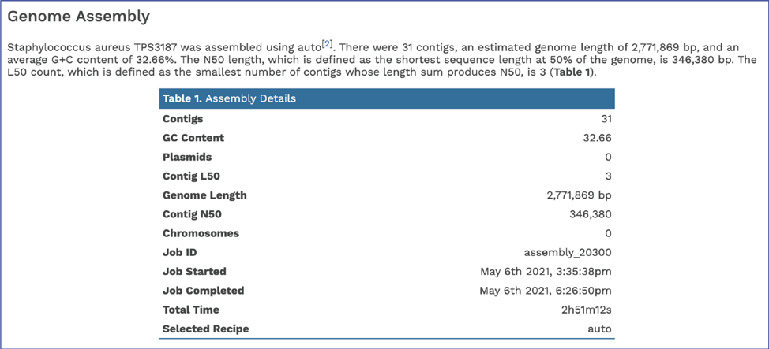
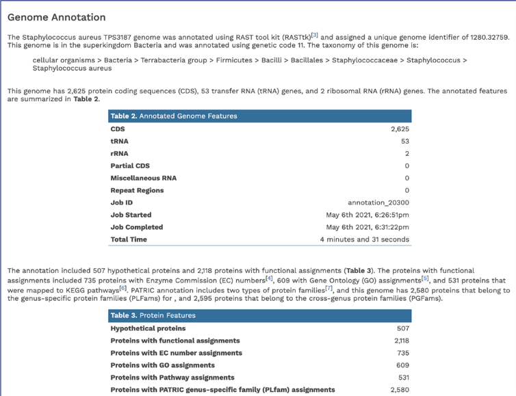
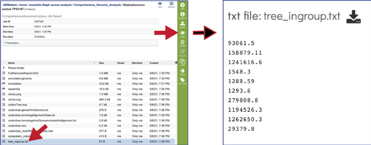
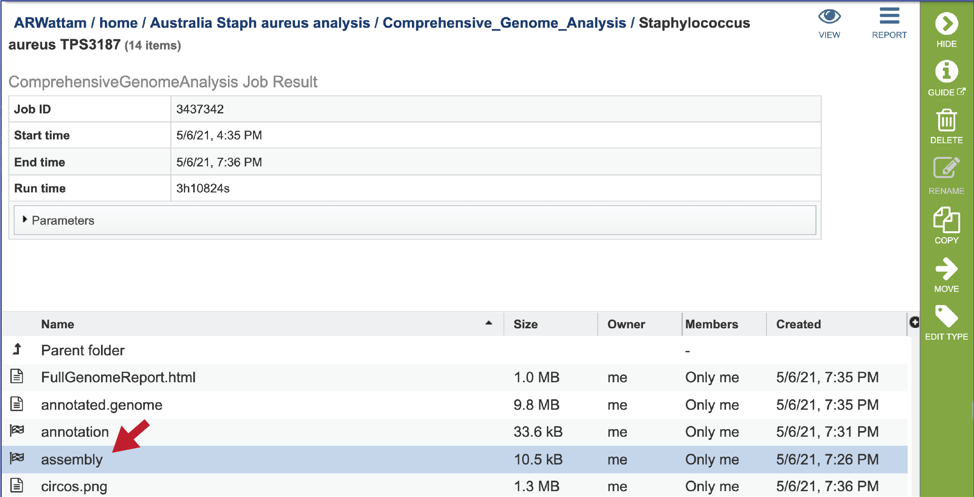

# Comprehensive Genome Analysis (CGA): Annotation and/or Assembly of a Genome

One of the most common use cases for analysis of private genomes at BV-BRC or PATRIC is for researchers to assemble and then annotate their genome sequences using two separate services. In the Spring of 2018, we launched a streamlined Comprehensive Genome Analysis ‘meta-service’ that accepts sequencing reads, computes the assembly and annotation, and provides a user-friendly description of the genome. The output includes a genome quality assessment, AMR genes and phenotype predictions, specialty genes, subsystem overview, identification of the closest genome sequences, a phylogenetic tree and a list of features that distinguish the genome from its nearest neighbors. The Comprehensive Genome Analysis Service has quickly risen to be one of the most popular services[1].

Creating a folder to hold the assembly job and related data
Please refer to the Assembly service tutorial for instructions on creating a folder in the BV-BRC or PATRIC (https://alpha.bv-brc.org/docs/tutorial/genome_assembly/assembly.html).

## Locating the Comprehensive Genome Analysis App

1.	Click on the Services tab at the top of the page, and then click on Comprehensive Genome Analysis (CGA).

2.	This will open the landing page for the service. 

### Uploading paired end reads

Please refer to the Assembly service tutorial for instructions on uploading paired-end reads in the BV-BRC or PATRIC (https://alpha.bv-brc.org/docs/tutorial/genome_assembly/assembly.html).

### Uploading single reads

Please refer to the Assembly service tutorial for instructions on uploading single-end reads in the BV-BRC or PATRIC (https://alpha.bv-brc.org/docs/tutorial/genome_assembly/assembly.html).

### Submitting reads that are present at the Sequence Read Archive (SRA)

Please refer to the Assembly service tutorial for instructions on submitting reads from the SRA  (https://alpha.bv-brc.org/docs/tutorial/genome_assembly/assembly.html).

## Selecting a contig file interface for CGA

1.	To submit contigs for an annotation job, click on the check box in front of Assembled Contigs at the top of the service. 

2.	This will rewrite the page to select contigs instead of read files. 

## Selecting a contig file interface for CGA

Please refer to the Annotation service tutorial for instructions on selecting contigs for annotation (https://alpha.bv-brc.org/docs/tutorial/genome_annotation/genome_annotation.html).

## Setting Parameters for the Annotation part of the CGA

Please refer to the Annotation service tutorial for instructions on selecting annotation parameters (https://alpha.bv-brc.org/docs/tutorial/genome_annotation/genome_annotation.html).

## Submitting the CGA job

1.	Once the input data and the parameters have been selected, the Submit button at the bottom of the page will turn blue.  The annotation job will be submitted once this button is clicked. Once submitted, the job will enter the queue.  You can check the status of your job by clicking on the Jobs monitor at the lower right. 

## Finding the CGA job

Please refer to the Annotation service tutorial for instructions on finding completed jobs (https://alpha.bv-brc.org/docs/tutorial/genome_annotation/genome_annotation.html).

## CGA job results-Full Genome Report

1.	BV-BRC and PATRIC now provide a genome announcement style document for any genome annotated using the Comprehensive Genome Analysis service.  To see this document, select the row that contains the FullGenomeReport.html and click on the view or download icon in the vertical green bar.

2.	The full genome report provides a detailed summary of the genome.  It begins with a summary of the genome quality, and then provides information for each step of the service, which includes assembly, annotation, and analysis of specialty genes and functional categories, and a phylogenetic tree of the new genome and its closest high-quality relatives. 

3.	The summary will indicate is the genome is of good or poor quality. 

4.	Scrolling down to Genome Assembly will summarize the method selected for assembly and provide the statistics of interest.  These statistics are those commonly provided when a genome is submitted as part of a publication.

5.	The Genome Annotation section describes the taxonomy of the genome, and genes and their functional divisions. 

6.	The Genome Annotation section also includes a circular diagram of the genes, their orientation, homology to AMR genes and virulence factors, and GC content and skew.  Genes on the forward and reverse strands are colored based on the subsystem[2] that they belong to. A separate, downloadable svg or png of the circular graph image is available in the jobs list. 

7.	BV-BRC BLATs[3] all genes in a new genome against specialty gene databases, including genes known to provide antibiotic resistance[4-6], virulence factors[7-9], transporters[10, 11], and known drug targets[12].  The CGA service shows the hits in the new genome that has homology to genes in those databases in a tabular form. 

8.	BV-BRC provides AMR phenotype predictions using custom built AdaBoost (adaptive boosting) machine learning classifiers[13]. 

9.	In addition, BV-BRC provides a k-mer based detection method for antimicrobial resistance genes[6] and shows the number of genes that share these k-mers. 

10.	BV-BRC’s subsystem analysis identifies genes based on specific biological processes that they are hypothesized to be active in.  The full genome report includes a pie chart showing the subsystems super classes[2], and an indication of the number of subsystems within that superclass (first number) and the number of annotated genes that are part of the superclass (second number).

11.	The CGA service identifies the closest relatives to the selected genome. It picks the closest reference and representative genomes using Mash/MinHash[14], and then takes five of BV-BRC’s global protein families[15] that are shared across all the selected genomes to build a tree based on the amino acid and nucleotide alignments of those proteins, which are aligned using MUSCLE[16], and RaxML[17] is used to build the tree. The genome submitted to the CGA is in red. 

## Viewing the genome 

Private genomes that have been annotated in BV-BRC or PATRIC can be viewed directly from the annotation job, or through the workspace, or by using the Global Search function. Please refer to the Annotation service tutorial for instructions on viewing the genome using the View, CDS or Browser icons (https://alpha.bv-brc.org/docs/tutorial/genome_annotation/genome_annotation.html).

## CGA job results-download files

1.	Any job run in the BV-BRC contains a number of files, as well as information about the submitted job.  To view the input parameters that were selected when the job was submitted, click on the arrow that precedes the word “Parameters.” 

