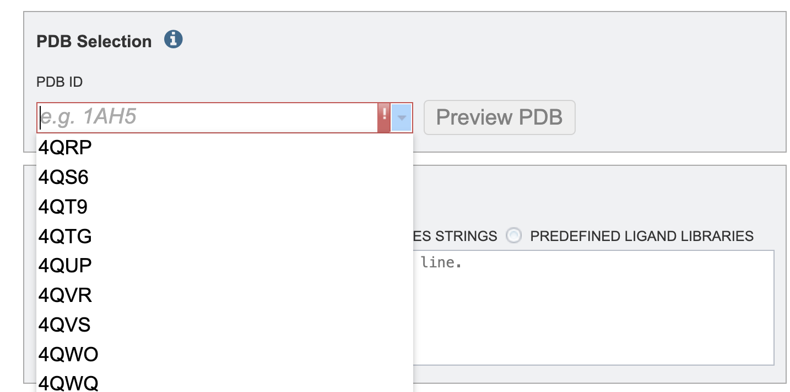
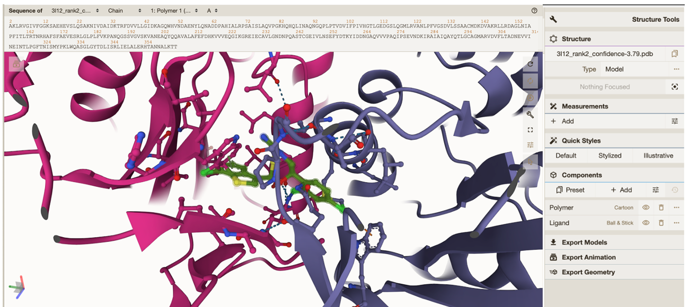
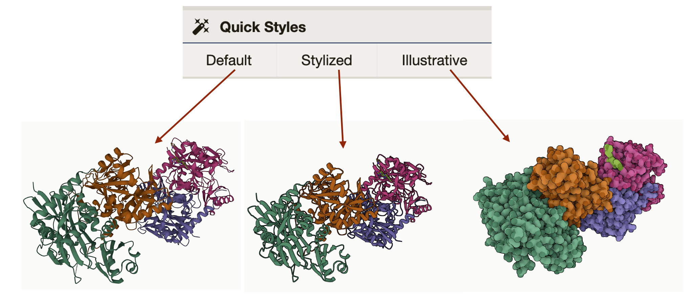

# Small Molecule Ligand Docking Service

*Revision: 10/7/2024*
The small molecule docking service uses the DiffDock method of molecular docking to compute a set of predicted
poses for a given protein structure and a set of small-molecule ligands.  This service utilizes a diffusion model, [DiffDock](https://arxiv.org/abs/2210.01776) to compute a set of poses for a target protein structure and a set of small-molecule ligands.  The aim is to simulate and analyze potential binding scenarios “in silico”. Offering a crucial advantage by predicting the success of protein ligand combinations ahead of costly and time-consuming in vivo experiments.

## Locating the Small Molecule Ligand Docking Service
The **Docking** submenu option under the **"SERVICES"** main menu (Protein Tools category) opens the Docking Service input form. *Note: You must be logged into BV-BRC to use this service.*


Below is a screenshot of the Docking Service landing page, as well as a summary of customizable parameters.


## Submitting a Protein and Small Molecule Ligands to the Service 
This service takes one protein and offers three options to provide small molecules for docking. We support the [RCSB Protein Data Bank](https://www.rcsb.org/)(PDB).  The ligands are provided in the form of SMILE string. The OpenSmiles group maintains a detailed specification for SMILES. For a detailed explanation of SMILE strings please visit [OpenSmiles](http://opensmiles.org/opensmiles.html).


1. Select a protein using the PDB identifier from the drop down or start typing a PBD identifier and the dropdown options will populate according to your text entry.
2. You have the option to click "Preview PBD" button to view the protein structure ahead of submitting the job.
3. We offer three options for providing ligand libraries. Ligand libraries are used to describe the options to enter
   


* By using the **Predefined Ligand Libraries** option. We offer three ligand libraries. The exemplar drug database is intended to be used in demonstrations. This is a small set of ligands that we will walk through in this tutorial. The approved compound library are compounds approved by at least one of various governing bodies for human use.  There are around two thousand compounds in this library. The experimental drug compound library is more robust, with nearly ten thousand compounds. The results from the ligand libraries will link out to [DrugBank Online](https://go.drugbank.com/).


 *  By using the **Select a workspace File of SMILES Strings** option. Here you may choose an existing workspace file of SMILES strings from the workspace or upload a new file from your computer. This file can be fromatted in two ways. The file can contain the ID, name and SMILE string seperated by tabs.
   ```
   DB00135   Tyrosine    N[C@@H](CC1=CC=C(O)C=C1)C(O)=O
   DB00515   Cisplatin    [H][N]([H])([H])[Pt](Cl)(Cl)[N]([H])([H])[H]
```
Or, the file can contain solely the ID and the SMILE seperated by tabs.
For example:
```
    Tyrosine    N[C@@H](CC1=CC=C(O)C=C1)C(O)=O
    Cisplatin    [H][N]([H])([H])[Pt](Cl)(Cl)[N]([H])([H])[H]
```


* The **Enter SMILES Strings** option, one or more SMILES strings may be pasted into the text
box, one per line. If you wish to specify identifiers for the SMILES strings these may be provided before the SMILES string.
For example:
```
    Tyrosine    N[C@@H](CC1=CC=C(O)C=C1)C(O)=O
    Cisplatin    [H][N]([H])([H])[Pt](Cl)(Cl)[N]([H])([H])[H]
```

## Parameters
1. As you would with our other services, please select an output folder and unique output name where the job results will populate.

## Results Review 
### Interacting with the Report 
1. The output page lands on a directory for the protein submitted and a report "small_molecule_docking_report.html.

2. The report begins with a brief description of the service, analysis workflow and the top results table.

3. The top results table displays all of the small molecules that DiffDock successfully bound to the structure. A score below negative eight (-8) is considred a benchmark where binding is likely significant. This table is sorted by Vinardo score which is one of the leading score consideration.

4. There are hyperlinks embedded in the table. This means that you can click on the link and it will take you to more relevant information.

5. Clicking the ligand ID should jump you down to that specific ligand result.

6. If your job is from a ligand library or a workspace file with three columns is given an extra column, "Drugbank Generic Name" will populate with the name in the table. If a drug bank page exists for the id paired with the name, clicking on the name will open the drug bank entry in a new tab.

7. Clicking the structure link in the viewer column will open a new tab with the BVBRC protein structure viewer showing that specific protein ligand interaction. This is detailed in the "Interacting with the Structure Viewer section".

8. The values in the Vinardo, Diffdock Confidence CNN Score, and CNN Affinity are detailed in the Interpreting the Report Values section.

9. The SMILES column displays the raw SMILE string. SMILE stands for the “Simplified Molecular Input Line Entry System,” which is used to translate a chemical's three-dimensional structure into a string of symbols that is easily understood by computer software.

### Interacting with the Structure Viewer 
The **protein ligand viewer** is based on Mol* (/'mol-star/) which  There are many features in the  viewer. This document will cover a few key features but explore all the features available. The Structure Tools panel is open on the right hand side. The first line is the .PDB protein ligand file. The naming convention is protein name followed by ranking and confidence level according to diff dock.

1. At any table in the report click the "Structure" hyperlink to open a new tab and show the protein ligand docking configuration in our protein viewer.




2. To zoom in on your ligand click  on either the next row which has a circle 'focus' or under "components" click between "Polymer" and "Ligand". Both are highlighted in the image below.


3. Quick styles gives the option to style your protein in different views. You can go into more detailed view settings if you click on the individual components either "Polymer" or "Ligand".


4. General Settings:  The general settings are a panel floating inside of the protein viewer.

| Icon Image                  | Description                                                                                                                                                                                                                       |
|-----------------------------|-----------------------------------------------------------------------------------------------------------------------------------------------------------------------------------------------------------------------------------|
|  | The first icon, a circle with one arrow, resets the viewer to the default settings.                                                                                                                                            |
|  | The second icon, a circle with two arrows, will rotate the protein and ligand until you click on the same icon again to stop the rotation.                                                                                      |
|  | The shutter icon takes a .PNG image. When clicked, a window will pop up next to the icon with options to crop, auto crop, copy, download, and change resolution.                                                                |
|  | The third icon, a wrench, will hide the Structure Tools panel on the right-hand side.                                                                                                                                          |
|  | The fourth icon will bring the viewer into full screen. If you are using the protein ligand viewer on the BV-BRC website, the viewer can only be the size of your internet browser window.                                      |
|  | The fifth icon, lines with slider toggles on them, will give settings and control options for animation. More animation options are also available by clicking on the icon that is multiple rectangles with a triangle *play* button in the upper left-hand corner. |
|  | The sixth icon, an arrow, will display options to color specific elements of the protein, including bond and structure properties, amino acid or nucleic base, and elements of the polymer.                                     |

5. The image below describes highlights even more features of the viewer.
    a. This shows the protein amino acid sequence. By clicking on a specific element of the sequence it will highlight that element in the structure and vice versa.
    b. This shows the protein and ligand's current position in space.
    c. Click here to see the export options and details.

6. We encourage you take your time reviewing the features of the protein viewer.

### Interpreting the Report Values 
Jumping back to the report tab. Below the top ligand table in the "Per-ligand Details" there is one subtable for each successful protein ligand combination. The values in the table are interpreted the same way in both the top ligand table and the sub ligand tables.  It can be difficult to compare the different complexes and protein confirmation but here is a rough guide. 

* **Vinardo**: An empirical score function that evaluate the binding pose with terms from Gaussian steric attractions, quadratic steric repulsions, Lennard-Jones potentials, electrostatic interactions, hydrophobic interactions, non-hydrophobic interactions, and non-directional hydrogen bonds. A lower Vinardo score indicates a better chance of ligand binding.
  
* **DiffDock Confidence**: The DiffDock output confidence score is assigned by DiffDock. A lower confidence score indicates more confidence in the ligand protein docking successfully. This score, C, pertains to the pose of the molecule and ligand.
    If C is greater than 0 the pose is considered **high** confidence.
    If C is between -1.5 and 0 the pose is considered **moderate** confidence
    If C is below -1.5 the pose is considered **low** confidence. 
The above confidence guidelines pertain to protein ligand combinations of medium-sized proteins with small, drug-like molecules. This is what DiffDock had it the training set. For large ligands, large protein complexes, or unbound conformations, adjust these intervals downward.
  
* **CNN Score**: CNN refers to a type of artificial intelligence called convolutional neural network (CNNs). The CNN Score gives a numerical value that represents how plausible is the binding pose is within the pocket based on the CNN model's evaluation. The evalulation is based on key features of protein-ligand interactions. The CNN score is a value between 0 and 1 that is used to rank the poses of the ligand, where a score of 1 denotes a perfect ligand pose.

* **CNN Affinity**: CNN affinity is a hypothetical measurement of the strength of the binding interaction between the molecule and the target protein when docked as calculated by the central neural network described above. A higher affinity value indicates a greater chance of successful ligand docking at that pose.

13. Click on the hyperlinked ligand ID will open a new tab taking you directly to the specific directory for that ligand in your workspace. Each ligand specific directory has the following:
    * PDB files for each ligand protein combination rank 1-10.
    * rank1.SDF file for the top ranked ligand.
    * Results.CSV which has the same data displayed in the report.
14. Back in the report. The next section will show any ligands that the service was unable to bind with the input protein. These sections only populate if there are ligands that fall into either category below.
    * RDKit Non-compliant Ligands: Ligands that appear in this table did not pass SMILE string validation preformed by [RDKit](https://rdkit.org/). This is a collection of cheminformatics and machine-learning software. RDKit validates SMILE strings according to parsing and sanitization.  For parsing, RDKit uses grammar defined in the [Smile Parse](https://github.com/rdkit/rdkit/tree/master/Code/GraphMol/SmilesParse) module. Which closely follows guidelines established in [OpenSmiles](http://opensmiles.org/opensmiles.html). A detailed explanation of sanitization is available [RDKit Book](https://www.rdkit.org/docs/RDKit_Book.html) under the Molecular Sanitization header. These ligands are also listed in the file "invalid_smile_strings.txt" in the landing directory for your job.
    * DiffDock Incompatible Ligands: Ligands in this table did not dock to the protein. This could be because they are incompatible with the protein or the current version of DiffDock.  Another reason could be the available memory during your job. To test this, please submit a new job with each ligand individually or in smaller groups. These ligands are also described in the file "bad-ligands.txt" in the protein subdirectory for your job.
    
If you have questions about failed ligands, we encourage you to reach out to a team member by either reporting the job or contacting us by clicking "About" in our header then the dropdown option, "Contact Us".

## References
* Olson RD, Assaf R, Brettin T, Conrad N, Cucinell C, Davis JJ, Dempsey DM, Dickerman A, Dietrich EM, Kenyon RW, Kuscuoglu
M, Lefkowitz EJ, Lu J, Machi D, Macken C, Mao C, Niewiadomska A, Nguyen M, Olsen GJ, Overbeek JC, Parrello B, Parrello V, Porter JS, Pusch GD, Shukla M, Singh I, Stewart L, Tan G, Thomas C, VanOeffelen M, Vonstein V, Wallace ZS, Warren AS,Wattam AR, Xia F, Yoo H, Zhang Y, Zmasek CM, Scheuermann RH, Stevens RL. Nucleic Acids Res. 2022 Nov 9:gkac1003. doi: 10.1093/nar/gkac1003. Epub ahead of print. PMID: 36350631.
* Corso, Gabriele, Arthur Deng, Benjamin Fry, Nicholas Polizzi, Regina Barzilay, and Tommi Jaakkola. "Deep Confident Steps to New Pockets: Strategies for Docking Generalization." arXiv preprint arXiv:2402.18396 (2024).
* McNutt, Andrew T., Paul Francoeur, Rishal Aggarwal, Tomohide Masuda, Rocco Meli, Matthew Ragoza, Jocelyn Sunseri, and David Ryan Koes. "GNINA 1.0: molecular docking with deep learning." Journal of cheminformatics 13, no. 1 (2021): 43.
* Quiroga R, Villarreal MA (2016) Vinardo: A Scoring Function Based on Autodock Vina Improves Scoring, Docking, and Virtual Screening. PLOS ONE 11(5): e0155183. https://doi.org/10.1371/journal.pone.0155183.
* Bento, A.P., Hersey, A., Félix, E. et al. An open source chemical structure curation pipeline using RDKit. J Cheminform 12, 51 (2020). https://doi.org/10.1186/s13321-020-00456-1.
* David Sehnal, Sebastian Bittrich, Mandar Deshpande, Radka Svobodová, Karel Berka, Václav Bazgier, Sameer Velankar, Stephen K Burley, Jaroslav Koča, Alexander S Rose: Mol* Viewer: modern web app for 3D visualization and analysis of large biomolecular structures, Nucleic Acids Research, 2021; https://doi.org/10.1093/nar/gkab314.
* Paul G. Francoeur, Tomohide Masuda, Jocelyn Sunseri, Andrew Jia, Richard B. Iovanisci, Ian Snyder, and David R. Koes Journal of Chemical Information and Modeling 2020 60 (9), 4200-4215 DOI: 10.1021/acs.jcim.0c00411
