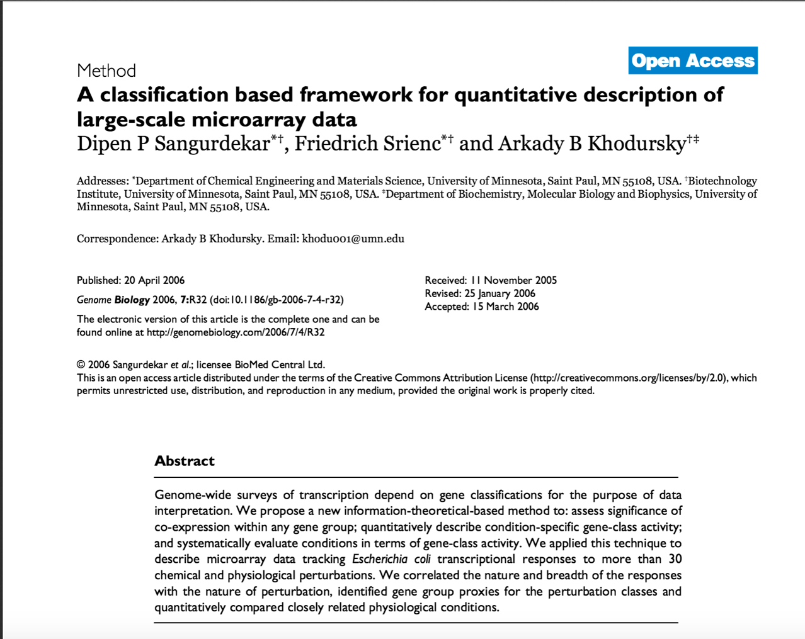
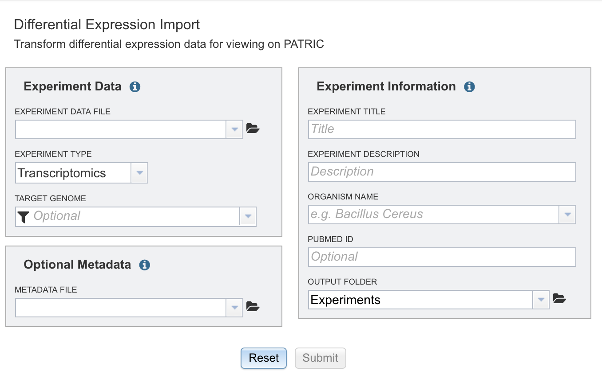
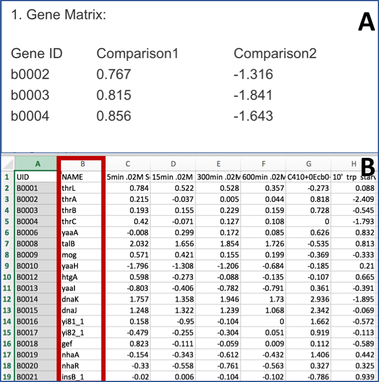
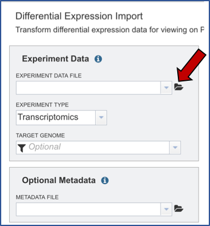
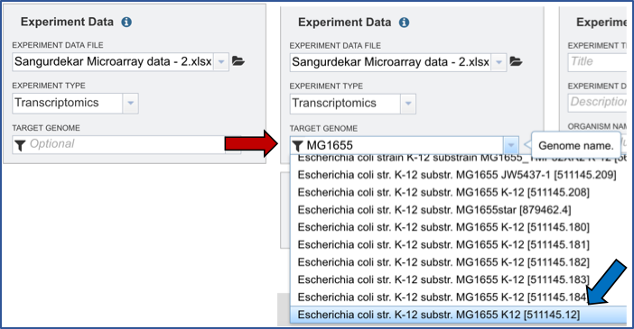
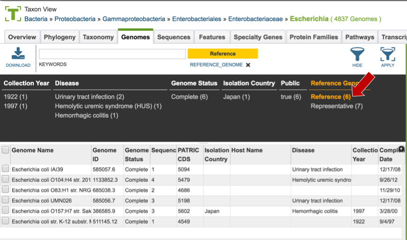
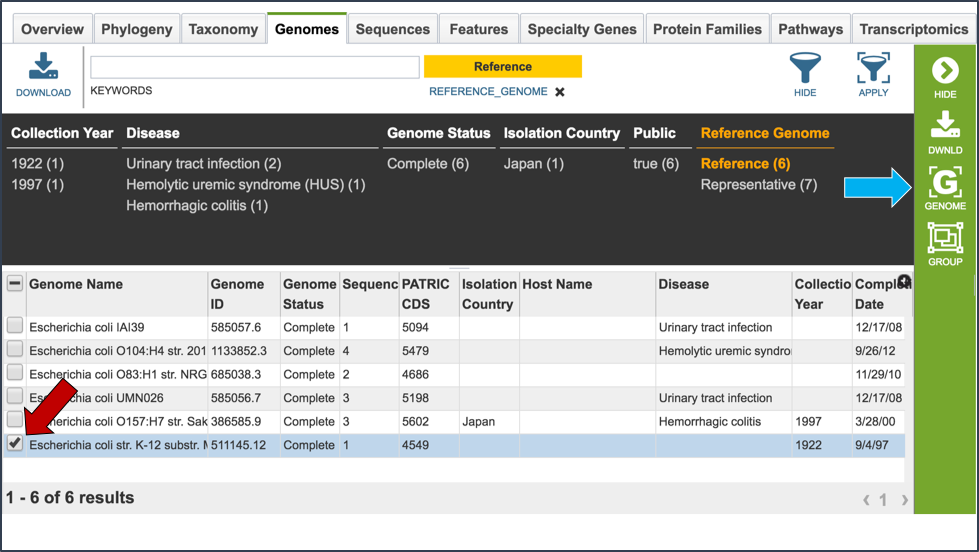
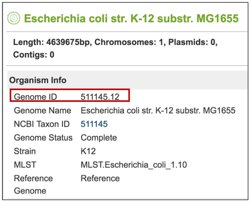
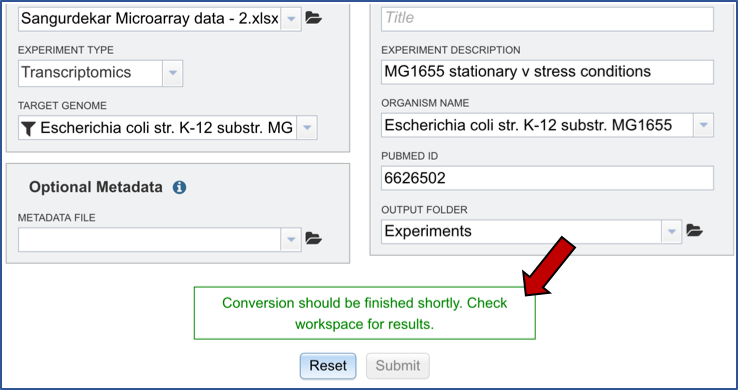

# Expression Import

## I. Using the Expression Import Service at PATRIC
1.  Find an article of interest, a dataset at the Gene Expression Omnibus (GEO, http://www.ncbi.nlm.nih.gov/geo/), or prepare your own data.  In this example, we are using a paper (PMID: 16626502) that examines transcriptional responses in Escherichia coli MG1655 to a variety of stimuli.  This strain has been designated as a reference strain by NCBI.

2. The Sangurdekar paper has a link to all the log expression data for 3046 genes across 246 different conditions. 

3. To upload this data into a private workspace, open the Services tab in PATRIC.

4. Click Experiment Import.

5. This opens a page where experimental data can be uploaded.

## II.  Data Format
1. The data should be loaded into a particular format into PATRIC, an example of which can be seen below (A).  The first column has the gene locus tag (RefSeq, GenBank, or PATRIC), and the second and later columns will have the log ratios for each gene in each condition.  The column headers in the first row can have the name of that condition.  You can see in B below that the second column has the gene name.  That must be deleted before it can be uploaded.

## III. Uploading the Experimental Data
1.  To upload the data sheet, which can either be txt or excel, click on the folder in the “Experiment Data” box that follows the text box under the words “Experiment Data File”.

2.  This will open a window that shows you data you have in uploaded or collected in PATRIC. If you had previously uploaded this data, you could find it here.  To upload new data, click on the upload icon.

3.  The pop-up widow will flip, and you will be able to select a file.  Make sure you have the right type of data selected (Blue arrow).  Then click on the blue “Select File” bar (Red arrow).

4. Select the file you want to upload (Red arrow) and then open it (Blue arrow).

5. The name of the file you selected will now appear on the page (Blue arrow).  To complete the upload, click on the “Upload Files” button (Red arrow).

## IV. Selecting a Target Genome
1.  The next task is to select the target genome.  It has to be the same as the genome in the experimental data you uploaded.  In this instance, the reference genome was Escherichia coli MG1655.  If you start typing MG1655 in the text box under “Target Genome” (Red arrow), PATRIC will display the best hits.  There are quite a few there…how do you know that the one shown as selected (Blue arrow) is the right one.

2. The number that follows the name is the genome ID.  If you click the Organism tab at the top of any PATRIC page, and then click on Escherichia, you will go to the landing page for that genus.  Clicking on genome list will show all the genomes in Escherichia.  MG1655 is a reference genome.  You can find the genome ID by clicking on “Reference” in the filter (Red arrow).  This will only show the reference genomes in the table

3. Click on the MG1655 genome (Red Arrow).  This will load the vertical green bar with all the downstream processes that you can do with this genome.  Click on the Genome icon (Blue arrow). 

4. This will take you to the landing page for that genome, where you can see the specific genome ID (red box).

## V. Experiment Information and Job Submission
1.  Next you will need to fill in all the metadata in the “Experiment Information” box (Red arrow).  The PubMed ID is optional.  When the information is filled out, click the submit button at the bottom of the page (Blue arrow).

2. A message appears underneath indicating that the data has been submitted (Red arrow).

3.  Clicking on the Jobs button at the bottom of the page will show you the status of the job you submitted.

