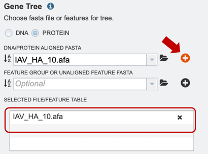
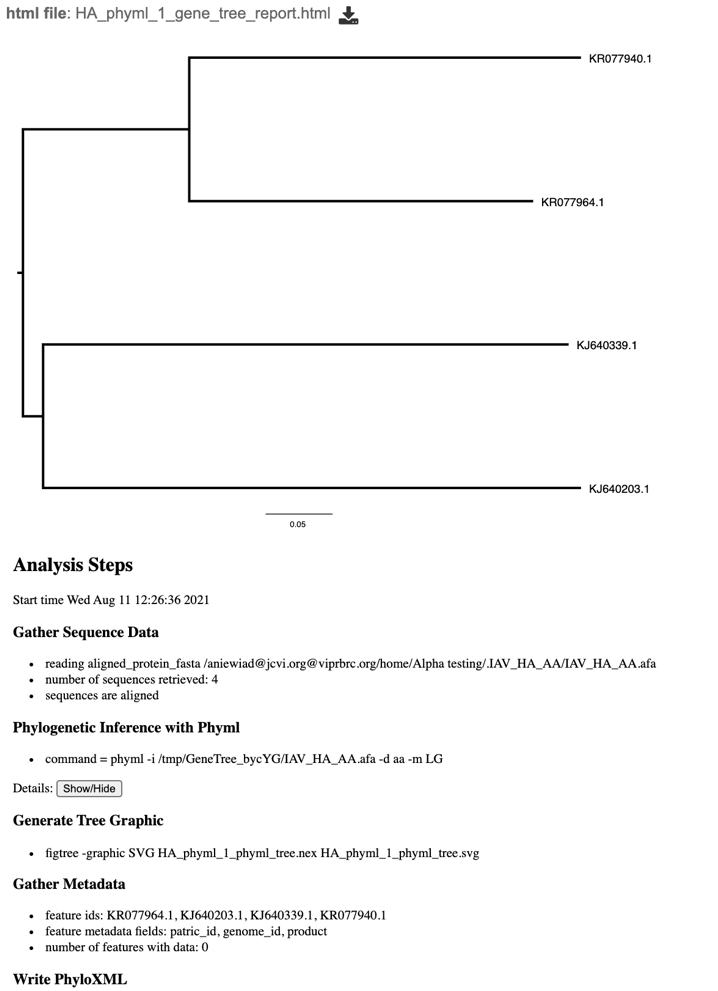

# Building Phylogenetic Trees (Gene Trees) Tutorial

## Overview
The Phylogenetic Tree (Gene Tree) Building Service enables construction of custom phylogenetic trees built from user-selected genomes, genes or proteins. Trees can be built based on either nucleotide or protein input sequences. The "FastTree" option computes large minimum evolution trees with profiles instead of a distance matrix. [1,2]. We also offer two maximum likelihood tree building algorithms: PhyML [3] and RaxML [4]. User-defined settings are required for either. PhyML and RaxML infer a more evolutionarily-accurate phylogenetic topology by applying a substitution model to the nucleotide sequences. This algorithm is best applied to datasets containing: 
1) fewer than 100 very long sequences, and
2) between 100 and 1,000 small or medium length sequences.
The service returns a Newick file which can be rendered in the interactive Archaeopteryx Tree Viewer in the BV-BRC or downloaded and viewed in other software.   

### See also
* [Phylogenetic Gene Tree Service](https://beta.bv-brc.org/app/GeneTree)
* [Phylogenetic Gene Tree Service Quick Reference](../../quick_references/services/genetree.html)

## Locating the service

At the top of any BV-BRC page, find the **SERVICES** tab and then click on Gene Tree. 
 

