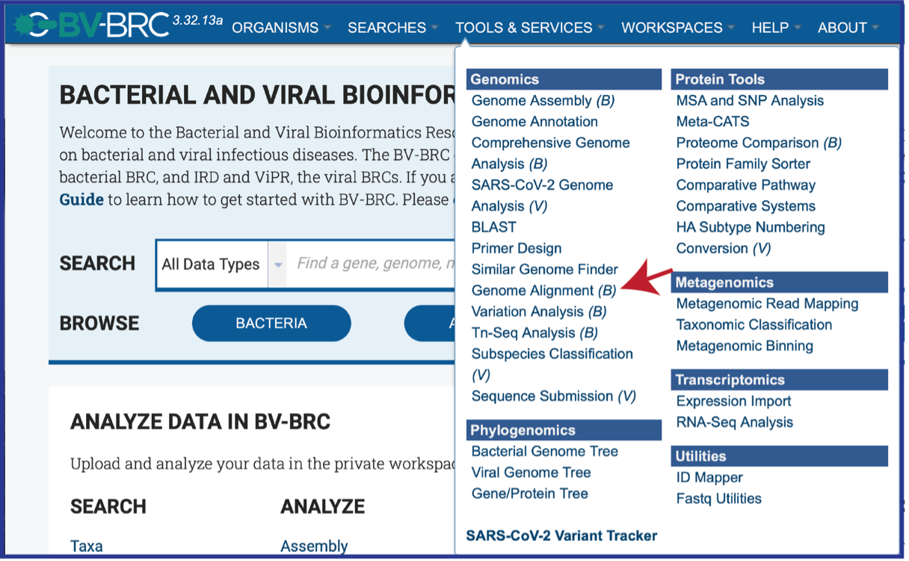
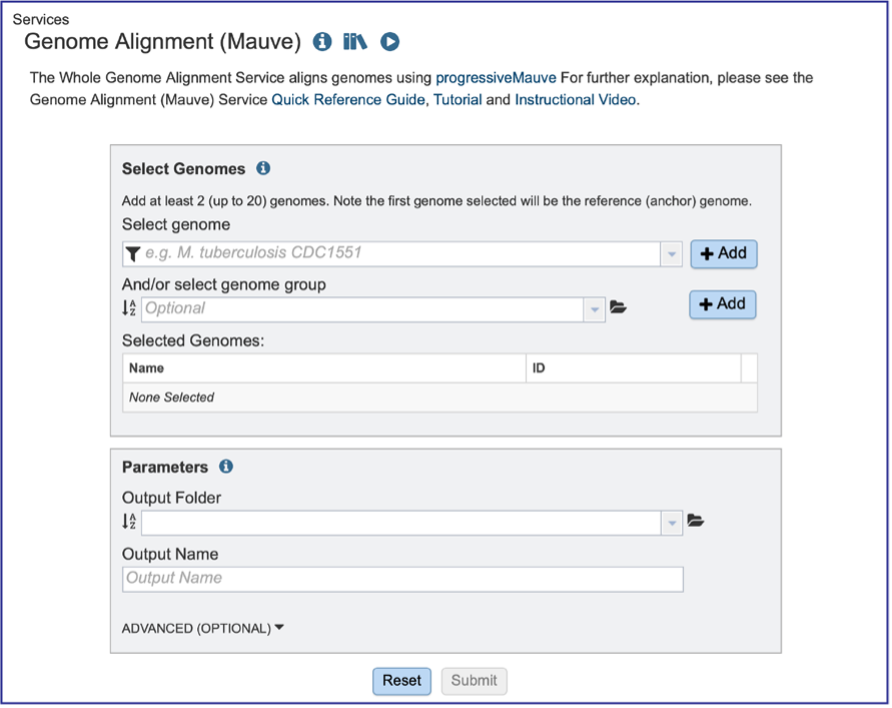
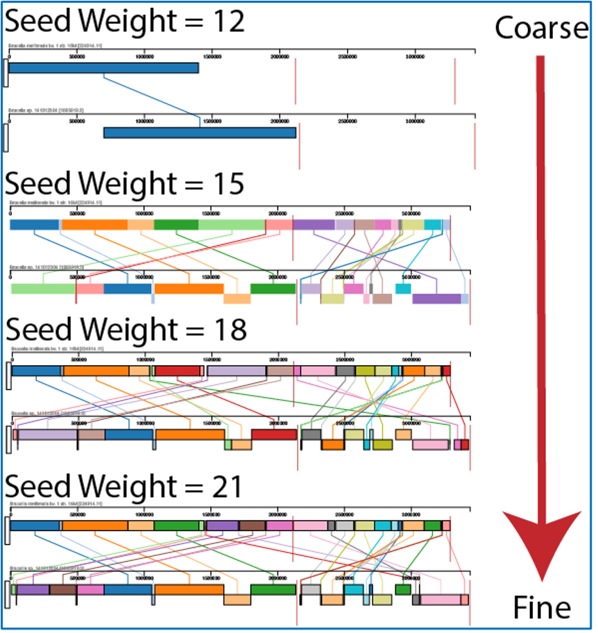
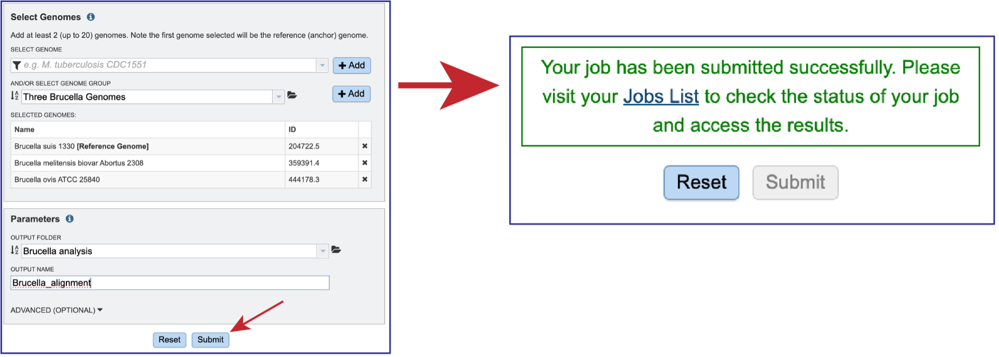
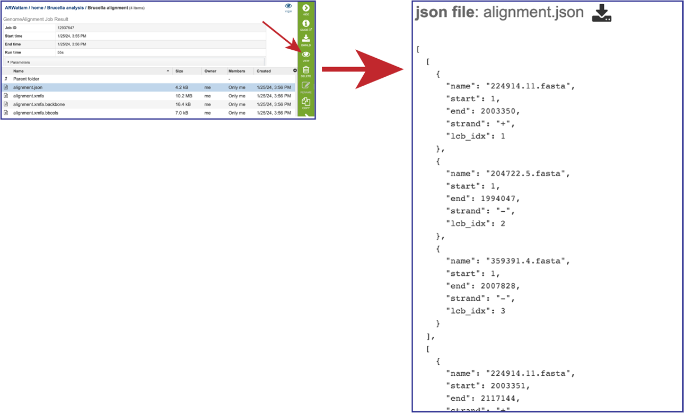
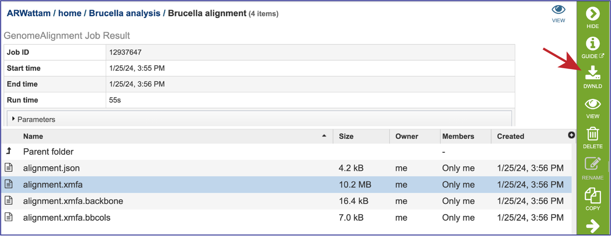
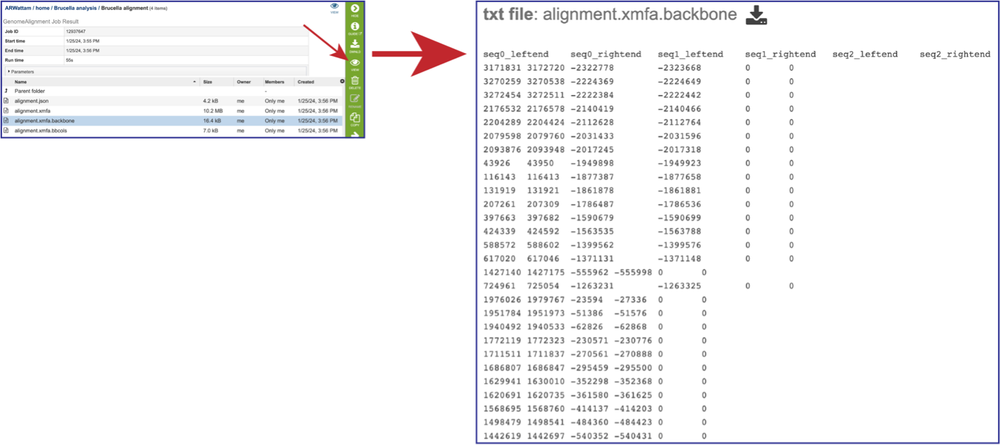

# Genome Alignment Service

*Revised: February 12, 2024*

DNA sequence alignment is a prerequisite to many comparative genomic analyses.
For longer genomic DNA, it helps to identify medium and large-scale rearrangements, as well as insertions and deletions. The BV-BRC Genome Alignment service uses progressiveMauve[1] which constructs positional homology multiple genome alignments to align regions conserved in subsets of the genomes.  The service uses genomes that are annotated within the BV-BRC resource (they can be private or public genomes), and up to 20 genomes can be compared.

## Submitting the Genome Alignment job

1.	Click on the **Tools & Services** tab at the top of the page, and then click on Genome Alignment.

2.	This will open the landing page for the **Genome Alignment** service.

3.	Genomes must be selected, either by using the name or the genome ID.  The genome **MUST** be in the BV-BRC resource.  Private or public genomes can be selected. The first genome selected will be the reference genome, which other genomes will be compared to.  Entering the genome ID in the text box underneath Select Genome will open a drop-down box that shows the corresponding genome.  Clicking on the name will autofill the name of the genome in the text box.

4.	Beginning to type the name in the text box underneath **Select Genomes** will show all possible genomes that match that text, starting with the private genomes (indicated by the lock symbol in front of the name).

5.	Clicking on the **Filter** icon at the beginning of the text box open a dynamic filter in the drop-down box.  Clicking on any of the check boxes will limit the search to whatever text is entered in the drop-down box.  Clicking on the genome will autofill the text box with the name of the genome.

6.	Once the genome is selected, it must be entered into the Selected Genomes box.  Clicking on the **+Add** button will move the name into the Selected Genomes box.

7.	Entering the genome ID or the name can be used to select the comparison genomes.  Click on the **+Add** button to add the genome to the Selected Genomes box.  Up to 20 genomes can be compared in the Genome Alignment service. 

8.	Genome groups can also be selected.  If a reference genome was not previously selected, the first genome added to the genome group will be the reference genome.  Clicking on the down arrow at the end of the text box underneath **And/Or Select Genome Group** will open a drop-down box that shows the most recently created genome groups.  Clicking on the row that has the desired group will autofill the text box with that group.

9.	Clicking on the **+Add** button will move the genomes from that group into the Selected Genomes box.

10.	Genomes can be removed by clicking on the **X** at the end of any genome listed in the Selected Genomes box.

11.	Any job must be saved to your workspace.  In the **Parameters** box, you can start entering text in the box underneath Output Folder to find a workspace folder that has been previously created.  A drop-down box will return below the text box.  Clicking on the word will autofill the text box with that folder name.

12.	A name must be entered in the text box underneath **Output Name**.  At this point, the job can be submitted.

The BV-BRC genome alignment service also allows users to adjust the Seed Weight and Weight.  To do this, click on the down arrow next to **Advanced (Optional)**. This will expand the **Parameters** box to show the **Seed Weight** slider, and the **Weight** text box. 

14.	The **Seed Weight** parameter determines the minimum length of an inexact, ungapped match to be considered as an alignment anchor. By default, Mauve chooses this value to be appropriate for the length of sequences being aligned. The default seed size for 1MB genomes is typically around 11, is around 15 for 5MB genomes, and continues to grow with the size of the genomes being aligned.  The Weight determines the minimum pairwise score for a region to be considered as a locally collinear block (LCB). By default, an LCB weight of 3 times the seed size will be used. The default value is often too low, however, and this value should be set manually.

15.	Once all the genomes and parameters have been defined, the **Submit** button will turn blue.  Clicking on that submits the job.  Do not leave the page until you see a message that tells you that the job has been successfully submitted.

## Viewing the files associated with the Genome Alignment job.
1.	The JSON (JavaScript Object Notation) file (**alignmnent.json**) is a standardized format for representing structured data. Although JSON grew out of the JavaScript programming language, it's a ubiquitous method of data exchange between systems. Most modern-day APIs accept JSON requests and issue JSON responses. Select the row that has that file.  This will populate the green action bar with possible downstream functions.  Click on the View icon to see the json file created by the Genome Alignment service.

2.	The alignment file (**alignment.xmfa**) contains the complete genome alignment generated by Mauve in the eXtended Multi-FastA (XMFA) file format. This standard file format is also used by other genome alignment systems that align sequences with rearrangements. Select the row that has that file.  This will populate the green action bar with possible downstream functions.  Click on the Download icon.

3.	The **alignment.xmfa.backbone** contains auxiliary information such as the genome phylogenetic guide tree that was used for alignment, an identity matrix for the genomes, the location of backbone (regions conserved among all genomes), and the locations of islands (regions where one or a subset of the genomes has a unique sequence element). Once the row is selected, click on the **View** icon in the green action bar.  This will open the **alignment.xmfa.backbone** file. 

4.	The **alignment.xmfa.bbcols** file records the alignment columns that are predicted to be. part of larger conserved segments among each group of genomes.  The first column is the block ID, counting from 0 in the order that blocks appear in the XMFA file. The 2nd column is the alignment column where a conserved segment begins within the block. The 3rd column is the length of the conserved region (in alignment columns). The 4th and successive columns record the genome IDs participating in the conserved block. Once the row is selected, click on the **View** icon in the green action bar.  This will open the **alignment.xmfa.bbcols** file.

## Accessing and adjusting the Genome Alignment Viewer

1.	Click on the **View** icon in the upper right corner of the landing page for your job. This will open the Genome Alignment viewer.

2.	The default view shows the genomes as rows of linear blocks. The name and ID of each genome is above each block row.  Vertical lines indicate that the segment blocks between the genomes are shared, and the lines are similarly colored to the block.  A block above or below the other blocks in the row indicates a genomic block that is inverted.  Vertical red lines indicate a contig boundary.

3.	The order of the genomes can be changed in the visualization by clicking on the up or down arrow directly in front of the genome row.  This will move the genome up (or down) in the visualization.

4.	Above the visualization are a number of options to alter the view.  **Reset** will return the visualization to the original view.  The view can be saved as a scaled vector graph (Save SVG).  There are also different Options that can be selected, as well as the ability to move along the genome and zoom in to the see the genes called in the genome.

5.	Clicking on **Options** opens a drop-down box that can change the view.

6.	Unclicking the box in front of **Show Genome ID** removes the ID from the end of the names of the genomes.

7.	Unclicking the box in front of **LCG Connecting Lines** will remove the lines that connect the blocks.

8.	If the visualization is zoomed in to where the features are visible, unclicking the box in front of **Show Features (zoomed)** to remove them from the visualization.

9.	Unclicking the box in front of **Show Contigs** will remove the lines that show where the contigs begin and end.

10.	You can use the “>” to shift the view to the right, and the “<” to shift it to the left.  Using the "+" icon to zoom in, and the "–" icon to zoom out.  Zooming in far enough will show the genes that are annotated in that area as grey blocks.  Mousing over each block will open a pop-up window that shows the name of that gene and information about it.

## Source Code
The code used in the BV-BRC service can be found here:
https://github.com/PATRIC3/p3_mauve

## References
1.	Darling, A.E., B. Mau, and N.T. Perna, progressiveMauve: multiple genome alignment with gene gain, loss and rearrangement. PloS one, 2010. 5(6): p. e11147.
