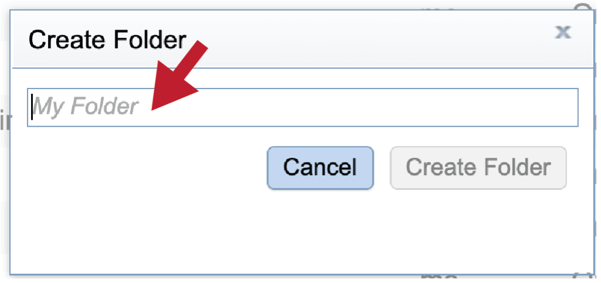
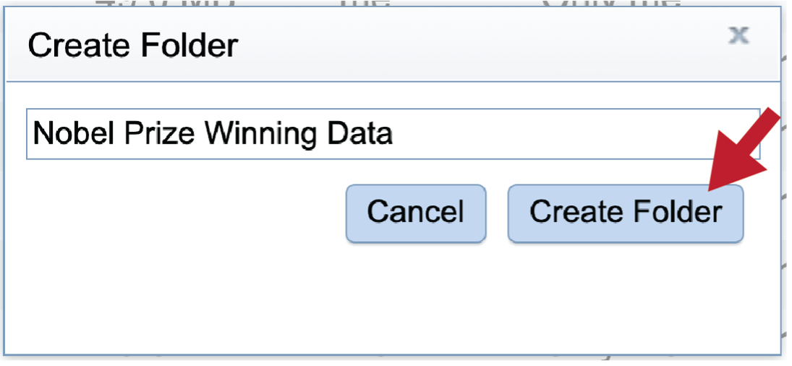
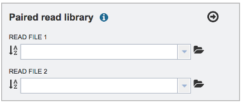
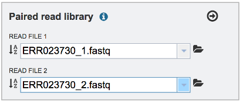
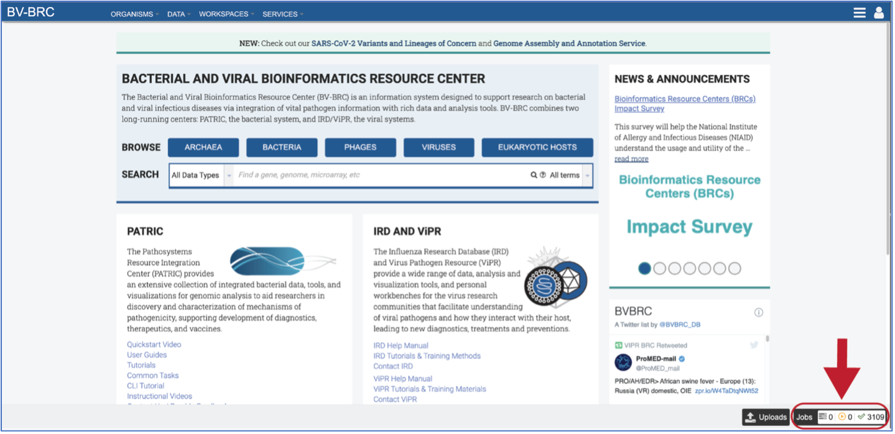
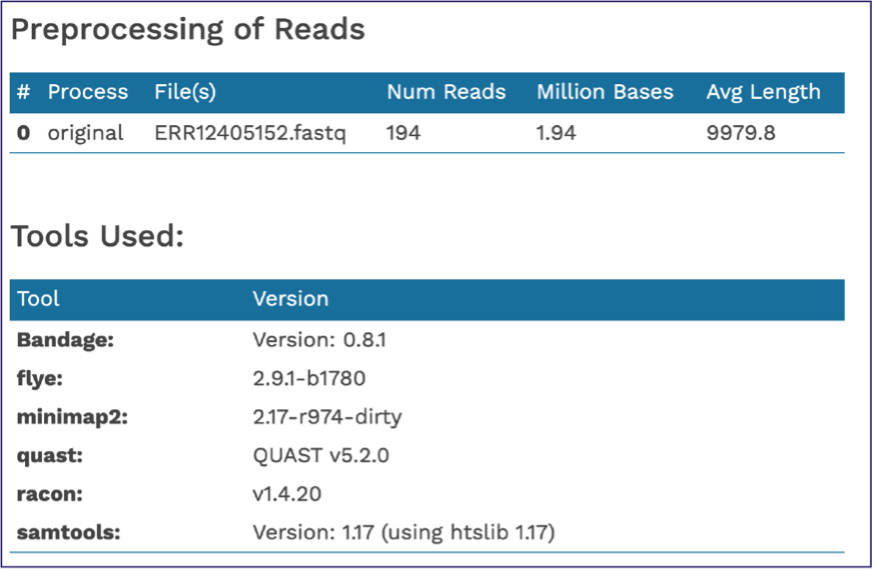

# Genome Assembly Service

A genome assembly is the sequence produced after chromosomes from the organism have been fragmented, those fragments have been sequenced, and the resulting sequences have been put back together. This is currently needed as DNA sequencing technology cannot read whole genomes in one go, but rather can read small pieces of between 20 and 30,000 bases, depending on the technology used. Typically, the short fragments, called reads, result from shotgun (random) sequencing of genomic DNA.

De novo sequence assemblers are a type of program that assembles short nucleotide sequences into longer ones without the use of a reference genome. These are commonly used in bioinformatic studies to assemble genomes or transcriptomes.

Different assemblers are designed for different type of read technologies. Second generation sequencing technologies like Illumina (called “short-read” technologies) produce short reads on the order of 50-200 base pairs and have low error rates of around 0.5-2%, with the errors chiefly being substitution errors. Third generation technologies like PacBio and fourth generation technologies like Oxford Nanopore (called “long-read” technologies) provide read lengths in the thousands or tens of thousands but have much higher error rates of around 10-20%, with errors being chiefly insertions and deletions. These differences necessitate different algorithms for assembly from short and long read technologies.

What follows is a tutorial showing how to submit reads of various types for assembly and selecting parameters for the assembly algorithm.  Note that reads from different sequencing platforms of the same organism can be submitted in one job. If PacBio and Illumina reads are available, both would be combined to generate the best assembly.

## Files accepted by BV-BRC Assembly Service

The assembly service accepts read files in either fastq, fasta, fastq.gz, or fasta.gz format. 

**FASTQ** is a text-based format for storing both a nucleotide sequence and its corresponding quality scores. Both the sequence letter and quality score are each encoded with a single ASCII character.  A FASTQ file normally uses four lines per sequence:
* Line 1 begins with a ‘@’ character and is followed by a sequence identifier and an optional description (like a FASTA title line).
* Line 2 is the raw sequence letters.
* Line 3 begins with a ‘+’ character and is optionally followed by the same sequence identifier (and any description) again.
* Line 4 encodes the quality values for the sequence in Line 2 and must contain the same number of symbols as letters in the sequence.

**FASTA** is a text-based format for representing either nucleotide sequences or amino acid (protein) sequences using single-letter codes. The format allows for sequence names and comments to precede the sequences. A **FASTA read file** has two parts: 
* Line 1 begins with a ‘>’.  Everything from the beginning ‘>’ to the first whitespace is considered the sequence identifier. Everything after that is considered the sequence description (this can be metadata, machine serial number, read orientation, etc.), all in a single line.
* Line 2 has the sequence, which can span multiple lines depending on the length.

What follows below is a tutorial showing how to submit reads of various types for assembly and selecting parameters for the assembly algorithm.  Note that reads from different sequencing platforms of the same organism can be submitted in one job.  If long and short reads are available for the same isolate, both could be combined to generate the best assembly using Unicycler, Canu or Flye.

## Creating a folder to hold the assembly job and related data

1.	It is always good practice to create a folder to keep the results from a particular experiment or project in order.  To create a new folder, go to the Workspaces tab and click on home.

2.	This will open the home directory on your workspace.  To create a new folder, click on the Add Folder icon at the top right of the table.

3.	This will open a pop-up window.  Note that the Create Folder button is greyed out.  Type the desired name in the text box.

4.	Once the name is entered, the Create Folder icon will turn blue.  To create the folder, click on that button.

5.	The pop-up window will disappear.  At the button left of the page you will see a temporal message indicating that the folder was successfully created.

## Locating the Assembly Service App

1.	At the top of any BV-BRC page, find the Tools & Services tab and click on it.

2.	In the drop-down box, underneath Genomics, click on Assembly.

3.	This will open up the Assembly landing page where researchers can submit single or paired read files, a combination of the two, and/or an SRA run accession number to the service.

### Uploading paired end reads

1.	To upload a fastq file that contains paired reads, locate the box called “Paired read library.” 

2.	The reads must be located in the workspace. To initiate the upload, first click on the folder icon. 

3.	This opens up a window where the files for upload can be selected. Click on the icon with the arrow pointing up. 

4.	This opens a new window where the file you want to upload can be selected. Click on the “Select File” in the blue bar. 

5.	This will open a window that allows you to choose files that are stored on your computer. Select the file where you stored the fastq file on your computer and click “Open”.  

6.	Once selected, it will autofill the name of the file. Click on the Start Upload button. 

7.	This will auto-fill the name of the document into the text box. 

8.	Pay attention to the upload monitor in the lower right corner of the BV-BRC page. It will show the progress of the upload. Do not submit the job until the upload is 100% complete.

9.	Repeat to upload the second pair of reads.

10.	To finish the upload, click on the icon of an arrow within a circle. This will move your file into the Selected libraries box.

### Uploading single reads

1.	To upload a fastq file that contains single reads, locate the text box called “Single read library.” If the reads have previously been uploaded, click the down arrow next to the text box below Read File. 

2.	This opens up a drop-down box that shows the all the reads that have been previously uploaded into the user account. Click on the name of the reads of interest.

3.	This will auto-fill the name of the file into the text box.

4.	To finish the upload, click on the icon of an arrow within a circle. This will move the file into the Selected libraries box.

### Submitting reads that are present at the Sequence Read Archive (SRA)

1.	BV-BRC also supports analysis of existing datasets from SRA. To submit this type of data, locate the Run Accession number that you will find at SRA and copy it.

2.	Paste the copied accession number in the text box underneath SRA Run Accession, then click on the icon of an arrow within a circle.  This will move the file into the Selected libraries box.

## Setting Parameters

1.	The assembly strategy for the reads must be selected.  Clicking on the down arrow that follows the text box under Assembly Strategy will open a drop-down box that shows all the strategies that BV-BRC offers.  A description of each strategy is listed below. Clicking on one of the strategies will autofill the text box with that selection: 

* **Unicycler** [1] is an assembly pipeline that can assemble Illumina-only read sets where it functions as a SPAdes-optimizer. It can also assembly long-read-only sets (PacBio or Nanopore) where it runs a miniasm plus Racon pipeline. For the best possible assemblies, give it both Illumina reads and long reads, and it will conduct a hybrid assembly.  Unicycler builds an initial assembly graph from short reads using the de novo assembler and then uses a novel semi-global aligner to align long reads to it. The latest version of Unicycler is available here (https://github.com/rrwick/Unicycler).

* **SPAdes** [2] is an assembler that is designed to assemble small genomes, such as those from bacteria, and uses a multi-sized De Bruijn graph to guide assembly. The latest version of the SPAdes toolkit is available here (http://cab.spbu.ru/software/spades/).

* **Canu**[3] is a long-read assembler which works on both third and fourth generation reads. It is a successor of the old Celera Assembler that is specifically designed for noisy single-molecule sequences. It supports nanopore sequencing, halves depth-of-coverage requirements, and improves assembly continuity. It was designed for high-noise single-molecule sequencing (such as the PacBio RS II/Sequel or Oxford Nanopore MinION).  The algorithm is available here (https://github.com/marbl/canu).

* **The metaSPAdes** [4] software combines new algorithmic ideas with proven solutions from the SPAdes toolkit to address various challenges of metagenomic assembly.  The latest version of the SPAdes toolkit that includes metaSPAdes is available here (http://cab.spbu.ru/software/spades/).

* The **plasmidSPAdes** [5] algorithm and software tool for assembling plasmids from whole genome sequencing data and benchmark its performance on a diverse set of bacterial genomes. Plasmids are stably maintained extra-chromosomal genetic elements that replicate independently from the host cell's chromosomes. The latest version of the SPAdes toolkit that includes plasmidSPAdes is available here (http://cab.spbu.ru/software/spades/).

* **Single-cell SPAdes** [2] is a new assembler for both single-cell and standard (multicell) assembly, and it improves on the recently released E+V−SC assembler (specialized for single-cell data). The latest version of the SPAdes toolkit that includes the assembly algorithm for reads from single cell is available here (http://cab.spbu.ru/software/spades/).

* **Flye** [6] is a long-read assembler.  Kolmogorov et al. say that “Flye initially generates disjointigs that represent concatenations of multiple disjoint genomic segments, concatenates all error-prone disjointigs into a single string (in an arbitrary order), constructs an accurate assembly graph from the resulting concatenate, uses reads to untangle this graph, and resolves bridged repeats (which are bridged by some reads in the repeat graph). Afterwards, it uses the repeat graph to resolve unbridged repeats (which are not bridged by any reads) using small differences between repeat copies and then outputs accurate contigs formed by paths in this graph.” [6] The algorithm is available here (http://github.com/fenderglass/Flye).

* Selecting **Auto** will use Flye if only long reads are submitted. If long and short reads, as or short reads alone are submitted, Unicycler is selected. 

2.	An output folder must be selected for the assembly job.  Typing the name of the folder in the text box underneath the words Output Folder will show a drop-down box that shows close hits to the name, and clicking on the arrow at the end of the box will open a drop-down box that shows the most recently created folders.  To find a previously created folder, or to create a new one, click on the folder icon at the end of the text box.  This will open a pop-up window that shows all the previously created folder.

3.	Click on the desired folder, and then click the OK button in the lower right corner of the window.

4.	A name for the job must be included prior to submitting the job.  Enter the name in the text box underneath the words Output Name.

5.	The BV-BRC assembly service also has options to trim the reads using TrimGalore[7], correct assembly errors (or “polish) using Racon[8] and/or Pilon[9], and also provides the ability to change the minimum contig length and coverage.  Adjusting these parameters can be accomplished by clicking on the down arrow next to the word “Advanced” in the Parameters box.

Both Racon and Pilon take the contigs and the reads mapped to those contigs and look for discrepancies between the assembly and the majority of the reads.  Where there is a discrepancy, Racon or Pilon will correct the assembly if the majority of the reads call for that.  Racon is for long reads (PacBio or Nanopore) and Pilon is for shorter reads (Illumina or Ion Torrent).  Once the assembly has been corrected with the reads, it is still possible to do another iteration to further improve the assembly, but each one takes time.  BV-BRC allows for 0 to 4 racon or pilon iterations. 

## Submitting the Assembly Job

1.	Once reads are in the Selected libraries and all the parameters have been selected, the Assemble button at the bottom of the page will turn blue.  The assembly will be submitted once this button is clicked.

2.	A message will appear at the bottom of the page, indicating that the submitted job has entered the BV-BRC queue.

### Monitoring progress on the Jobs page
1.	Clicking on the Jobs box at the bottom right of any BV-BRC page/

2.	This will open the Jobs Landing page where the status of submitted jobs is displayed.

## Viewing and Interpreting the Assembly Job Results
1.	On the jobs page, click on the row that has the assembly of interest. This will populate the vertical green bar on the right with possible downstream steps, which include viewing the results of the job, or reporting an issue that was experienced (like a job failure).  Click on the View icon.

2.	This will rewrite the page to show the information about the assembly job, and all of the files that are produced when the pipeline runs.  

3.	The information about the job submission can be seen in the table at the top of the results page.  To see all the parameters that were selected when the job was submitted, click on the Parameters row.

4.	This will show the information on what was selected when the job was originally submitted.

### Genome Assembly Report

1.	The Genome Assembly report contains valuable information about the assembly, including the number of contigs. Clicking on the row that contains the number of contigs, depth and coverage.  **AssemblyReport.html** will highlight it in blue and populate the action bar with possible downstream steps.  Click on the View icon.

