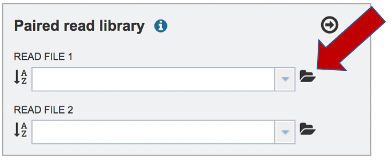
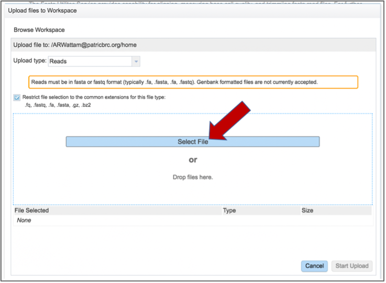
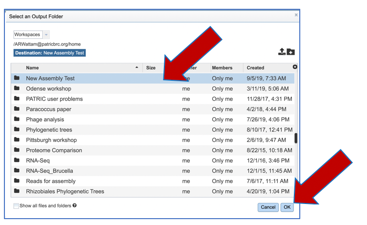
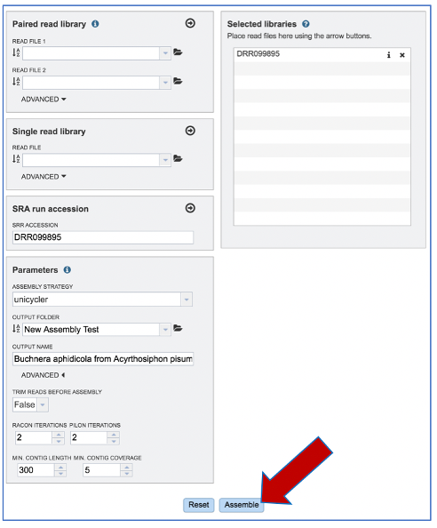

# Genome Assembly Service

A genome assembly is the sequence produced after chromosomes from the organism have been fragmented, those fragments have been sequenced, and the resulting sequences have been put back together. This is currently needed as DNA sequencing technology cannot read whole genomes in one go, but rather can read small pieces of between 20 and 30,000 bases, depending on the technology used. Typically, the short fragments, called reads, result from shotgun (random) sequencing of genomic DNA.

De novo sequence assemblers are a type of program that assembles short nucleotide sequences into longer ones without the use of a reference genome. These are commonly used in bioinformatic studies to assemble genomes or transcriptomes.

Different assemblers are designed for different type of read technologies. Second generation sequencing technologies like Illumina (called “short-read” technologies) produce short reads on the order of 50-200 base pairs and have low error rates of around 0.5-2%, with the errors chiefly being substitution errors. Third generation technologies like PacBio and fourth generation technologies like Oxford Nanopore (called “long-read” technologies) provide read lengths in the thousands or tens of thousands but have much higher error rates of around 10-20%, with errors being chiefly insertions and deletions. These differences necessitate different algorithms for assembly from short and long read technologies.

What follows is a tutorial showing how to submit reads of various types for assembly and selecting parameters for the assembly algorithm.  Note that reads from different sequencing platforms of the same organism can be submitted in one job. If PacBio and Illumina reads are available, both would be combined to generate the best assembly.

## Files accepted by BV-BRC Assembly Service

The assembly service accepts read files in either fastq, fasta, fastq.gz, or fasta.gz format. 

FASTQ is a text-based format for storing both a nucleotide sequence and its corresponding quality scores. Both the sequence letter and quality score are each encoded with a single ASCII character.  A FASTQ file normally uses four lines per sequence.
•	Line 1 begins with a ‘@’ character and is followed by a sequence identifier and an optional description (like a FASTA title line).
•	Line 2 is the raw sequence letters.
•	Line 3 begins with a ‘+’ character and is optionally followed by the same sequence identifier (and any description) again.
•	Line 4 encodes the quality values for the sequence in Line 2 and must contain the same number of symbols as letters in the sequence.

1. At the top of any BV-BRC page, find the Services tab and click on it

