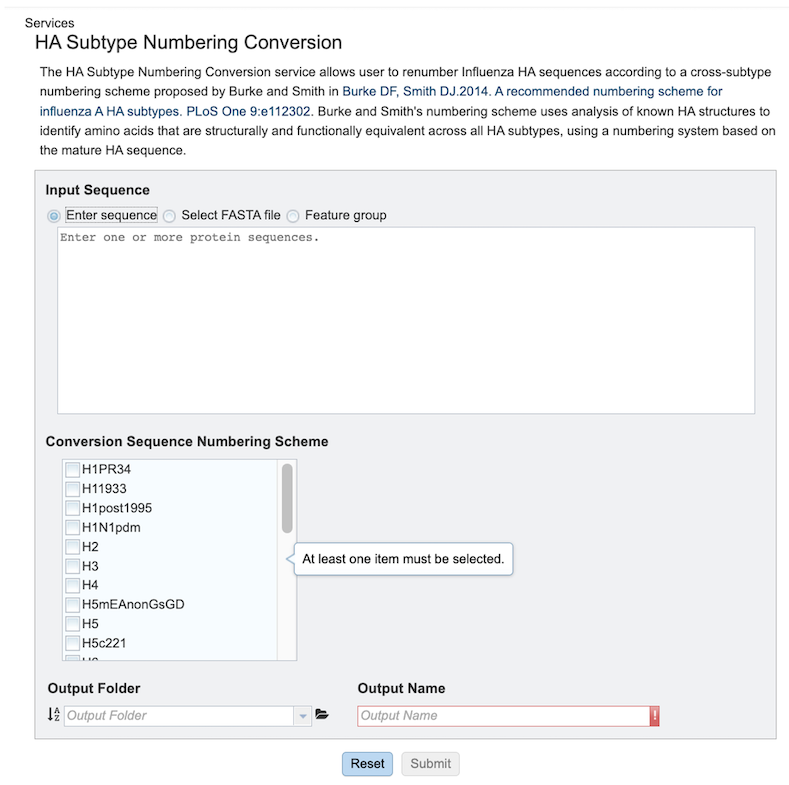
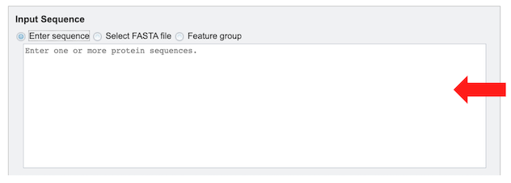
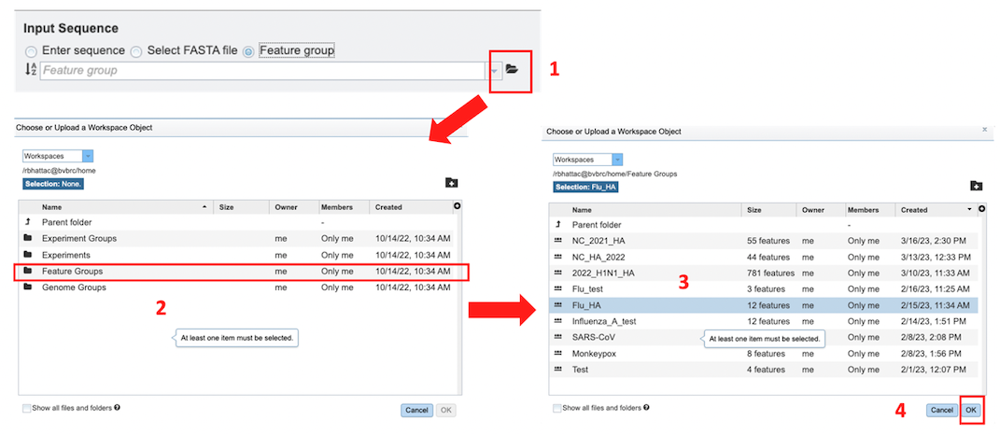
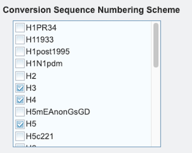
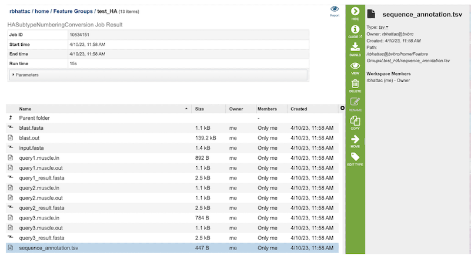
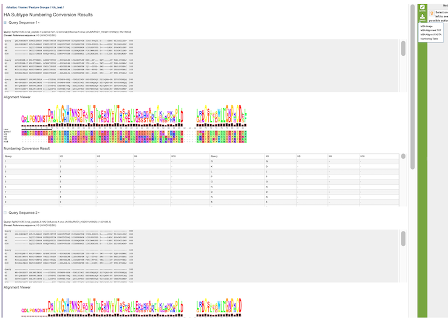
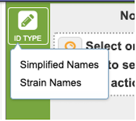
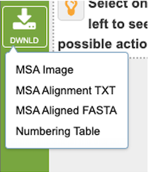

# HA Subtype Numbering Conversion Service

*Revised: 7/11/2023*

## Overview

The HA Subtype Numbering Conversion tool takes influenza HA protein sequence(s) and converts their existing HA position numbering to a different HA numbering scheme using David Burke and Derek Smith’s method that uses both sequence and structure information to propose positions of functional equivalence across different HA subtypes. The analysis starts with the user inputting protein sequence(s). The sequence(s) are BLASTed against the Burke Reference sequences, which will determine the best reference subtype to use in the HA numbering pipeline. The HA numbering pipeline will generate a pairwise multiple sequence alignment using the reference protein sequence selected and the user inputted protein sequence(s). This alignment will generate a mapping between the user input sequence(s) and the BLAST reference sequence. Then this mapping is used to align the input sequence(s) to the selected HA subtype positions.

### Burke Reference Sequences

<table>
  <tr>
    <th>Subtype Common Name</th>
    <th>Strain Name</th>
  </tr>
  <tr>
    <td>H1_PR34</td>
    <td>A/Puerto/Rico/8/34</td>
  </tr>
  <tr>
    <td>H1_1993</td>
    <td>A/United/Kingdom/1/1933</td>
  </tr>
<tr>
    <td>H1post1995</td>
    <td>A/NewCaledonia/20/1999</td>
  </tr>
  <tr>
    <td>H1pdm</td>
    <td>A/California/04/2009</td>
  </tr>
  <tr>
    <td>H2</td>
    <td>A/Singapore/1/1957</td>
  </tr>
  <tr>
    <td>H5mEA-nonGsGD</td>
    <td>A/mallard/Italy/3401/2005 (LPAI)</td>
  </tr>
  <tr>
    <td>H5</td>
    <td>A/Vietnam/1203/04 (HPAI)</td>
  </tr>
  <tr>
    <td>H5c221</td>
    <td>A/chicken/Egypt/0915-NLQP/2009 (HPAI)</td>
  </tr>
  <tr>
    <td>H6</td>
    <td>A/chicken/Taiwan/0705/99</td>
  </tr>
  <tr>
    <td>H8</td>
    <td>A/turkey/Ontario/6118/1968</td>
  </tr>
  <tr>
    <td>H9</td>
    <td>A/Swine/HK/9/98</td>
  </tr>
  <tr>
    <td>H11</td>
    <td>A/duck/England/1/1956</td>
  </tr>
  <tr>
    <td>H12</td>
    <td>A/Duck/Alberta/60/1976</td>
  </tr>
  <tr>
    <td>H13</td>
    <td>A/gull/Maryland/704/1977</td>
  </tr>
  <tr>
    <td>H16</td>
    <td>A/black-headedgull/Turkmenistan/13/76</td>
  </tr>
  <tr>
    <td>B/Hong Kong/8/73</td>
    <td>B/HONGKONG/8/73</td>
  </tr>
  <tr>
    <td>B/Florida/4/2006</td>
    <td>B/FLORIDA/4/2006</td>
  </tr>
  <tr>
    <td>B/Human/Brisbane/60/2008</td>
    <td>B/HUMAN/BRISBANE/60/2008</td>
  </tr>
  <tr>
    <td>H3</td>
    <td>A/AICHI/2/68</td>
  </tr>
  <tr>
    <td>H14</td>
    <td>A/mallard/Astrakhan/263/1982</td>
  </tr>
  <tr>
    <td>H15</td>
    <td>A/duck/Australia/341/1983</td>
  </tr>
  <tr>
    <td>H10</td>
    <td>A/mallard/bavaria/3/2006</td>
  </tr>
  <tr>
    <td>H4</td>
    <td>A/swine/Ontario/01911-1/99</td>
  </tr>
  <tr>
    <td>H7N3</td>
    <td>A/Turkey/Italy/220158/02/H7N3</td>
  </tr>
  <tr>
    <td>H7N7</td>
    <td>A/Netherlands/219/03/H7N7</td>
  </tr>
  <tr>
    <td>H17</td>
    <td>A/little-yellowshoulderedbat/Guatemala/060/2010</td>
  </tr>
  <tr>
    <td>H18</td>
    <td>A/flat-faced/bat/Peru/033/2010</td>
  </tr>
</table>

### See Also
  * [HA Subtype Numbering Conversion Service](https://www.bv-brc.org/app/HASubtypeNumberingConversion)
  * [HA Subtype Numbering Conversion Quick Reference](/quick_references/services/ha_numbering_service)

## Locating the service

The HA Subtype Numbering Conversion submenu option under the **TOOLS & SERVICES** main menu (Protein tools category) opens the HA Subtype Numbering Conversion input form. *Note: You must be logged into BV-BRC to use this service.*
 

This will open up the HA Subtype Numbering Conversion job landing page.

## Specifying HA Subtype Numbering Conversion parameters

1\.	select the desired input files/Sequences. There are three ways to select input sequences for analysis: 

* **Enter Sequence::** Allows pasting of one or more protein sequence in FASTA format.

* **Select FASTA File:** Allows selection of custom sequence(s) file in Fasta format. These can be selected Fasta files which are already uploaded in the workspace [2a] or uploaded [2b].

* **Feature Group:** Users can select their own previously customized feature groups from data saved or uploaded to their workspace.

2\.	**Conversion Sequence Numbering Scheme** - One or more subtypes must be selected for which the corresponding numbering scheme is desired.

3\.	Select an **Output Folder** in your workspace or create one if an appropriate folder is not available (red arrow). An **Output Name** (red box) must also be specified for the job result, before the job can be submitted.

4\.	After parameter and input file selections have been completed, the “Submit” button will become available. Clicking this button will launch the service job.

5\. A message will appear below the box to indicate that the job is now in the queue.

## Checking the status of the job

1\.	Click on the Jobs indicator at the bottom of the BV-BRC page.

2\.	This will open the Jobs Status page that displays the status of the job, as well as previously submitted jobs. 

3\.	Once the job is completed, select the job by clicking on it and click the “View” button on the right-hand bar to see the results.

4\.	The results page will consist of a header describing the job and a list of output files, as shown below.

5\.	The HA Subtype Numbering Conversion Service generates several files that are deposited in the Private Workspace in the designated Output Folder. These include the following:

* **blast.fasta** - contains the query sequences where the fasta headers are replaced with ‘queryN’.
* **blast.out** - output from blast to identify the closest Burke reference sequence.
* **input.fasta** - input sequences from the users or selected by users.
* **queryN.muscle.in** - input file for MUSCLE to align Nth query to its closest Burke reference sequence.
* **queryN.muscle.out** - output file from MUSCLE for Nth Query
* **queryN_result.fasta** - alignment of the query, its closest Burke reference and the selected subtypes for Numbering conversion.
* **Sequence_annotation.tsv** - tabular summary of blast results for all the query sequences to determine the best reference subtype to use in the HA numbering pipeline.

## Viewing HA Subtype Numbering Conversion results

1\.	After selecting the files, you can choose to either download (red box below) or view (red arrow) the results by selecting the appropriate button (Download or View respectively) on the green vertical Action Bar on the right-hand side of the page.

* Selecting the View button for “**sequence_annotation.tsv**” file, a tabular summary of blast results for all the query sequences is displayed to determine the best reference subtype to use in the HA numbering pipeline. The columns contain information regarding the following: 

  * Query Sequence Name – Query identifier
  * Virus Type – Influenza A or B
  * Closest Reference Sequence – the matched Burke Reference Sequence
  * Warning – if any - If BLAST returns no significantly similar sequences (i.e. all values have E-value > 0.1) the program throws an error message indicating that - “No similar HA sequences were identified.  Check to make sure that the query sequence provided is from an influenza A HA protein”.
  * Blast score
  * E-value

* The results can be sorted by increasing or decreasing values by clicking on the desired column as shown below (red arrow), and can be further filtered by selecting appropriate keywords and the desired column to search from the dropdown menu pictured below (red box).

2\.	Clicking on the **Report** button in the right-hand side of header in the results page opens a consolidated report for the job.

For each Query, the result of the analysis is reported in two forms: 

* A simple multiple sequence alignment format that includes the query sequence on top and then the reference sequence of the same subtype as the query sequence, and then reference sequences for all other chosen subtypes.  It will be displayed using the alignment viewer.
* A table with the mapping coordinating positions in one group of columns and the residue per subtype in the second group of columns

## Action Buttons

* **ID TYPE** - Changes the sequence ID in the displayed alignment by selecting query and using the “ID TYPE” option. Then the alignment can be viewed with a simplified common name or strain name. 

* **Download** - Downloads query sequences, availabel in several formats:
  * MSA in text format
  * MSA in aligned fasta format
  * Numbering Conversion Table in excel format
  * MSA Image

