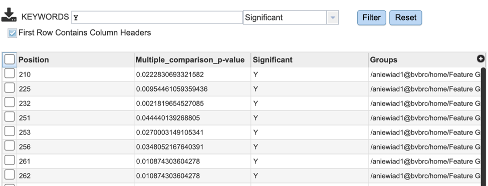

# Metadata-driven Comparative Analysis Tool (meta-CATS) Tutorial

## Overview
The meta-CATS tool provides the capability to perform customized comparative genomics analyses with minimal manual manipulation. You can perform a statistical analysis on sequences assigned to up to 10 different groups to determine which residues significantly correlate with one or more metadata fields. The meta-CATS tool looks for positions that significantly differ between user-defined groups of sequences. However, biological biases due to covariation, codon biases, and differences in genotype, geography, time of isolation, or others may affect the robustness of the underlying statistical assumptions. Click here to view meta-CATS tutorial. Open-source code for meta-CATS can be found here. 

### Keywords:
metadata, variation analysis, comparative analysis. 

### See also
* [Meta-CATS Analysis Service](https://beta.bv-brc.org/app/MetaCATS)
* [Meta-CATS Analysis Service Quick Reference](../../quick_references/services/metacats.html)

## Locating the meta-CATS App

1.	At the top of any BV-BRC page, find the **SERVICES** tab and then click on Meta-CATS. 
 

2.	This will open up the Meta-CATS landing page.

## Specifying meta-CATS parameters

1.	Users will need to specify the required P-value (calculated during the chi-square test of independence). If none is selected, the default p-value will be 0.05, ie: if the resulting p-value from any column > 0.05, then that column will not be displayed in the results. 

