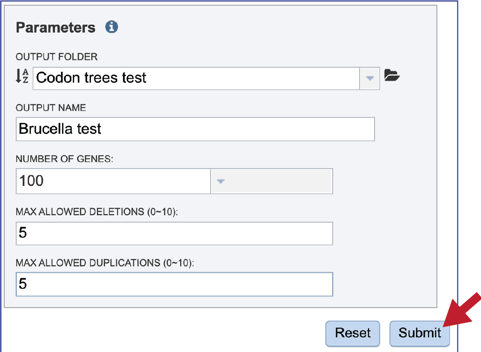
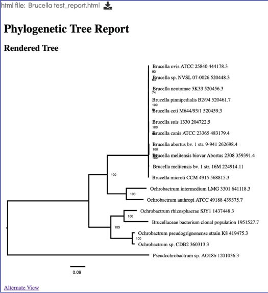
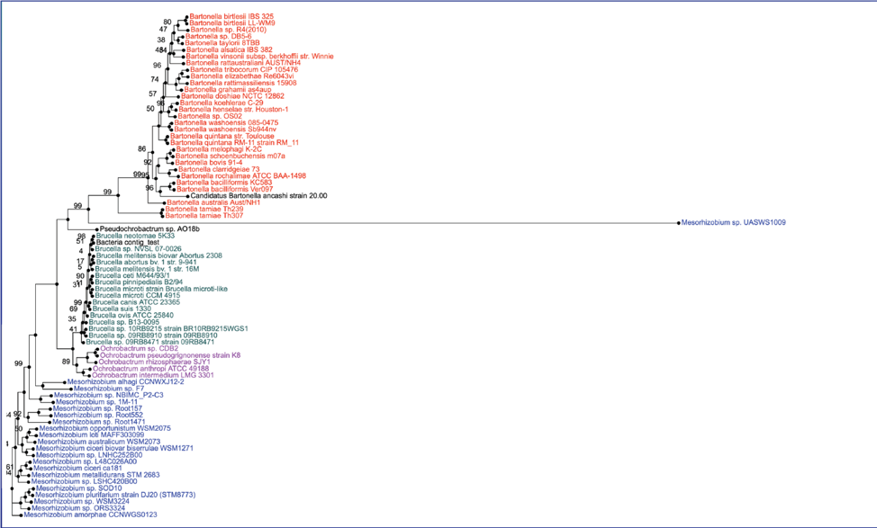
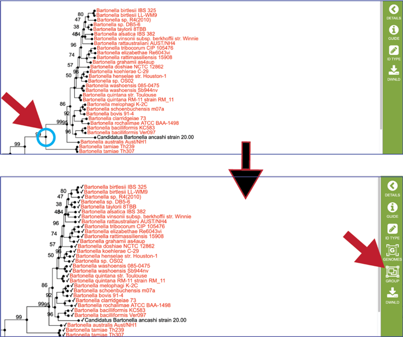
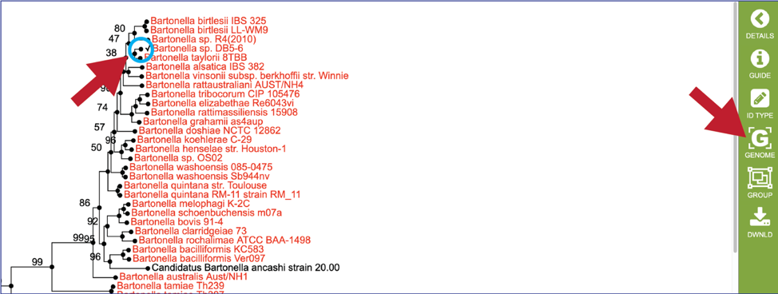
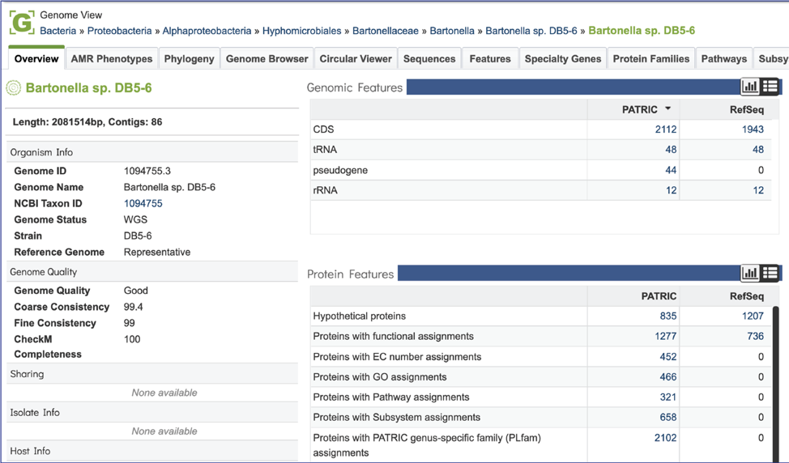

# Phylogenetic Tree Service 

A phylogenetic tree or evolutionary tree is a branching diagram or “tree” showing the evolutionary relationships among various biological species or other entities. The Codon Tree service in BV-BRC allows researchers to build trees that contain private and public genomes, adjusting for the number of genes that will be used to generate the tree.
The Codon Tree pipeline generates phylogenetic trees for BV-BRC and PATRIC. It uses the amino acid and nucleotide sequences from defined number of the BV-BRC global Protein Families (PGFams)[1], which are picked randomly, to build an alignment, and then generate a tree based on the differences within those selected sequences. This tutorial deals with the Codon Trees pipeline. Both the protein (amino acid) and gene (nucleotide) sequences are used for each of the selected genes from the PGFams. Protein sequences are aligned using MUSCLE[2], and the nucleotide coding gene sequences are aligned using the Codon_align function of BioPython[3]. A concatenated alignment of all proteins and nucleotides were written to a PHYLIP formatted file, and then a partitions file for RaxML[4] is generated, describing the alignment in terms of the proteins and then the first, second and third codon positions. Support values are generated using 100 rounds of the “Rapid” bootstrapping option[5] of RaxML. The resulting newick file can be viewed in BV-BRC, and we also suggest that researchers download it and view it in FigTree[6] to generate a publication quality image.
Source code for algorithms

* The source code for RaxML can be found at: https://github.com/stamatak/standard-RAxML
* The source code for MUSCLE can be found at: https://www.drive5.com/muscle/downloads.htm
* The source code for BioPython can be found at: https://github.com/biopython/biopython

