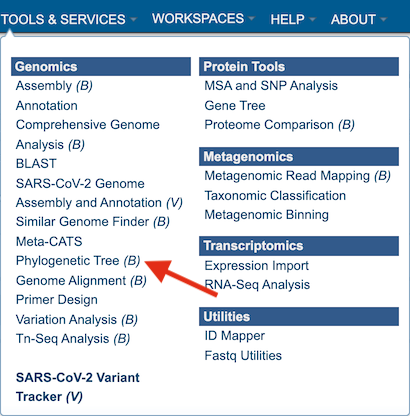
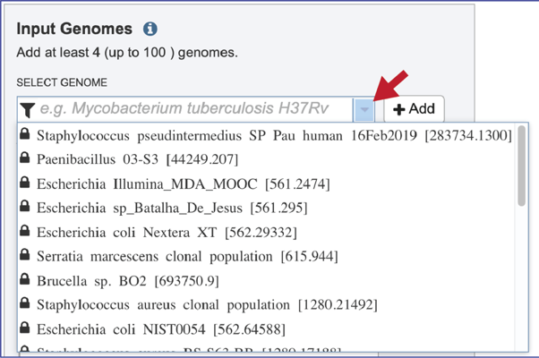
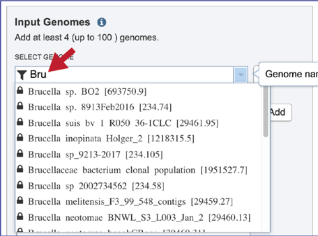
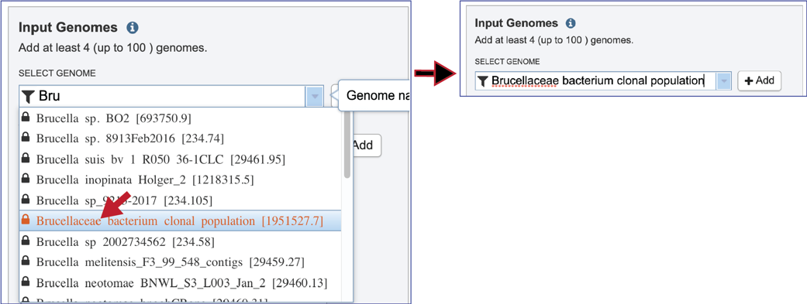
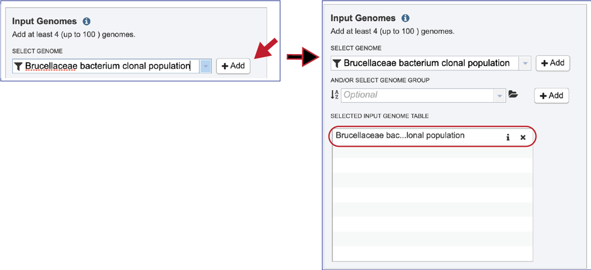
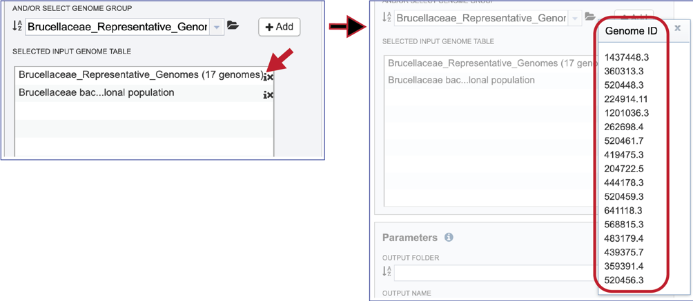
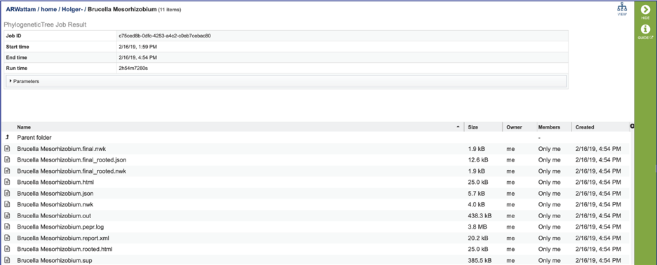
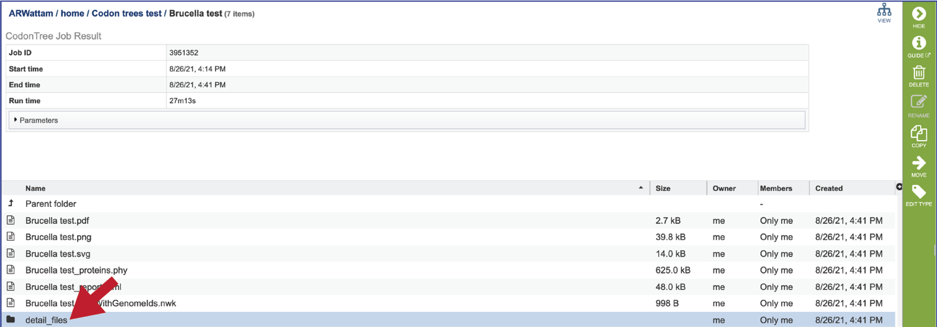
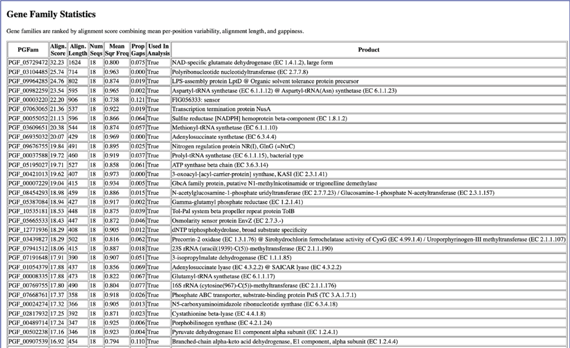

# Phylogenetic Tree Service 

A phylogenetic tree or evolutionary tree is a branching diagram or “tree” showing the evolutionary relationships among various biological species or other entities. The Codon Tree service in BV-BRC allows researchers to build trees that contain private and public genomes, adjusting for the number of genes that will be used to generate the tree.

The Codon Tree pipeline generates bacterial phylogenetic trees. It uses the amino acid and nucleotide sequences from defined number of the BV-BRC global Protein Families (PGFams)[1], which are picked randomly, to build an alignment, and then generate a tree based on the differences within those selected sequences. This tutorial deals with the Codon Trees pipeline. Both the protein (amino acid) and gene (nucleotide) sequences are used for each of the selected genes from the PGFams. Protein sequences are aligned using MUSCLE[2], and the nucleotide coding gene sequences are aligned using the Codon_align function of BioPython[3]. A concatenated alignment of all proteins and nucleotides were written to a PHYLIP formatted file, and then a partitions file for RaxML[4] is generated, describing the alignment in terms of the proteins and then the first, second and third codon positions. Support values are generated using 100 rounds of the “Rapid” bootstrapping option[5] of RaxML. The resulting newick file can be viewed in BV-BRC, and we also suggest that researchers download it and view it in FigTree[6] to generate a publication quality image.
Source code for algorithms

* The source code for RaxML can be found at: https://github.com/stamatak/standard-RAxML
* The source code for MUSCLE can be found at: https://www.drive5.com/muscle/downloads.htm
* The source code for BioPython can be found at: https://github.com/biopython/biopython

## Creating a folder to hold the phylogenetic tree job and related data

Please refer to the [Genome Assembly Service tutorial](../genome_assembly/assembly.html) for instructions on creating a folder in the workspace.

## Locating the Phylogenetic Tree App

1.	At the top of any BV-BRC page, find the Services tab and click on Phylogenetic Tree. 

2.	This will open up the Phylogenetic tree landing page where researchers can generate a phylogenetic tree. 

## Selecting genomes 

### Individual genomes

1.	Public or private genomes that are in the BV-BRC database can be used to build a phylogenetic tree. Up to 100 genomes can be used in this service. To add a private genome, click on the Filter icon at the beginning of the text box underneath **Select Genome**. 

2.	This will open a drop-down box with a list of the types of genomes that can be filtered on. Click off the check box in front of Reference, Representative and All Other Public Genomes to enable filtering on private genomes that are in the researcher’s workspace. 

3.	Clicking on the drop-down box at the end of the text box under Select Genome will show the private genomes in the workspace that have most recently been annotated. 

4.	The list can also be filtered by beginning to type a name in the text box under Select Genome. 

5.	A genome of interest can be selected by clicking on it. This will auto-fill the name of the genome into the text box. 

6.	The genome needs to be added into the Selected Input Genome Table. Click the **+ Add** button at the end of the text box, and the genome will appear in the table. 

7.	To add a different type of genome (Reference, Representative, or All Other Public Genomes), click on the filter icon and click the check boxes to the desired category.  The selected genomes will be moved to the Selected Genome Input Table by clicking on the name and then the Add button.

## Genome Groups

1.	Genome groups can also be added to the Input Genome Table. Clicking on the down arrow that follows the text box underneath **And/Or Select Genome Group** will show the genome groups that have most recently been created by the researcher. 

2.	The list can be filtered by beginning to type a name in the text box under Select Genome. 

3.	A genome group of interest can be selected by clicking on it. This will auto-fill the name of the genome into the text box. 

4.	The selected genomes will be moved to the Selected Genome Input Table by clicking on the name and then the **+ Add** button.  This will move the selection to the top of the **Selected Input Genome Table**. 

5.	Clicking on the Information icon following the name will show the Genome IDs of the genomes within a selected group. 

6.	Clicking on the **X** icon that follows the name of a genome or genome group in the Selected Input Genome Table will remove it from the selection. 

## Setting parameters

1.	Several parameters must be addressed before the codon tree job can be submitted, and the Submit button will turn blue when the job is ready.

2.	The phylogenetic tree job must be placed in an **Output Folder**.  Clicking on the down arrow that follows the text box underneath Output Folder will show the folders that have most recently been created by the researcher. 

3.	Clicking on a folder name will add it to the text box.  Links to instructions on creating a new folder are available at the top of this tutorial. 

 4.	The phylogenetic tree job needs a name, which can be entered in the text box under **Output Name**.

5.	The number of single-copy PGFams set as the default is 100. This will include 100 amino acid and nucleotide sequences for the alignment and the tree but will depend on the number of single copy genes found in all of the genomes selected. For example, if one genome has only 10 single copy genes, then the tree will be built on the protein and gene sequences for those 10 genes, even if all the other genomes have 100 single copy genes. This can be adjusted (see below for Max Allowed Deletions and Duplications). 

A different number can be selected by clicking on the down arrow at the end of the text box underneath **Number of Genes**, and the range is 10 to 1000 genes. Genomes that are in widely different taxa might be resolved with as few as 10 genes, but closely related genomes (same species or even strain) might require up to 1000 genes selected to separate them on a phylogenetic tree. **The more genes selected, the longer the tree job will run**. Clicking on the desired number will fill the text box. 

6.	The selection of “single-copy” genes can be made more lenient by allowing one or more instances of genomes missing a member of a particular homology group (**Max Allowed Deletions**). If the number is set at 1, 9 genomes would have a gene in a particular PGFam, and the 10th would be missing it. Likewise, if the number is set at 2, 8 genomes would have the PGFam and the last 2 would be missing it. This would only be used if there are not enough PGFams meet the single copy criterion. The number of deletions allowed can be set between 0 and 10 in the text box underneath Max Allowed Deletions (0-10). 

7.	The selection of “single-copy” genes can also be made more lenient by allowing for PGFams that might have more than one copy of a single gene within a single genome. If the number is set at 1, then. Nine genomes have one gene in a particular PGFam, and the 10th has two. If the number is set at 2, 8 genomes will have one gene in a particular PGFam and the other two have 2. When there are two copies of a gene, the algorithm will pick the gene that is the most similar to the other genes found in the other selected genomes. This would only be used if there are not enough PGFams meet the single copy criterion. This number of can be set between 0 and 10 in the text box underneath **Max Allowed Duplications** (0-10). 

8.	When all the parameters are entered, the codon tree job is ready to submit. Submit the job by clicking on the blue Submit button. 

9.	A message will appear above the submit button, indicating that the submission was successful. 

## Monitoring progress on the Jobs page

1.	Click on the Jobs box at the bottom right of any BV-BRC page. 

2.	This will open the Jobs Landing page where the status of submitted jobs is displayed. 

## Viewing the Phylogenetic tree job results

1.	To view a particular job, click on a row to select it. Once selected, the downstream processes available for the selection appear in the vertical green bar.  Clicking on the View icon will open the phylogenetic tree job summary. 

2.	This will rewrite the page to show the information about the phylogenetic tree job, and all of the files that are produced when the pipeline runs.  

3.	The information about the job submission can be seen in the table at the top of the results page.  To see all the parameters that were selected when the job was submitted, click on the Parameters row. 

4.	This will show the information on what was selected when the job was originally submitted. 

5.	The Codon Trees pipeline generates several different formats of images of the phylogenetic tree.  The **.pdf** file contains the portable document format showing a midpoint rooted phylogenetic tree. 

6.	The Codon Trees pipeline also produces a portable graphic format (**.png**).

7.	A Scalable Vector Graphics (**.svg**) file, an XML-based two-dimensional graphic file format, is also produced. It is a publication quality image that is best downloaded.

8.	The **proteins.phy** file shows the aligned, trimmed, and concatenated sequences suitable to submission to RaxML. 

9.	The **report.html** file provides a detailed report on the phylogenetic tree.  This will be discussed below.

10.	The **treeWithGenomeIds.nwk** file contains the newick file.  Newick files are the instructions for building the phylogenetic tree. These files should be downloaded, and opened in viewer that can interpret them, where they can be adjusted to create the best possible image. Two viewers that we recommend are FigTree[6] and the Interactive Tree of Life (ITOL)[7]. The Codon Trees pipeline provide two different versions of **newick (.nwk)** for download. The **codontree_treeWithGenomeIDs.nwk** shows the IDs for all the genomes in the tree, which will be visible as the leaves. 

11.	The **Detail_files folder** contains additional files associated with the Codon Trees job.  Double click on the row that contains the folder.  

12.	This will rewrite the page to show the contents of the folder. 

13.	The **analysisStats** file gives the statistics for the Codon Tree job, including the number of genomes, protein alignments, aligned amino acids, gene (CGS) alignments, aligned nucleotides and a list of the protein families used.  This information is also available in the html file and can be downloaded. 

14.	The **genesPerGenome.txt** file shows the Genome IDs, the number of genes in that genome, the number of those genes that were single copy, and the number of genes viewed.  The file can be downloaded or viewed by clicking the **View** icon. This information is also available in the html file. 

15.	The **homologAlignmentStats.txt** file shows the statistics for each of the protein families used in the Codon Tree job.  The information includes the protein family ID, the number of gaps, the mean squared frequency (This calculates the frequency of each letter per column and then sum the square for each column, which would be 1.0 if all had the same letter), the number of positions in the alignment for that family, the number of sequency from all the genomes, the proportion of the alignment that consists of gap characters, the sum squared frequency (The sum of all the mean squared frequencies in the alignment, which is used to select the best alignment.) and the an indication if the protein family was used in the analysis.  The file can be downloaded or viewed in the page by clicking the **View** icon. 

16.	The **homologsAndGenesIncludedInAlignment.txt** file gives a list of the protein families and the unique identifier for each protein/gene used in the alignment. The file can be downloaded or viewed in the page by clicking the **View** icon. 

17.	The **nex** file is used to generate the graphics in a program like FigTree.  It contains parameters that tells the graphics file how to draw it.  It can be downloaded by clicking the **Download** icon. 

18.	The **partitions** file tells RaxML which alignment columns are first, second or third codon position nucleotides, or amino acids. It can be downloaded by clicking the **Download** icon. 

19. The **phy** file is the concatenated alignment in PHYLIP format.  This is a very large file and can be downloaded by clicking the Download icon. 

20.	The **raxmlcommand.sh** provides the command script to run the pipeline for the tree that was generated.  It can be run on your personal computer, can be downloaded by clicking the **Download** icon. 

21.	The **tipsAligned.pdf** file shows the midpoint rooted phylogenetic tree with the names of genomes aligned. It can be downloaded by clicking the **Download** icon. 

22. The **tipsAligned.png** shows the same tree as above, but in a portable graphic format.  It can viewed by clicking on the **View** icon or downloaded. A scaled vector graph (**SVG**) of the same tree is also available. 

23.	The **treewithGenomeNames.nwk** is a newick file that has genome names as the leaves of the tree.  It can be downloaded or viewed by clicking the appropriate icons. 

24.	The **RaxML_info** file has details on the RaxML run. 

