# Exploring a Private Genome

## Locating a privately annotated genome-Global Search
1. Open the drop-down box using the arrow following All Data Types in the global search at the right of blue banner across any PATRIC page.

2. Enter the name of the genome you annotated. This can be as simple as using the name of the strain that you used (red arrow).

3. This opens the Search Results page that shows all the genomes that have the text that was used in the search somewhere in their name or description. If the text is specific, the genome should be easily identified. Click on the name of the genome of interest (red arrow)
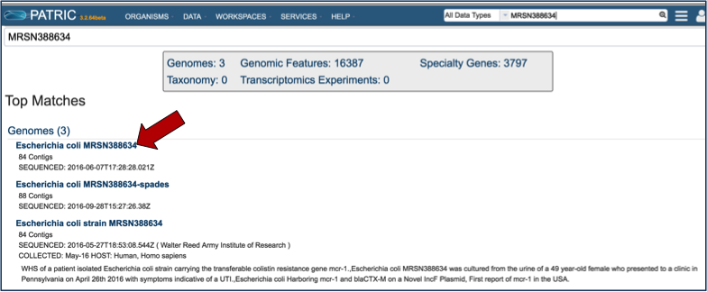

4. This opens the landing page for the selected genome.
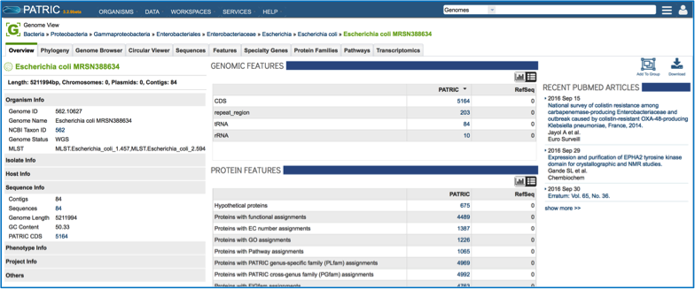

## Locating a privately annotated genome - Jobs page
1. Click on Your Jobs found in the Workspaces tab.

2. This opens the jobs page that shows all the jobs that have been submitted. Clicking on a job of interest highlights to row, and populates the green information bar to the right with the View icon (red arrow).

3. Clicking on the View icon opens the Jobs Detail page, where a number of files with data and details about the specific annotation
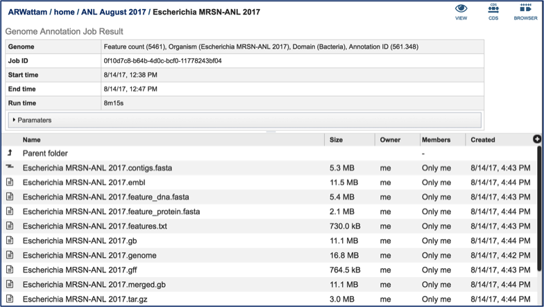

4. A View icon is available at the top of the Jobs Detail page.

5. Clicking on the view icon opens the landing page for the genome that was chosen.

6. If that genome has sequences the correspond to antimicrobial resistance or susceptibility, that information will be at the top of the overview page for the genome. This will provide an indication of the antibiotics that the isolate is predicted to be susceptible or resistant to [1]. If a known antimicrobial resistance (AMR) phenotype has been entered as part of the metadata, that will also be available in the table at the top of this page.
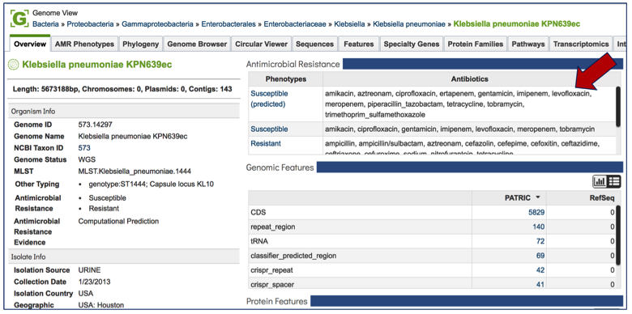

## Tabs on the Genome Landing Page
### AMR Phenotype
1. Every landing page at PATRIC has a number of tabs across the top, each of which contains different information. Clicking on AMR Phenotype will show the antibiotics that the isolate is resistant to, differentiating between predicted and actual phenotypes. It includes minimum inhibitory concentration (MIC) values, a variety of columns that show different information on lab typing, and also testing standards. If a particular genome does not have the actual phenotype information, or does not have any predictions from the PATRIC AMR pipeline, this table will be empty.

###	Phylogeny
1. Clicking on phylogeny will show phylogenetic trees that span the taxonomic level of Order.

2. The trees do not show private genomes, but select genomes of high quality (either complete or with the fewest contigs, indicating a good assembly). Researchers can see the results as either a phylogram or a cladogram.
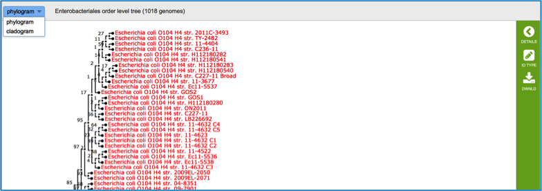

### Genome Browser
1. Clicking on the Genome Browser tab will show the annotations on the JBrowse viewer [2]. Private genomes will only show the PATRIC annotation, but public genomes will also have RefSeq annotation available for comparison.  Researchers can move along the contigs and zoom in and out of the annotation (red box), even to the level of seeing the nucleotide sequence with 6-frame translations.

2. If the genome is in multiple contigs, the browser will load the first contig. To explore different contigs, click on the down arrow (red arrow) that will open up a list of the available contigs. Scroll down that list to choose the contig of interest, and clicking on the name will reload the browser with that information.
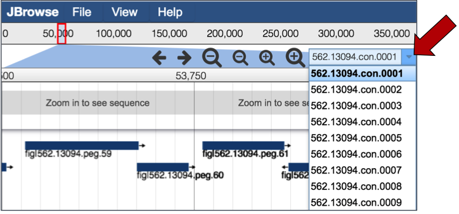

3. Researchers can also upload other tracts, like RNA-Seq, to the genome browser to compare the annotations with expression data. Clicking on the File tab, and then Open underneath that (red arrow) will open a pop-up window where different files can be selected for display.

###	Circular Viewer
1. PATRIC also provides a circular view of the genome and annotations. All contigs are united into a single circle.  Researchers can change the tracks they want to see by using the filter on the left-hand side, and also upload custom tracks and personal data. Users can upload custom tracks or their own data, resize the image, and download it as a publication quality scaled vector graphic (svg). Mousing over genes in the circular view will generate a pop-up box that shows the location and functional description of the gene.
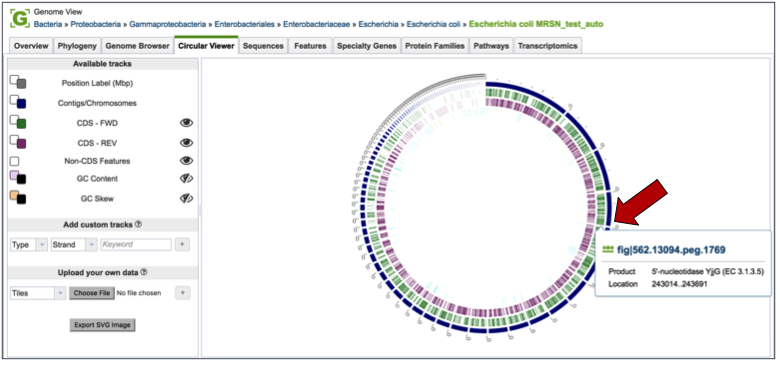

2.  Double clicking on a particular gene will open up additional information about that gene.
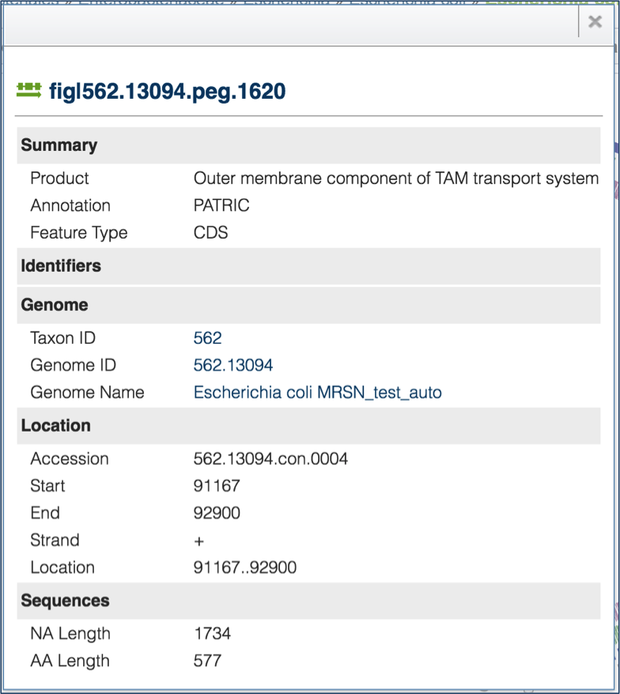

### Sequences
1. Clicking on the Sequences tab will show a list of all the contigs, their ID, length, %GC Content, they sequence type, topology and the description. Clicking on the check box in front of a single sequence (red arrow) will display information about the particular sequence at the far right, and will also populate the vertical green bar with possible downstream actions that apply to the selected sequence.  

### Features
1. Clicking on the Features tab will show a list of all the genes in the genomes. Clicking on the check box in front of a single sequence will display information about the particular sequence at the far right, and will also populate the vertical green bar with possible downstream actions that apply to the selected gene.
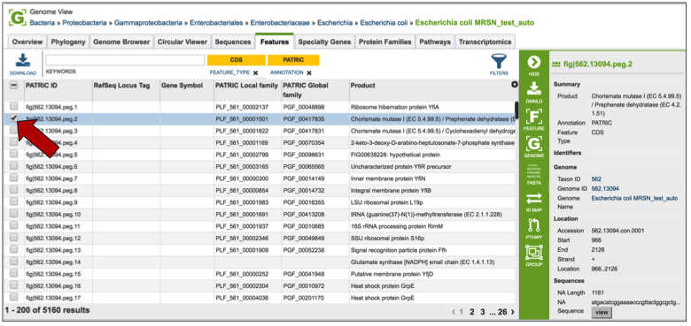

2. Mousing over the icons in the vertical green bar will generate a pop-up box that describes the downstream application.

3. Clicking on the filter above the table allows researchers to select different types of annotations, like the coding sequences (CDS), tRNA or rRNA genes.  When public genomes are examined, researchers can also filter on RefSeq or PATRIC annotations.
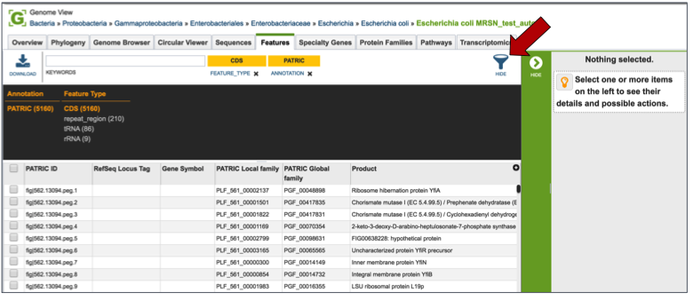

4. Entering a specific keyword into the filter, and hitting return, will resort the table to show all the genes that have text matching that keyword.
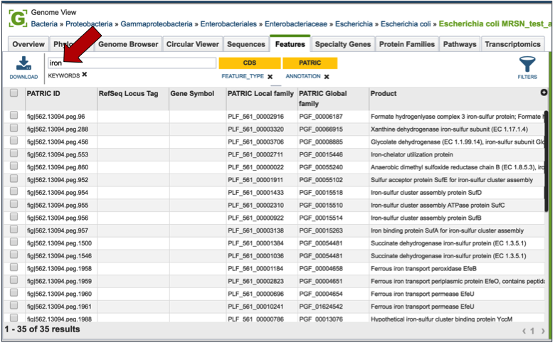

### Specialty Genes
1. Clicking on the Features tab will show a list of all the genes in the genome. PATRIC BLASTs all the genes in the genome against specific databases that contain genes identified as virulence factors (from the Virulence Factor Database [3,4], PATRIC virulence factors [5], and Victors, which is part of the Phidias database [5], which are involved in antibiotic resistance (the Antibiotic Resistance Database[6] and the Comprehensive Antibiotic Resistance Database[7]), and have been used as drug targets, or are human homologs. The left side of this page contains a filter to narrow the results, and a table listing the results on the right.
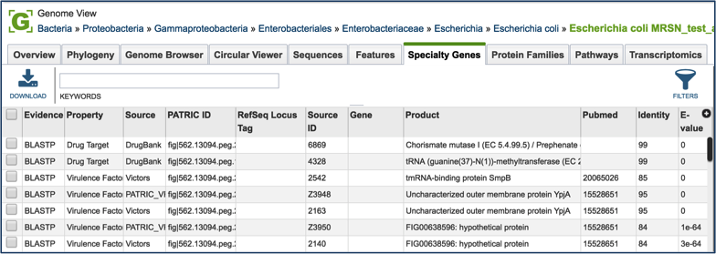

1. Clicking on the check box in front of a single sequence will display information about the particular sequence at the far right, and will also populate the vertical green bar with possible downstream actions that apply to the selected gene.
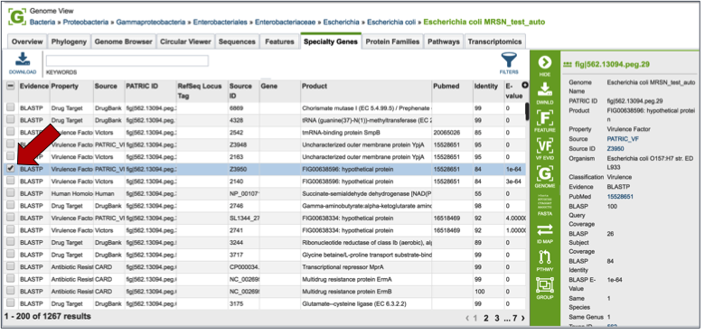

2. Clicking on the filter above the table (red arrow) allows researchers to filter on the type of Evidence (private genomes will all have BLASTP as evidence), the Property (i.e. Homology to known virulence factors, drug targets, antibiotic resistance genes, or human homologs), and the source of the information (the database that the genes in the genome were BLASTed against).

3. Direct evidence that original gene, which is linked to the gene in the selection by homology, can be seen by selecting that gene by clicking the check box in front of the name. This will populate the area beyond the green bar with all the information about that gene, and when available this will include a PubMed ID. This ID is a hyperlink. Clicking on the PubMed link will open up a new page that shows the paper(s) that are the base of that evidence.

###  Protein Families
1. Clicking on the Protein Families tab will show a list of all the protein families in the genome.  There is a filter on the left and a table on the right that lists the protein families, their IDs, Product Description, and statistics on the amino acids contained across your selection on the right. For individual genomes, these statistics will be limited.

2. To find specific protein families, enter a name that might describe a specific function of interest into the filter box on the left (red arrow) and then click the filter button (blue arrow). This will filter the results to show the protein families that match the search (red box).  
 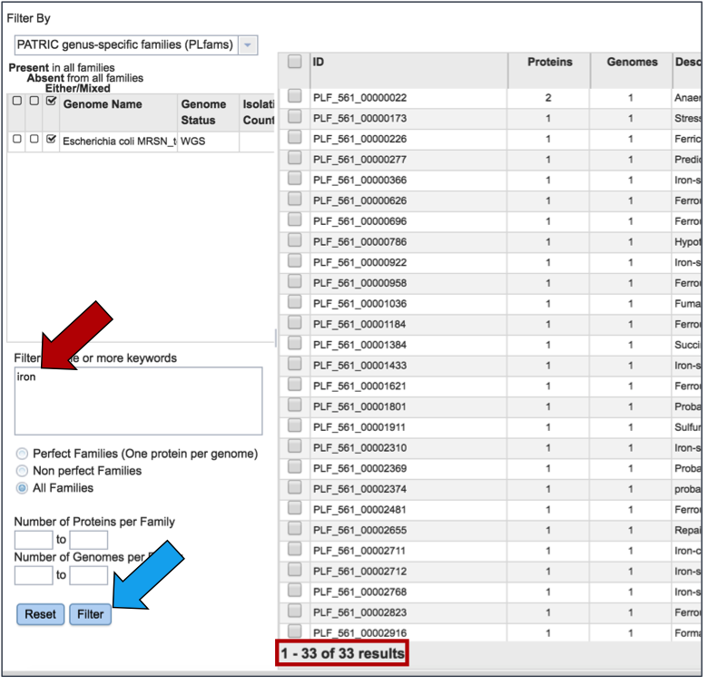

3. Clicking on the check box in front of a single family (red arrow) will display information about the particular family at the far right, and will also populate the vertical green bar with possible downstream actions that apply to the selected family.
 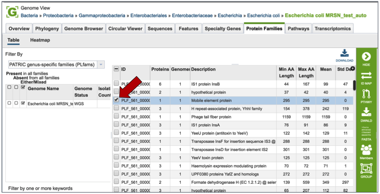

4. Mousing over the icons in the vertical green bar will generate a pop-up box that describes the downstream application.
 

5. PATRIC has three types of protein families. FIGFams [9] contain isofunctional homologs.  Two new sets of protein families, called PATtyFams [10], are assembled from the function-based groups into families by use of k-mers and a Markov Cluster algorithm (MCL) [11, 12]. To select different protein families associated with the genome, click on the down arrow that follow the text box under Filter By.  A drop-down box will appear where researchers can select the family type.  

### Pathways
1. PATRIC maps genes with functional evidence to the pathways they belong to. The source of pathway information comes from the Kyoto Encyclopedia of Genes and Genomes (KEGG) [13, 14], to which PATRIC maps protein data to.   
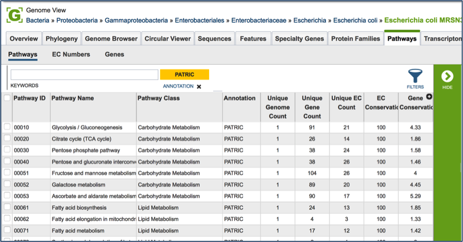

2. Clicking on the check box in front of a single pathway (red arrow) will display information about the particular pathway at the far right, and will also populate the vertical green bar with possible downstream actions that apply to the selected family.

3. Mousing over the icons in the vertical green bar will generate a pop-up box that describes the downstream application. Clicking on the Pathway Map will open a new tab that shows all the genes in that particular genome that have a role in the selected pathway. The page shows a list of the EC Numbers on the left side, and the KEGG pathway map on the right. Green boxes correspond to the EC numbers on the left side of the page (those genes that are actually annotated in the genome).  White boxes indicate EC numbers that are not present in this genome

## References

1. Davis JJ, Boisvert S, Brettin T, Kenyon RW, Mao C, Olson R, Overbeek R, Santerre J, Shukla M, Wattam AR, Will R, Xia F, Stevens R. 2016. Antimicrobial Resistance Prediction in PATRIC and RAST. Sci Rep. 6:27930.
2. Skinner, M.E., et al., JBrowse: a next-generation genome browser. Genome Res, 2009. 19(9): p. 1630-8.
3. Chen, L., et al., VFDB: a reference database for bacterial virulence factors. Nucleic acids research, 2005. 33(suppl 1): p. D325-D328.
4. Chen, L., et al., VFDB 2016: hierarchical and refined dataset for big data analysis-10 years on. Nucleic Acids Res, 2016. 44(D1): p. D694-7.
5. Mao, C., et al., Curation, integration and visualization of bacterial virulence factors in PATRIC. Bioinformatics, 2015. 31(2): p. 252-258.
6. Xiang, Z., Y. Tian, and Y. He, PHIDIAS: a pathogen-host interaction data integration and analysis system. Genome Biol, 2007. 8(7): p. R150.
7. Liu, B. and M. Pop, ARDB—antibiotic resistance genes database. Nucleic acids research, 2009. 37(suppl 1): p. D443-D447.
8. McArthur, A.G., et al., The comprehensive antibiotic resistance database. Antimicrobial agents and chemotherapy, 2013. 57(7): p. 3348-3357.
9. Meyer, F., R. Overbeek, and A. Rodriguez, FIGfams: yet another set of protein families. Nucleic acids research, 2009. 37(20): p. 6643-6654.
10. Davis, J.J., et al., PATtyFams: Protein Families for the Microbial Genomes in the PATRIC Database. Front Microbiol, 2016. 7: p. 118.
11. Enright, A.J., S. Van Dongen, and C.A. Ouzounis, An efficient algorithm for large-scale detection of protein families. Nucleic acids research, 2002. 30(7): p. 1575-1584.
12.	van Dongen, S.M., Graph Clustering by Flow Simulation. 2001, iversity of Utrecht: Utrecht.
13.	Kanehisa, M., et al., KEGG for linking genomes to life and the environment. Nucleic acids research, 2008. 36(suppl 1): p. D480-D484.
14.	Kanehisa, M., et al., The KEGG resource for deciphering the genome. Nucleic acids research, 2004. 32(suppl 1): p. D277-D280.
