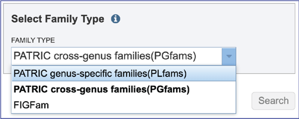
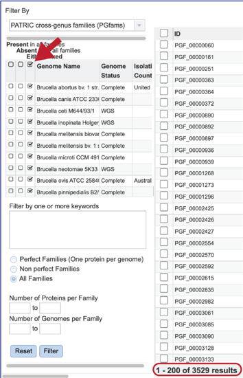
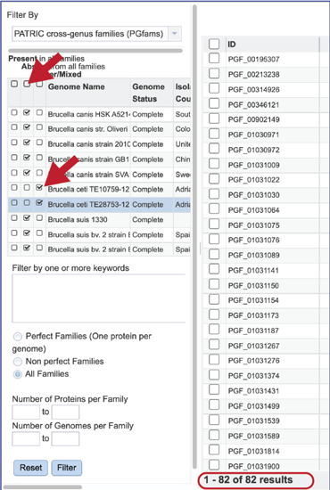
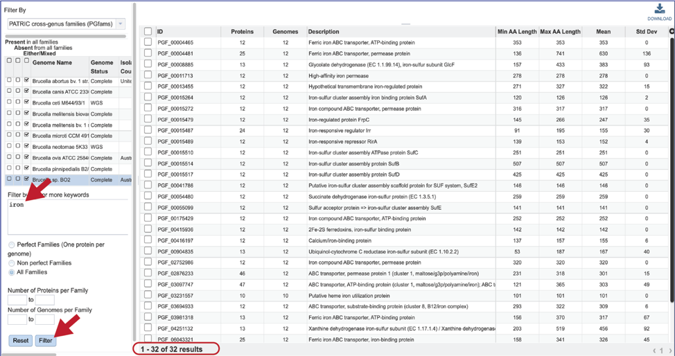
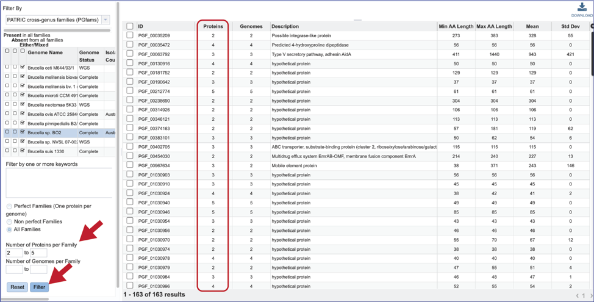
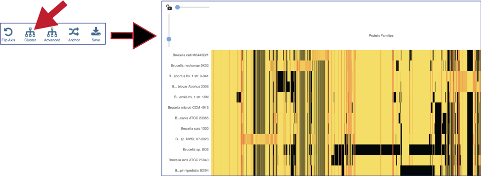
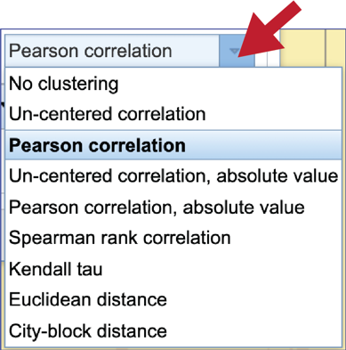
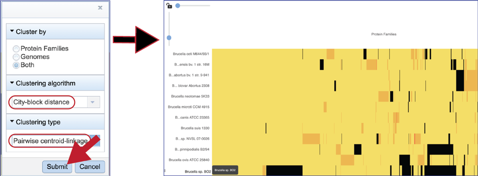
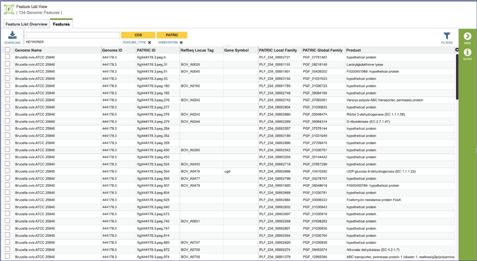

# Protein Family Sorter Tool

The Protein Family Sorter tool enables researchers to examine the distribution of specific protein families across different genomes.  The tool uses PATtyFams[1], the protein families that are assigned in the BV-BRC annotation process.  There are two types of PATtyFams.  The global families, known as **PGFams**, can be used for cross genus comparisons.  The local families (**PLFams**) are for intra-genus comparisons.

## Locating the Protein Family Sorter App

1.	At the top of any BV-BRC page, find the Services tab and click on Protein Family Sorter. 

2.	This will open up the Protein family Sorter landing page. 

## Selecting Genomes

1.	To include any genome (reference, representative, other public, or private genomes), click on the filter button to narrow the selection and deselect the categories that are not of interest. 

2.	Typing in the text box will show a list of the genomes available that contain that text. Private genomes are indicated by a **Lock** icon. Once the genome of interest is located, clicking on it will fill the box. 

3.	The genome must be added to the genomes for comparison, a box in the Selected Genomes box. Click on the arrow at the upper right of the Select Genome box (and the name of the genome will appear in the Selected Genomes box. 

## Selecting Genome Groups

1.	To select a genome group, go to the Select Genome Group box and click on the down arrow that follows the text box. That will show a list of all the genome groups, with the most recently created appearing at the top of the list. 

2.	Entering a name (or part of a name) in the text box will populate the drop-down box with possible groups that match that text. 

3.	Clicking on the genome group of interest will make the name appear in the text box. 

4.	The genome group must be added to the genomes for comparison, a box in the **Select Genomes** box. Click on the arrow at the upper right of the **Select Genome** box and the name of the genome will appear in the box. This can be repeated until all the genome groups or genomes of interest, have been added to the Selected Genomes box. 

## Selecting Protein Family Type

1.	BV-BRC offers three types of protein families. The default, PGFams, are protein families that cross the genus boundary. PLFams are protein families across a genus. FigFams[2] are an older protein family that is not updated, where the protein families are united by function. Clicking on the down arrow at the end of the text box under Family Type will show the two types of protein families. Clicking on one will select it for the analysis.

## Submitting the Protein Family Sorter job

1.	Once the genomes, genome groups, and type of protein families are selected, the job will be initiated by clicking the submit button. The selected data will begin loading. 

2.	This will rewrite the page, which may take some time to load depending upon the number and size of the selected genomes. 

## Filtering the Protein Family Table

1.	The page will reload to show the Protein Family Table view.  This contains a dynamic filter on the left, and a table on the right that shows all the families based on the selections of the filter. 

2.	The Protein Family Sorter loads showing all the protein families across all the genomes. This is the **Pan Genome**. 

3.	The Core Genome can be seen by clicking on the box in the column head below Present in all families. This will select all the genomes in the list and will reload the table to show all the protein families that are in that selection. 

4.	The **Accessory Genome** for a species can be seen by first clicking on the box in the column head below **Absent** in all families and then clicking on the text box in the **Either/Mixed** column in front of each genome of interest. This will select all the genomes in the list and will reload the table to show all the protein families that are in that selection. 

5.	The **Accessory Genome** for a single genome can be seen by first clicking on the box in the column head below Absent in all families and then clicking on the text box in the Present column in front of the genome of interest. This will select all the genomes in the list and will reload the table to show all the protein families that are in that selection.

