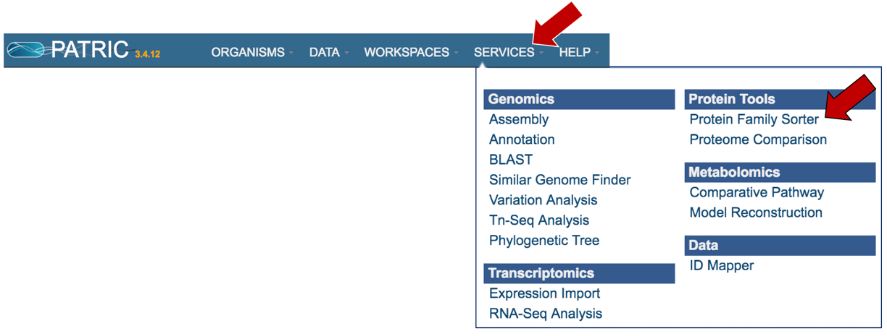
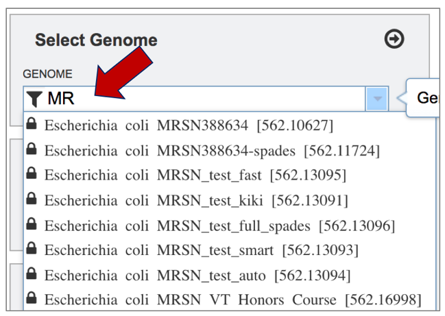
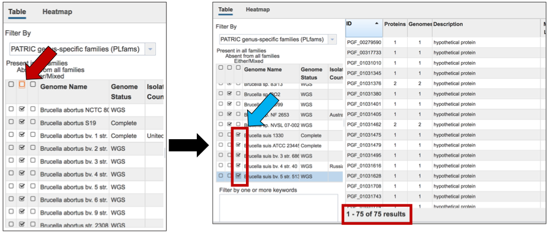
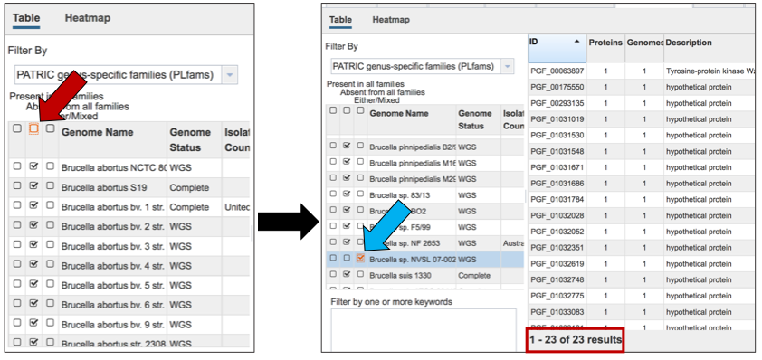
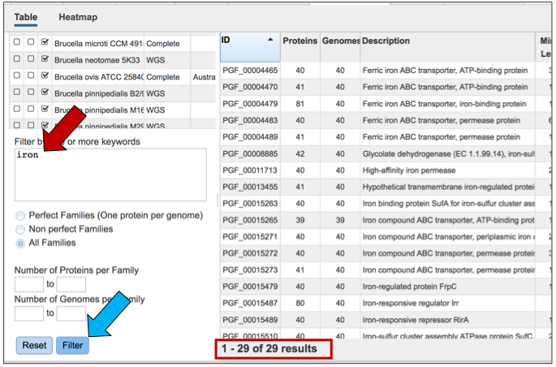
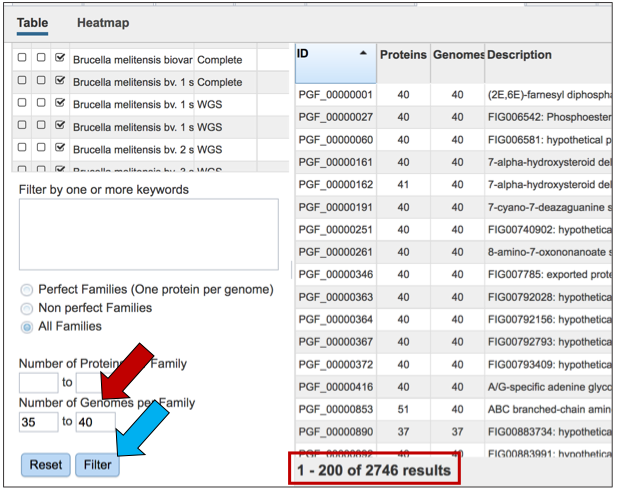
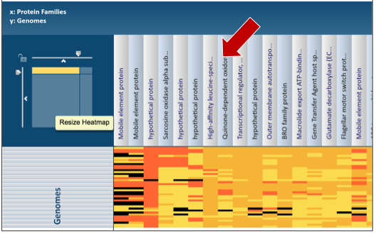

# Comparing Protein Families across individual genomes and genome groups

## I.  Locating the Protein Family Sorter tool.
1. At the top of any PATRIC page, find the Services tab. Click on Genome Groups.

2. This will open the landing page for the Protein Family Sorter tool.

## II. Selecting Individual Genomes
1. To include any genome (reference, representative, other public, or private genomes), click on the filter button to narrow the selection and deselect the categories that are not of interest. 

2. Typing in the text box will show a list of the genomes available that contain that text.  Private genomes are indicated by a Lock symbol.  Once the genome of interest is located, clicking on it will fill the box.

3. The genome must be added to the genomes for comparison, a box in the Selected Genomes box. Click on the arrow at the upper right of the Select Genome box (and the name of the genome will appear in the Selected Genomes box.

## III. Selecting Genome Groups
1. To select a genome group, go to the Select Genome Group box and click on the down arrow that follows the text box (red arrow).  That will show a list of all the genome groups, with the most recently created appearing at the top of the list.

2. Clicking on the genome group of interest (red arrow) will make the name appear in the text box.

3. The genome group must be added to the genomes for comparison, a box in the Selected Genomes box. Click on the arrow at the upper right of the Select Genome box (red arrow) and the name of the genome will appear in the Selected genomes box.

4. This can be repeated until all the genome groups or genomes of interest, have been added to the Selected Genomes box.

## IV. Selecting a Protein Family for Comparison.
1. PATRIC offers three types of protein families.  Two of the protein families (PGFams and PLFams) have been recently described[1].  The default, PGFams, are protein families that cross the genus boundary.  PLFams are protein families across a genus.  The third, FIGFams[2], are sets of isofunctional homologues.  Clicking on the down arrow a the end of the text box under Family Type will show the three type of protein families.  Clicking on one will select it for the analysis.

## V. Submitting the Protein Family Sorter job.
1. Once the genomes, genome groups, and type of protein families are selected, the job will be initiated by clicking the submit button.  The selected data will begin loading.

2. Once loaded, a page with a filter on the right, and a table on the left a table showing all the families.

## VI. Protein Family Sorter – Pan, Core and Accessory Genome
1. The Protein Family Sorter loads showing all the protein families across all the genomes.  This is the **Pan Genome**.

    

2. The **Core Genome** can be seen by clicking on the box in the column head below Present in all families.  This will select all the genomes in the list, and will reload the table to show all the protein families that are in that selection.

3. The **Accessory Genome** for a species can be seen by first clicking on the box in the column head below Absent in all families (red arrow) and then clicking on the text box in the Either/Mixed column in front of each genome of interest (blue arrow).  This will select all the genomes in the list, and will reload the table to show all the protein families that are in that selection.

4. The **Accessory Genome** for a single genome can be seen by first clicking on the box in the column head below Absent in all families (red arrow) and then clicking on the text box in the Either/Mixed column in front of the genome of interest (blue arrow).  This will select all the genomes in the list, and will reload the table to show all the protein families that are in that selection.

## VII. Protein Family Sorter – Text filter
1. The text filter box can be used to find protein families that contain specific names.  Enter a name of interest (red arrow) and click the filter button (blue arrow).  This will re-filter the table to show the protein families that contain that text in the functional description.

2. Other available filters allow users to filter the protein families to show the number of proteins per family, which can be a range or a single value.

3. Users can also filter on the number of genomes found in each family.

## VIII. Protein Family Sorter – Loading the Heatmap
1. The presence and/or absence of protein families can also be seen in a heatmap view.  To see the heatmap, click on the Heatmap icon above the filter (red arrow).  This will reload the page to show the heatmap.

## IX. Protein Family Sorter – Heatmap – Anchoring a genome
1. The protein family sorter allows users to see the protein families in the order that they appear in any given genome.  This process is called anchoring a genome.  To re-order the protein families, click on the Anchor icon that can be seen at the upper right above the heatmap (red arrow).  This will open a box, where, if clicking on the down arrow, the list of all the genomes in the heatmap will appear.  Click on the genome of interest (blue arrow). 

2. The protein families in the heatmap will be reloaded to show the presence and absence of protein families across all the genomes, in the order that the genes occur in the genome that was selected as the anchor.

## X. Protein Family Sorter – Heatmap – Downloading information by Column
1. The names of genes and genomes, locus tags, functional description and other information can be downloaded directly from the heatmap.  To select and see all the genes from an individual column, click on any column head of interest where the name of the protein family is displayed (red arrow).

    

2. This will open a pop-up box that allows users to download the heatmap data, download the proteins, show the protein, or add the proteins to a group in the workspace.  To see the proteins in the column, click on the Show Proteins button (red arrow).

3. This will open a new tab that shows the list of proteins.

4. All the proteins in the list can be selected by clicking the box in the column head to the left of Genome Name (red arrow).  This will select all the proteins in the table.

5. Once any, or all features are selected, the vertical green bar will show all the tools or processes that can be used on these proteins.  These include download the group, creating a feature group, creating a genome group, getting the protein or nucleotide FASTA sequences, creating a multiple sequence alignment, finding other identifiers that map to the proteins in that selection, see if any of them are in a pathway, or group them all together.

    

## XI. Protein Family Sorter – Heatmap – Downloading information by Selection
1. The names of genes and genomes, locus tags, functional description and other information can be downloaded directly from the heatmap.  To select a group of proteins from the heatmap directly, use the mouse to draw an icon over the proteins of interest.  As you mouse over a region, you will see a yellow box begin to form.

2. This will open a pop-up box that allows users to download the heatmap data, download the proteins, show the protein, or add the proteins to a group in the workspace.  To see the proteins in the column, click on the Show Proteins button (red arrow).

3. This will open a new tab that shows the list of proteins.

4. All the proteins in the list can be selected by clicking the box in the column head to the left of Genome Name (red arrow).  This will select all the proteins in the table.

5. Once any, or all features are selected, the vertical green bar will show all the tools or processes that can be used on these proteins.  These include download the group, creating a feature group, creating a genome group, getting the protein or nucleotide FASTA sequences, creating a multiple sequence alignment, finding other identifiers that map to the proteins in that selection, see if any of them are in a pathway, or group them all together.

    

## References
1. Davis, J.J., et al., PATtyFams: Protein Families for the Microbial Genomes in the PATRIC Database. Front Microbiol, 2016. 7: p. 118.
2. Meyer, F., R. Overbeek, and A. Rodriguez, FIGfams: yet another set of protein families. Nucleic acids research, 2009. 37(20): p. 6643-6654.