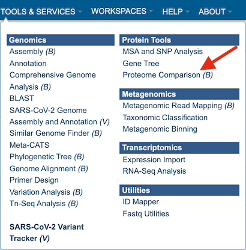
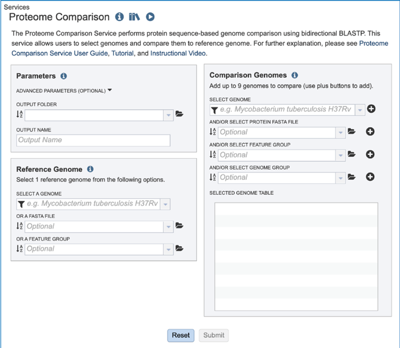
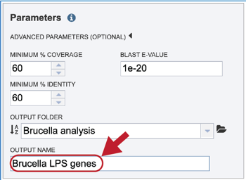
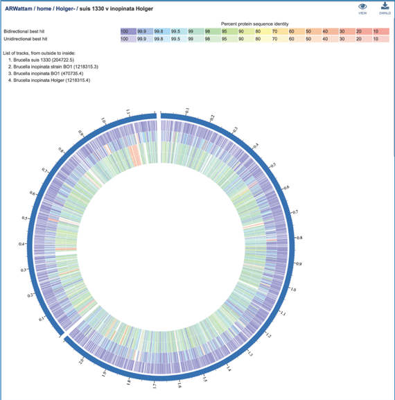
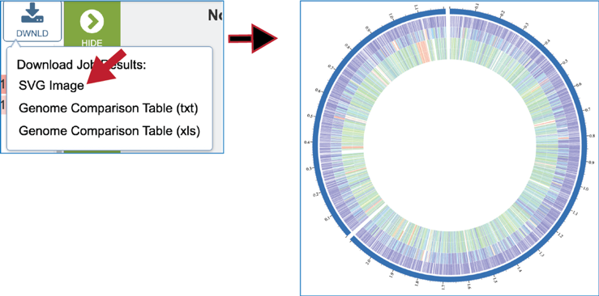
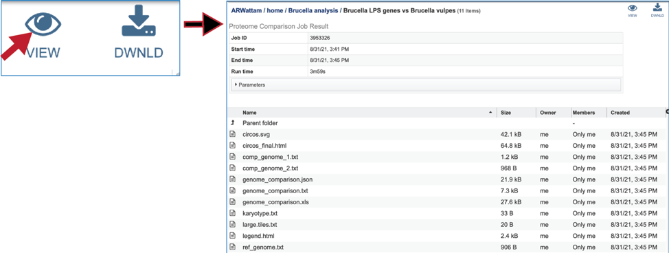
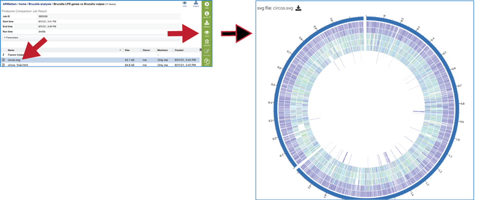
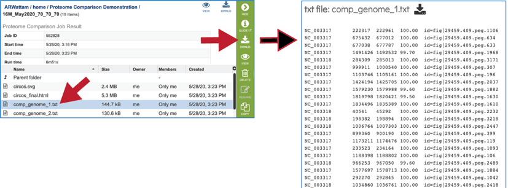

# Proteome Comparison Service

*Revised: 11/1/2021*

The BV-BRC’s Proteome Comparison service can be used to readily identify insertions and deletions in up to nine target genomes that are compared with one reference, which can be a researcher’s private genome in BV-BRC, a genome that has been annotated outside, any of the publicly available genomes in BV-BRC, or a set of proteins that have been saved as a Feature Group in BV-BRC.

The Proteome Comparison service is based on the original Sequence-based Comparison tool that was part of RAST[1]. This tool colors each gene based on protein similarity using BLASTP[2] and marks each gene as either unique, a unidirectional best hit or a bidirectional best hit when compared to the reference genome. The output includes a whole-genome schematic that is colored based on BLAST. A table that details all the results can be downloaded for further analysis, as can a scalable vector graphic (svg) diagram of the results that is publication quality.

## Creating a folder to hold the Proteome Comparison job and related data

Please refer to the [Genome Assembly Service tutorial](/tutorial/genome_assembly/assembly) for instructions on creating a folder in the workspace.

## Locating the Proteome Comparison App

1.	At the top of any BV-BRC page, find the Services tab and click on Proteome Comparison. 

2.	This will open up the Proteome Comparison landing page. 

## Setting Parameters

1.	The default parameters for BLASTP in the Proteome Comparison tool are a minimum coverage of 30%, a minimum identity of 10% and a BLAST E-value of 1e-5.  To see the parameters that can be adjusted, click on the down arrow that follows **Advanced Parameters (Optional)**.  This will open a pop-up window where the coverage, identity and E-value can be adjusted. 

2.	A folder must be selected for the job. To see recently created folders, click on the arrow at the end of the text box underneath **Output Folder**. This will open a drop-down box that shows the folders that you have created, starting with the most recent and continuing in that order. 

3.	Links to instructions on creating a new folder are available at the top of this tutorial, but if a folder has already been created, entering the name in the text box will filter the drop-down box to show the possible folders that match that input. 

4.	Clicking on the **Folder** icon at the end of the text box will open a pop-up window that shows all the files in the workspace, which can be selected. 

5.	Provide a distinctive name for the proteome comparison in the text box underneath the words **Output Name**. 

## Selecting a Reference

1.	The Proteome Comparison tools allows researchers to select genomes or a specific feature group that contains a set of proteins to serve as a reference that other genomes will be BLASTed against.  The search can be narrowed by clicking on the filter icon at the beginning of the text box.  This will show checkboxes that can narrow the search to reference, representative, all public, or private genomes (My Genomes). 

2.	If the name or genome ID is known, typing that in the text box will filter results in the drop-down box to show the possible genomes that match the input. Clicking on the row that contains the correct genome will fill the box underneath **Select A Genome**. 

3.	The reference data can be a fasta file with protein sequences.  If that file has not been uploaded into the BV-BRC workspace, they will need to be uploaded.  Click on the folder icon that follows the text box underneath **Or A FASTA File** will open a pop-up window that shows the workspace.  Navigate to the destination folder for the file, and when located, click on the row that contains it. 

4.	This will show the contents of the selected folder.  To upload a fasta file to this location, click on the upload icon in the upper right corner.  This will open yet another pop-up window that handles the upload of files.  Note that the type of file is **Feature Protein FASTA**. Click on the blue **Select File** bar in the middle of the page.  This will open a dialog box with your computer.  Fasta documents will be in bold text and available for upload. 

5.	Click on the row with the desired file and then click on the **Open** button at the lower right. This will initiate the upload process into the workspace location, and the dialog box with your computer will close.  The name of the desired file will appear in the pop-up window. Click on the **Start Upload** button in the lower right.  When the upload has completed, the name of the file will appear in the text box below **Or A FASTA File**. 

6.	Feature groups can also be used as reference data.  To see recently created groups, click on the down arrow at the end of the text box underneath **Or A Feature Group**. This will open a drop-down box that shows the most recently created groups.  Clicking on that group will autofill the text box with the name of the group.  

## Selecting Comparison Data

1.	Up to nine files can be compared to a reference genome in the bidirectional BLAST analysis.  Genomes can be added individually.  Finding a genome of interest is the same as discussed earlier for reference genomes (enter name or genome ID, use drop-down, go to workspace).  Entering the name of a particular genome in the text box underneath **Select Genome** will open the drop-down box below where the name can be clicked.  This will fill the text box with the name of the selected genome.  Click on the + icon at the end of the text box. This will move the genome into the **Selected Genome Table**. 

2.	The comparison data can be a fasta file with protein sequences.  If the file is in the BV-BRC workspace, click on the folder icon at the end of the text box underneath **And/Or Select Protein FASTA File**.  This will open a dialog box where the file can be uploaded or located in the workspace. Once selected, the name will appear in the text box. Click on the + icon at the end of the text box. This will move the genome into the **Selected Genome Table**. 

3.	Feature groups can also be used as comparison data.  To see recently created groups, click on the down arrow at the end of the text box underneath **And/Or Select Feature Group**. This will open a drop-down box that shows the most recently created groups.  Clicking on that group will autofill the text box with the name of the group.  Click on the + icon at the end of the text box. This will move the genome into the **Selected Genome Table**. 

4.	Genome groups can also be used as comparison data.  To see recently created groups, click on the down arrow at the end of the text box underneath **And/Or Select Genome Group**. This will open a drop-down box that shows the most recently created groups.  Clicking on that group will autofill the text box with the name of the group.  Click on the + icon at the end of the text box. This will move the genome into the **Selected Genome Table**. 

## Submitting Proteome Comparison job

1.	Once the parameters, the reference and comparison data have been selected, the **Submit** button at the bottom of the page will turn blue.  Clicking on it will submit the job. 

2.	A message will appear that confirms that the job has been submitted. 

## Monitoring progress on the Jobs page

1.	Click on the Jobs box at the bottom right of any BV-BRC page. 

2.	This will open the Jobs Landing page where the status of submitted jobs is displayed. 

## Viewing the Proteome Comparison job results

1.	To view a particular job, click on a row to select it. Once selected, the downstream processes available for the selection appear in the vertical green bar.  Clicking on the **View** icon will open the Proteome Comparison job summary.

2.	This will rewrite the page to show the information about the Proteome Comparison job, and all of the files that are produced when the pipeline runs.  

3.	The information about the job submission can be seen in the table at the top of the results page.  To see all the parameters that were selected when the job was submitted, click on the **Parameters** row.  

4.	This will show the information on what was selected when the job was originally submitted. 

5.	One of the best ways to view the Proteome Comparison job is to click on the **View** icon at the upper right of the job landing page. 

6.	This will rewrite the page to show the plot of the bi-directional BLAST hits, the order of the data in the image, and a legend that shows the strength of the BLAST hits (blue is strongest, red is weakest). The entire image can be viewed by scrolling down.  The circular diagram is generated by Circos[3], 

7.	To download either the image or the underlying data, click on the **Download** icon at the upper right. 

8.	A Scalable Vector Graphics (**.svg**) file, an XML based two-dimensional graphic file format, is also produced by the Proteome Comparison pipeline. It is a publication quality image that can be downloaded by clicking on **SVG Image**. 

9.	A text file that shows the results of the BLAST comparison is also available for download. To download the file, click on **Genome Comparison Table (txt)**. 

10. The Excel version of the **Genome Comparison Table (xls)** is perhaps the best way to view this data, as it even matches the color showing the strength of the BLASTP hits. 

11.	The document contains information that includes all the genes in the reference data (genomes or fasta file) and the genes in the comparison data that have the best BLASTP hits to that reference. The first row will show the names of the data files in specific columns, and the column heading in the second row show the additional information. Data begins with the data that was used as a reference (Row 2, Columns A-J) and includes the following:
    * Column A – Accession number for the contig in the reference genome 
    * Column B – The order number of this gene in the genome
    * Column C – Size in amino acids
    * Column D – BV-BRC locus tag
    * Column E – RefSeq locus tag (if available)
    * Column F – Gene name
    * Column G – Functional annotation
    * Column H – Start location for the gene on the contig
    * Column I – End of the gene on the contig
    * Column J – Strand that the gene is located on

12. This is followed by information on the comparison data (genomes or fasta file). This data in columns K-T for row 2 (for the first comparison genome) include:
    * Column K – Data on the type of BLAST hit (bi- or uni-directional or missing).  Cells in this column will be colored to match the strength of the BLAST hit as seen in the circular diagram.
    * Column L - Contig that contains the gene.
    * Column M - The order number of this gene in the genome or data file.
    * Column N - Size of the protein in amino acids
    * Column O – BV-BRC locus tag
    * Column P - RefSeq locus tag (if available)
    * Column Q - Gene name
    * Column R - Functional description
    * Column S - Percent identity of the BLAST hit
    * Column T - Sequence coverage compared to the reference This pattern is repeated for all comparison genomes. 

13. Clicking on the **View** icon will reload the job landing page. 

14. The **SVG** image can be viewed or downloaded from the job landing page. 

15. An **html** version of the completed job is also available for view or download. 

16.	The **comp_genome.txt** files show the contig that the reference gene is on, the start and stop positions of that gene, the percent identity to the gene in the comparison genome, and the gene ID of that gene in the comparison genome. These files are available for view or download. 

17. A **JSON** file is a file that stores simple data structures and objects in JavaScript Object Notation (JSON) format, which is a standard data interchange format. It is primarily used for transmitting data between a web application and a server.  While it is not recommended for viewing (it is a computer-readable file), the file is both downloadable and viewable. 

18.	The **genome_comparison.txt** file is also available for download from the job landing page. 

19.	The Excel version of the **Genome Comparison Table (xls)** is also available from the job landing page. 

20.	The **karyotype.txt** file is an intermediate file used by the Circos drawing program. 

21.	The **legend.txt** file is an intermediate file used by the Circos drawing program. 

21.	The **ref_genome.txt** file shows the contig ID, start, stop, and gene ID for each of the genes/proteins in the reference data set.  

## References

1.	Overbeek, R., et al., The SEED and the Rapid Annotation of microbial genomes using Subsystems Technology (RAST). 2013. 42(D1): p. D206-D214.
2.	Boratyn, G.M., et al., BLAST: a more efficient report with usability improvements. Nucleic acids research, 2013. 41(W1): p. W29-W33.
3.	Krzywinski, M., et al., Circos: an information aesthetic for comparative genomics. Genome research, 2009. 19(9): p. 1639-1645.
