# Proteome Comparison

## Comparing Annotated Proteins Across Genomes

PATRIC’s Proteome Comparison tool can be used to readily identify insertions and deletions in up to nine target genomes that are compared with one reference, which can be a researcher’s private genome in PATRIC, a genome that has been annotated outside PATRIC, any of the publicly available genomes in PATRIC, or a set of proteins that you have saved in PATRIC as a feature group.

The Proteome Comparison tool is based on the original Sequence-based Comparison tool that was part of RAST[1].  This tool colors each gene based on protein similarity using BLASTP and marks each gene as either unique, a unidirectional best hit or a bidirectional best hit when compared to the reference genome. The output includes a whole-genome schematic that is colored based on BLAST. A table that details all the results can be downloaded for further analysis, as can a scalable vector graphic (svg) diagram of the results that is publication quality.

### I. Finding The Tool

1. At the top of any PATRIC page, find the Services tab and click on it.
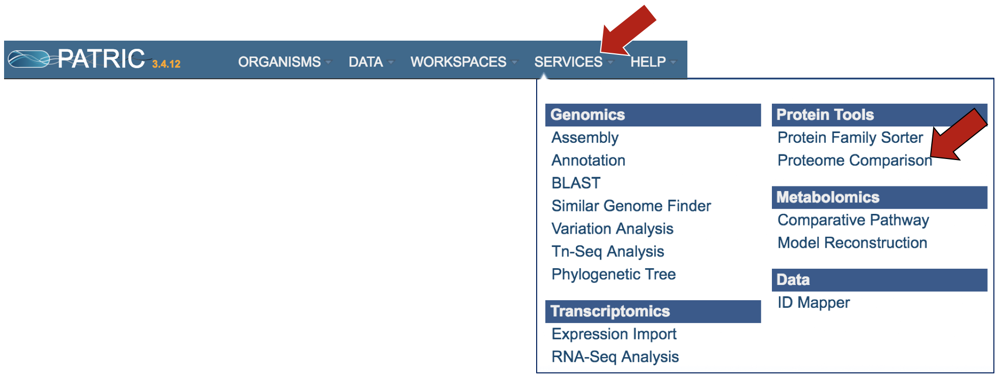

2. Click on Proteome Comparison

3. This will open up the landing page for where you can submit a Proteome Comparison job.  This tool is a best bidirectional BLAST comparison of the annotated proteins from up to nine different genomes.
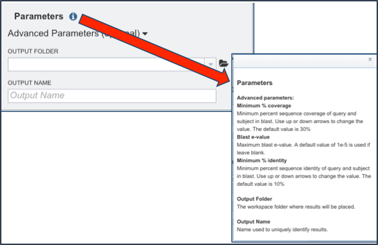

### II. Setting Parameters and Selecting an Output Folder

1.  To see what the advanced parameters are in the proteome comparison, click on the information icon (Blue I as indicated by the Red Arrow).  This opens a pop-up window that describes what can be adjusted.
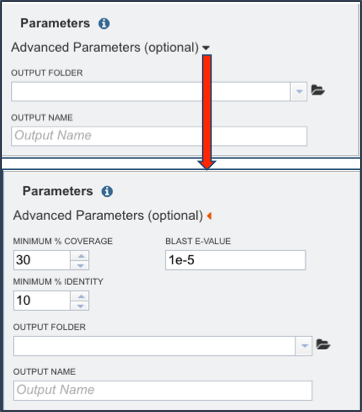

2.  The box to adjust the advanced parameters can be opened by clicking on the down arrow that follows Advanced Parameters (optional) as indicated by the Red Arrow.  Researchers can adjust the minimum percent coverage, the minimum percent identity and the BLAST E-value.
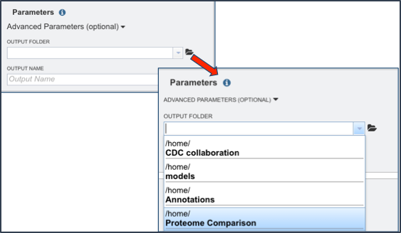

3. Next the researcher must select an output folder where the proteome comparison job will be placed.  To do this, click on the folder icon that follows the text box under the words Output Folder (Red Arrow) and click on preferred folder.

4. Provide a distinctive name for the proteome comparison in the text box underneath the words Output Name.
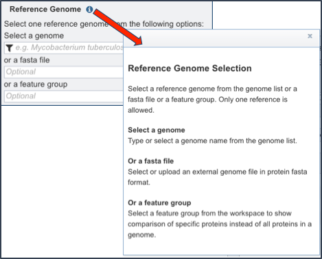

### III. Selecting the Reference Genome

1. The proteome comparison tools allows researchers to select genomes or a specific feature group that contains a set of proteins to serve as a reference that other genomes will be BLASTed against.  To see and understand the available options, click on information icon (Blue I as indicated by the Red Arrow).  This opens a pop-up window that describes the types of selections that can be made.
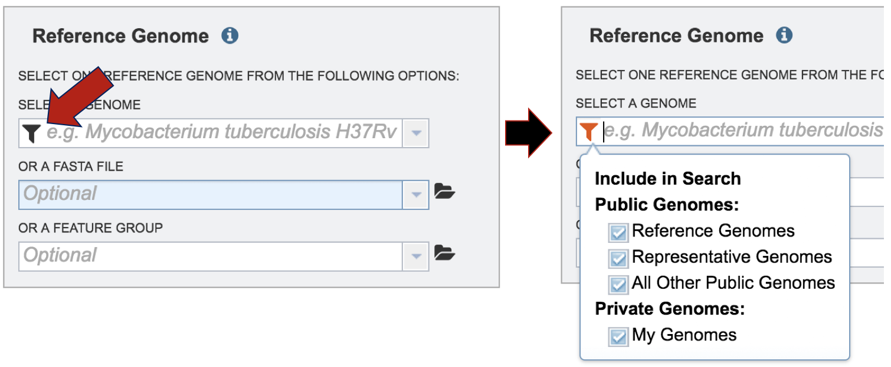

2.  In this example, a private genome is selected.  To do this, first click on the filter icon (Red Arrow under Reference Genome).  This will open a box that allows a researcher to search across all of the public genomes available in PATRIC, or across the genomes that they have annotated and that are stored in their private workspace.

3. Click on the box in front of Public Genomes (Red Arrow) to deselect that box.

4. In the text box below Reference Genome, start typing some words that will identify the reference. Once the user starts typing in the text box, a list appeared below the box, providing the user with possible choices that match the text.  Clicking on a name (Red Arrow) will auto-fill the name in the text box under Reference Genome (lowest panel).
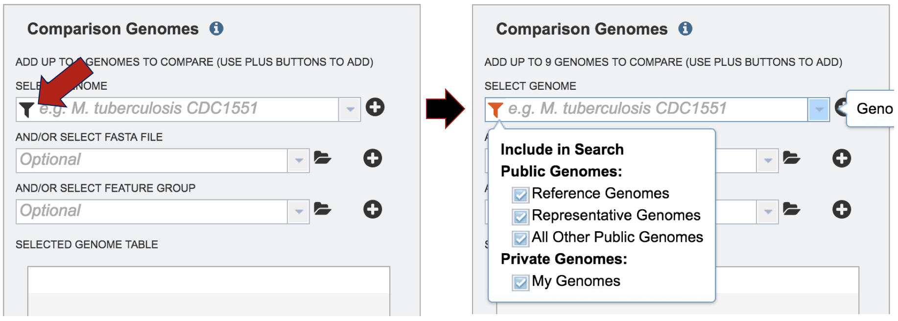

### IV. Selecting the Comparison Genomes
1. Locate the panel for selecting a comparison genomes, or a set of proteins, that will be BLASTed against the selected reference.

2. Comparison genomes can be public or private.  To select genomes that are publicly available, deselect the check box in front of Private Genomes.

3. Start typing a name into the text box.  Once enough text has been entered to see the genome of interest, click on that (Red Arrow 1 in Panel A below).  This will auto-fill the text box with the selected name (Panel B).  If the choice is correct, click the “+” icon (Red arrow 2).  The genome will then appear in the box below (Panel C).
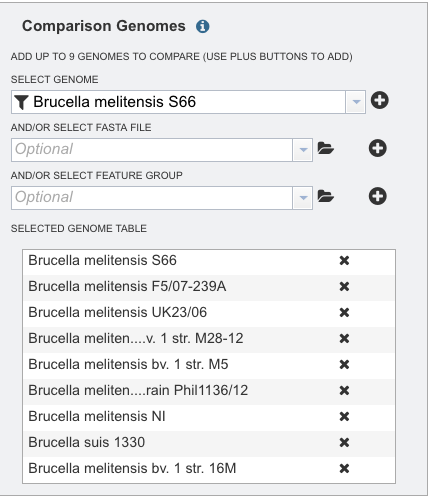

4. To finally selecting the genome, click on the + icon at the end of the text box that has the name of the selected genome (Red Arrow).  Clicking on the icon will move the genome to the Selected Genome table (Blue Arrow).
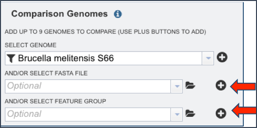

5. Repeat step 3 to add as many genomes (up to 9) to compare to the reference genome you have selected.

6. Genomes that have been annotated by a different service, or a specific group of proteins, can also be used in the comparison.  Those can be included as indicated by the red arrows as seen below.

7.  Once the nine genomes (or feature groups) are included, the Comparison Genome box will show all the members you have selected.
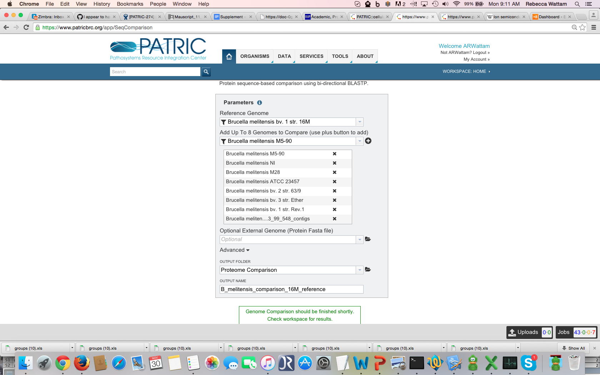

### V. Submitting the Proteome Comparison Job

1. Click the Submit button at the bottom of the page (Red Arrow)

2. A message will appear that confirms that the job has been submitted.  This message is temporal and will disappear after several seconds.

3. To check the status of the annotation job by clicking on the Jobs indicator at the bottom left of the PATRIC page.

4. Clicking on Jobs opens the Jobs Status page, which shows the status of the proteome comparison job.  The statuses of all the previous service jobs that have submitted to PATRIC are also available.

5.  You will be able to see when your job is complete.

### VI. Accessing the Proteome Comparison Job

1.  To access the results of the job, click on Workspace Home that is found at the top left of any PATRIC page.  This will open up the workspace, where all folders are visible.  Find the folder where the comparison job was placed and click on the folder icon that precedes the name (Red arrow 1).

2. This will open a page that shows all the comparisons available in that folder.  Click on the icon in front of the job name  (Red arrow 1).  This opens up the landing page for that job that shows a diagram showing the sequence identity, a list of the names of the genomes in the job, and will also show a circular image that shows the relatedness.  This will take a few seconds to load.
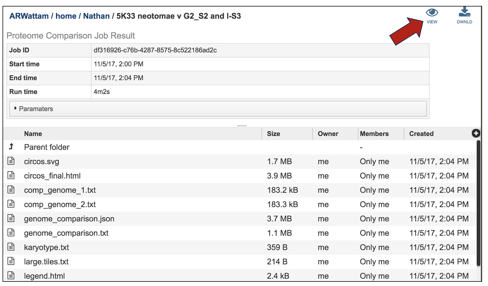

3. To see the entire image, find the download icon at the top of the page on the left and click on SVG image (Red arrow 1).
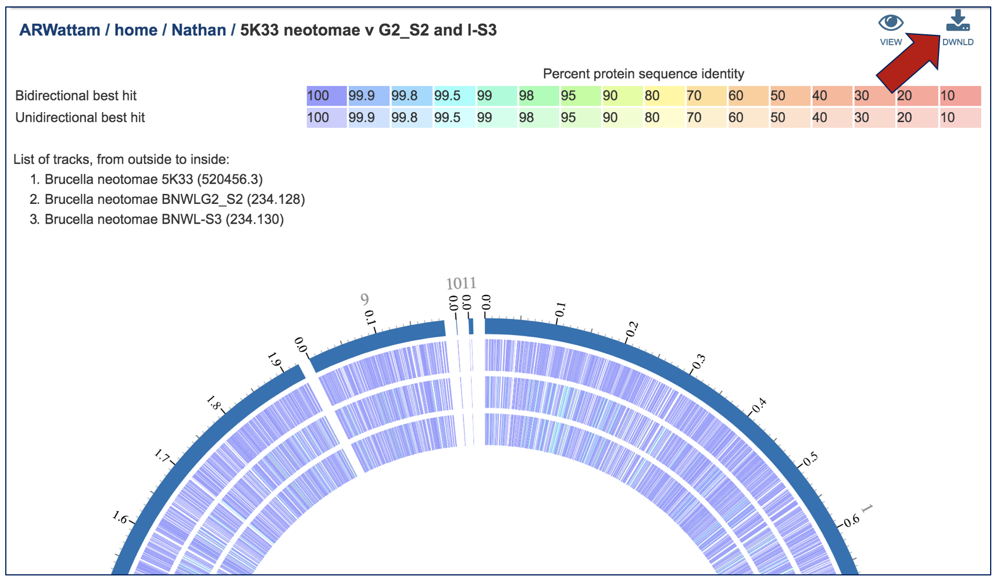

4.  This will download the publication quality SVG image that shows the percent identity across all the proteins in the comparison genomes compared to the reference genome.

5.  To examine the data underneath the visualization, click on Genome Comparison Table (Red arrow 1).
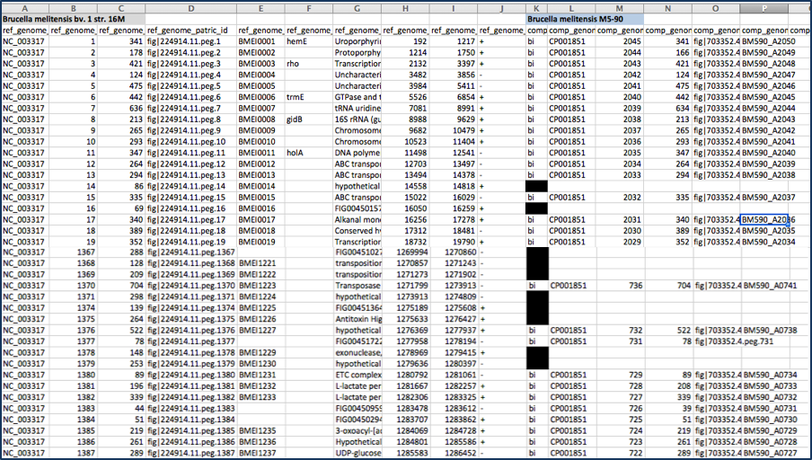

6.  This will open up a text file, that can be opened with excel.  The document contains a lot of information, and users will be able to see all the genes in the comparison genomes that have the best BLAST hits to the reference genome.  The first row will show the genome names in specific columns, and the column heading in the second row show the additional information.  Data begins with the genome that was used as a reference (2A-J) and includes the following: accession number for the contig in the reference genome (Column A); the order number of this gene in the genome (B); size in amino acids (C); PATRIC locus tag (D); RefSeq locus tag (E); gene name (F); functional annotation (G); start location for the gene on the contig (H); end of the gene on the contig (I); and strand that the gene is located on (J). This is followed by information on the comparison genomes.  This data in columns K-T for row 2 (for the first comparison genome) include: data on the type of BLAST hit (Column K, bi- or uni-directional, or missing); contig that the gene is located on (L); the order number of this gene in the genome (M); size in amino acids (N); PATRIC locus tag (O); RefSeq locus tag (P); gene name (Q); functional description (R); percent identity of the BLAST hit (S); and sequence coverage compared to the reference (T).  This pattern is repeated for all comparison genomes.

## References

1.	Overbeek, R., et al., The SEED and the Rapid Annotation of microbial genomes using Subsystems Technology (RAST). Nucleic acids research, 2014. 42(D1): p. D206-D214.

