# RNA-Seq Analysis

***This tutorial is outdated and requires work. It will be updated soon***

## I. Locating the RNA-Seq Service App.
1. At the top of any BV-BRC page, find the Services tab. Click on RNA-Seq Analysis.
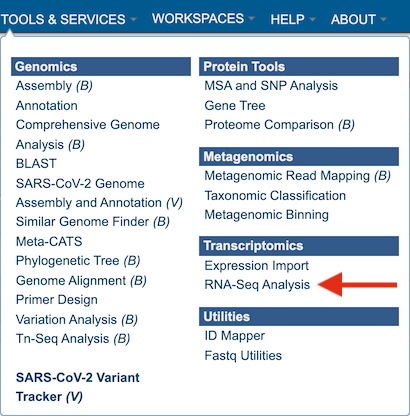

2. This will open up the RNA-Seq landing page where researchers can submit long reads, single or paired read files.
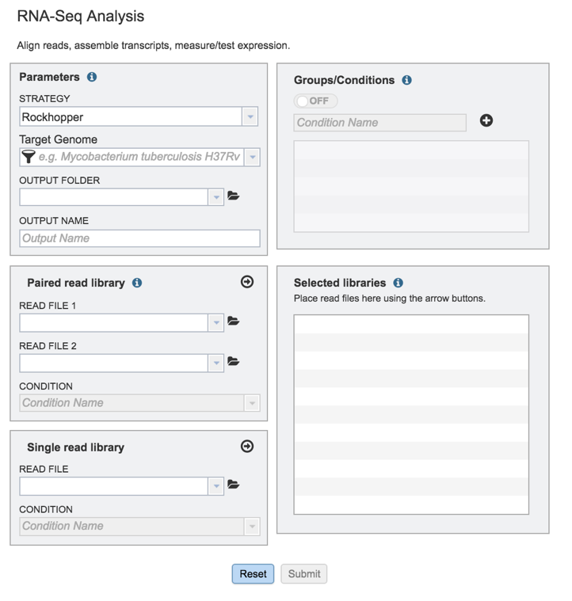

## II.  Filling in parameters - Strategy
1. Information on any page is available by clicking on the blue icon (red arrow).  This will open an information box.

BV-BRC offers three different RNA-Seq strategies:
* Rockhopper supports various stages of bacterial RNA-Seq data analysis, including aligning sequencing reads to a genome, constructing transcriptome maps, quantifying transcript abundance, testing for differential gene expression and determining operon structures[1]. 
* Tuxedo is part of TopHat2[2], which allows for variable-length indels with respect to the reference genome and also aligns reads across fusion breaks, which can occur after genomic translocations. TopHat2 combines the ability to identify novel splice sites with direct mapping to known transcripts, producing sensitive and accurate alignments, even for highly repetitive genomes or in the presence of pseudogenes.
* HISAT (hierarchical indexing for spliced alignment of transcripts)[3] is a highly efficient system for aligning reads from RNA sequencing experiments. HISAT uses an indexing scheme based on the Burrows-Wheeler transform and the Ferragina-Manzini (FM) index, employing two types of indexes for alignment: a whole-genome FM index to anchor each alignment and numerous local FM indexes for very rapid extensions of these alignments.  BV-BRC provides this service (called Host HISAT2) to allow researchers is analyse RNA-Seq for a limited number of host genomes that include:
    * Caenorhabditis elegans 
    * Danio rerio
    * Drosophila melanogaster
    * Gallus gallus
    * Homo sapiens
    * Macaca mulatta
    * Mus musculus
    * Mustela putorius furo
    * Rattus norvegicus
    * Sus scrofa

2.  Clicking on the down arrow that follows the Strategy text box arrow (red arrow) will show the three options.  Click on the desired strategy (blue arrow).

## III.  Filling in parameters - Target Genome
1. Researchers must select a Target Genome to align the reads against.  If this genome is a private genome, the search can be narrowed by clicking on the filter icon under the words Target Genome.  This will open the filter where the available categories of genomes can be selected, or de-selected, to narrow the choices and find the correct target genome.
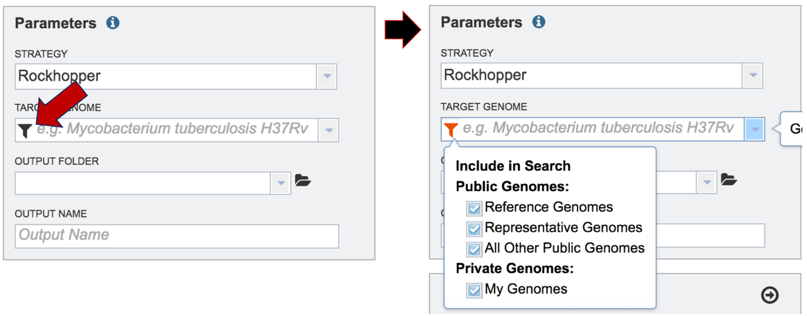

2. After selecting the category, click on the down arrow at the end of the text box.  This will open up a drop-down box that lists the genomes available in that particular category.
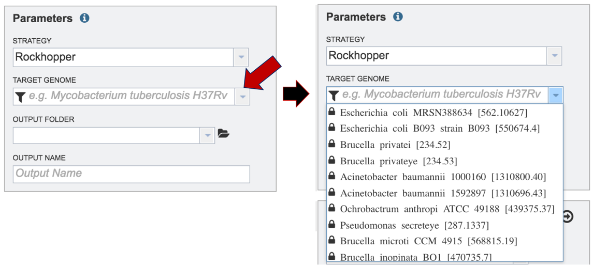

3. Start typing the name of a genome.  A box below Target Genome will show the closest matches that can be selected. Click on the genome that should be used as the target.
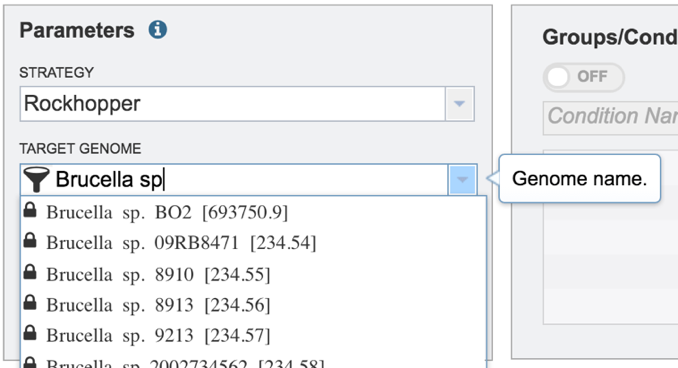

## IV.  Filling in parameters – Output folder
1. Researchers that have used BV-BRC before can click on the down arrow at the end of the Output Folder text box.  This will open a dropdown box that will show the folders that exist in the workspace (red arrow).

2. Researchers that have not previously submitted a RNA-Seq job and want to create a new folder to store the results will need to click on the folder icon at the end of the Output Folder text box (red arrow).

3. This will open a pop-up window.  To create a new folder, click on the folder icon (red arrow) which will reload the window (black arrow) to show a text box where the new folder can be named (blue arrow).  Once the folder has been named, click on OK to finalize it (green arrow).
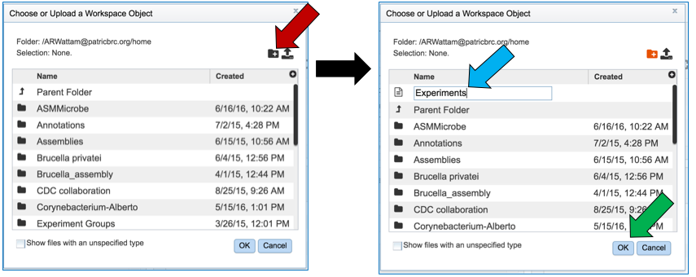

4. Finally, researchers must name the RNA-Seq job (red arrow).
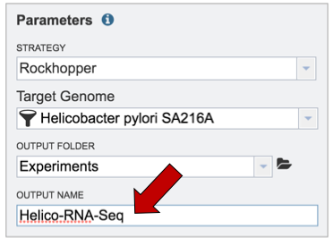

## V. Uploading reads from your computer that are not in the workspace
1. To upload reads that have not previously been uploaded into BV-BRC, click on the folder icon that follows the Read File text box (red arrows).  This will open a pop-up window.  To upload new reads, click on the upload icon (blue arrow).
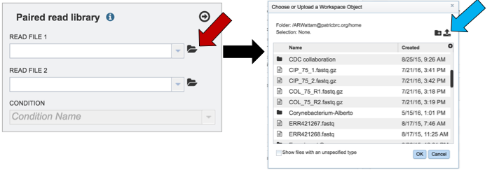

2. Select the file of interest (red arrow) and then click OK (blue arrow).

3. Once a file is selected, researchers must play particular attention to the Uploads monitor at the bottom of the page, which will show the progress in upload.

4. The name of the uploaded file will appear in the text box.
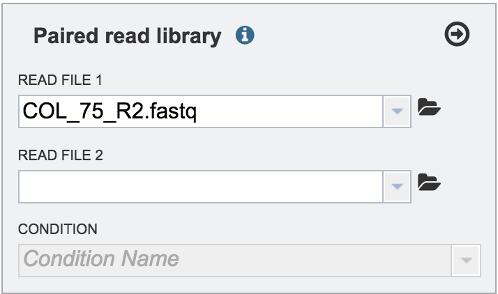

## V. Uploading reads from your computer that are in the workspace
1. Clicking on the down arrow that follows the text box (red arrow) will open a drop down box where files can be selected (blue arrow).

2. Another way to upload reads that are already in the workspace is to click on the folder icon that follows the text box (red arrow) which will open a pop-up box where reads can be selected (blue arrow).  The upload is completed by clicking OK (blue arrow).
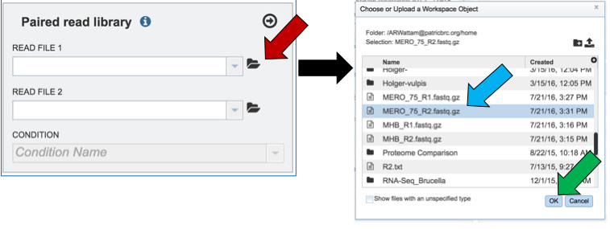

3. Single or paired end reads should be selected and then will appear in the text box(es).
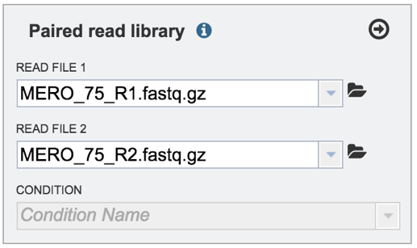

## VI.  Selecting a condition or group that will be linked to a read (Optional)
1. Metadata can be assigned to selected reads.  This will make identification easier in some of the downstream tools available on BV-BRC.  To do this, locate the Condition box and click the On box (red arrow).  This will make it possible to name specific conditions.

2. Name the condition (red arrow) and click the plus icon (blue arrow).  This will show the name of the condition and a color code assigned to it in the text box (green arrow).  As many conditions as desired can be entered.

3. To link the name of the condition or group to the selected reads, click on the down arrow that follows the text box under Condition (red arrow).  This will open a drop down box that shows all possible conditions.  Click on the appropriate one (blue arrow).

4. This will autofill the Condition text box with the name of the condition.

## VII.  Selecting a condition or group that will be linked to a read
1. Clicking on the arrow icon in any read library box (red arrow) will load the reads (shown together in the same line for paired reads) with their assigned condition into the selected library.
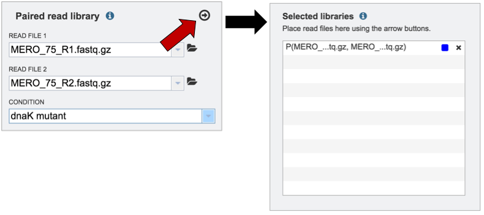

2. To submit the completed job, click the Submit button (red arrow).
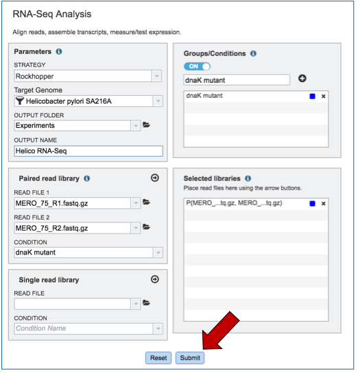

3. If the job was submitted successfully, a message will appear that indicates that the job has entered the assembly queue.

4. To check the status of the assembly job, click on the Jobs indicator at the bottom of the BV-BRC page.

5. Clicking on Jobs opens the Jobs Status page, where researchers can see the progression of the assembly job as well as the status of all the previous service jobs that have been submitted.

## VIII.  Examining the RNA-Seq job results
1. Once the RNA-Seq job of interest is located and clicked on in the jobs list, the vertical green bar will become populated with the View icon (red arrow).  To see the results, click on that icon.

2. This will open the results page for the RNA-Seq job.

3. Summary.txt file.  Clicking on the download button opens a text file that summarizes the steps and the different categories of feature alignment.  
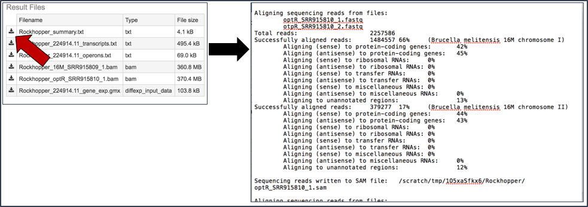

4. Transcripts.txt file.  This text file contains the data on a per gene bases.  This data includes the contig, the transcription and translation stop and end sites, the strand, BV-BRC and RefSeq locus tags, the functional description, estimates of abundance levels per gene, and the q-value.  Estimates of transcription abundance sum the number of reads for a transcript and divides that by the transcript’s length and normalization factor. The q-value is an adjusted p-value, taking in to account the false discovery rate (FDR).

Per [McClure 2013], "From the resulting P-values, differentially expressed genes are determined by computing q-values based on Benjamini–Hochberg correction (34) with a false discovery rate <1%."

https://stats.stackexchange.com/questions/165119/choosing-the-q-value-in-the-benjamini-hochberg-procedure-to-control-false-discov/166392

"The q value (lower case) is the Q value (upper case) at which that particular comparison would be right at the border of being a discovery. You can then report the q value for each comparison, rather than just a list of which comparisons are "discoveries" using an arbitrary value of Q."

http://www.nonlinear.com/support/progenesis/comet/faq/v2.0/pq-values.aspx

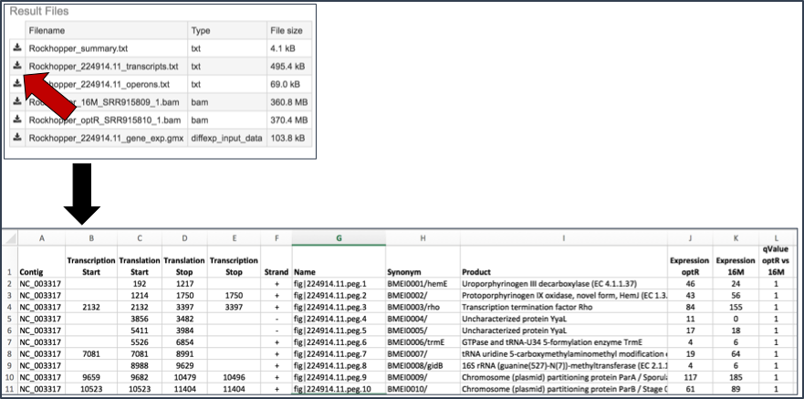

5. BAM files.  BV-BRC also provides BAM files.  BAM is the compressed binary version of the Sequence Alignment/Map (SAM) format, a compact and index-able representation of nucleotide sequence alignments, and uploaded into a genome browser so that researchers can see the alignment of the reads compared to the annotation for the genome in question.

6. Gene_exp.gmx file.  The GMX file format is a tab delimited file format that describes gene sets or other collections of elements. The RNA-Seq gene_exp.gmx file contains a list of the genes and the ratio of their expression between two conditions.
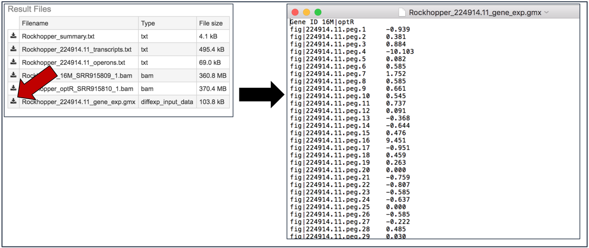

## IX. Viewing RNA-Seq results in the genome browser.
1.  Once a job is selected, click on the View icon that has appeared in the vertical green bar.

2. This will open the landing page for that particular job.  To see the genome browser, where the results of the variation job can be summarized, click on the Browser icon that is visible in the upper right corner of the page.
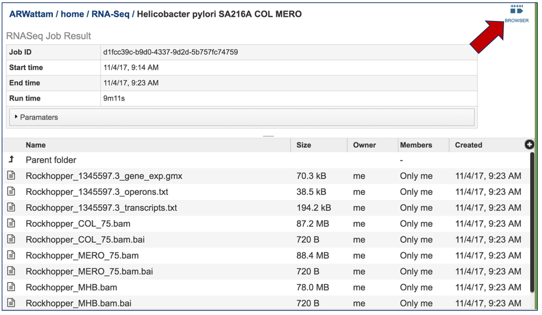

3. This will open the genome browser for the genome that was selected as the reference.  There is a box on the left of the browser that shows the available tracks.  To see the reads, , click on the check boxes before in front of the names that end in bam.

4. This will show the individual reads, with the colors indicative of the orientation of the reads (blue is forward, red is reverse).
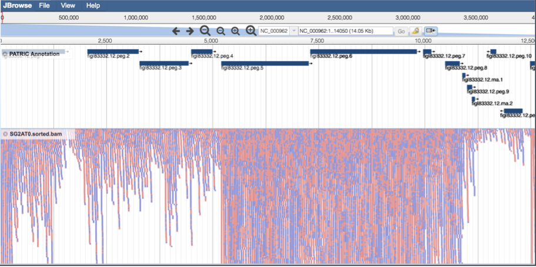

## Other output files
Descriptions of the other output files can be found in the [RNA-Seq Analyis Service Quick Reference Guide](../../services/rna_seq_analysis_service.html).

## References
1. McClure, R., et al., Computational analysis of bacterial RNA-Seq data. Nucleic Acids Res, 2013. 41(14): p. e140.
2. Kim, D., et al., TopHat2: accurate alignment of transcriptomes in the presence of insertions, deletions and gene fusions. Genome Biol, 2013. 14(4): p. R36.
3. Kim, D., B. Langmead, and S.L. Salzberg, HISAT: a fast spliced aligner with low memory requirements. Nat Methods, 2015. 12(4): p. 357-60.

