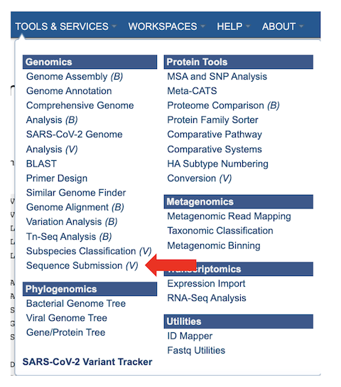
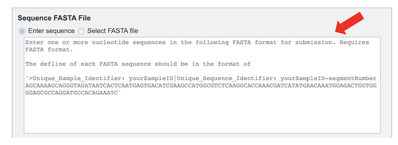
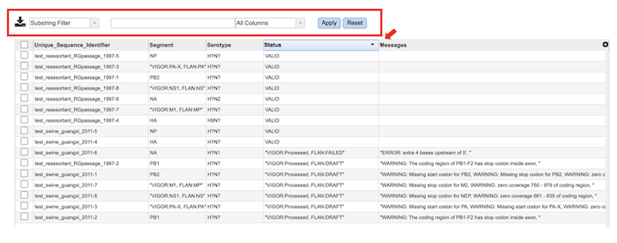

# Sequence Submission Service
The Sequence Submission service allows user to validate and submit virus sequences to NCBI Genbank. User-provided metadata and FASTA sequences are validated against the Genbank data submission standards to identify any sequence errors before submission. Sequences are also annotated using the VIGOR4 and FLAN annotation tools for internal use by users. The Sequence Submission service provides a validation report that should be reviewed by the user before submitting the sequences to the Genbank. 

Note: Current pipeline only supports Influenza A, B, or C virus family.

## Locating the Sequence Submission Service

1\. At the top of any BV-BRC page, find the Tools & Services tab and click on it.
 

2\. In the drop-down box, underneath Genomics, click on Sequence Submission.

3\. This will open the Sequence Submission landing page for entering submitter information, sequence data or FASTA file, and a metadata file.

## Specifying Sequence Submission Parameters

1\. Provide submitter information. All fields marked with asterisks are required.

2\. Select the desired input files/sequences in FASTA format. FASTA definition line must begin with a carat (“>”), followed by a unique sample identifier (Unique_Sample_Identifier) and a unique sequence identifier (Unique_Sequence_Identifier) separated by a pipe (“|”). 
Example defline: “>Unique_Sample_Identifier: yourSampleID| Unique_Sequence_Identifier: yourSampleID-segmentNumber”

There are two ways to select input sequences for analysis: 
* Use the Enter Sequence option to paste one or more protein sequence in FASTA format.

* Select FASTA File: This option allows selection of custom sequence(s) file in a FASTA format. Also, you can select FASTA files which are already uploaded in the workspace [2a] or upload your own [2b].

3\. Provide a metadata file in CSV format. The metadata template, field definitions, data types and formats are available [here](https://www.bv-brc.org/workspace/mkuscuog@bvbrc/BV-BRC Templates/).

4\. To specify output parameters, select an output folder in their workbench or create one if an appropriate folder is not available (red arrow). You will also be prompted to specify an “Output Name” (red box) for the job result, before the job can be submitted.

## Submitting a job for Sequence Submission

After the parameters and input file selections have been made, the “Annotate and Validate Sequence(s)” button will become available.

After clicking the button, a message will appear below the box to indicate that the job is now in the queue.

If there is a problem with the An error message will appear below the box to indicate that the validation has failed. The details of the validation error(s) can be accessed by [1] by either downloading the error report [2a] or viewing on the browser [2b].

## Checking the status of the job

1\. 1.	Click on the Jobs indicator at the bottom of the BV-BRC page.

2\.	This will open the Jobs Status page which displays the status of the job. The status of all the service jobs that have been submitted to BV-BRC are also available.

3\.	Once the job is completed, you can select the job by clicking on it and click the “View” button on the right-hand bar to see the results.

