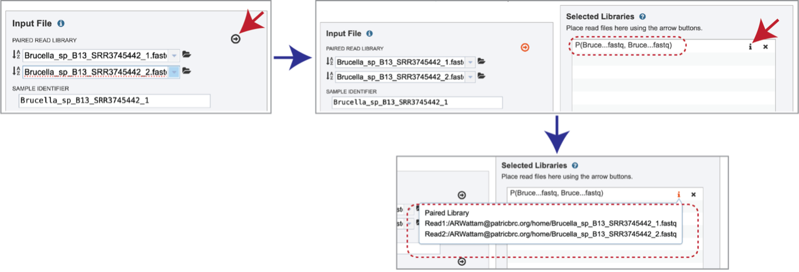
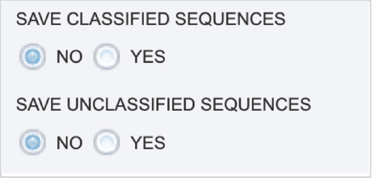
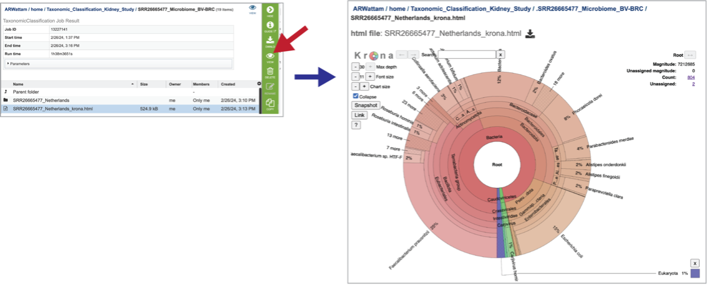
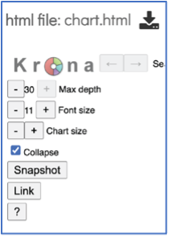
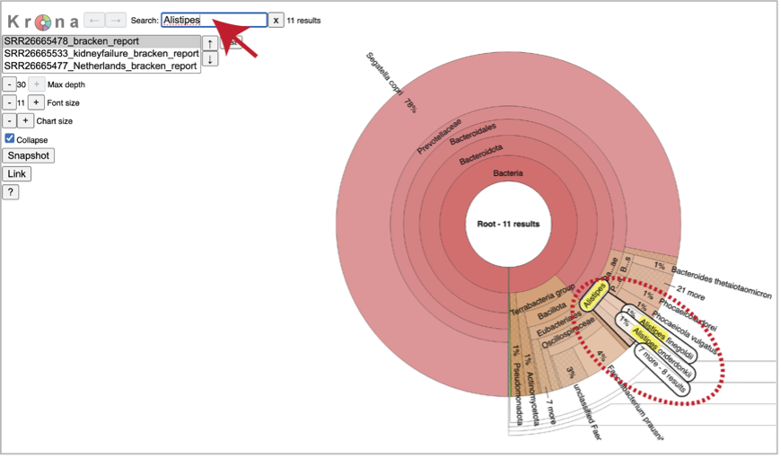
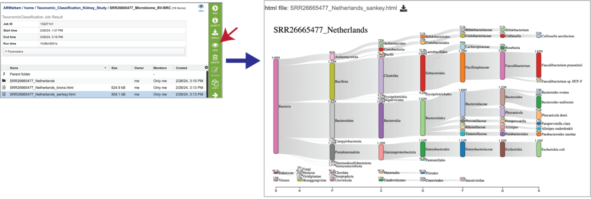
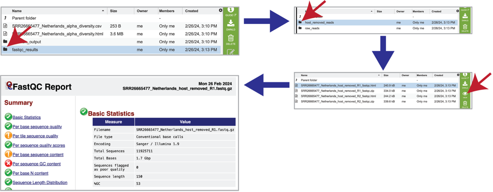

# Taxonomic Classification Service

*Revision: 02/29/2024*

Metagenomics is the study of genomic sequences obtained directly from an environment. For many metagenomic samples, the species, genera and even phyla present in the sample are largely unknown at the time of sequencing, and the goal of sequencing is to determine the microbial composition as precisely as possible. The BV-BRC Taxonomic Classification service can be used to identify the microbial composition of metagenomic samples, but it can also be used to verify the purity of an isolated sample. **Researchers can submit metagenomic samples that are short reads (paired end or single end) as well as submissions to the Sequence Read Archive via accession run numbers.** 

The BV-BRC Taxonomic Classification service can be used to identify species (Species Identification) and metagenomes (Microbiome) using whole genome sequencing reads.  It has also been recently updated to classify 16S ribosomal RNA reads.  The first step of the service estimates the quality of the reads using FastQC [1].  After this it follows the pipeline established by Lu, et al. [2].  If desired, a researcher can separate the host reads from the microbial ones using HiSAT2 [3],  but if this is not enabled, all reads are classified using Kraken 2 [4].  This is the central feature of the pipeline and uses exact-match database queries of k-mers, rather than inexact alignment of sequences. Sequences are classified by querying the database for each k-mer in a sequence, and then using the resulting set of lowest common ancestor (LCA) taxa to determine an appropriate label for the sequence.  The results from Kraken 2 are used to generate a Krona [5] plot, are used by Pavian [6] to generate a Sankey plot as well as Summary and Interactive Multi-sample Comparison tables.  The 16S rRNA and microbiome pipelines also include Bracken [7] where abundances of reads mapping to different taxa are estimated.  The abundance estimates from Bracken are combined with the Kraken 2 and FastQC results to aggregate results using MultiQC [8], and also to provide alpha and beta estimates of diversity.  The MultiQC report is not included in the Species Identification pipeline.

The BV-BRC service recently expanded to include analysis of reads from 16S ribosomal RNA. The workflow is similar, but does not include read mapping using HiSAT2 and instead, trims the submitted reads using TrimGalore [9].

## Locating the Taxonomic Classification Service
1.	At the top of any BV-BRC page, find the Services tab.

2.	Click on Taxonomic Classification, which is under the Metagenomics heading.

3.	This will open up the **Taxonomic Classification** landing page where researchers can submit long reads, single or paired read files, an SRA run accession number, or assembled contigs to the service.

## Submitting sequencing reads (single or paired)
The service accepts both single and paired reads.  Paired read libraries are usually given as file pairs, with each file containing the forward or reverse half of each read pair. Paired read files are expected to be sorted in such a way that each read in a pair occurs in the same Nth position as its mate in their respective files. These files are specified as READ FILE 1 and READ FILE 2. For a given file pair, the selection of which file is READ 1 or READ 2 does not matter.

Reads must first be uploaded to the BV-BRC workspace, and once there, they can be selected in several ways.

1.	Navigate to the workspace by clicking on the **Folder** icon at the end of the text box.  This will open a pop-up window.  Located the row that has the correct reads, and then click on that.  This will highlight the row.  Click on OK at the bottom of the pop-up box to select the reads.

2.	Clicking on the **down arrow** at the end of the text box will open a drop-down box that shows the reads that have been selected most recently (top of list) to less frequently (down).  Clicking on the row that has the correct read will select those reads.
3.	Beginning to type the name of the read in the text box will open a drop-down box that shows reads matching that text.  Clicking on the row that has the correct read will select those reads.
4.	Note that once reads are selected, a **SAMPLE ID** field will auto populate with the file name in the box immediately below the selected reads. Edit the field by clicking into the text box. The text entered to this text box will be used to identify this sample throughout the output files for the service. 

5.	Multiple read pairs or single reads can be analyzed, but they must first be moved to the **Selected Libraries** box. Click on the **arrow** to the right of the selected reads.  This will move the file into the **Selected Libraries** box. Clicking on the information icon (i) will open a pop-up window that shows the reads selected, as well as where they are located in the workspace.

6.	Note that there is an **S** or **P** preceding the reads designates if they are single or paired.  Reads can be removed by clicking on the **X** at the end of the row where they are listed.

## Submitting reads from the Sequence Read Archive (SRA)
BV-BRC also supports analysis of existing datasets from SRA. If users submit SRA values, the BV-BRC will input the corresponding FASTQ files to the service. 
1.	To submit this type of data, locate the Run Accession number and copy it.

2.	Paste the copied accession number in the text box underneath SRA Run Accession, then click on the icon of an **arrow within a circle**. This will generate a dialog box above the text box that indicates that the service is validating the run number with SRA.  Once the verification is complete, the number will appear in the **Selected Libraries** box.

## Parameters
Parameters must be selected prior to submission of the Taxonomic Classification job.  The algorithm used is Kraken 2, which uses exact alignment of k-mers for classification accuracy.

1.	**Sequencing Type** must first be selected by clicking on the radio button before either **Whole Genome Sequencing (WGS)** or **16S Ribosomal RNA**.

2.	**Analysis Type** is the next parameter to be selected.  If **WGS** was selected originally, clicking on the down arrow at the end of the text box will open a drop-down box that shows the two options.  The **Species identification** is an end-to-end pipeline that runs Kraken2Uniq to identify taxa at the species level. The Kraken results are used in the analysis results. The **Microbiome Analysis** includes the steps of the species identification pipeline with additional microbiome specific steps (Bracken abundance, alpha diversity, and beta diversity). This pipeline uses Kraken 2 to identify taxa the species level. However, this pipeline uses a companion program to Kraken 2 and the other tools in the Kraken suite, Bracken. Bracken is run at the species level with the flag ‘-S’. Bracken recreates the report file using the values from the Bracken recalculation. This is available in the user input sample id subdirectory under bracken_output. Any levels whose reads were below the threshold of 10 are not included. Percentages will be re-calculated for the remaining levels.

There are no **Analysis Type** options available if **16S** was originally selected. The 16S pipeline uses Bracken at the genus level ”G”.

3.	**Database** is the next parameter.  If **WGS** was selected originally, there are two database options. The **Kraken2 Standard Database** contains distinct 31-mers, based on completed microbial genomes from NCBI. The **BV-BRC Database** includes the RefSeq [10] complete genomes and protein/nucleotide sequences for archaea, bacteria, plasmids, viruses, human GRCh38, fungi, plants, protozoa and UniVec (the NCBI-supplied database of vector, adapter, linker, and primer sequences that may be contaminating sequencing projects and/or assemblies).

If **16S** was originally selected, the two database selections are SILVA [11] (16S rRNA genes sequences from bacteria, archaea, and eukaryotes) or Greengenes [12] (16S rRNA gene sequences from bacteria and archaea). These databases do not provide NCBI taxonomy IDs.

4.	If **WGS** was selected, a host can be selected in the **Filter Host Reads** dropdown, HiSAT2 will align the reads to one of ten available host genomes, then remove any aligned reads that aligned to that host genome from the sample. FastQC will run on the host removed reads. The remaining, non-host reads are then classified by Kraken 2.

5.	**Confidence Interval** selection is the same for all sequence types.  The default confidence interval is 0.1. The classifier then will adjust labels up the tree until the label’s score meets or exceeds that threshold.

6.	The Taxonomic Classification service also provides the ability to save the reads that were classified by Kraken, or those that were not classified, in separate files for possible downstream analyses. If either (or both) of those options are selected, the files will be available in the output folder when the job is completed.

7.	An **Output Folder** must be designated to hold the job results.

8.	Once an **Output Name** is selected, the job can be submitted. At this point, the Submit button turns blue and the job will be submitted once clicked.

9.	After clicking the submit button, your job will be launched.  A successful submission will generate a message indicating that the job has been queued.  

10.	 The bottom of each BV-BRC page has an indicator that shows the number of jobs that are queued, running or completed. Clicking on the word Jobs will rewrite the page to show the Job status. Researchers can monitor the Jobs Status page to see the status of their job, which is indicated in the first column (Queued, Running, Complete, Failed).

## Locating the Taxonomic Classification job – Output files
1.	To access your job, you can click on the Jobs part of your Jobs monitor.

2.	This will open your Jobs page.

3.	Clicking on the row that contains the job of interest will open two icons in the vertical green bar.  To view the job, click on the **View** icon.

4.	This will open a page for the selected job. The results are divided into several sections that include the job information, the results for each individual file that was submitted, diversity statistics, multisample reports and information about the samples, including a key and a table.

5.	Information about the job, including the job ID, the running time, and the information of the data submitted can be viewed in the uppermost box.  Clicking on **Parameters** will open a drop-down box that contains information about the samples submitted.

## Results for Individual Files Submitted
1.	A Krona image is created for each individual file that has been submitted.  Selecting the row that contains the **krona.html** file, and then on the **View** icon, will open this image.  Manipulation of Krona image described in Krona images below.

1.	At the top of the view, there are several controls that can be used to change the visualization or download the data.

2.	The number of circles shown in the graph can be changed by increasing the number (+) or decreasing the number (-) using the Max depth function.

3.	A text box at the top of the page enables a search for specific names.

4.	You can see the taxonomy spectrum by clicking on a region of interest in the Krona chart.  This will rewrite the view to show how the data mapped within the particular taxon selected.

5.	Sankey plots (**sankey.html**) are created for each sample using functions from Pavian. To see the Sankey plot, click on its row and then on the **View** icon in the green action bar. 

6.	Click into a sample specific subdirectory. Each sample directory is formatted the same way and contains files for an individual sample.

7.	Selecting the row that contains the **alpha_diversity.csv** file and then clicking on the **View** icon in the green action bar will rewrite the window to show the alpha diversity report for that sample.

8.	Selecting the row for the **alpha_diversity.html** and then the **View** icon will open this file.

9.	The individual job folder also contains a **bracken_output** folder.  Clicking on that will open the folder.  Selecting the **bracken_output.txt** file will open the bracken output.

10.	It also includes a **bracken_report.txt** file.  This file contains a number of columns, the headings of which are as described:
* Percentage of fragments covered by the clade rooted at this taxon.
* Number of fragments covered by the clade rooted at this taxon.
* Number of fragments assigned directly to this taxon.
* A rank code, indicating (U)nclassified, (R)oot, (D)omain, (K)ingdom, (P)hylum, (C)lass, (O)rder, (F)amily, (G)enus, or (S)pecies. Taxa that are not at any of these 10 ranks have a rank code that is formed by using the rank code of the closest ancestor rank with a number indicating the distance from that rank. E.g., "G2" is a rank code indicating a taxon is between genus and species and the grandparent taxon is at the genus rank.
* NCBI taxonomic ID number.
* Indented scientific name.

11.	The pipeline produces FastQC reports for each of the reads submitted for each sample. These reports are available in the **fastqc_results** folder. There are two folders within that directory.  Clicking on the  host_removed_reads folder reveals two files per read submitted.   The **fastqc.html** file has the FastQC report, which can be seen by selecting that row and clicking on the **View** icon.  The **fastqc.zip** file should be downloaded and contains all the files produced by FastQC for these reads.

12.	Each of the submitted samples contains a **raw_reads** folder. Clicking on that folder will reveal two files for each read submitted in that sample. The **fastqc.html** file has the FastQC report, and the **fastqc.zip** file should be downloaded, and contains all the files produced by FastQC for these reads. 

13.	As mentioned above, reads are aligned to the host genome using Hisat2 if selected during submission.  The reads that mapped to the host genome are available in the **hisat2_results** folder. Clicking on that folder reveals the files associated with those reads, including the **aligned_reads.sam** file, which is the Sequence Alignment/Map format (SAM).  This file has the alignment of the reads on the host genome and should be downloaded if of interest.

14.	 The individual files for each of the reads in this sample are also produced as the **host_removed_R1.fastq.gz** files.  These are available for download.

15.	The classification results produced by Kraken 2 are available in the **kraken_output** folder.  Clicking on this folder reveals two different files.  The **k2_output.txt** file should be downloaded, but the k2_report.txt can be visualized by clicking on the **View** icon.  This file contains a number of columns, the headings of which are as described:
* Percentage of fragments covered by the clade rooted at this taxon.
* Number of fragments covered by the clade rooted at this taxon.
* Number of fragments assigned directly to this taxon.
* Number of  minimizers in read data associated with this taxon (Note: Kraken 2 stores minimizers (l-mers) of each k-mer instead of the entire k-mer, which reduces the database size and improves query speed).
* An estimate of the number of distinct minimizers in read data associated with this taxon.
* A rank code, indicating (U)nclassified, (R)oot, (D)omain, (K)ingdom, (P)hylum, (C)lass, (O)rder, (F)amily, (G)enus, or (S)pecies. Taxa that are not at any of these 10 ranks have a rank code that is formed by using the rank code of the closest ancestor rank with a number indicating the distance from that rank. E.g., “G2” is a rank code indicating a taxon is between genus and species and the grandparent taxon is at the genus rank.
* NCBI taxonomic ID number
* Indented scientific name.

## Diversity Statistics
1.	Bracken is a companion program to Kraken 2 and the other tools in the Kraken suite. It regenerates the report file using the new values calculated by Bracken. The Bracken results are used in the output files. The raw result files are available in the sample subdirectory under bracken_output. Any levels whose reads were below the threshold of 10 are not included. Percentages will be re-calculated for the remaining levels. Unclassified reads are not included in the report.  Bracken functions calculate alpha and beta diversity. The statistics displayed in .HTML files as well as a .CSV for downstream analysis. Selecting the **alpha_diversity.csv** row followed by the **View** icon will open the alpha diversity table. 

2.	Clicking on the **alpha_diversity.html** row, followed by the **View** icon, opens the **Alpha Statistics** file.  This is similar to the alpha_diversity.csv file but includes explanations of the different diversity statistics at the bottom of the file.

3.	Beta diversity statistics are also provided. The **beta_diversity.csv** file should be downloaded, but the **beta_stats_heatmap.html** file is available for viewing.  This is a heatmap displaying the beta-diversity value between each sample. Beta-diversity is quantified as the variability in community composition (the identity of taxa observed) between samples within a group of samples [13].  It is calculated by the KrakenTools beta_diversity.py script to compute the Bray-Curtis dissimilarity matrix [14] for pairwise dissimilarities among the samples. In this matrix, a 0 means the two samples were exactly the same and a 1 means they are maximally divergent.

## Multisample reports

16.	If multiple samples are submitted, functions from Pavian create an interactive multisample comparison table.  Clicking on the **multi_sample_table.csv** row and then clicking on the **View** icon in the green action bar will open this an interactive view of this table.

17.	It is possible to filter the **multi_sample_table.csv**.  If a particular taxon is of interest, the name can be entered into the text box at the top of the page, followed by clicking on the **Apply** button.  This will rewrite the table to show the results that match that name.

18.	Results are compiled into a MultiQC report.  The **multiqc_report.html** can be viewed by selecting the row that contains it, and then clicking on the **View** icon.

19.	Scroll down the **multiqc_report.html** to see additional comparisons across the samples.

20.	Select the row that contains the **multisample_comparison.html** table and click on the **View** icon in the green action bar.  Interact with the table by clicking the up and down arrows next to the sample ID. This will sort the results for the taxa with the highest z-score at the. top of the table. Set a range for the values in a column in the “All” text box. Click the “Prev”, “Next”, and page numbers to sort through pages of the table. Note that there are usually many pages of data.

The robust z-score is the median absolute deviation. This method is chosen to reduce impact from outliers in the data, providing a more reliable measure of relative position within the data distribution.  A positive robust z-score indicates that the number of fragments assigned to that taxon was above the median or central tendency of the data.  Conversely, a negative robust z-score indicates that the number of fragments assigned to that taxon was below the median or central tendency of the data.  The magnitude (represented as the value of the z-score) indicates the distance of the data point from the central tendency in terms of the robust measure of dispersion.

The intensity of the red for each cell is calculated by putting the read scores into quantiles probabilities ranging from 0.05 to 0.95 with an increment of 0.05. This means that the intensity of the color represents the relative position in the dataset’s distribution for that datapoint. A darker color indicates that value is more likely to be an outlier.

21.	The **multisample_krona.html** file is only generated if multiple samples are submitted with this job.  First select the row that contains this file, and then click on the **View** icon. Click to view krona plots of each sample included in your analysis. Toggle between all the samples included in your analysis by clicking on the sample names or up and down arrows in the upper left-hand corner of the report underneath the Krona logo. 

Sample Information
1.	The Taxonomic Classification pipeline also provides information on the samples submitted, and the identifiers that were originally included when the job was submitted.  The **sample_key.csv** shows this information, including the number of reads per sample submitted.

2.	The **summary_table.csv** file shows information about the reads per sample submitted.  It includes the total number of reads and those that were classified and unclassified.  It also shows the number of reads that mapped to the highest taxonomic levels, as well as an artificial read.  

## Reporting problems
1.	This will open a pop-up window where issues with particular jobs can be reported. A description of the particular problem can be provided and clicking the submission button will generate a message to BV-BRC team members, notifying them that there has been a problem. We encourage researchers to report all failed jobs, or those that have results that are confusing. In addition, researchers should report long waits that they are experiencing in the queue.

## Pipelines
* Pavian software: https://github.com/fbreitwieser/pavian
* Kraken 2 software: https://github.com/DerrickWood/kraken2/
* Bracken software: https://github.com/jenniferlu717/Bracken
* HISAT2 software: https://github.com/DaehwanKimLab/hisat2

## References
1. Andrews, S.  FastQC: a quality control tool for high throughput sequence data.  (2010). http://www.bioinformatics.babraham.ac.uk/projects/fastqc
2. Lu, J. et al. Metagenome analysis using the Kraken software suite. Nature protocols 17, 2815-2839 (2022).
3. Kim, D., Paggi, J. M., Park, C., Bennett, C. & Salzberg, S. L. Graph-based genome alignment and genotyping with HISAT2 and HISAT-genotype. Nature biotechnology 37, 907-915 (2019).
4. Wood, D. E., Lu, J. & Langmead, B. Improved metagenomic analysis with Kraken 2. Genome biology 20, 257 (2019).
5. Ondov, B. D., Bergman, N. H. & Phillippy, A. M. Interactive metagenomic visualization in a Web browser. BMC bioinformatics 12, 385 (2011).
6. Breitwieser, F. P. & Salzberg, S. L. Pavian: Interactive analysis of metagenomics data for microbiomics and pathogen identification. bioRxiv, 084715, doi:10.1101/084715 (2016).
7. Lu, J., Breitwieser, F. P., Thielen, P. & Salzberg, S. L. Bracken: estimating species abundance in metagenomics data. PeerJ Computer Science 3, e104 (2017).
8. Ewels, P., Magnusson, M., Lundin, S. & Käller, M. MultiQC: summarize analysis results for multiple tools and samples in a single report. Bioinformatics 32, 3047-3048 (2016).
9. Krueger, F. Trim Galore: a wrapper tool around Cutadapt and FastQC to consistently apply quality and adapter trimming to FastQ files, with some extra functionality for MspI-digested RRBS-type (Reduced Representation Bisufite-Seq) libraries. URL http://www.bioinformatics.babraham.ac.uk/projects/trim_galore/. (Date of access: 28/04/2016) (2012).
10. O'Leary, N. A. et al. Reference sequence (RefSeq) database at NCBI: current status, taxonomic expansion, and functional annotation. Nucleic acids research 44, D733-D745 (2016).
11. Quast, C. et al. The SILVA ribosomal RNA gene database project: improved data processing and web-based tools. Nucleic acids research 41, D590-D596 (2012).
12. DeSantis, T. Z. et al. Greengenes, a chimera-checked 16S rRNA gene database and workbench compatible with ARB. Applied and environmental microbiology 72, 5069-5072 (2006).
13. Anderson, M. J., Ellingsen, K. E. & McArdle, B. H. Multivariate dispersion as a measure of beta diversity. Ecology letters 9, 683-693 (2006).
14. Bray, J. R. & Curtis, J. T. An ordination of the upland forest communities of southern Wisconsin. Ecological monographs 27, 326-349 (1957).
