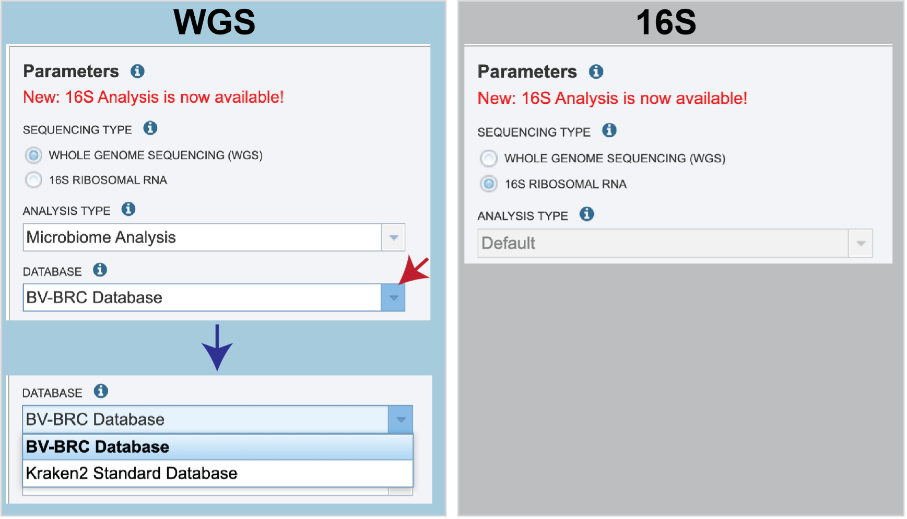
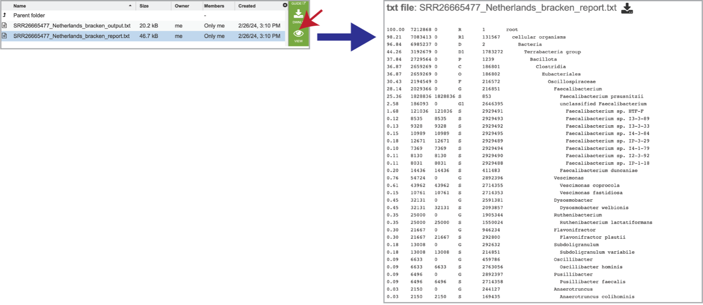

# Taxonomic Classification Service

*Revision: 02/29/2024*

Metagenomics is the study of genomic sequences obtained directly from an environment. For many metagenomic samples, the species, genera and even phyla present in the sample are largely unknown at the time of sequencing, and the goal of sequencing is to determine the microbial composition as precisely as possible. The BV-BRC Taxonomic Classification service can be used to identify the microbial composition of metagenomic samples, but it can also be used to verify the purity of an isolated sample. **Researchers can submit metagenomic samples that are short reads (paired end or single end) as well as submissions to the Sequence Read Archive via accession run numbers.** 

The BV-BRC Taxonomic Classification service can be used to identify species (Species Identification) and metagenomes (Microbiome) using whole genome sequencing reads.  It has also been recently updated to classify 16S ribosomal RNA reads.  The first step of the service estimates the quality of the reads using FastQC [1].  After this it follows the pipeline established by Lu, et al. [2].  If desired, a researcher can separate the host reads from the microbial ones using HiSAT2 [3],  but if this is not enabled, all reads are classified using Kraken2 [4].  This is the central feature of the pipeline and uses exact-match database queries of k-mers, rather than inexact alignment of sequences. Sequences are classified by querying the database for each k-mer in a sequence, and then using the resulting set of lowest common ancestor (LCA) taxa to determine an appropriate label for the sequence.  The results from Karken2 are used to generate a Krona [5] plot, are used by Pavian [6] to generate a Sankey plot as well as Summary and Interactive Multi-sample Comparison tables.  The 16S rRNA and microbiome pipelines also include Bracken [7] where abundances of reads mapping to different taxa are estimated.  The abundance estimates from Bracken are combined with the Kraken2 and FastQC results to aggregate results using MultiQC [8], and also to provide alpha and beta estimates of diversity.  The MultiQC report is not included in the Species Identification pipeline.

The BV-BRC service recently expanded to include analysis of reads from 16S ribosomal RNA. The workflow is similar, but does not include read mapping using HiSAT2 and instead, trims the submitted reads using TrimGalore [9].

