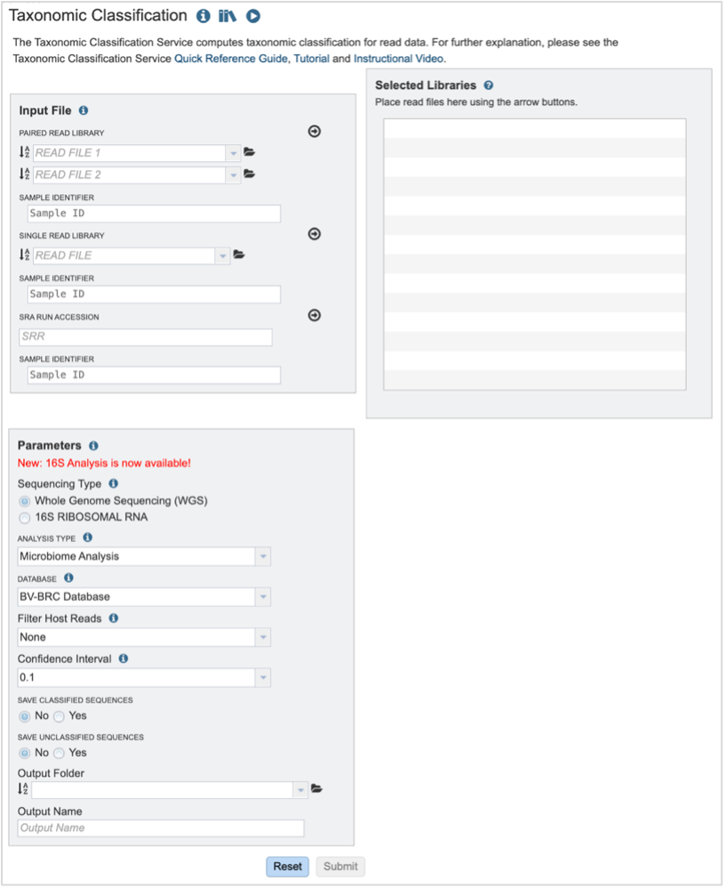
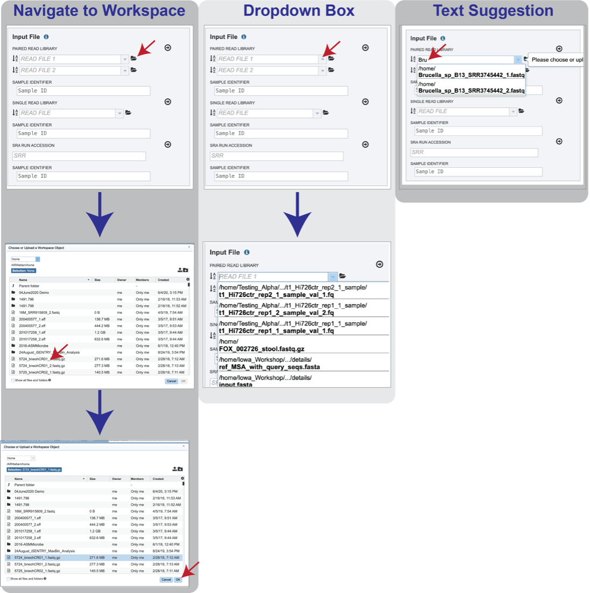
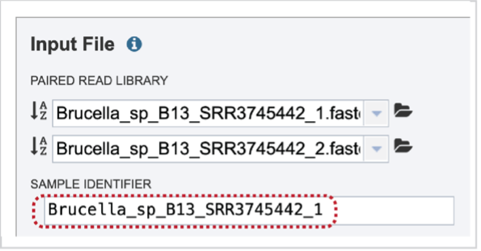
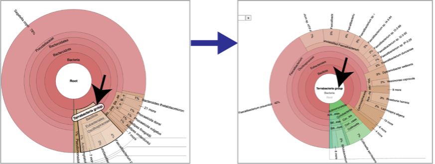
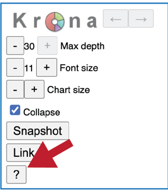
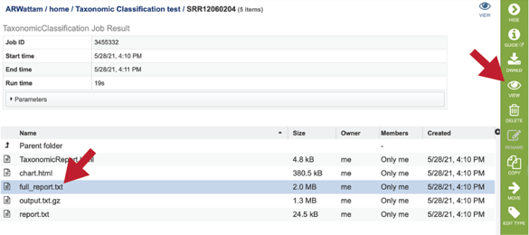
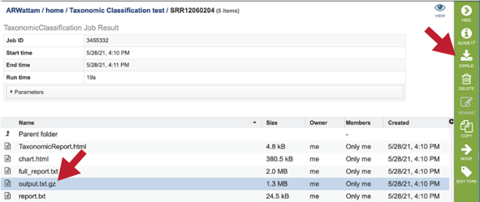
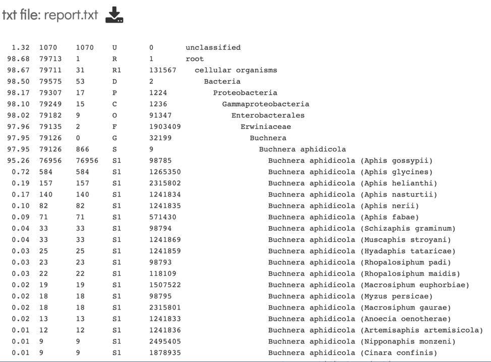

# Taxonomic Classification
Metagenomics is the study of genomic sequences obtained directly from an environment. For many metagenomic samples, the species, genera and even phyla present in the sample are largely unknown at the time of sequencing, and the goal of sequencing is to determine the microbial composition as precisely as possible. The BV-BRC Taxonomic Classification service can be used to identify the microbial composition of metagenomic samples. Researchers can submit their metagenomic samples that are reads (paired-or single-end, long or short, zipped or not) or contigs to the service, as well as the Sequence Read Archive accession numbers. This service uses Kraken 21. Kraken, first released in 2014, has been shown to provide exceptionally fast and accurate classification for shotgun metagenomics sequencing projects. Kraken 2, which matches the accuracy and speed of Kraken 1, supports 16S rRNA databases.  Kraken uses exact-match database queries of k-mers, rather than inexact alignment of sequences.  Sequences are classified by querying the database for each k-mer in a sequence, and then using the resulting set of lowest common ancestor (LCA) taxa to determine an appropriate label for the sequence.

## I. Locating the Taxonomic Classification Service App

1. At the top of any BV-BRC page, find the Services tab.

2. Click on Taxonomic Classification.

3. This will open up the Taxonomic Classification landing page where researchers can submit long reads, single or paired read files, an SRA run accession number, or assembled contigs to the service.

## II. Uploading paired end reads

Paired read libraries are usually given as file pairs, with each file containing the forward or reverse half of each read pair. Paired read files are expected to be sorted in such a way that each read in a pair occurs in the same Nth position as its mate in their respective files. These files are specified as READ FILE 1 and READ FILE 2. For a given file pair, the selection of which file is READ 1 or READ 2 does not matter.

1.	To upload a fastq file that contains paired reads, locate the box called “Paired read library.”

2.	The reads must be located in the workspace to submit them to a BV-BRC service.  To initiate the upload, first click on the folder icon.

3.	This opens up a pop-up window where the files for upload can be selected.  Click on the icon with the arrow pointing up.

4.	This opens a new pop-up window where the file can be selected.  Click on the “Select File” in the blue bar.

5.	This will open a window that allows you to choose files that are stored on your computer.  Select the file where you stored the fastq file and click “Open”.

6.	Once selected, it will autofill the name of the file. You can see it in the screenshot below. Click on the Start Upload button.

7.	This will auto-fill the name of the document into the text box as seen below.

8.	Pay attention to the upload monitor in the lower right corner of the BV-BRC page. It will show the progress of the upload. Do not submit the job until the upload is 100% complete.

9.	Repeat steps 2-5 to upload the second pair of reads.

10.	To finish the upload, click on the icon of an arrow within a circle. This will move your file into the Selected libraries box.

## III. Uploading single reads

1.	To upload a fastq file that contains single reads, locate the text box called “Single read library.”

2.	If the reads have previously been uploaded, click the down arrow next to the text box below Read File.

3.	This opens up a drop-down box that shows the all the reads that have been previously uploaded into the user account. Click on the name of the reads of interest.

4.	This will auto-fill the name of the document into the text box as seen below.

5.	To finish the upload, click on the icon of an arrow within a circle. This will move your file into the Selected libraries box.

## IV. Submitting reads that are present at the Sequence Read Archive (SRA)
1.	BV-BRC also supports analysis of existing datasets from SRA. To submit this type of data, locate the Run Accession number and copy it.

2.	Paste the copied accession number in the text box underneath SRA Run Accession, then click on the icon of an arrow within a circle.

3.	This will move the file into the Selected libraries box.

## V. Submitting assembled contigs

1.	To submit a taxonomic classification job that uses contigs, click on the check box in front of Assembled Contigs in the upper box. Clicking on the folder icon.

2.	This will open a pop-up window that shows data in the private workspace that can be selected. The upload icon in the upper right can also be used to upload contig files that might exist on your computer.

3.	Clicking on the down arrow next to the contigs text box will show fasta files (ending in .fa or .fasta) that have been recently accessed in the private workspace.

## VI. Selecting parameters

Parameters must be selected prior to job submission. The algorithm used for Taxonomic Classification is Kraken21, which uses exact alignment of k-mers for classification accuracy. The Kraken2 algorithm was downloaded from the following source: https://ccb.jhu.edu/software/kraken2/
The only database selection currently is only “All genomes”.

1.	You can choose to save the classified sequences (meaning that those reads or contigs that mapped to the k-mers in the all genomes database) and/or the unclassified sequences (those that do not map to those k-mers).  If either (or both) of those options are selected, the files will be available in the output folder when the job is completed.

2.	A folder must be selected for the Taxonomic Classification job. Clicking on the down arrow at the end of the text box underneath Output Folder will show recent folders that have been used. Clicking on the folder icon at the end of the text box will open a pop-up window where all folders can be viewed, or new folders created. You can also start typing the name of a folder in the text box.  A drop-down box will appear that shows folders that match what you entered.

3.	Click on the desired folder.

4.	The name of the folder will now appear in the box.  

5.	A name for the job must be entered in the text box under Output Name. At this point, the Submit button turns blue and the job will be submitted once clicked.  

6.	After clicking the submit button, your job will be launched.  A successful submission will generate a message indicating that the job has been queued.  

The bottom of each BV-BRC page has an indicator that shows the number of jobs that are queued, running or completed. Clicking on the word Jobs will rewrite the page to show the Job status. Researchers can monitor the Jobs Status page to see the status of their job, which is indicated in the first column (Queued, Running, Complete, Failed).

## VII. Viewing the Taxonomic Classification job – Output files

## References
1. Lu, J. & Salzberg, S. L. Ultrafast and accurate 16S rRNA microbial community analysis using Kraken 2. Microbiome 8, 1-11 (2020).
2. Ondov, B. D., Bergman, N. H. & Phillippy, A. M. Interactive metagenomic visualization in a Web browser. BMC bioinformatics 12, 385 (2011).

