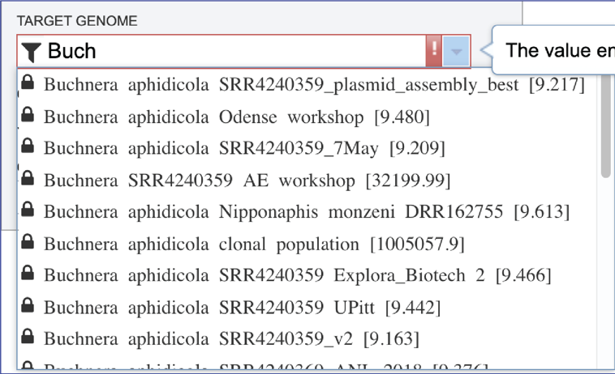
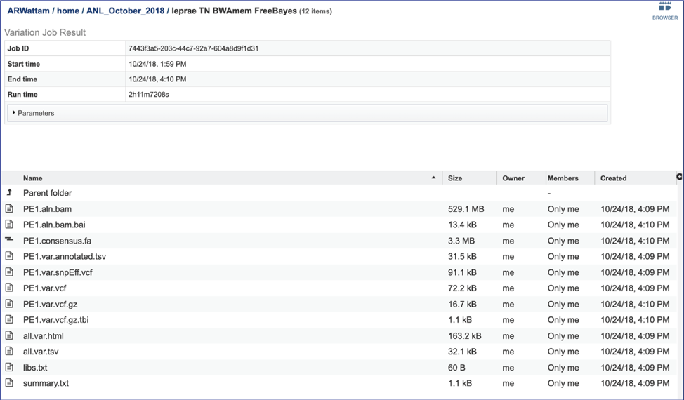
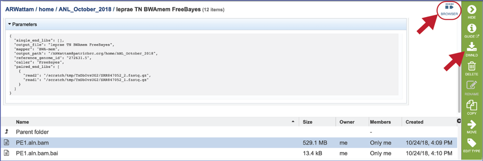
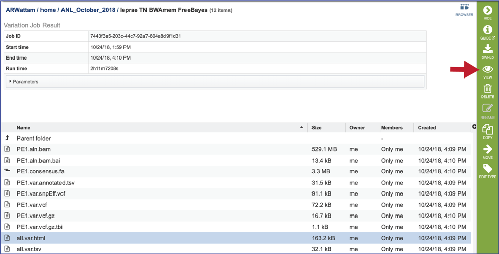
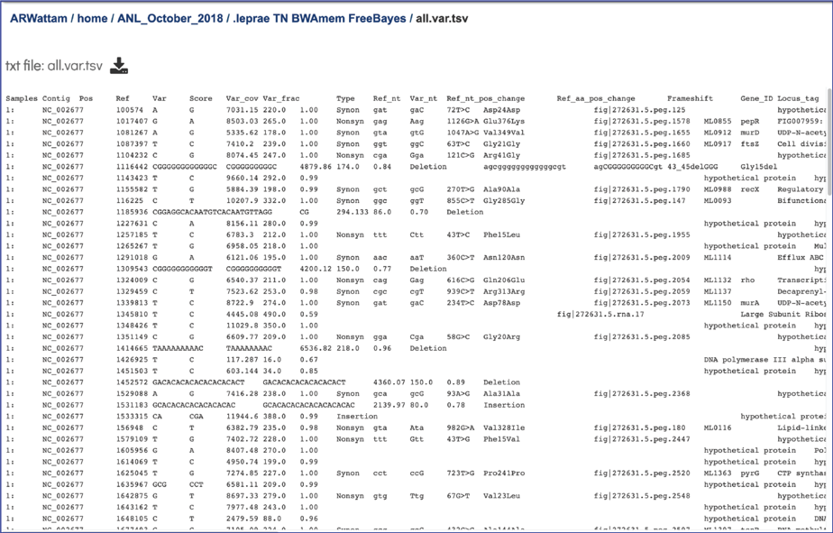
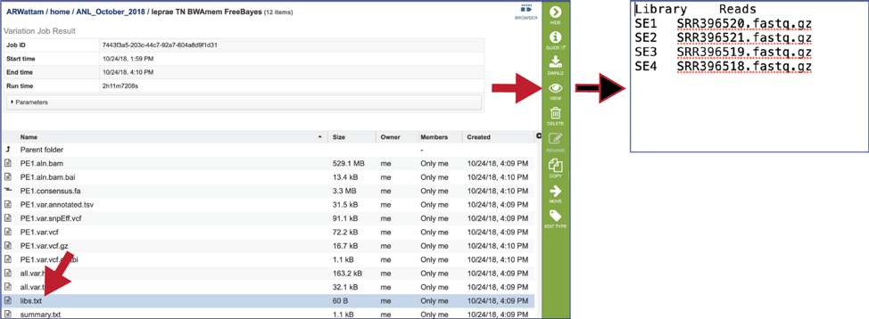
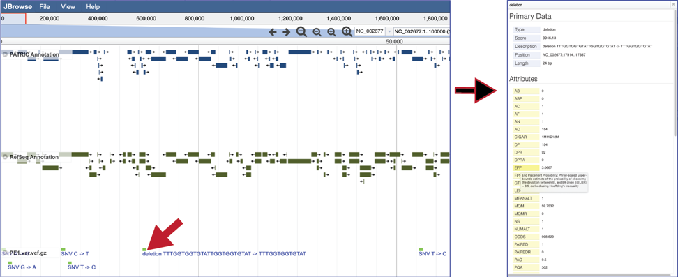

# Variation - SNP Analysis Service

SNP genotyping is the measurement of genetic variations of single nucleotide polymorphisms (SNPs) between members of a species. It is a form of genotyping, which is the measurement of more general genetic variation. SNPs are one of the most common types of genetic variation. A SNP is a single base pair mutation at a specific locus, usually consisting of two alleles. SNP calling require the reads of target isolates and a reference genome as input and execute an external mapping tool and variant caller, followed by some filtering steps to remove low-quality SNPs. The BV-BRC Variation Analysis Service can be used to identify and annotate sequence variations, including SNPs, SNVs, and indels.

