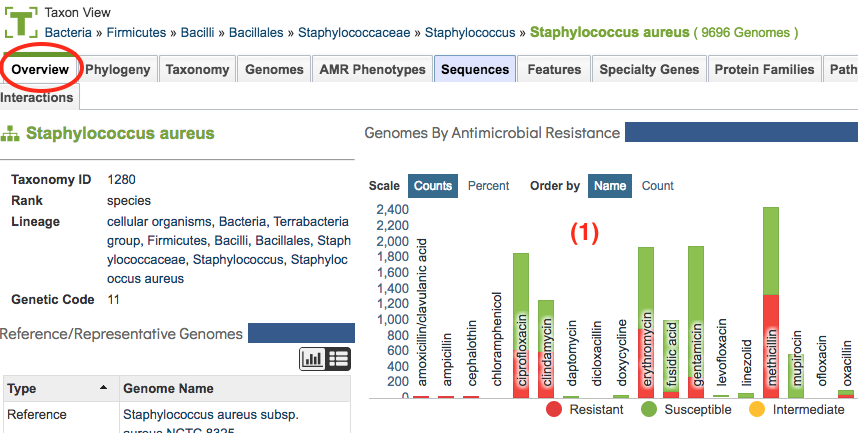
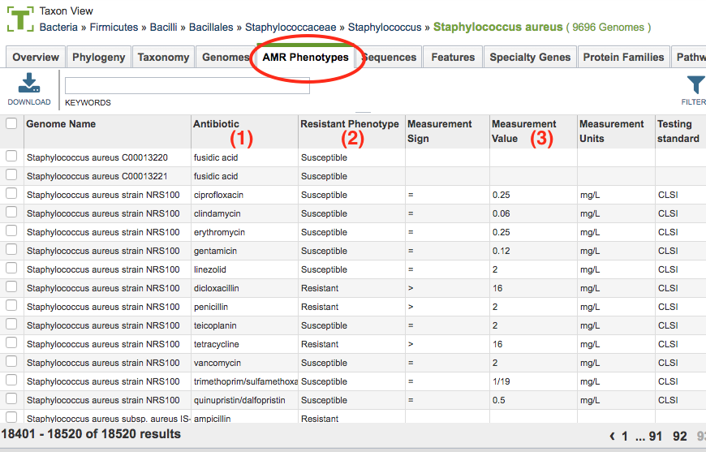

# Antimicrobial Resistance and Other Clinical Metadata

## Genome-Level Antimicrobial Resistance (AMR)

Genome-level AMR metadata in PATRIC include data from GenBank, from the NIAID-funded [Genomic Centers for Infectious Diseases](https://docs.patricbrc.org/website/data_collections/niaid_genome_sequencing.html), and from sequencing read data generated as part of AMR-related studies sequencing projects, typically curated from SRA. These data include panel data for antibiotics and chemicals. These data are accessible at different levels of detail via multiple views/tabs, including **Taxon Overview**, **Genomes**, **AMR Phenotypes**, as well as for individual genomes, described in the following sections.

The **Taxon Overview** tab (*shown below*) provides an interactive summary bar chart showing the relative genome counts by resistance type (defined in Antimicrobial Resistance section below) and antibiotic. Clicking a bar in the chart filters to the corresponding list of AMR Phenotypes by genome for that resistance category and antibiotic.  

From the **Genomes** tab (*shown below*) PATRIC metadata includes information on Antimicrobial Resistance, Antimicrobial Resistance Evidence, and other related information.

**(1) Antimicrobial Resistance** metadata field. This field shows genomes
that have been specifically tested against certain antibiotics and the
resulting phenotype from that test. Note that a genome can have multiple
antibiotic phenotypes, such as being resistant to one drug and
susceptible to another. Values in this field include the following:

- 'Resistant'
- 'Susceptible'
- 'Intermediate'

**(2) Antimicrobial Resistance Evidence** metadata field. This field provides the form of evidence used to determine the value in the corresponding Antimicrobial Resistance metadata field.  Values in this field include the following: 

-   'Phenotype.' Genomes in this category were assigned their resistance
    category based on phenotype information provided by source data, metadata and/or
    publication. For instance, the AMR phenotype may have been determined as MRSA or MSSA.
    This phenotype data is available at PATRIC as well.
-   'AMR Panel.' Some genomes have been tested against a panel of
    antibiotics, with the results of the screening reported in a table
    using either a specific designation (such as 'Susceptible,'
    'Resistant,' or 'Intermediate'), or the minimum inhibitory
    concentration (MIC). See AMR Phenotypes below.
-	'Computational Prediction.' Some genomes have been predicted by machine-learning 
	based classifiers built on experimentally verified phenotypes. The prediction methodology is described in [PMC4906388](https://www.ncbi.nlm.nih.gov/pmc/articles/PMC4906388/).
-   **(3)** 'Comment.' The basis for the resistance category for these genomes
    can be found in the comment metadata field. This information may
    have come from the comment field at GenBank, or in a comment field
    from data provided by the data generator, or sample
    provider. In some cases, the comment has been provided by
    literature-based curation by the PATRIC team; in these cases, a link
    to the corresponding publication is also available.

The Antimicrobial Resistance metadata field and the Antimicrobial
Resistance Evidence metadata field are available as filterable facets **(4)** on
the Genome list pages, allowing sorting on the terms 'Susceptible',
'Resistant' or 'Intermediate' to locate the genomes tagged with that
information. In addition, filters are available for the source of the
information, which provides the ability, for example, to only include
genomes that have complete AMR panel information and exclude genomes
where there is only a comment.

**AMR Phenotypes.** For genomes with AMR panel data, the **AMR Phenotypes** tab (*shown below*) provides a listing of Resistance Phenotype **(2)** (Susceptible, Resistant, Intermediate) for each of the tested antibiotics/chemicals **(1)** associated with each genome. Where available, additional panel data are provided such as MIC information **(3)** (Measurement Sign, Measurement Value, Measurement Units, Testing Standard, Testing Standard Year). Additional fields for Lab Typing information (Method, Platform, Vendor, Version) and Source are also available.

