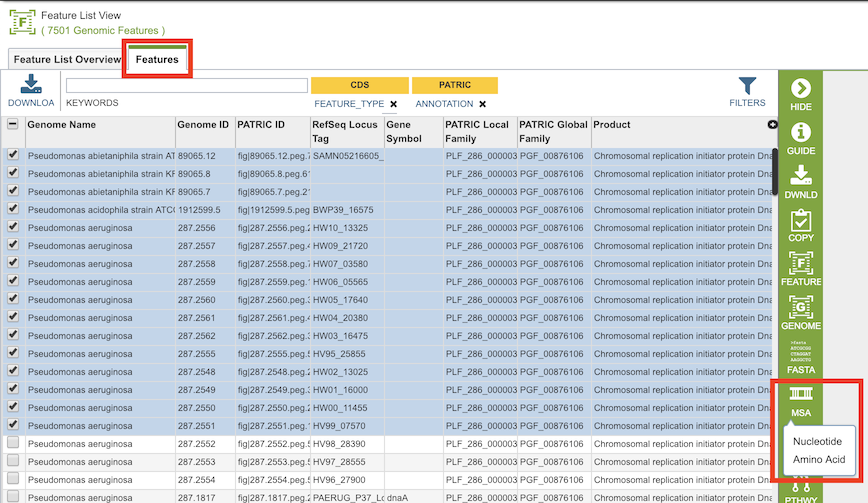

# Mulitiple Sequence Alignment Viewer

## Overview
The Multiple Sequence Alignment (MSA) Viewer provides an interactive visualization of a nucleic acid or amino acid multiple sequence alignment with a linked interactive tree viewer. 

### See also
  * [Features Tab](../organisms_taxon/features.html)

## Accessing the MSA Viewer on the PATRIC Website
The MSA can be accessed by selecting a set of features in the Features Tab or any other table that contains features/genes (nucleotide sequences) or proteins (amino acid sequences), then clicking the MSA button in the vertical green Action Bar to the right of the table, as shown below: 

Results, whether nucleotide or amino acid, will be shown in the MSA Viewer, as shown in the figures below:

**Nucleotide MSA**

**Amino Acid MSA**

## Features and Functionality

The visualization has 3 main components:
  1. Gene tree on the left-hand side that is constructed based on the alignment
  2. Sequence logo across the top wherein the hight of the letter corresponds to the amount of conservation of the corresponding nucleotide or amino acid
  3. The multiple sequence alignment in the main body of the visualization.

### Gene tree
The gene tree on the left-hand side is generated using FastTree (Price 2009) and Gblocks (Castresana 2002). Clicking on a single sequence item in the tree selects that item, as indicated with a small check mark and a red line in the tree branch.  A set of corresponding actions becomes available in the vertical green Action Bar on the right side of the visualization.  Also, additional information and metadata about the selected item will be displayed in the information panel on the far right.  See figure below.

Genomes are listed along the Y (vertical) axis and corresponding Protein Families are listed along the X (horizontal) axis. The scale of these rows and columns may be controlled by sliding the x and/or y slidebars located at the axis intersection in the upper left corner of the Heatmap. Action buttons on the top right of the heatmap provide additional display options:

* **Legend:** Displays a popup box showing the color coding scheme of the heatmap.  Clicking the Legend button again hides the popup box.
* **Flip Axis:** Swaps the positions (horizontal or vertical) of the Genomes and Protein Families.
* **Cluster:** Reorders the Genomes and Protein Families in their respective axes to group individual cells in the heatmap together by value (color), using Pearson Correlation.
* **Advanced:** Provides advanced clustering options including clustering by Protein Families or Genomes separately, choosing alternate clustering algorithms, and choosing alternate clustering types. 
* **Anchor:** Reorders the heatmap display such that all Genomes and Protein Families are baselined ("anchored") against the chosen genome.

In addition to the display options described above, each individual column or row within the Heatmap may be clicked and dragged to any specified position.

The following options may be accessed from a pop-up widow by clicking on any individual colored cell, any Protein Family label, or any Genome label within the Heatmap. The same information can be collected for a whole region of interest within the Heatmap by clicking and dragging to select a group of cells.

* **Download Heatmap Data:** Shows the count of proteins from each Genome assigned to each Protein Family in either a text or excel file. Note: Clicking this button from a Protein Family label will produce a file with the count for each genome assigned to that Protein Family, while clicking on this button from a Genome label will produce a file with the count for that particular genome in every Protein Family.
* **Download Proteins:** Downloads the set of PATRIC features associated with the chosen proteins.  Download available as csv, txt, or Excel file.
* **Show Proteins:** Open a feature list table in PATRIC containing the features associated with the chosen proteins. This view contains the same information as any feature list in PATRIC: Genome Name, Genome ID, RefSeq Locus Tab, Gene Symbol, protein family information, Product, length, start/stop, etc. This view also allows access to sequences, enables building of multiple sequence alignments, map IDs, etc.
* **Add Proteins to Group:** button will save selected items to new, or existing, groups within the Workspace. 
* **Cancel:** Closes the pop-up window.

The [Comparing Protein Families Across Genomes Tutorial](https://docs.patricbrc.org//tutorial/protein_family_sorter/protein_family_sorter.html) provides additional information and guidance in using the Protein Family Sorter.

## References
* Castresana, J. (2002). Gblocks, v. 0.91 b. Online version available at: http://molevol. cmima. csic. es/castresana. Gblocks_server. html.
* Edgar, R.C. (2004) MUSCLE: multiple sequence alignment with high accuracy and high throughput
  Nucleic Acids Res. 32(5):1792-1797.
* Price, M. N., Dehal, P. S., & Arkin, A. P. (2009). FastTree: computing large minimum evolution trees with profiles instead of a distance matrix. Molecular biology and evolution, 26(7), 1641-1650.

