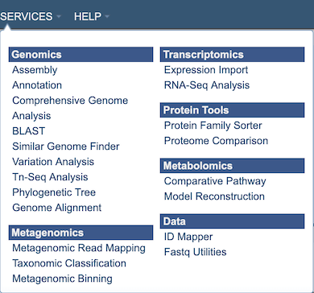
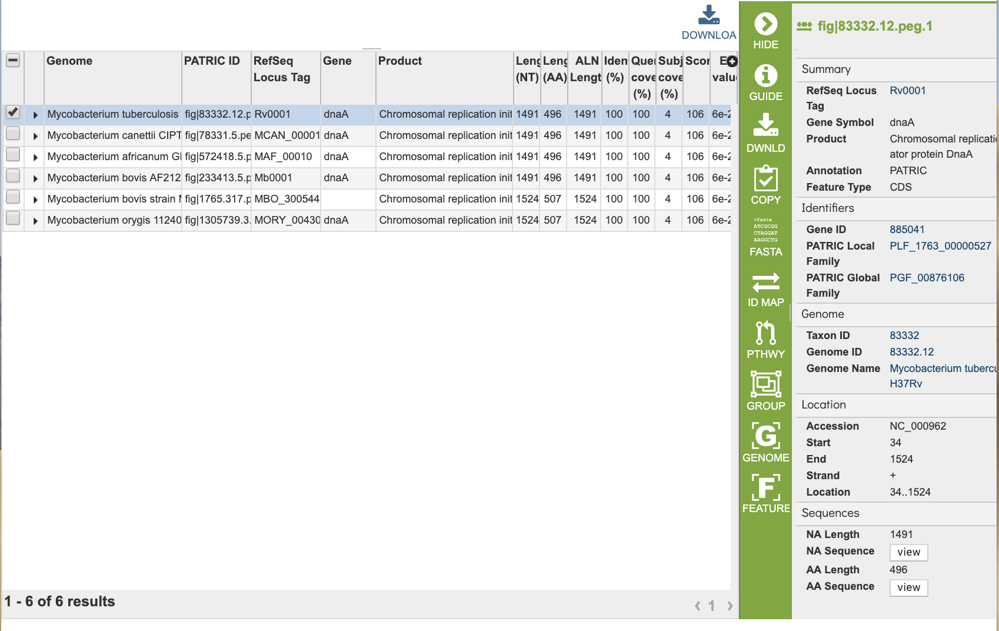

# BLAST Service

## Overview
The PATRIC BLAST service integrates the BLAST (Basic Local Aligment Search Tool) algorithms to perform searches against against public or private genomes in PATRIC or other reference databases using a DNA or protein sequence and find matching genomes, genes, RNAs, or proteins.  

### See also
* [BLAST Service](https://patricbrc.org/app/BLAST)
* [BLAST Service Tutorial](https://docs.patricbrc.org/tutorial/blast/blast.html)

## Using the BLAST Service
The **BLAST** submenu option under the **Services** main menu (Genomics category) opens the BLAST input form (*shown below*). *Note: The BLAST Service can be used without logging in, but if you want to include your private genome in the BLAST results, you must be logged into PATRIC.*

## Options
 

**Sequence:** This is the entry box for either the nucleotide or amino acid target search sequence.  Cut-and-paste is supported. 

**Program:** Depending upon the type of sequence (nucleotide or amino acid) entered into the Sequence text box sequence, this will open a dropdown box showing the types of BLAST available. These include the following: 
  * blastn: searches nucleotide databases using a nucleotide query

  * blastx: searches protein databases using a translated nucleotide query

  * tblastx: searches translated nucleotide databases using a translated nucleotide query

  * blastp: searches protein databases using a protein query

  * tblastn: searches translated nucleotide subjects using a protein query

**Database:** Dropdown list of a variety of PATRIC databases or user-selected data sets for searching. Depending upon the query type, searches are available for entire genomes or limited to only features. Specifically, blastn, tblastn, or tblastx, allows searches against either genomes or features. However, blastp or blastx are limited to features (proteins) only.   

## Advanced Options
**BLAST Parameters:** Allows adjustment of maximum number of hits returned and E value threshold.

## Buttons
**Search:** Launches the search which, upon completion, returns a set of results matching the sequence provided and selected criteria.  On the results page, the **Edit form and resubmit Button** above the search results reloads the input form so that the parameters can be easily adjusted and the search relaunched.

## Output Results
 

The BLAST Service generates a table of matching results (features) based on the options chosen.  

### Action buttons
After selecting one of the output files by clicking it, a set of options becomes available in the vertical green Action Bar on the right side of the table.  These include

* **Hide/Show:** Toggles (hides) the right-hand side Details Pane.
* **Guide** Link to the corresponding User Guide
* **Download:**  Downloads the selected item.
* **Copy:** Copies the selected items to the clipboard.

More details are available in the [Action Buttons](../other/action_buttons.html) user guide.

## References
1.	Boratyn, G.M., Camacho, C., Cooper, P.S., Coulouris, G., Fong, A., Ma, N., Madden, T.L., Matten, W.T., McGinnis, S.D., Merezhuk, Y. et al. (2013) BLAST: a more efficient report with usability improvements. Nucleic acids research, 41, W29-33.

2.	O'Leary, N.A., Wright, M.W., Brister, J.R., Ciufo, S., Haddad, D., McVeigh, R., Rajput, B., Robbertse, B., Smith-White, B., Ako-Adjei, D. et al. (2016) Reference sequence (RefSeq) database at NCBI: current status, taxonomic expansion, and functional annotation. Nucleic acids research, 44, D733-745.
