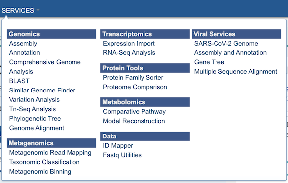
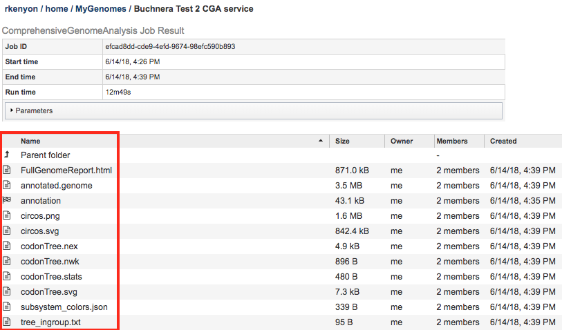

# Comprehensive Genome Analysis Service

## Overview
The bacterial Comprehensive Genome Analysis Service provides a streamlined analysis **"meta-service"** that accepts raw reads and performs a comprehensive analysis including assembly, annotation, identification of nearest neighbors, a basic comparative analysis that includes a subsystem summary, phylogenetic tree, and the features that distinguish the genome from its nearest neighbors.

### See also
  * [Comprehensive Genome Analysis Service](https://alpha.bv-brc.org/app/ComprehensiveGenomeAnalysis)
  * Comprehensive Genome Analysis Service Tutorial
  * [Genome Assembly Service User Guide](./genome_assembly_service.html)
  * [Genome Annotation Service User Guide](./genome_annotation_service.html)
  * [Phylogenetic Tree Building Service User Guide](./phylogenetic_tree_building_service.html)

## Using the Comprehensive Genome Analysis Service
The **Comprehensive Genome Analysis** submenu option under the **Services** main menu (Genomics category) opens the Comprehensive Genome Analysis input form (shown below). *Note: You must be logged into PATRIC to use this service.*

## Options

## Start with
The service can accept either read files or assembled contigs. If the "Read Files" option is selected, the Assembly Service will be invoked automatically to assemble the reads into contigs before invoking the Annotation Service. If the "Assembled Contigs" option is chosen, the Annotation Service will automatically be invoked, bypassing the Assembly Service.

## Read Input File
Depending on the option chosen above (Read File or Assembled Contigs), the Input File section will request read files or assembled contigs, respectively.

### Paired read library
**Read File 1 & 2:**  Many paired read libraries are given as file pairs, with each file containing half of each read pair. Paired read files are expected to be sorted such that each read in a pair occurs in the same Nth position as its mate in their respective files. These files are specified as READ FILE 1 and READ FILE 2. For a given file pair, the selection of which file is READ 1 and which is READ 2 does not matter.

### Single read library
**Read File:** The fastq file containing the reads.

### SRA run accession
Allows direct upload of read files from the [NCBI Sequence Read Archive](https://www.ncbi.nlm.nih.gov/sra) to the PATRIC Assembly Service. Entering the SRR accession number and clicking the arrow will add the file to the selected libraries box for use in the assembly.

## Selected libraries
Read files placed here will contribute to a single assembly.

## Parameters

### Strategy

#### auto
  * Uses Canu if only long reads are submitted
  * Uses Unicycler if long and short reads, as or short reads alone are submitted

#### Unicycler
Unicycler is an assembly pipeline that can assemble Illumina-only read sets where it functions as a SPAdes-optimizer. It can also assemble long-read-only sets (PacBio or Nanopore) where it runs a miniasm plus Racon pipeline. For the best possible assemblies, provide both Illumina reads and long reads and it will conduct a hybrid assembly. Unicycler builds an initial assembly graph from short reads using the de novo assembler and then uses a novel semi-global aligner to align long reads to it.

#### SPAdes
SPAdes is an assembler that is designed to assemble small genomes, such as those from bacteria, and uses a multi-sized De Bruijn graph to guide assembly.

#### Canu
Canu is a long-read assembler which works on both third and fourth generation reads. It is a successor of the old Celera Assembler that is specifically designed for noisy single-molecule sequences. It supports nanopore sequencing, halves depth-of-coverage requirements, and improves assembly continuity. It was designed for high-noise single-molecule sequencing, such as the PacBio RS II/Sequel or Oxford Nanopore MinION.

#### metaSPAdes
The metaSPAdes software combines new algorithmic ideas with proven solutions from the SPAdes toolkit to address various challenges of metagenomic assembly.

#### plasmidSPAdes
The plasmidSPAdes algorithm is a software tool for assembling plasmids from whole genome sequencing data and benchmarks its performance on a diverse set of bacterial genomes. 

#### Single-cell
SPAdes is an assembler for both single-cell and standard (multicell) assembly, and it improves on the recently released E+V−SC assembler (specialized for single-cell data). 

### Trim Reads Before Assembly
Selecting "True" opens additional options for trimming reads.

#### Racon and Pilon Iterrations
PATRIC’s assembly service also allows for the correction of assembly errors (or “polish) using Racon and/or Pilon. Both Racon and Pilon take the contigs and the reads mapped to those contigs, and look for discrepancies between the assembly and the majority of the reads. Where there is a discrepancy, Racon or Pilon will correct the assembly if the majority of the reads call for that. Racon is for long reads (PacBio or Nanopore) and Pilon is for shorter reads (Illumina or Ion Torrent). Once the assembly has been corrected with the reads, it is still possible to do another iteration to further improve the assembly, but each one takes time. PATRIC allows for 0 to 4 Racon or Pilon iterations.

#### Min. Contig Length and Coverage
The assembly service also provides the ability to change the minimum contig length and coverage.

### Domain
The taxonomic domain of the target organism: bacteria or archaea.

### Taxonomy Name
Taxon must be specified at the genus level or below to get the latest
protein family predictions.

### Taxonomy ID
Auto-populated after entering Taxonomy Name. If a Taxonomy ID is entered, auto-populates the Taxonomy Name

### Genetic Code
The codon translation used in calling genes.

### Output Folder
The workspace folder where results will be placed.

### Output Name
Name used to uniquely identify results.

## Output Results

The Comprehensive Genome Analysis Service generates several files that are deposited in the Private Workspace in the designated Output Folder. These include

 * **FullGenomeReport.html** - A web-browser-viewable report that summarizes the results of the service including
   * Summary information - genome name, quality,
   * Genome assembly information - contigs, GC content, plasmids, L50, genome length, chromosomes
   * Genome annotation information - taxonomy, CDS, tRNA, rRNA, partial CDS, misc RNA, repeat regions, protein feature summary, circular view with annotations
   * Specialty genes - antibiotic resistance, drug targets, transporters, virulence factors
   * Subsystem analysis - summary
   * Phylogenetic analysis - phylogenetic tree generated using the analyzed genome and the closest Reference and Representative genomes
   * References - citations to all tools used by the service
 * **annotated.genome** - A special "Genome Typed Object (GTO)" JSON-format file that encapsulates all the data from the annotated genome. See Extracting and Mining Genome Typed Objects for more information.
 * **annotation** - The Annotation sub-job that was run as part of the CGA Service. Double-clicking this item will display the Annotation job results. Note that sub-jobs are indicated by the "checkered flag" icon beside the name.
 * **assembly** - The Assembly sub-job that was run as part of the CGA Service. Double-clicking this item will display the Assembly job results. Note that sub-jobs are indicated by the "checkered flag" icon beside the name.
 * **circos.svg** - SVG-format rendering of the circular genome view used in the FullGenomeReport.html file.
 * **circos.png** - PNG-format rendering of the circular genome view used in the FullGenomeReport.html file.
 * **codonTree.nex** - NEXUS-format file containing the phylogenetic tree generated by the CGA Service.
 * **codonTree.nwk** - Newick-format file containing the phylogenetic tree generated by the CGA Service.
 * **codonTree.stats** - File containing the statistics on the phylogenetic tree generated by the CGA Service.
 * **codonTree.svg** - SVG-format rendering of the phylogenetic tree used in the FullGenomeReport.html file.
 * **subsystem_colors.json** - JSON-format file used for rendering colors in the Subsystem pie chart displayed in the FullGenomeReport.html file.
 * **tree_ingroup.txt** - File containing the closely related genomes used in building the ingroup for the phylogenetic tree generated by the CGA Service.

## References
1. Wick, R.R., et al., Unicycler: resolving bacterial genome assemblies from short and long sequencing reads. PLoS computational biology, 2017. 13(6): p. e1005595.
2. Bankevich, A., et al., SPAdes: a new genome assembly algorithm and its applications to single-cell sequencing. Journal of computational biology, 2012. 19(5): p. 455-477.
3. Koren, S., et al., Canu: scalable and accurate long-read assembly via adaptive k-mer weighting and repeat separation. Genome research, 2017. 27(5): p. 722-736.
4. Nurk, S., et al., metaSPAdes: a new versatile metagenomic assembler. Genome research, 2017. 27(5): p. 824-834.
5. Antipov, D., et al., plasmidSPAdes: assembling plasmids from whole genome sequencing data. bioRxiv, 2016: p. 048942.
6. Krueger, F., Trim Galore: a wrapper tool around Cutadapt and FastQC to consistently apply quality and adapter trimming to FastQ files, with some extra functionality for MspI-digested RRBS-type (Reduced Representation Bisufite-Seq) libraries. URL http://www. bioinformatics. babraham. ac. uk/projects/trim_galore/.(Date of access: 28/04/2016), 2012.
7. Vaser, R., et al., Fast and accurate de novo genome assembly from long uncorrected reads. Genome research, 2017. 27(5): p. 737-746.
8. Walker, B.J., et al., Pilon: an integrated tool for comprehensive microbial variant detection and genome assembly improvement. PloS one, 2014. 9(11): p. e112963.
9. Brettin, T., et al., RASTtk: a modular and extensible implementation of the RAST algorithm for building custom annotation pipelines and annotating batches of genomes. Scientific reports, 2015. 5: p. 8365.
10. Davis, J.J., et al., PATtyFams: Protein families for the microbial genomes in the PATRIC database. 2016. 7: p. 118.
11. Overbeek, R., et al., The SEED and the Rapid Annotation of microbial genomes using Subsystems Technology (RAST). Nucleic Acids Res, 2014. 42(Database issue): p. D206-14.
12. Ondov, B.D., et al., Mash: fast genome and metagenome distance estimation using MinHash. Genome biology, 2016. 17(1): p. 132.
13. Davis, J.J., et al., PATtyFams: Protein Families for the Microbial Genomes in the PATRIC Database. Front Microbiol, 2016. 7: p. 118.
14. Edgar, R.C., MUSCLE: multiple sequence alignment with high accuracy and high throughput. Nucleic acids research, 2004. 32(5): p. 1792-1797.
15. Stamatakis, A., RAxML version 8: a tool for phylogenetic analysis and post-analysis of large phylogenies. Bioinformatics, 2014. 30(9): p. 1312-1313.
