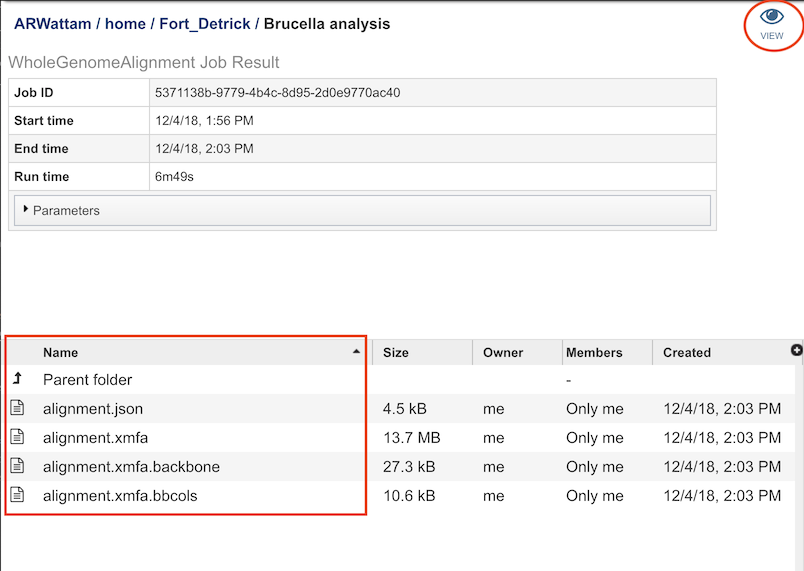
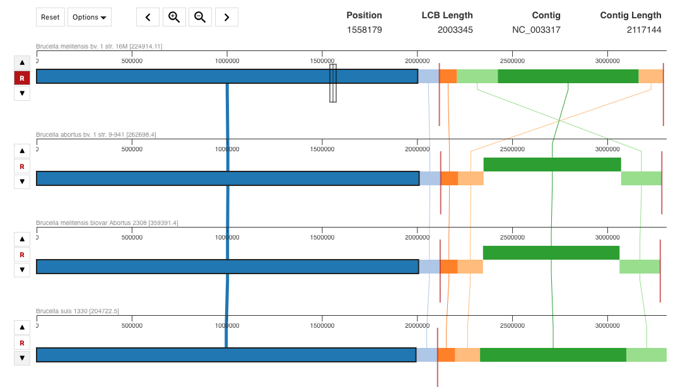

# Genome Alignment Service

## Overview
The PATRIC Genome Alignment Service uses [progressiveMauve](https://journals.plos.org/plosone/article?id=10.1371/journal.pone.0011147) to produce a whole genome alignment of two or more genomes.  The resulting alignment can be visualized within the PATRIC website, providing insight into homologous regions and changes due to DNA recombination.  It should be noted that this service is currently released as *beta*.  As always, we appreciate your feedback.

### See also
* [Genome Alignment Service](https://patricbrc.org/app/GenomeAlignment)

## Using the Genome Alignment Service
The **Genome Alignment** submenu option under the **Services** main menu (Genomics category) opens the Genome Alignment Service input form (*shown below*).

## Options

## Select Genomes
Specifies the genomes (at least 2) to have aligned.

### Select Genome
Genomes for inclusion in the **ingroup** for the tree. Type or select a genome name from the genome list. Use the "+ Add" button to add to the Selected Genome Table.

### And/Or Select Genome Group
Option for including a genome group from the workspace. Can be included with, or instead of, the Selected Genomes.

## Parameters

### Output Folder
The workspace folder where results will be placed.

### Output Name
Name used to uniquely identify results.

### Advanced Options

**Seed Weight:** The seed size parameter sets the minimum weight of the seed pattern used to generate local multiple alignments (matches) during
the first pass of anchoring the alignment. When aligning divergent genomes or aligning more genomes simultaneously, lower seed
weights may provide better sensitivity. However, because Mauve also requires the matching seeds must to be unique in each
genome, setting this value too low will reduce sensitivity.

**hmm-p-go-unrelated:**  Probability of transitioning from the unrelated to the homologous state.

**hmm-p-go-unrelated:**  Probability of transitioning from the homologous to the unrelated state

(more parameters to be added soon)

## Output Results

The Genome Alignment Service generates files that are deposited in the Private Workspace in the designated Output Folder. These include

* **alignment.json** - The LCB coordinates in JSON format.

* **alignment.xmfa** - The Mauve alignment file.

Clicking on "VIEW" at the top right of this page will bring will allow you to visualize the genome alignment:

