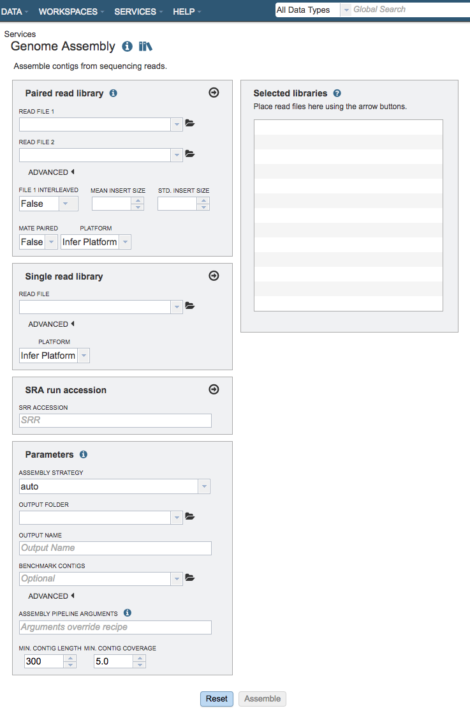

# Genome Assembly Service

## Overview
The Genome Assembly Service allows single or multiple assemblers to be invoked to compare results. The service attempts to select the best assembly, i.e., assembly with the smallest number of contigs and the longest average contig length. Several assembly workflows or "recipes" are available that have been tuned to fit certain data types or desired analysis criteria such as throughput or rigor. Once the assembly process has started by clicking the Assemble button, the genome is queued as a "job" for the Assembly Service to process, and will increment the count in the Jobs information box on the bottom right of the page. Once the assembly job has successfully completed, the output file will appear in the workspace, available for use in the PATRIC comparative tools and downloaded if desired.

### See also
  * [Assembly Service Tutorial](/tutorial/genome_assembly/assembly.html)

## Using the Genome Assembly Service
The **Assembly** submenu option under the **Services** main menu (Genomics category) opens the Genome Assembly input form (*shown below*). *Note: You must be logged into PATRIC to use this service.*

## Options
 

## Selected libraries
Read files placed here will contribute to a single assembly.

## Paired read library

**Read File 1 & 2:**  Many paired read libraries are given as file pairs, with each file containing half of each read pair. Paired read files are expected to be sorted such that each read in a pair occurs in the same Nth position as its mate in their respective files. These files are specified as READ FILE 1 and READ FILE 2. For a given file pair, the selection of which file is READ 1 and which is READ 2 does not matter.

**Advanced:**
  * File 1 Interleaved - Some paired libraries are available in a single file where each read in a pair occurs in succession. To specify such a file set this parameter to 'True'.

  * Mean Insert Size - This refers to the mean insert size between paired reads. If you have this information you may provide it. If not the assembly algorithm will make an attempt to determine this value.
  
  * Std. Insert Size - This refers to the standard deviation of the insert size between paired reads. If you have this information you may provide it. If not the assembly algorithm will make an attempt to determine this value.
  
  * Mate Paired- Defines the orientation of read pairs. Setting Mate Paired to true indicates that the sequencing direction of the two reads in each pair is outward facing.
  
  * Platform - The sequencing platform used for each library.
    * infer: Infer sequencing platform from read files
    * illumina: Illumina short reads
    * pacbio: PacBio long reads
    * nanopore: MinION long reads

## Single read library

**Read File:**
The fastq file containing the reads

**Advanced:**

  * Platform - The sequencing platform used for each library.
    * infer: Infer sequencing platform from read files
    * illumina: Illumina short reads
    * pacbio: PacBio long reads
    * nanopore: MinION long reads

## SRA run accession
Allows direct upload of read files from the [NCBI Sequence Read Archive](https://www.ncbi.nlm.nih.gov/sra) to the PATRIC Assembly Service. Entering the SRR accession number and clicking the arrow will add the file to the selected libraries box for use in the assembly. 

## Parameters

**Assembly Strategy:**
  * auto
    * For short reads:
      1. Runs BayesHammer on reads
      2. Assembles with Velvet, IDBA and SPAdes
      3. Sorts assemblies by ARAST quality score

    * For long reads (PacBio or Nanopore):
      1. Assembles with MiniASM

  * fast
    1. Assembles with MEGAHIT and Velvet.
    2. Results are sorted by ARAST quality score.

  * full_spades
    1. Runs BayesHammer on reads
    2. Assembles with SPAdes.

  * kiki
    1. Runs the Kiki assembler

  * miseq
    1. Runs Velvet with hash length 35.
    2. Runs BayesHammer on reads and assembles with SPAdes with k up to 99.
    3. Results are sorted by ARAST quality score.
    4. Works for Illumina MiSeq reads.

  * plasmid
    1. Runs BayesHammer on reads and assembles with plasmidSPAdes.

  * smart
    * For short reads:
      1. Runs BayesHammer on reads, Kmergenie to choose hash-length for Velvet
      2. Assembles with Velvet, IDBA and SPAdes
      3. Sorts assemblies by ALE score
      4. Merges the two best assemblies with GAM-NGS

    * For long reads (PacBio or Nanopore):
      1. Assembles with MiniASM

**Output Folder:** The workspace folder where results will be placed.

**Output Name:** User-provided name used to uniquely identify results.

**Benchmark Contigs:** This optional parameter can be used to specify a FASTA contigs file to evaluate the assembly against.

## Advanced

**Minimal output contig length:**  Filter out short contigs in final assembly

**Minimal output contig coverage:** Filter out contigs with low read depth in final assembly

### Assembly Pipeline
The pipeline parameter is an advanced way to customize the assembly workflow by mixing and matching a variety of modules. Each modules works at one of the three stages of the pipeline: preprocessing, assembly, and post-processing. In general, you can compose a pipeline by concating one or more preprocessing modules, one assembler, and optionally one
postprocessor.

**Example 1: tagdust velvet** This pipeline will simply run tagdust to remove adapter sequences in the reads and then assemble them with velvet. Note: quotes should not be used around the two modules as they have special meaning in pipeline syntax.

**Example 2: a6**  You can also invoke an assembler that we have not included in our curated strategies. In this case, A6 is an assembler with its built-in preprocessing and postprocessing steps.

**Example 3: "tagdust none" "megahit velvet" sspace**  You can use quotes to specify alternative modules you would like to try at each step. This example will launch a cartesian combination of four parallel pipelines: tagdust+megahit+sspace, tagdust+velvet+sspace, megahit+sspace, velvet+sspace.

*Note:* The pipeline parameter overrides the assembly strategy parameter. Not all modules combine well.
[List of modules supported](ftp://ftp.patricbrc.org/workshop/arast/arast_modules.txt)

## Buttons

**Reset:** Clicking this button resets the input form to default values

**Assemble:** Clicking this button launches the assembly job.
